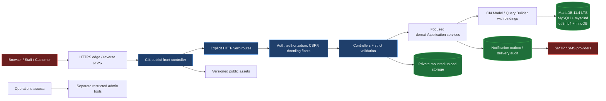
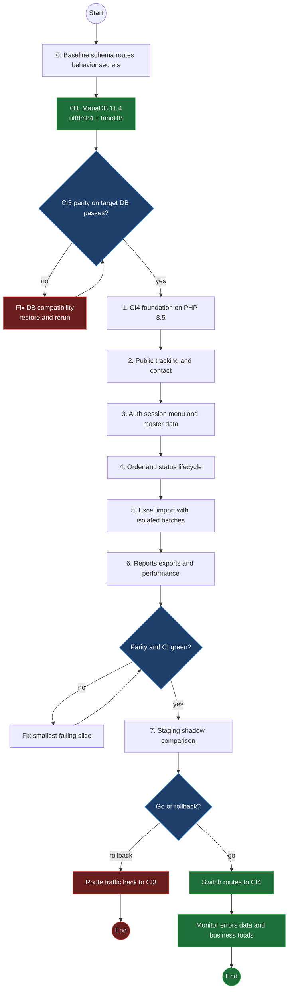
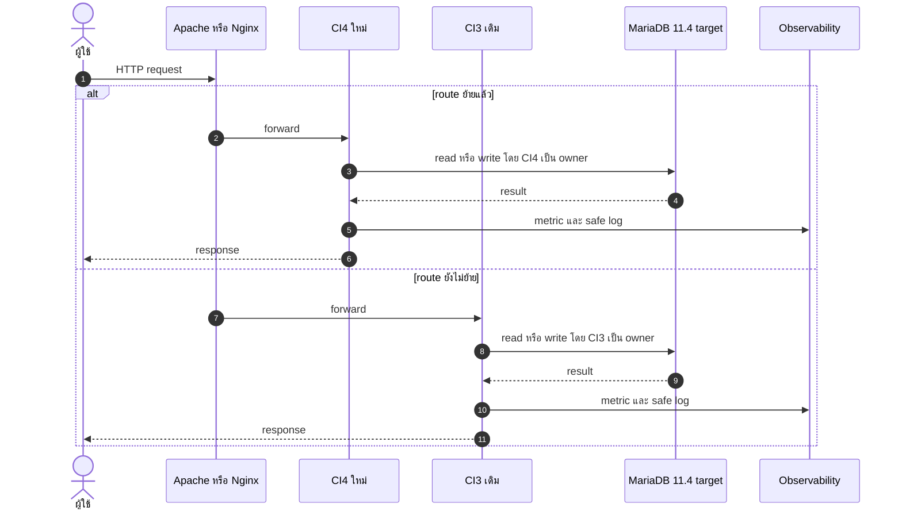
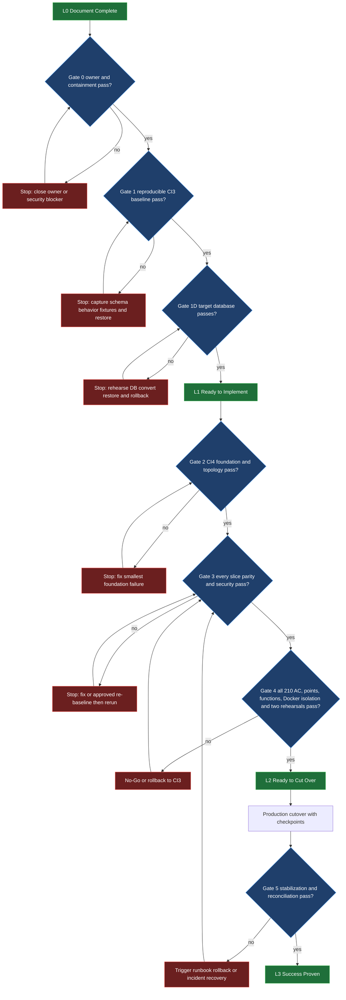
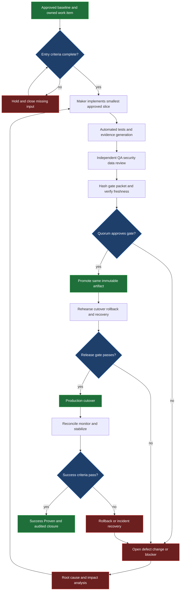
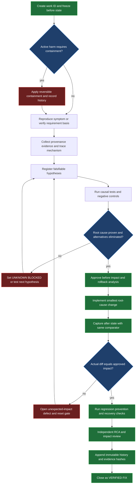

# Samsonite Tracking — แผนอัปเกรด CodeIgniter 3 เป็น CodeIgniter 4

> Source: CodeIgniter 3.1.6 source code ใน working tree และเอกสารทางการ CodeIgniter/PHP/MariaDB
> Scope: migration ไป CodeIgniter 4 บน PHP 8.5 และ mandatory database target, compatibility, roadmap, verification, cutover และ rollback
> Generated: 2026-08-10
> Updated: 2026-08-13
> Version: v3.8 — เพิ่ม Docker isolation, safe-port allocation และ cross-project non-interference proof

เอกสารนี้กำหนดแผนย้ายระบบเดิมไป CodeIgniter 4 บน target stack ที่อนุมัติ. ทุก behavior ต้องผ่าน Functional Parity 100%; database platform conversion ต้องแยก release จาก CI4 application cutover เพื่อพิสูจน์ผลกระทบและ rollback ได้อิสระ.

## การควบคุมเอกสาร

| หัวข้อ | รายละเอียด |
|---|---|
| วัตถุประสงค์ | ใช้เป็น migration charter, delivery roadmap, quality gate และ cutover/rollback baseline |
| ผู้อนุมัติหลัก | Business owner, product owner, engineering lead, QA lead, security และ operations |
| In scope | Application conversion, PHP 8.5, CI4, MariaDB 11.4.x LTS, MySQLi/mysqlnd, utf8mb4, InnoDB, tests, deployment, data compatibility และ operations |
| Out of scope | UX redesign, authentication product ใหม่, business-schema redesign และ data cleansing ที่ไม่เกิดจาก verified target-stack conversion |
| Delivery model | Vertical slice + route-level strangler + shared database ชั่วคราว |
| Version target | PHP 8.5.x + CI4 ≥4.7.4 + MariaDB 11.4.x LTS; pin exact patch/image และผ่าน CI/rehearsal |
| Estimate class | ROM ±40%; re-baseline หลัง discovery/baseline phase |
| Change control | การเปลี่ยน scope, schema incompatibility หรือ external contract ต้องบันทึก decision และปรับ estimate |
| Research basis | Local source/repository evidence + official CI4/PHP/MariaDB/Composer/PhpSpreadsheet primary sources |

### เป้าหมายและตัวชี้วัดสำเร็จ

| Goal ID | เป้าหมาย | Success measure |
|---|---|---|
| G-01 | ย้าย runtime ไป PHP 8.5 และ CI4 | clean build/test ผ่านบน production-like image |
| G-02 | รักษา Functional Parity 100% | ทุก route, use case, field, rule, side effect, report, export และ failure path ใน approved inventory ผ่านโดยไม่มี unapproved difference |
| G-03 | ไม่ทำข้อมูลเสียหรือปนข้าม request | transaction, unique constraint และ concurrency tests ผ่าน |
| G-04 | ลด security exposure | ไม่มี hardcoded secret, authz/CSRF/upload checks ผ่าน |
| G-05 | deploy/rollback ได้ | staging rehearsal และ route rollback ผ่านตามเวลาเป้าหมาย |
| G-06 | ดูแลต่อได้ | Composer lock, migrations, tests, runbook และ ownership ครบ |
| G-07 | ใช้ target stack ที่อนุมัติครบ | version/driver/charset/engine assertions และ production-like rehearsal ผ่าน |
| G-08 | พิสูจน์ผลสำเร็จได้ทุกจุด | normative point ทุกตัวมี before/cause-or-basis/change/after/impact/independent-review record และสถานะ `CLOSED` |
| G-09 | ไม่มี function ตกหล่นหรือถูกยกเลิกโดยไม่มีหลักฐาน | application-owned function/handler ทุกตัวมี Function ID, caller, CI4 target/retirement disposition, test, impact และ P5 closure |

### Non-goals

- ไม่เปลี่ยน business process หรือชื่อสถานะระหว่าง parity phase
- ไม่เปิด Auto Routing Legacy เพื่อเลียนแบบ CI3
- ไม่สร้าง generic repository, event bus หรือ abstraction ที่ยังไม่มี use case
- ไม่รวม MariaDB/charset/engine conversion กับ CI4 application cutover release เดียวกัน
- ไม่ share session payload ระหว่าง CI3/CI4 แบบ ad hoc

## สรุปการตัดสินใจ

CodeIgniter 4 เป็น framework ที่เขียนใหม่และไม่ backward-compatible กับ CodeIgniter 3. งานนี้จึงเป็นการ convert application ลง CI4 project ใหม่ ไม่ใช่อัปเกรดทับ source เดิม. อ้างอิง: [Upgrading from 3.x to 4.x](https://codeigniter.com/user_guide/installation/upgrade_4xx.html)

PHP 8.5 ต้องใช้ CodeIgniter 4.7.0 ขึ้นไป แต่ระบบนี้กำหนด **CodeIgniter 4.7.4 เป็นขั้นต่ำ**. Release 4.7.4 แก้ประเด็น security ที่ตรงกับ risk ของระบบ ได้แก่ client upload filename/path traversal, file content-extension validation, Query Builder `deleteBatch()` SQL injection และ trusted proxy HTTPS detection. รุ่นใหม่กว่า 4.7.4 ใช้ได้เมื่อ review changelog/security และ test ผ่าน; ห้ามใช้ floating `latest`. อ้างอิง: [Server Requirements](https://codeigniter.com/user_guide/intro/requirements.html), [CodeIgniter 4.7.4 changelog](https://codeigniter.com/user_guide/changelogs/v4.7.4.html)

แนวทางหลัก: baseline ระบบเดิมก่อน, ย้าย database target เป็น release แยก, จากนั้นใช้ vertical slice + route-level strangler และย้าย write ownership ครั้งละ module. ไม่ทำ big-bang rewrite หรือ redesign authentication/business schema พร้อม framework migration.

Target database เป็น **MariaDB 11.4.x LTS + InnoDB + utf8mb4** และ CI4 เชื่อมผ่าน **MySQLi ที่ใช้ mysqlnd**. CodeIgniter รองรับ MySQL ผ่าน MySQLi; CI4 database config รองรับ `DBDriver=MySQLi`, `charset=utf8mb4` และ MySQLi-specific collation. PHP แนะนำ mysqlnd สำหรับ mysqli. อ้างอิง: [CI4 Server Requirements](https://codeigniter.com/user_guide/intro/requirements.html), [CI4 Database Configuration](https://codeigniter.com/user_guide/database/configuration.html), [PHP mysqli overview](https://www.php.net/manual/en/mysqli.overview.php)

MariaDB 11.4 เป็น long-term series ที่ดูแลถึงพฤษภาคม 2029. MariaDB 11.4 ไม่ได้ทำให้ utf8mb4 เป็น server default โดยอัตโนมัติ; ต้องตั้งและตรวจ server, schema, table, text column และ client connection แยกกัน. Database conversion ใช้ release ก่อนหน้า CI4 route migration: CI3 ต้องผ่าน full regression บน target DB และ stabilization ก่อนเริ่มย้าย write ownership. อ้างอิง: [MariaDB 11.4](https://mariadb.com/docs/release-notes/mariadb-community-server-release-notes/mariadb-11-4-series/what-is-mariadb-114), [Character sets and collations](https://mariadb.com/docs/server/reference/data-types/string-data-types/character-sets/setting-character-sets-and-collations), [InnoDB](https://mariadb.com/docs/platform/mariadb-faqs/storage-engines/innodb-storage-engine)

## สารบัญ Diagram

| § | Diagram | Source |
|---|---|---|
| 1 | ลำดับ migration | roadmap ในเอกสารนี้ |
| 2 | Target architecture และ trust boundaries | CI4 deployment/security requirements + local risks |
| 3 | CI3/CI4 coexistence และ cutover | deployment plan ในเอกสารนี้ |
| 17 | Readiness state และเส้นทางพิสูจน์ความสำเร็จ | assurance gates ในเอกสารนี้ |
| 18 | Process control loop | maker-checker, rework, promotion, cutover และ stabilization |
| 19 | Evidence-First RCA และ change history | causal proof, before/after impact และ immutable audit trail |

---

## 1. ขนาดงานจากระบบเดิม

| ตัวชี้วัด | จำนวน | ผลต่อ migration |
|---|---:|---|
| Controllers | 25 | ย้าย namespace, base class, request/response และ routes |
| Models | 19 | 18 ตัวสืบทอด `CI_Model`; ต้องย้าย DB API |
| PHP views | 117 | ย้ายไป `app/Views`; ตรวจ layout, escaping และ asset path |
| Route declarations | 178 | สร้าง explicit routes และรักษา URL contract |
| `$this->db->` | 1,089 hits ใน 19 files | พื้นที่ regression สูงสุด |
| `$this->input->post/get` | 351 hits ใน 24 files | ย้ายไป IncomingRequest และ validation |
| `$this->session->userdata` | 94 hits ใน 23 files | กำหนด session/auth contract ใหม่ |
| `$this->form_validation` | 158 hits ใน 21 files | แปลง rules และ error flow |
| `base_url()` | 568 hits ใน 110 files | ตรวจ `public/`, base URL และ assets |
| Raw-SQL style selects | 49 calls | ใช้ binding และ regression test ราย report |
| Shared temp-table references | 136 | แยกข้อมูลตาม request/import batch |

ตัวเลขเป็น static inventory จาก working tree วันที่ 2026-08-09 ไม่ใช่ runtime coverage หรือ story point.

## 2. Target Stack

| ส่วน | เป้าหมาย | เหตุผล |
|---|---|---|
| Runtime | PHP 8.5.x | ตรงกับ production target |
| Framework | CodeIgniter 4.7.4 เป็นขั้นต่ำ; pin exact release | PHP 8.5 ต้องใช้ CI4 ≥ 4.7.0 และ 4.7.4 มี upload/query security fixes ที่เกี่ยวข้อง |
| Database server | MariaDB 11.4.x LTS; pin exact patch + image digest | mandatory target; long-term series ดูแลถึงพฤษภาคม 2029 |
| CI4 database driver | `MySQLi` | driver ที่ CI4 รองรับสำหรับ MySQL/MariaDB protocol |
| PHP client library | mysqlnd enabled | mandatory build/runtime assertion สำหรับ mysqli |
| Character set | `utf8mb4` ที่ server/schema/table/text column/client connection | รองรับ Unicode 4-byte; exact collation ต้องผ่าน Thai/search/sort parity และ BLK-001 |
| Storage engine | InnoDB สำหรับ application base tables 100% | transaction, row-level locking, foreign key และ crash recovery |
| Dependency | Composer + committed `composer.lock` | build ซ้ำได้และตรวจ dependency ได้ |
| Web root | `<project>/public` | ไม่ expose source, config, vendor และ runtime files |
| Application | `app/Controllers`, `app/Models`, `app/Views` | โครงสร้างและ namespace มาตรฐาน CI4 |
| Runtime data | `writable/` | session, cache, logs และ private uploads |
| Routing | explicit routes | ไม่เปิด Auto Routing Legacy |
| Database compatibility | business schema เดิมบน MariaDB 11.4/utf8mb4/InnoDB ระหว่าง CI3→CI4 parity | isolate database conversion ก่อน framework route migration |
| Email | CI4 Email service | ตัด PHPMailer เก่าที่ bundle ใน repo |
| Spreadsheet | PhpSpreadsheet | successor ที่ maintained ของ PHPExcel |

เอกสารทางการครอบคลุม namespace, `public/`, request/response และ services: [CI3 to CI4 Upgrade Guide](https://codeigniter.com/user_guide/installation/upgrade_4xx.html). Composer เป็นวิธีติดตั้งที่แนะนำ: [Installing CodeIgniter 4](https://codeigniter.com/user_guide/installation/).

### Target architecture และ trust boundaries



**Mapping →** web server expose เฉพาะ `public/`; upload อยู่ non-executable storage; admin tool เช่น phpMyAdmin ไม่อยู่ใน application artifact; request ที่เปลี่ยนข้อมูลผ่าน verb route + filter + validation ก่อนถึง MariaDB target. CI3/CI4 ใช้ database contract เดียวกันหลัง database foundation stabilization.

ใช้ mounted private volume เป็น default ที่เล็กและปลอดภัยสำหรับ upload 14 GiB เดิม. ใช้ object storage เมื่อมี requirement ด้าน multi-instance, lifecycle หรือ scale ที่ volume ตอบไม่ได้; ไม่เพิ่ม infrastructure พร้อม framework migration โดยไม่มี requirement.

### Architecture principles

| Principle | กติกา |
|---|---|
| Parity before redesign | ย้าย behavior เดิมและเพิ่ม test ก่อนเปลี่ยน business rules |
| Explicit boundaries | routes, filters, validation, transaction และ external adapters ต้องเห็นตำแหน่งชัด |
| One write owner | route/slice เดียวเขียนโดย CI3 หรือ CI4 เพียงระบบเดียวระหว่าง coexistence |
| Database-enforced integrity | unique/FK/index ใช้เมื่อ schema ยืนยันและรองรับ rollback |
| Thin controllers | controller รับ request/คืน response; shared side effects อยู่ service ที่มีเหตุผลจริง |
| Secure by default | `public/` web root, explicit routes, CSRF, secure cookies, input validation และ output escaping |
| Observable operations | request/batch correlation ID, safe log, metrics และ alert โดยไม่บันทึก secret/PII เกินจำเป็น |
| Reversible delivery | additive migrations, route switch และ versioned release ก่อน destructive cleanup |

### Component mapping

| CI3 source | CI4 target | กติกาการย้าย |
|---|---|---|
| `application/controllers` | `app/Controllers` | namespace, typed response, request validation และ filters |
| `application/models` | `app/Models` | ย้าย query ทีละ use case; ไม่บังคับ repository layer |
| `application/views` | `app/Views` | layout/escaping/assets ต้องรักษา output contract |
| `application/helpers` | `app/Helpers` หรือ focused service | pure helper คง helper; integration ใช้ service |
| `application/libraries/BaseController.php` | CI4 `BaseController` + filters | แยก login gate จาก layout/menu loading |
| `application/config/routes.php` | `app/Config/Routes.php` | explicit routes + route-name/URL regression tests |
| PHPMailer bundle | CI4 Email service | config จาก environment/secret manager |
| PHPExcel bundle | PhpSpreadsheet | stream/limit file และ isolate import batch |
| upload paths อิง document root | UploadedFile + `writable/` | validate MIME/size/name และไม่ trust client filename |
| CI3 migration config | `app/Database/Migrations` | timestamp migration, additive first, rollback tested |

## 3. Gap Matrix

| พื้นที่ | ระบบเดิม | เป้าหมาย CI4 | Risk |
|---|---|---|---|
| Bootstrap | CI 3.1.6 ที่ `system/core/CodeIgniter.php:58` | fresh CI4 project; ไม่ copy `system/` | สูง |
| Controllers | `CI_Controller` และ custom `BaseController` | `App\\Controllers` และ CI4 `BaseController` | สูง |
| Request | `$this->input` 351 hits | `$this->request->getPost()`/`getGet()` + validation | สูง |
| Response | output implicit และ `redirect()` 82 hits | return ตาม endpoint: `view()`, JSON/file response หรือ `RedirectResponse` | กลาง |
| Models | `CI_Model` และ Query Builder จำนวนมาก | `CodeIgniter\\Model` หรือ CI4 Query Builder | สูง |
| Model writes | ไม่มี `$allowedFields` | กำหนด table, primary key และ allowed fields | สูง |
| Views | 117 files และ `$this->load->view()` | `return view()` และ `app/Views` | กลาง |
| Session | state กระจาย 23 files | `session()` พร้อม key contract ชัด | สูง |
| Authorization | `BaseController::isLoggedIn()` + DB menu | CI4 filters; คง policy เดิมช่วง parity | สูง |
| Routes | 178 declarations และมี route ผิด | explicit `$routes` + characterization tests | สูง |
| Upload | PHPExcel + `DOCUMENT_ROOT` | UploadedFile API + PhpSpreadsheet | สูง |
| Email | PHPMailer 5.2.10 + hardcoded credential | CI4 Email + environment/secret manager | วิกฤต |
| Migrations | ปิดและไม่มี application migration files | แยก schema baseline snapshot จาก additive CI4 migrations | สูง |
| Tests | ไม่พบ application-level runnable parity suite | characterization + feature + DB integration tests | วิกฤต |

รายละเอียดเพิ่มเติม: [Upgrade Models](https://codeigniter.com/user_guide/installation/upgrade_models.html), [Upgrade File Upload](https://codeigniter.com/user_guide/installation/upgrade_file_upload.html), [Upgrade Emails](https://codeigniter.com/user_guide/installation/upgrade_emails.html).

### Route conversion contract

| CI3 pattern/behavior | CI4 rule | Required test |
|---|---|---|
| route ไม่ระบุ verb | ใช้ `$routes->get/post/put/patch/delete()` ตาม side effect | wrong method ได้ 404/405 และไม่เขียน DB |
| `(:any)` รับ token หนึ่ง segment | ใช้ `(:segment)` หรือ regex แคบกว่า | slash/encoded slash/malformed token ไม่ bypass |
| Auto-routing กลบ route ผิด | ปิด auto-routing; route defect ต้องเลือก Preserve/Redirect/Fix | legacy URL และ direct-controller path |
| `redirect()` แบบ implicit | `return redirect()->to(...)`; copy cookie/header เฉพาะที่ต้องใช้ | status + Location + cookie/flashdata |
| `$this->input` รวมพฤติกรรม legacy | ใช้ source-specific request method | GET/POST/cookie confusion + extra field |
| JSON helper `_display()` + `exit()` | return `$this->response->setJSON(...)` | status/content-type/body และ code หลัง response ไม่รัน |

Defined route และ filter mapping ต้องตรวจด้วย `php spark routes` และ `php spark filter:check`. Auto Routing Legacy อาจเปิด alternate URI/method ที่ bypass filter/CSRF จึงไม่ใช้. อ้างอิง: [Upgrade Routing](https://codeigniter.com/user_guide/installation/upgrade_routing.html), [Routing](https://codeigniter.com/user_guide/incoming/routing.html), [Filters](https://codeigniter.com/user_guide/incoming/filters.html)

### Authorization matrix template

| Route ID | Method | Authentication | Allowed role/group | Branch scope | Object ownership | CSRF | Negative tests |
|---|---|---|---|---|---|---|---|
| `AUTH-*` | GET/POST | anonymous/session ตาม flow | explicit | none | user/token | POST=yes | expired/replay/token swap/session fixation |
| `ORDER-*` | GET/POST | session | approved matrix | own/all ตาม policy | `trackID` + branch | mutation=yes | direct URL, wrong branch, IDOR, wrong verb |
| `MASTER-*` | GET/POST | session | approved admin groups | policy-specific | referenced master row | mutation=yes | role bypass, delete in-use, mass assignment |
| `IMPORT-*` | GET/POST | session | approved importer groups | owner branch | `batch_id` + owner | mutation=yes | batch swap, duplicate confirm, concurrent user |
| `REPORT-*` | GET/POST | session | approved report groups | filtered server-side | export scope | POST=yes | parameter tamper, sort injection, data overreach |
| `PUBLIC-*` | GET/POST | anonymous | public | none | tracking/contact token | form POST=yes | enumeration, throttle, malformed identifier |

ตารางนี้เป็น template ไม่ใช่ policy ที่อนุมัติ. ต้องแตกเป็น 178 route records และให้ Business/Security ลงนามก่อน Identity slice.

## 4. PHP 8.5 Compatibility

เครื่องตรวจมี PHP 8.5.7. `php -l` ผ่าน 189 application PHP files โดยเว้น `application/config/database.php` เพื่อไม่อ่าน credential. ผลยืนยัน syntax เท่านั้น ไม่ยืนยัน database, session, upload, email หรือ library runtime.

PHP 8.5 release วันที่ 2025-11-20 และมี backward-incompatible changes/deprecations ที่ต้องทดสอบ: [PHP 8.5 Release](https://www.php.net/releases/8.5/en.php), [Migration Guide](https://www.php.net/manual/en/migration85.php), [Deprecated Features](https://www.php.net/manual/en/migration85.deprecated.php).

### PHP 8.5-specific changes

| Change | Local relevance | Gate |
|---|---|---|
| `curl_close()`, `finfo_close()`, `imagedestroy()` deprecated | SMS/OAuth และ target upload/image path | static scan + active-path runtime test ด้วย `E_ALL` |
| `session_start()` options เข้มขึ้น; session key ที่มี `\|` เตือน | login/session cutover | login, logout, timeout, regeneration, session round-trip tests |
| float/NAN หรือ out-of-range numeric conversion เตือน | Excel import, pagination, IDs และ report | boundary/invalid numeric fixtures; ห้าม suppress warning |
| ICU ≥57.1 และ Unicode behavior เปลี่ยน | Thai search/sort/export | production-like ICU + Thai collation/normalization snapshots |
| OPcache ถูก build/load เสมอ; legacy build/load flags เปลี่ยน | Dockerfile, `php.ini`, CLI entrypoint | config scan; ไม่มี `zend_extension=opcache.so` หรือ CLI `-z` warning |
| `disable_classes` ถูกลบ | infrastructure hardening | ห้ามใช้ directive เป็น security boundary; ใช้ container/least privilege |

### Inherited blockers จาก PHP 7.2–8.2

| Finding | ตำแหน่ง | ผล | การจัดการ |
|---|---|---|---|
| Noncanonical casts deprecated | PHPExcel/PHPMailer หลายจุด | warning จำนวนมาก | replace package; ไม่ patch vendor เก่า |
| `ereg()` removed | `lib/mail.php:135` | fatal เมื่อถูกเรียก | ไม่ port library |
| `mcrypt_*` removed | `lib/aes_encrypt.php:119-145` และ legacy extras | fatal เมื่อถูกเรียก | ไม่ port; ยืนยัน caller ก่อนเลือก replacement |
| `create_function()` removed | `lib/ApnsPHP/Message/CustomProperty.php:403` | fatal เมื่อถูกเรียก | ลบ dead integration หรือเปลี่ยน package |
| `set_magic_quotes_runtime()` removed | PHPExcel PCLZip | fatal ระหว่าง archive path | replace PHPExcel |
| Dynamic property | `$this->excel` ใน `Upload_excel.php` 6 จุด | PHP 8.2+ deprecation | ใช้ local dependency ใน import slice |

ต้องรัน test ด้วย `E_ALL` บน production-like PHP 8.5 image. Syntax lint ไม่พอ.

### Runtime/dependency gate

```bash
php --version
composer validate --strict
composer install --no-interaction
composer check-platform-reqs
composer audit --locked
vendor/bin/phpunit
```

Image ขั้นต่ำต้องมี CI4 required extensions `intl` และ `mbstring` รวมทั้ง extension ที่ dependency/feature ใช้จริง. Target stack บังคับ mysqli ที่ใช้ mysqlnd; ตรวจทั้ง build และ web runtime ด้วย `php --ri mysqli` กับ client-info assertion. PhpSpreadsheet ต้องตรวจอย่างน้อย DOM, Fileinfo, GD, XML, Zip และ Zlib จาก version ที่ lock; ยึด `composer check-platform-reqs` เป็นหลัก แต่ mysqlnd ต้องมี assertion แยก.

CI4 validation ใช้ Strict Rules. Write path ต้องใช้ input-source method ที่ชัด (`getPost()`, `getGet()`, `getJSON()`), อ่านเฉพาะ `getValidated()` และ test type confusion. Transaction ต้องตรวจ `transStatus()` หรือเปิด `transException(true)` อย่างตั้งใจ เพราะ query error ใน transaction ไม่ throw โดย default ใน CI4 ปัจจุบัน. อ้างอิง: [Validation](https://codeigniter.com/user_guide/libraries/validation.html), [Transactions](https://codeigniter.com/user_guide/database/transactions.html)

## 5. Dependency Plan

| Dependency | ตัดสินใจ | เหตุผล |
|---|---|---|
| PHPExcel | Replace | code ปี 2015 และใช้ API ที่ PHP ใหม่ยกเลิก |
| PHPMailer 5.2.10 | Delete from target | CI4 Email รองรับ SMTP/TLS/SSL อยู่แล้ว |
| `lib/mail.php`, `lib/aes_encrypt.php` | Do not port | มี removed PHP APIs |
| ApnsPHP, phpfreechat | Usage audit แล้วลบถ้าไม่มี caller | ลด dead attack surface |
| SMS ใน `cias_helper.php` | Retain behavior, wrap minimally | integration ใช้งานจริง; ต้องเพิ่ม timeout/error handling |

[PhpSpreadsheet](https://github.com/PHPOffice/PhpSpreadsheet) เป็น successor ของ PHPExcel, maintained, license MIT และรองรับ PHP `^8.1`. ก่อนเพิ่ม dependency ต้อง pin version, review license/maintenance และ commit lock file.

ไม่เพิ่ม generic repository, event bus หรือ framework ซ้อน. เพิ่ม abstraction เมื่อมี implementation หรือ requirement จริงมากกว่าหนึ่งกรณี.

## 6. Roadmap



**Mapping →** แต่ละ node ตรงกับ phase และ exit criteria ในตารางถัดไป.

| ระยะ | งานหลัก | Exit criteria |
|---|---|---|
| 0. Baseline | DDL/index/seed, full behavior/point inventory, characterization tests, rotate secret, DB backup | restore ได้; ทุก in-scope behavior มี approved expected result, Point ID, before evidence และ test ID |
| 0D. Database foundation | MariaDB 11.4.x LTS, exact patch/image, utf8mb4, InnoDB, upgrade/conversion/rollback | CI3 full suite บน target DB ผ่าน, reconciliation 100%, rehearsal 2 รอบและ stabilization ลงนาม |
| 1. Foundation | fresh CI4, Composer, PHP 8.5, config, DB, logging, routes, CI | health check และ CI ผ่าน |
| 2. Public | tracking EN/TH และ contact/email | parity; ไม่มี global temp table; secret ไม่อยู่ใน source |
| 3. Identity/Master | login, session, menu, branch scope, master CRUD | authorization tests และ URL contract ผ่าน |
| 4. Orders | create/edit/print, parts, status, logs, SMS | transaction ครบ; tracking ID atomic/unique |
| 5. Import | status, price, new-order preview/confirm | batch แยกตาม user/import ID; concurrent test ผ่าน |
| 6. Reports | filters, SLA, rating, summary, exports | SQL binding, totals parity และ performance ผ่าน |
| 7. Cutover | staging, compare, route switch, monitoring, rollback rehearsal | acceptance sign-off และ CI green |

### Phase 0: Baseline และ risk containment

| Work package | Deliverable | Verify | Owner role | Dependency |
|---|---|---|---|---|
| WP-00A Source inventory | route/controller/model/view/integration map | ทุก route มี owner และ migration disposition | Engineering | working tree ที่ระบุ commit SHA |
| WP-00B Data baseline | DDL, indexes, FK, triggers, status/role/menu seed | restore เข้า isolated DB และ checksum/row counts ตรง | DBA/Engineering | sanitized database access |
| WP-00C Behavior baseline | full characterization catalog + approved fixtures | ทุก in-scope behavior ผ่าน CI3, มี expected output และ trace ถึง test ID | QA/Business | test accounts/data |
| WP-00D Security containment | rotate SMTP/DB/encryption material ที่เคยอยู่ใน source; invalidate sessions | credential เดิม revoke, sessions ใช้ต่อไม่ได้ และ source/log ไม่มีค่าจริง | Security/Ops | provider/key/DB access |
| WP-00E Operations baseline | current deploy, backup, restore, cron, log map | restore rehearsal และ dependency list | Operations | deployment access |
| WP-00F Web exposure containment | deny `tools`, `lib`, config, session, uploads execution; remove phpMyAdmin จาก release | external deny tests ผ่านและ artifact manifest ไม่มี admin tool | Security/Ops | web-server access |
| WP-00G Repository/runtime cleanup | stop tracking runtime session/upload; define ignore/retention | clean clone ไม่มี runtime secret/data และ rollback/archive record พร้อม | Engineering/Ops | approved retention |
| WP-00H Upload inventory | path/size/hash/type/owner manifest สำหรับประมาณ 14 GiB | source-to-manifest-to-target reconciliation 100% | Engineering/Ops | storage access |
| WP-00I Authorization baseline | route × method × role × branch matrix | owner อนุมัติและ direct URL/IDOR tests รันบน CI3 ได้ | Security/Business/QA | role/menu seed |
| WP-00J Database compatibility inventory | current server/schema/table/column charset/collation, engine, SQL mode, routines, triggers, events, users/auth plugins, size และ query-plan baseline | sanitized machine-readable inventory + DBA sign-off | DBA/Engineering | BLK-001/008/010 |
| WP-00K MariaDB 11.4 rehearsal | exact 11.4.x patch/image, backup restore, upgrade checker, server config, CI3 smoke/full suite และ rollback | production-size rehearsal 2 รอบ; data/business reconciliation 100% | DBA/Ops/QA | WP-00B/J + maintenance window |
| WP-00L utf8mb4/InnoDB conversion | approved utf8mb4 collation, server/schema/table/column/connection conversion และ all-base-table InnoDB | invalid-byte/index/type/lock/downtime checks, engine/collation inventory และ checksums ผ่าน | DBA/Engineering/Business | WP-00K + signed collation decision |
| WP-00M Database foundation release | deploy DB target โดย CI3 application code เดิม, monitor, reconcile และ stabilize ก่อน CI4 route migration | CI3 parity 100%, P0/P1/data diff 0, rollback tested และ Gate 1D sign-off | DBA/Ops/QA/Business | WP-00K/L |
| WP-00N Point-proof baseline | canonical point registry, source mapping, parent-child denominator, before/comparator templates, discovery ledger และ proof-grade rule | `D=R`, orphan/unowned/duplicate point = 0, registry/hash ลงนาม และ intentionally missing point ทำ Gate 1 fail | QA/Process Owner | WP-00A–M + BLK-015/016 |
| WP-00O Function baseline | PHP/JavaScript/controller/model/helper/library/config/callback inventory, Function ID, caller graph, behavior/side-effect และ disposition candidate | source declarations + route/static/runtime caller reconciliation 100%; function ที่ไม่มี owner/caller status/disposition = 0 | Engineering/QA | WP-00A/C/N + BLK-003/005/015 |

### Phase 1: CI4 foundation

| Work package | Deliverable | Verify | Owner role | Dependency |
|---|---|---|---|---|
| WP-01A Runtime | PHP 8.5 image + required extensions + mysqli/mysqlnd | clean Composer install, health check, extension/client-library assertions, timezone/locale tests | Platform | approved base image |
| WP-01B Framework | fresh CI4 ≥4.7.4 skeleton | exact framework version + lock file + CI build | Engineering | WP-01A |
| WP-01C Configuration | environment-specific config + `DBDriver=MySQLi` + `charset=utf8mb4` + approved collation | no secrets in repo; config validation fails fast; connection variables ตรง target contract | Engineering/Security/DBA | secret manager + WP-00M |
| WP-01D Web boundary | `public/` document root + server routes | app/vendor/writable access denied externally | Platform/Security | web server config |
| WP-01E Quality gate | lint, tests, static/security/dependency checks | required CI checks block merge | QA/Engineering | CI runner |
| WP-01F Runtime policy | production env, `DBDebug=false`, secure cookie, strict session, error policy | configuration tests + no startup warning/deprecation | Platform/Security | WP-01A–C |
| WP-01G Route/filter skeleton | explicit verbs, auto-routing off, authz/CSRF filter map | `php spark routes`, filter checks และ wrong-method tests ผ่าน | Engineering/Security | WP-00I |
| WP-01H Point evidence automation | CI result ผูก Point ID, evidence hash/lineage, registry diff, orphan scan และ invalidation report | test PR พิสูจน์ missing/stale/orphan evidence block merge/gate จริง | QA/Platform | WP-00N + WP-01E |
| WP-01I Function evidence automation | source/target Function ID extraction, mapping diff, orphan-target scan, retirement guard และ affected-test report | intentionally missing/duplicate/orphan/retired-with-caller function ทำ CI/gate fail | Engineering/QA | WP-00O + WP-01E/H |
| WP-01J Docker isolation และ safe port | unique Compose project, localhost-only web port, internal DB network, preflight allocator, ownership guard และ unrelated-project before/after diff | candidate port ผ่าน OS/Docker/declared-config/bind checks, rendered config publish จุดเดียว, unrelated Docker resource เปลี่ยน 0 | Platform/QA | WP-01A–I + BLK-017 |

### Phase 2–3: Public และ authenticated foundation

| Work package | Deliverable | Verify | Owner role | Dependency |
|---|---|---|---|---|
| WP-02A Public tracking | EN/TH tracking without global temp table | found/not-found/language/concurrency parity | Engineering/QA | status seed baseline |
| WP-02B Contact/email | validated contact flow + CI4 Email | DB write, SMTP sandbox, duplicate/error paths | Engineering/QA | secret manager + SMTP sandbox |
| WP-03A Session | login/logout/timeout contract | cookie flags, regeneration, expiry, invalid login tests | Engineering/Security | test users |
| WP-03B Authorization | filters + branch/group policy | deny-by-default, IDOR และ branch isolation tests | Engineering/Security | role/menu seed |
| WP-03C Master data | CRUD slices ตาม dependency order | historical references และ delete behavior approved | Engineering/Business | schema/FK inventory |
| WP-03D Password reset | random one-time token hash + expiry + throttle + audit | expired/replayed/brute-force tests และ no-token logs ผ่าน | Engineering/Security | email sandbox |
| WP-03E View boundary | controller supplies data; view ไม่เรียก model/session policy โดยตรง | migrate 70 coupled views/19 direct-model-call views พร้อม escape tests | Engineering/QA | approved output snapshots |

### Phase 4–6: Core transaction, import และ report

| Work package | Deliverable | Verify | Owner role | Dependency |
|---|---|---|---|---|
| WP-04A Tracking ID | atomic generator + unique constraint/retry | parallel-create test ไม่มี duplicate | Engineering/DBA | schema change approval |
| WP-04B Order lifecycle | create/edit/print/status flows | transaction + log + date/report parity | Engineering/QA | status transition approval |
| WP-04C Notifications | SMS adapter + delivery audit | timeout/retry/manual resend และ no-secret logs | Engineering/Ops | SMS sandbox |
| WP-05A Spreadsheet | PhpSpreadsheet upload/parse | `uploaded`, size, MIME, extension/content agreement, row limits และ malformed-file tests | Engineering/Security | dependency/extension approval |
| WP-05B Batch isolation | batch ID, owner, preview/confirm/reject | concurrent users ไม่ปน; replay behavior ชัด | Engineering/QA | schema migration |
| WP-05C File storage | generated server name + private volume + metadata manifest | no script execution, checksum/reconcile, backup/restore และ retention tests | Engineering/Ops/Security | WP-00H |
| WP-06A Report queries | bound CI4 Query Builder/SQL | filters/totals/branch scope parity | Engineering/QA | approved fixtures |
| WP-06B Export | streamed/bounded Excel output | volume benchmark และ memory ceiling ผ่าน | Engineering/Platform | performance dataset |

### Phase 7: Release และ decommission preparation

| Work package | Deliverable | Verify | Owner role | Dependency |
|---|---|---|---|---|
| WP-07A Staging rehearsal | production-like deployment + rollback | runbook ทำได้ภายใน RTO ที่อนุมัติ | Operations/QA | all prior gates |
| WP-07B Shadow comparison | route/read/report comparison ระหว่าง CI3/CI4 | parity/test/point closure 100%, P5 evidence ครบ; unapproved difference = 0 | QA/Business | representative dataset |
| WP-07C Cutover | versioned release + route switch | go/no-go sign-off, monitoring green | Operations | change window |
| WP-07D Stabilization | incident watch + defect triage | error/business metrics stable ตาม observation window | All leads | production traffic |
| WP-07E CI3 retirement plan | dependency/data/archive checklist | ไม่มี route/caller ที่ยังพึ่ง CI3 | Engineering/Ops | stabilization sign-off |
| WP-07F Success-proof closure | consolidated point/function registry, actual-impact/discovery/history audit และ production stabilization package | point formula ผ่าน, function reconciliation 100%, AC 210/210 และ Gate 5 ลงนาม | QA/Gate Chair | WP-07A–E |
| WP-07G Function retirement closure | final migrated/replaced/retained/retired ledger, runtime no-caller window, archive/restore และ target-orphan audit | `RETIRE_PROPOSED`/`UNKNOWN_BLOCKED`/orphan target = 0; retired functions ผ่าน owner sign-off | Engineering/QA/Business | WP-00O/01I + stabilization |

Migration files ต้องใช้ timestamp, อยู่ใน `app/Database/Migrations` และรันด้วย `php spark migrate`. ใช้ single migrator; หาก deploy หลาย replica พร้อมกันให้เปิด migration lock และทดสอบ failure/retry. อ้างอิง: [Upgrade Database Migrations](https://codeigniter.com/user_guide/installation/upgrade_migrations.html), [Database Migrations](https://codeigniter.com/user_guide/dbmgmt/migration.html)

## 7. Coexistence และ Cutover

หลัง Gate 1D ผ่าน Apache/Nginx ส่ง route ที่ย้ายแล้วเข้า CI4; route ที่เหลือเข้า CI3. ทั้งสอง runtime ใช้ MariaDB target เดียว แต่ write slice แต่ละชุดมี owner ระบบเดียว ห้าม double write.



**Mapping →** เริ่ม public routes ที่ไม่มี session. จากนั้นย้าย authenticated boundary เป็นชุด เพราะ CI3/CI4 session sharing เสี่ยงด้าน serialization, cookie และ security settings.

### Coexistence control register

| Control | Required record | Gate |
|---|---|---|
| Route ownership | route, method, CI3/CI4 owner, write tables, rollback target | route เปลี่ยน owner ได้เมื่อ test + review ผ่าน |
| Schema compatibility | migration version, CI3 readable, CI4 readable, rollback command | additive และ backward-compatible ระหว่าง coexistence |
| Session boundary | cookie name, storage, TTL, regeneration, route set | authenticated module ย้ายเป็นชุด; ไม่ decode ข้าม framework |
| Job/cron ownership | job name, schedule, owner runtime, idempotency | มี active owner เดียว |
| Integration ownership | SMTP/SMS call sites, credential source, retry policy | provider side effect ไม่ถูกส่งซ้ำจากสองระบบ |
| Observability | route version, release ID, correlation ID, error/business metrics | แยก CI3/CI4 traffic และผลลัพธ์ได้ |

ระบบปัจจุบันใช้ file session ใต้ `application/sess` ไม่ใช่ database session. จึงไม่ต้อง migrate `ci_sessions` table เว้น target เปลี่ยน handler เป็น database. ระหว่าง coexistence ให้ใช้ cookie name/storage แยกและย้าย authenticated route group เป็นชุด; ไม่สร้าง session bridge โดยไม่มี security review และ regression test. อ้างอิง: [Upgrade Sessions](https://codeigniter.com/user_guide/installation/upgrade_sessions.html)

### Data migration strategy

| Stage | วิธี | Validation | Rollback |
|---|---|---|---|
| Current DB baseline | capture exact server version/config, DDL/index/FK/routine/trigger/event, charset/collation, engine และ size โดยไม่เก็บ PII | restore isolated DB + machine-readable inventory/schema/data diff | ใช้ baseline backup |
| Target DB rehearsal | restore copy เข้า MariaDB 11.4 exact patch แล้ว convert approved utf8mb4 collation/InnoDB | CI3 full suite, checksum/business totals, engine/collation/query-plan/performance diff และ rehearsal 2 รอบ | discard target copy; before DB ไม่เปลี่ยน |
| Database foundation release | upgrade/restore production target โดยยังใช้ CI3 application release เดิม | Gate 1D, stabilization, reconciliation 100%, P0/P1/data diff 0 | separate DB rollback/restore runbook; ห้ามเริ่ม CI4 route migration |
| Additive changes | เพิ่ม table/column/index ที่ทั้ง CI3/CI4 ยอมรับ | migration up + compatible rollback/restore plan + CI3/CI4 smoke tests | `down()` เฉพาะเมื่อไม่ทำข้อมูลหาย; มิฉะนั้น restore/forward-fix ที่อนุมัติ |
| Reference data | version status/role/menu mappings | row count, key uniqueness, business sign-off | restore versioned seed |
| Batch isolation | เพิ่ม batch ID/owner/status หากจำเป็น | concurrent preview/confirm/replay tests | disable CI4 route; เก็บ batch audit |
| Constraint hardening | unique tracking ID และ FK ที่ยืนยันแล้ว | duplicate/orphan scan ก่อนสร้าง constraint | drop new constraint หากไม่ทำข้อมูลเสีย |
| Destructive cleanup | ลบ legacy column/table หลัง CI3 retirement | no-caller proof + backup + approval | restore backup/data migration |

ห้ามเก็บ production PII dump ใน repo. Test fixtures ต้อง synthetic หรือ sanitized ตาม policy ที่อนุมัติ.

### File migration strategy

| Stage | Action | Validation | Rollback |
|---|---|---|---|
| Classify | สร้าง manifest `{relative_path, size, sha256, media_type, linked_record, retention_class}` โดยไม่ใส่ file content ใน repo | duplicate/orphan/unknown-type report | read-only; ไม่มีผลกับ source |
| Prepare target | สร้าง private non-executable mounted volume, permission, quota, backup | upload/download/deny-execute/restore tests | ปิด target mount |
| Copy | copy แบบ resumable ตาม manifest; ไม่เปลี่ยน source | byte size + hash + record link ตรง 100% | ลบเฉพาะ target copy หลังยืนยัน target path |
| Shadow read | CI4 อ่าน target; fallback CI3 path เฉพาะช่วงกำหนด | access log + missing-file reconciliation | route read กลับ CI3 |
| Cutover writes | route slice เขียน target เดียว; generated filename | no double write + upload security tests | route กลับ CI3 และรักษา target audit |
| Retire source | หลัง retention/stabilization sign-off | no-read proof, backup restore และ business approval | restore archived source |

Excel temp/source file ต้องมี retention แยกจาก customer image. ห้ามใช้ client filename เป็น storage path. File rule ขั้นต่ำ: upload valid, size ceiling, MIME allowlist, extension/content agreement และ image dimensions เมื่อเป็นรูป. อ้างอิง: [CI4 File Validation](https://codeigniter.com/user_guide/libraries/validation.html), [UploadedFile migration](https://codeigniter.com/user_guide/installation/upgrade_file_upload.html)

### Cutover runbook

| Step | Action | Evidence | Stop condition |
|---:|---|---|---|
| 1 | ยืนยัน release tag, image digest, CI SHA และ approved change window | release record | artifact ไม่ตรง SHA |
| 2 | ยืนยัน Gate 1D packet และ production DB identity ตรง MariaDB/MySQLi/mysqlnd/utf8mb4/InnoDB contract | signed stack/database manifest | DB identity drift หรือ stabilization ไม่ผ่าน |
| 3 | ยืนยัน backup และ restore rehearsal ล่าสุด | backup ID + restore log | restore ไม่ผ่านหรือเกิน RTO |
| 4 | freeze schema/job/config changes ที่ไม่เกี่ยวข้อง | change calendar | มี conflicting change |
| 5 | deploy CI4 แบบไม่รับ production traffic | health/build/migration status | health หรือ migration fail |
| 6 | รัน full release acceptance suite และ synthetic transaction | test evidence | required test fail, skip, not-run หรือ evidence ขาด |
| 7 | switch route slice ตาม ownership register | router diff + timestamp | owner ไม่ชัดหรือ double write |
| 8 | ตรวจ error, latency, DB writes, report totals และ provider calls | dashboard/safe logs | threshold เกินที่อนุมัติ |
| 9 | business owner ตรวจทุก business capability ตาม UAT catalog | signed checklist | Functional Parity 100% ไม่ผ่าน |
| 10 | ขยาย traffic หรือคง route ตาม observation window | traffic record | trend แย่ลงหรือ data mismatch |
| 11 | ปิด change window พร้อม release note | tag/changelog/incident links | open P0/P1 defect |

### Rollback

1. เก็บ CI3 image/release และ routing config ก่อน cutover.
2. ใช้ additive schema migration ระหว่าง coexistence; destructive change ทำหลังเลิก CI3.
3. หาก error rate, business totals หรือ write integrity หลุด threshold ให้ route กลับ CI3.
4. หาก schema ใหม่ทำให้ CI3 อ่านไม่ได้ ต้อง rollback data migration ก่อน rollback traffic.
5. Production deploy หลัง staging และ rollback rehearsal ผ่าน พร้อม tag และ changelog.

DB foundation rollback เป็น runbook แยกและเกิดก่อน CI4 route migration. MariaDB ไม่รับรอง in-place downgrade เป็น rollback ทั่วไป; ใช้ tested backup restore, snapshot หรือ replica/failover ตาม topology ที่อนุมัติ. หลัง Gate 1D stabilization แล้ว CI4 route rollback ต้องกลับ CI3 บน MariaDB target เดิม; ห้าม rollback database platform พร้อม application traffic เว้น Incident Commander ใช้ tested DB restore plan.

### Go/No-Go และ rollback trigger

| Signal | Go condition | Rollback trigger |
|---|---|---|
| Data integrity | ไม่มี duplicate/orphan/new mismatch | confirmed write loss, duplicate หรือ cross-user contamination |
| Authentication | login/session/authorization smoke ผ่าน | auth bypass, session failure หรือ branch data leak |
| In-scope flows | ทุก route/use case ใน slice ผ่าน และ traceability ครบ 100% | test fail, skip, not-run หรือมี unapproved difference แม้หนึ่งรายการ |
| Error rate | อยู่ใน baseline/tolerance ที่อนุมัติ | sustained threshold breach ตาม runbook |
| Performance | p95 และ resource use อยู่ใน target | timeout/resource exhaustion กระทบผู้ใช้ |
| Integrations | SMTP/SMS success/failure mapping ถูกต้อง | duplicate send หรือ delivery state ไม่ตรวจสอบได้ |
| Rollback readiness | CI3 route และ schema compatibility พร้อม | rollback path ไม่ผ่าน rehearsal |

## 8. Risk Register

| ID | Risk | Likelihood | Impact | Rating | Mitigation | Owner role |
|---|---|---|---|---|---|---|
| R-01 | SMTP credential hardcode ถูกใช้โดยบุคคลภายนอก | สูง | วิกฤต | P0 | rotate/revoke, secret manager, scan history/logs | Security/Ops |
| R-02 | ไม่มี schema/test baseline ทำให้ parity วัดไม่ได้ | สูง | วิกฤต | P0 | DDL/seed capture + characterization tests ก่อน coding | QA/Engineering |
| R-03 | PHPExcel/PHPMailer และ legacy APIs ล้มบน PHP 8.5 | สูง | สูง | P0 | replace/remove; runtime test ทุก active integration | Engineering |
| R-04 | Global temp tables ปนข้อมูลข้าม request/user | สูง | วิกฤต | P1 | direct query หรือ batch-scoped rows + concurrency test | Engineering/DBA |
| R-05 | `select_max + 1` สร้าง tracking ID ซ้ำ | กลาง | วิกฤต | P1 | unique constraint + atomic generator/retry | Engineering/DBA |
| R-06 | Status update/log/notification เกิด partial failure | สูง | สูง | P1 | DB transaction + durable side-effect record/manual retry | Engineering |
| R-07 | Raw SQL/filter เปิดช่อง injection หรือ totals drift | กลาง | วิกฤต | P1 | binding, allowlisted filters, authorization + parity tests | Engineering/Security |
| R-08 | Session/branch authorization ต่างจากเดิม | สูง | วิกฤต | P1 | filters, deny-by-default, IDOR/branch matrix tests | Security/QA |
| R-09 | Database target release ทำให้ CI3 ใช้งานหรือ rollback ไม่ได้ | กลาง | วิกฤต | P1 | แยก DB release, CI3 full regression, backup/restore และ stabilization ก่อน CI4 route migration | DBA/Ops/QA |
| R-10 | Report/export ใช้ memory/time เกิน target | สูง | สูง | P1 | query/index review, pagination/streaming, size ceiling | Engineering/Platform |
| R-11 | Route contract แตกหรือ route เดิมมี defect | สูง | สูง | P1 | inventory + characterization tests + explicit redirect decisions | QA/Business |
| R-12 | EN/TH flow drift | กลาง | กลาง | P2 | shared domain/query behavior + language parity tests | Engineering/QA |
| R-13 | Dead legacy libraries ถูก port โดยไม่จำเป็น | กลาง | สูง | P2 | caller proof ก่อน port; delete from target เมื่อไม่ใช้ | Engineering/Security |
| R-14 | Team capacity/business decision delay | กลาง | สูง | P2 | phase gate, decision log, weekly blocker review | Product/Engineering |
| R-15 | utf8mb4/collation change ทำข้อมูล, sort, search, export หรือ comparison เพี้ยน | กลาง | วิกฤต | P1 | exact collation decision, invalid-byte scan, CI3 before/after diff และ production-size rehearsal | DBA/Business/QA |
| R-16 | Project-root web exposure เปิด `tools`, libraries หรือ uploads ตรง | สูง | วิกฤต | P0 | containment ทันที; CI4 document root=`public/`; external deny tests | Security/Ops |
| R-17 | Tracked session/upload/runtime data กระจายผ่าน clone/backup | สูง | วิกฤต | P0 | invalidate, stop tracking, access review, retention และ storage migration | Security/Ops |
| R-18 | phpMyAdmin 5.2.0 bundle มี dependency advisories | สูง | วิกฤต | P0 | remove จาก release; separate restricted management plane | Security/Ops |
| R-19 | Default development/DB debug เปิดรายละเอียดระบบ | กลาง | สูง | P1 | production fail-closed config + deployment tests | Platform/Security |
| R-20 | View output ไม่ escape และ view เรียก model โดยตรง | สูง | วิกฤต | P1 | output-context escaping, presenter data และ XSS/query-count tests | Engineering/Security |
| R-21 | Upload เดิม trust extension/client filename | สูง | วิกฤต | P1 | CI4 ≥4.7.4, validation matrix, random name, private storage | Engineering/Security |
| R-22 | Password reset ไม่มี TTL/throttle และ login ไม่ยืนยัน regeneration | กลาง | วิกฤต | P1 | hashed one-time token, expiry, throttling, strict session tests | Engineering/Security |
| R-23 | Google OAuth helper ปิด TLS verify/log response หากยัง active | ไม่ทราบ | วิกฤต | P1 | caller proof; delete หรือเปิด verify + redact logging | Security/Engineering |
| R-24 | UI success check ใช้ assignment 19 จุด | สูง | สูง | P1 | characterization + backend/DB assertions; แก้ก่อน parity sign-off | QA/Engineering |
| R-25 | MariaDB 11.4 optimizer, SQL mode, reserved word, auth หรือ query-plan difference ทำ behavior/performance drift | ไม่ทราบ | วิกฤต | P1 | current/target variable diff, query corpus, explain/benchmark, CI3 full suite และ rollback rehearsal | DBA/Engineering/QA |
| R-26 | utf8mb4 conversion ขยาย byte length/index/type หรือพบ invalid encoding จน DDL/data เสีย | ไม่ทราบ | วิกฤต | P1 | preflight per column/index, lossless conversion proof, checksum/business totals และ restore test | DBA/Engineering |
| R-27 | InnoDB conversion lock นาน, disk ไม่พอ หรือเปลี่ยน transaction/foreign-key behavior | ไม่ทราบ | วิกฤต | P1 | table-size/engine inventory, dry run, capacity/lock budget, FK/orphan checks และ timed rollback | DBA/Ops |
| R-28 | Point denominator/evidence workload ต่ำกว่าจริง ทำให้ false-green, checker bottleneck หรือ schedule drift | สูง | สูง | P1 | WP-00N/01H, `D/R` metrics, independent-review capacity, EVIDENCE-TBD re-baseline และ fail-closed gate | QA/Project Lead |
| R-29 | Function ที่ไม่มี route ตรง, dynamic caller, frontend handler, backup-like source หรือ legacy library ตกจาก mapping หรือถูก retire ผิด | สูง | วิกฤต | P1 | WP-00O/01I, static+runtime caller proof, Function ID reconciliation, no-caller window และ owner approval | Engineering/QA/Business |
| R-30 | Docker migration project ชน host port, reuse shared network/volume/name หรือ lifecycle command กระทบโปรเจกต์อื่น | กลาง | วิกฤต | P1 | WP-01J, project-scoped resources, localhost-only port, repeated preflight, label ownership guard และ before/after non-interference diff | Platform/QA |

พบ hardcoded SMTP credential ที่ `application/controllers/Login.php:213-214`, `Login.php:344-345`, `Contact.php:206-208` และ `Contact_th.php:177-179`. เอกสารไม่บันทึกค่า secret. Credential เดิมต้อง rotate/revoke เพราะลบ source อย่างเดียวไม่ลบประวัติการเปิดเผย.

## 9. Verification Gate

| Gate | Check ขั้นต่ำ |
|---|---|
| Build | clean Composer install จาก lock file บน PHP 8.5 |
| Target stack | exact PHP/CI4/MariaDB image + MySQLi/mysqlnd + utf8mb4/InnoDB assertions |
| Static | lint, coding standard, static analysis, dependency/security audit |
| Unit | tracking ID, status transition, validation, import mapping |
| Integration | MariaDB 11.4 transaction, branch scope, rating/status log, report totals |
| Feature | login, order, tracking EN/TH, contact, rating, import, export |
| Concurrency | tracking, order creation และ Excel imports พร้อมกัน |
| Security | auth bypass, IDOR, CSRF, upload, SQL injection, secret/log scan |
| Performance | report/export ด้วย dataset จริง; ไม่พึ่ง `memory_limit=8048M` |
| Release | staging, backup/restore, rollback route, tag และ changelog |

CI เป็น required check: test + lint ต้องผ่าน, coverage ไม่ลดต่ำกว่า baseline และห้ามมี `.only`/`.skip` ค้าง.

### Test strategy และ evidence

| Test layer | Scope | Data | Evidence | Blocking condition |
|---|---|---|---|---|
| Characterization | CI3 input/output ของทุก in-scope route/use case | synthetic approved fixtures | baseline snapshots/totals | expected behavior หรือ coverage ยังไม่ครบ 100% |
| Unit | validation, mapping, tracking ID, transition decisions | in-memory/simple fixtures | CI report | branch/edge cases fail |
| DB platform | server upgrade, charset/collation, engine, restore และ CI3 compatibility | production-size restored copy | inventory/diff/reconciliation/rehearsal logs | version/charset/engine mismatch, data diff หรือ rollback fail |
| DB integration | queries, transaction, constraints, migrations | isolated MariaDB 11.4 exact approved patch | test + migration logs | data integrity หรือ rollback fail |
| Feature | HTTP/session/filters/views/download | seeded test DB | response/assertion report | in-scope use case fail, skip หรือ not-run |
| Contract | SMTP/SMS payload/error mapping | provider sandbox/stub | request ID + redacted logs | duplicate send หรือ unhandled timeout |
| Concurrency | tracking, create order, import batches | parallel synthetic requests | result uniqueness/isolation | duplicate/cross-user contamination |
| Security | authz, IDOR, CSRF, upload, SQL injection, secrets | non-production accounts | security report | P0/P1 finding stands |
| Performance | report/export และ queue ขนาดจริง | sanitized/synthetic volume dataset | p50/p95, memory, DB plan | target SLA/resource ceiling fail |
| UAT | business flows และ totals | approved representative scenarios | signed checklist | business owner reject |

### Minimum scenario matrix

ตารางนี้เป็น scenario ขั้นต่ำสำหรับจัดกลุ่ม test เท่านั้น ไม่ใช่ขอบเขตเต็ม. Release gate ใช้ full traceability inventory ใน §14 และห้ามอนุมานว่า critical scenarios ผ่านแล้วเท่ากับ Functional Parity 100%.

| Scenario | Happy path | Negative/edge path | Parity assertion |
|---|---|---|---|
| Login | valid user creates session | invalid/deleted user, timeout, logout | session keys และ redirect contract |
| Create order | valid data creates status 1 | duplicate ID, invalid master, upload fail | order/log/tracking output |
| Status change | valid transition + log | invalid transition, partial DB failure, SMS timeout | state/date/log/report totals |
| Tracking | known ID shows timeline | unknown ID, malformed ID, concurrent requests | EN/TH content และ order isolation |
| Contact | valid form saved and sent | validation fail, SMTP fail, duplicate submit | DB row + user-visible result |
| Rating | first rating accepted | duplicate/invalid score/unreachable route | rating rows + status side effect |
| Import | preview then confirm | malformed file, row reject, replay, concurrent users | accepted/rejected counts + no cross-batch writes |
| Report/export | valid filter returns totals | empty range, unauthorized branch, large dataset | row count, aggregation และ headers |

## 10. ROM Estimate

| Scenario | Scope | Engineer-weeks | ทีม 2 คนโดยประมาณ |
|---|---|---:|---:|
| A. Parity-only | code conversion + mandatory target-stack foundation โดย security/storage preconditions ถูกปิดนอกโครงการแล้ว | 14–24 + DB-TBD + EVIDENCE-TBD | 8–14 weeks + DB-TBD + EVIDENCE-TBD |
| B. Recommended | Scenario A + credential/exposure containment + 14 GiB file/Git cleanup + authz matrix + upload/session hardening | 18–30 + DB-TBD + EVIDENCE-TBD | 10–18 weeks + DB-TBD + EVIDENCE-TBD |
| C. Expanded modernization | Scenario B + auth product redesign, object storage, unrelated data cleansing หรือ major report redesign | 24–38+ + DB-TBD + EVIDENCE-TBD | 14–24+ weeks + DB-TBD + EVIDENCE-TBD |

แนะนำใช้ Scenario B เป็น application budget baseline. `DB-TBD` เป็น mandatory database-foundation effort แต่ห้ามเดาตัวเลขก่อนปิด BLK-001/008/009/010. `EVIDENCE-TBD` เป็น mandatory point registration, baseline capture, evidence automation, independent review และ rerun effort; ห้ามเดาตัวเลขก่อน freeze `D`, ทดลอง WP-00N/01H และยืนยัน checker capacity ตาม BLK-015/016. ROM และ calendar commitment ใช้ไม่ได้จน re-baseline ทั้งสองส่วนจากหลักฐานจริง.

| Workstream สำหรับ Scenario B | Engineer-weeks |
|---|---:|
| Baseline, containment, repository/storage inventory | 3–5 |
| MariaDB 11.4/utf8mb4/InnoDB foundation | `UNKNOWN_BLOCKED` จนปิด database evidence blockers |
| CI4/PHP 8.5 foundation | 2–3 |
| Public tracking/contact | 1–2 |
| Auth/session/authorization/master/views | 3–5 |
| Order/status lifecycle | 3–5 |
| Excel imports/file migration | 3–5 |
| Reports/exports | 2–4 |
| Hardening/cutover | 1–3 |
| Point registry/evidence automation/independent verification | `UNKNOWN_BLOCKED` จน freeze point denominator และวัด automation/review throughput |
| **รวม** | **18–32 gross + DB-TBD + EVIDENCE-TBD; ห้ามอนุมัติ total จน database/point-proof re-baseline** |

Estimate ยังไม่รวม incident investigation ย้อนหลัง, legal/privacy response หรือ business rule redesign. Database target และ point-proof execution อยู่ใน scope บังคับแล้ว แต่ numeric estimate คง `UNKNOWN_BLOCKED` จนมีหลักฐาน; ห้ามตัดออกจาก release ลด proof grade หรือรวมเป็น overhead ที่มองไม่เห็นเพื่อทำให้ estimate ดูครบ.

### Estimate assumptions และ critical path

| Assumption | หากไม่เป็นจริง |
|---|---|
| ทีม 2 คนทำงานต่อเนื่อง | calendar time เพิ่มตาม context switching และ dependency wait |
| Business owner ตอบ status/report rules ภายใน 2 working days | Phase 0, order และ report gate หยุด |
| มี sanitized database และ provider sandbox | integration/UAT estimate ใช้ไม่ได้ |
| Schema เดิมรองรับ additive changes | ต้องเพิ่ม data migration/reconciliation work |
| Route-level proxy/config ทำได้ | ต้องเปลี่ยน coexistence strategy และ rollback design |
| ไม่มี active legacy integration ที่ยังไม่พบ | dependency replacement scope เพิ่ม |

Critical path: point/schema/seed baseline → MariaDB 11.4/utf8mb4/InnoDB foundation release → CI3 stabilization บน target DB → CI4 foundation/evidence automation → authentication/authorization → order lifecycle → imports/reports → point closure/staging rehearsal → cutover. Public tracking/contact ทำคู่กับ CI4 foundation หลัง Gate 1D ผ่านได้.

## 11. ข้อมูลที่ต้องยืนยัน

รายการนี้เป็น hard-blocker register ไม่ใช่คำถามประกอบ. ค่า `ไม่มี safe default` หมายถึงห้ามเริ่ม phase ที่ระบุจน owner ส่งหลักฐานและผู้อนุมัติลงนาม.

| Blocker ID | ข้อมูล/การตัดสินใจที่ยังต้องได้ | Owner role | หลักฐานปิดรายการ | Default/กติกาเมื่อไม่ได้ข้อมูล | Gate ที่หยุด |
|---|---|---|---|---|---|
| BLK-001 | current DB version, DDL/index/FK/routine/trigger/event, SQL mode, row/size profile, engine และ server/schema/table/column charset/collation; exact target utf8mb4 collation | DBA/Business | machine-readable database inventory + signed collation/search/sort decision + schema fingerprint | ไม่มี safe default; ห้ามใช้ utf8mb4 โดยปล่อย collation implicit | Gate 1 Baseline/1D Database |
| BLK-002 | mapping `statusaction` 1–8, allowed transition, date/log/SMS side effect และ invalid-transition outcome | Business/Product | signed state-transition matrix | ไม่มี safe default; status ใดไม่ชัดเป็น `Unknown` | Gate 1 Baseline |
| BLK-003 | URL/caller จริงจาก access log, bookmark, QR, email/SMS link, callback, cron และ operator procedure | Product/Ops | normalized caller inventory + no-unmapped-caller report | static route list อย่างเดียวไม่พอ | Gate 1 Baseline |
| BLK-004 | sanitized fixtures, test accounts, role/group/branch combinations และ representative files | QA/Business | versioned fixture manifest + hashes | synthetic data ใช้ได้เมื่อรักษา distribution/edge case และอนุมัติ | Gate 1 Baseline |
| BLK-005 | active callers ของ Google OAuth, APNS, phpfreechat, legacy mail/AES และ integration อื่น | Engineering/Security | caller proof + Retain/Replace/Retire decision | ไม่มี caller proof ห้าม port; ไม่มี no-caller proof ห้าม retire | Gate 1 Baseline |
| BLK-006 | SMTP/SMS payload, timeout, retry, idempotency, cost, sender/recipient policy และ sandbox | Product/Ops/Security | signed contract + sandbox test credentials ใน secret manager | ห้ามทดสอบด้วย production recipient | Gate 2 Foundation/Integration |
| BLK-007 | retention/audit/privacy policy สำหรับ order, contact, login log, rating, export, session, temp และ upload | Business/Security/Ops | approved retention matrix | ห้ามลบ legacy data/file | Gate 1 Baseline และ CI3 retirement |
| BLK-008 | production topology: edge, web server, PHP image/extensions/mysqlnd, MariaDB 11.4 image/config, DB, session, cron/queue, storage, CI/CD และ route switch | Platform/Ops/DBA | production-like environment manifest + image digests + runtime assertions | local CLI/compose ไม่ใช่ production evidence | Gate 1D Database และ Gate 2 Foundation |
| BLK-009 | SLA/SLO, traffic/volume, peak concurrency, report/export ceiling และ maintenance window | Product/Ops | approved NFR baseline + measured CI3 benchmark | ใช้ provisional budget ใน §17.4 เพื่อเริ่มวัด แต่ห้าม cutover ก่อน sign-off | Gate 4 Cutover |
| BLK-010 | backup access, restore owner, encryption, retention, capacity และ production-size DB upgrade/charset/engine rehearsal environment | DBA/Ops/Security | backup ID + checksum + timed restore/upgrade/conversion/rollback logs 2 รอบ | ไม่มี successful restore/rollback = No-Go | Gate 1 Baseline/1D Database และ Gate 4 Cutover |
| BLK-011 | ชื่อบุคคลจริง, deputy และ authority ของทุก RACI role | Sponsor/Project lead | signed owner register + escalation contact | role label ไม่ถือเป็นผู้อนุมัติ | Gate 0 Plan freeze |
| BLK-012 | route-level proxy/strangler capability และ rollback switch | Platform/Ops | tested routing config + timed switch-back evidence | ถ้าทำไม่ได้ต้อง ADR เปลี่ยน strategy และ re-estimate | Gate 2 Foundation |
| BLK-013 | credential/key ที่เคยเปิดเผยถูก rotate/revoke และ session เดิมถูก invalidate | Security/Ops | provider/key record + redacted validation + secret scan | ห้ามใช้ credential เดิมแม้ลบจาก source แล้ว | Gate 0 Containment |
| BLK-014 | exact PHP 8.5/CI4/MariaDB 11.4 patch, immutable image digests, MySQLi/mysqlnd assertions และ dependency lock | Engineering/Platform/DBA/Security | stack manifest + SBOM + image/runtime/database assertion report | ห้ามใช้ floating `latest`, open-ended `+` หรือ unlocked dependency | Gate 1D Database และ Gate 2 Foundation |
| BLK-015 | repository/CI/artifact/evidence platform รองรับ branch protection, required checks, canonical Point ID, immutable promotion, orphan/invalidation scan, append-only history, audit และ retention | Engineering/Platform | settings export + test PR ที่พิสูจน์ missing/stale/orphan point ถูก block + artifact/evidence retention proof | manual promise ไม่แทน enforced control | Gate 0 Process และ Gate 2 Foundation |
| BLK-016 | named maker/checker capacity, deputy/on-call coverage, budget authority และ approved release calendar | Sponsor/Project lead | capacity/review-throughput plan + roster + calendar + escalation path | ห้ามลด test/gate/proof grade เพื่อชดเชย resource ขาด | Gate 0 และทุก phase entry |
| BLK-017 | Docker shared-host inventory, dedicated project/resource identity, safe host-port candidate และ non-interference checker | Platform/QA | OS listener + Docker mapping + Compose declaration + bind probe + rendered config + unrelated-project before/after diff | port ว่างจาก snapshot อย่างเดียวไม่พอ; conflict ให้หยุดและเลือกใหม่ ห้าม stop/reconfigure owner | Gate 2 Foundation และก่อน Docker lifecycle command ทุกครั้ง |

Blocker ปิดได้ต่อเมื่อ evidence ผูก Point ID อยู่ใน release evidence index, มี hash, ไม่มี secret/PII เกิน policy และผู้มี authority ลงนาม. การเปลี่ยนสถานะด้วยข้อความประชุมหรือ screenshot ที่ trace กลับไม่ได้ไม่ถือว่าปิด.

## 12. Governance และ RACI

R = ลงมือ, A = accountable/อนุมัติผล, C = ให้ข้อมูล/review, I = รับทราบ. แต่ละงานมี A คนเดียว.

ตารางด้านล่างระบุ role เท่านั้น. Gate 0 ต้องแทนทุก role ด้วยชื่อบุคคลจริง, deputy, ช่องทางติดต่อ และขอบเขต authority ตาม BLK-011; ห้ามให้คนเดียวลงนามทั้งผู้สร้างและผู้ตรวจหลักฐานเดียวกันใน security, data restore หรือ release gate.

| Workstream | Business | Product | Engineering | QA | Security | DBA | Operations |
|---|---|---|---|---|---|---|---|
| Business rules/status/report totals | A | R | C | C | I | C | I |
| Scope/priority/acceptance | C | A/R | C | C | I | I | I |
| CI4 implementation | I | C | A/R | C | C | C | C |
| Test strategy/UAT evidence | C | C | C | A/R | C | C | I |
| Security/secrets/authz | I | I | R | C | A | I | R |
| Database target foundation | C | I | R | C | C | A/R | R |
| Schema/migrations/data validation | C | I | R | C | I | A/R | C |
| Infrastructure/deploy/rollback | I | I | C | C | C | C | A/R |
| Go/No-Go | A | R | C | C | C | C | C |

### Cadence และ control records

| Record | Update cadence | Owner | Minimum content |
|---|---|---|---|
| Decision log | เมื่อมี architecture/business decision | Engineering/Product | context, options, decision, consequences, approver |
| Risk register | อย่างน้อยรายสัปดาห์ | Project lead | likelihood, impact, mitigation, owner, due date, status |
| Route ownership register | ทุก slice cutover | Engineering/Ops | route, runtime owner, writes, tests, rollback |
| Migration ledger | ทุก schema change | DBA | version, up, rollback/restore strategy, compatibility, backup, execution evidence |
| Test evidence | ทุก CI/release candidate | QA | environment, SHA, data set, results, deviations |
| Release record | ทุก staging/production release | Operations | tag/image, config, migration, approvals, monitoring, rollback |
| Change register | ทุก scope/code/config/schema/integration change | Product/Engineering | class, reason, impact, affected AC/tests, approver, release ID |
| Defect ledger | เมื่อพบ failure/difference | QA | severity, evidence, owner, root cause, fix, verification, closure authority |
| Gate decision record | ทุก Gate 0–5 รวม Gate 1D | Gate Chair | packet hash, quorum, metrics, exceptions, decision, signers, timestamp |
| Environment drift record | ก่อน Gate 2/4 และ production cutover | Platform/Ops | expected/actual image, config, extension, DB, storage, network diff |
| Database target manifest | Gate 1/1D/2/4 | DBA/Platform | exact MariaDB patch/image, variables, charset/collation, engine, schema/data hashes, migration/rollback evidence |
| Handover/training record | ก่อน Gate 4 | Product/Ops | audience, material version, attendance, support/runbook readiness |
| Root-cause dossier | ทุก defect/change/incident | Engineering + affected Checker | reproduction, hypotheses, causal evidence, eliminated causes, proven root cause, prevention |
| Before/after impact ledger | ทุก work item | Engineering/QA | baseline snapshot, expected impact, actual diff, unexpected effect, verification, hashes |
| Append-only work journal | ทุก action ตั้งแต่ intake ถึง closure | Process Owner | actor, timestamp, command/action, input/output evidence, decision, previous/new state |
| Verification-point registry | ทุก baseline/change และก่อนทุก gate | QA + Process Owner | Point ID/type/parent, scope, owner/checker, proof state, AC/test/evidence/change/impact/history links |
| Discovery/additional-cause ledger | เมื่อพบสาเหตุหรือขอบเขตนอก baseline | Engineering + affected control owner | observation, evidence, taxonomy, scope/estimate/gate impact, owner, decision และ reset |
| Point impact closure report | ทุก slice/gate/release | QA + affected control owner | expected/actual/no-change/unexpected impact, proof grade, open status และ independent decision |
| Function disposition ledger | ทุก baseline/slice/change/gate | Engineering + QA | Function ID/source hash/symbol/caller/behavior/side effect, target mapping, disposition/state, tests, impact, owner/checker |
| Function retirement record | ทุก `RETIRE_PROPOSED` | Engineering + Business/QA/Security ตาม impact | static/runtime no-caller, route/job/view/provider scan, data/side-effect impact, archive/restore, approval และ observation window |

## 13. Required Deliverables

| Deliverable | Phase | Definition of done |
|---|---|---|
| Current-system baseline | 0 | use cases, routes, schema, seed, integrations และ known defects trace ได้ |
| Characterization suite | 0 | ทุก in-scope CI3 behavior รันซ้ำได้ด้วย sanitized fixtures และ coverage 100% ตาม approved inventory |
| Security containment record | 0 | exposed credential revoke, replacement active และ scan evidence |
| Database foundation package | 0D | MariaDB 11.4 exact patch, utf8mb4 approved collation, InnoDB 100%, CI3 parity, reconciliation, restore/rollback และ stabilization ผ่าน |
| Target stack manifest | 0D–1 | exact PHP/CI4/MariaDB versions, image digests, MySQLi/mysqlnd, charset/collation/engine และ runtime assertions ลงนาม |
| CI4 foundation repository structure | 1 | PHP 8.5 build, Composer lock, `public/`, config, CI gates |
| Route ownership registry | 1–7 | ทุก route มี CI owner, write tables, tests และ rollback target |
| Versioned migrations | 0D–7 | DB upgrade/charset/engine + application migrations มี up, safe rollback/restore, compatibility note, backup requirement และ execution log |
| Module migration package | 2–6 | source map, tests, data diff, security review และ operator note |
| Integration contracts | 2–6 | payload, timeout, retry, idempotency, error mapping, redacted logging |
| Performance baseline | 6 | dataset profile, DB plan, response/memory targets และ results |
| Cutover/rollback runbook | 7 | rehearsal ผ่าน, owner/contact และ trigger ชัด |
| Release evidence | 7 | CI/UAT/security/performance approvals + tag/changelog |
| Process assurance charter | 0 | maker-checker, gate quorum, evidence validity, change/defect protocol และ process metrics ลงนาม |
| Gate packets | 0–7 | ทุก Gate 0–5 มี immutable packet, hash, quorum, decision และ traceability ครบ |
| Root-cause evidence package | 0–7 | ทุก defect/change มี proven cause หรือ explicit `UNKNOWN/BLOCKED`; hypothesis ไม่ถูกใช้เป็นข้อสรุป |
| Before/after impact package | 0–7 | expected และ actual impact ครบทุก domain, snapshot/hash/diff ตรวจซ้ำได้, unexpected diff = 0 |
| Immutable work history | 0–7 | work journal append-only trace จาก intake→evidence→change→verification→closure ได้ 100% |
| Point-by-point proof package | 0–7 | normative point ทุกตัวอยู่ใน registry, proof state/grade/parent/owner/checker ครบ, point closure 100% และ orphan/open point = 0 |
| Discovery/additional-cause package | 0–7 | สาเหตุนอก code/scope เดิมทุกตัวมี evidence, impact, change decision, gate reset และ closure; silent scope expansion = 0 |
| Function disposition evidence appendix | 0–7 | source function/handler ทุกตัวมี exact path:line, caller evidence, CI4 destination/retirement, disposition, execution state, AC/test/Point ID และ impact; coverage 100% |
| Function retirement proof package | 0–7 | function ที่ยกเลิกทุกตัวมี no-caller/data/side-effect proof, business/security approval, archive/restore และ post-removal regression |
| Operational handover package | 7 | dashboard/alert/runbook/support/training/communication drill ผ่าน |
| Post-implementation review | หลัง stabilization | incident, defect escape, metric, residual risk, action owner และ due date ลงนาม |
| CI3 retirement checklist | หลัง stabilization | no-route/no-job/no-secret/no-data dependency proof |

## 14. Acceptance Criteria — Functional Parity 100%

ห้ามประกาศว่า migration สำเร็จจากการผ่านเฉพาะ smoke test หรือ critical flow. Release รับรอง Functional Parity 100% ได้เมื่อทุก item ใน approved inventory มี test/evidence, required tests ผ่าน 100% และไม่มีความต่างที่ยังไม่ได้อนุมัติ.

### 14.1 นิยามคำว่า “ทำงานเหมือนเดิม 100%”

Functional Parity หมายถึง เมื่อ actor, permission, input, precondition, test data และ environment เท่ากัน ผู้ใช้ได้รับผลทางธุรกิจเท่ากัน และระบบสร้างข้อมูล/side effect เท่ากันตาม baseline ที่อนุมัติ.

| มิติ | ต้องเท่ากัน | สิ่งที่ไม่ต้องเหมือนภายใน |
|---|---|---|
| HTTP contract | URL, method, parameter, status, redirect, content type และ download contract | namespace, controller class และ framework bootstrap |
| UI behavior | field, label, default, validation, action, filter, sort, pagination, message และข้อมูลที่แสดง | template/layout implementation ที่ไม่กระทบผลสังเกตได้ |
| Authorization | actor เดิมทำสิ่งที่อนุญาตได้ และถูกปฏิเสธในสิ่งที่ไม่อนุญาต | filter/middleware implementation |
| Business rule | calculation, status transition, date rule, duplicate rule และ branch scope | service/model decomposition |
| Data effect | row ที่ insert/update/delete, relation, audit record และ transaction outcome | SQL text หรือ Query Builder chain |
| External effect | email/SMS payload, recipient, trigger, duplicate behavior และ failure mapping | client library ภายใน |
| Report/export | filter semantics, rows, order, totals, headers, cell type, date/number format และ filename | query structure และ streaming implementation |
| File behavior | accepted/rejected file, metadata, link, download และ retention outcome | physical target path เมื่อ mapping และ access contract เท่ากัน |
| Runtime behavior | timeout, error handling, concurrency isolation และ approved performance budget | PHP/CI internal lifecycle |

ค่าที่ไม่ deterministic เช่น session ID, CSRF token, reset token, server-generated filename, request ID และ exact timestamp ห้ามเทียบ literal. ต้องกำหนด comparator ล่วงหน้า เช่น format, uniqueness, TTL, timezone, precision และ relationship; ห้าม normalize field ธุรกิจเพื่อซ่อนความต่าง.

### 14.2 กฎจัดการ bug และ security behavior เดิม

ระบบเดิมมีทั้ง behavior ที่ต้องรักษา, defect และช่องโหว่. ห้าม port ช่องโหว่เพื่อให้ตัวเลข parity ผ่าน และห้ามแก้ behavior โดยไม่มีการอนุมัติ.

| Disposition | วิธีนับ | เงื่อนไข |
|---|---|---|
| Preserve | นับเป็น direct parity | CI3 และ CI4 ให้ observable result ตรงกัน |
| Correct and re-baseline | นับเทียบกับ baseline ใหม่ | Product/Business, QA และ Security อนุมัติ expected result ก่อนทดสอบ CI4 |
| Retire | ไม่นับใน approved denominator | ต้องมีหลักฐานไม่มี caller, impact analysis และ scope-change approval ก่อน UAT |
| Unknown | ห้าม release | ต้อง reproduce บน CI3 หรือให้ owner ตัดสิน expected result |

ตัวอย่างที่ต้องมี disposition ได้แก่ broken routes, rating redirect, report placeholder, undefined report variable, assignment แทน comparison ใน JavaScript, global temp table, tracking ID race, CSRF, permissive authorization และ unsafe upload. หาก baseline เปลี่ยนหลังเริ่ม UAT ต้อง version ใหม่และ rerun test ที่ได้รับผลทั้งหมด.

### 14.3 สูตรผ่านและ No-Go rule

| Metric | สูตร | เกณฑ์ผ่าน |
|---|---|---:|
| Inventory coverage | item ที่มี owner + disposition + test ID ÷ approved in-scope items | 100% |
| Requirement coverage | AC ที่ trace ถึง test อย่างน้อยหนึ่งรายการ ÷ required AC | 100% |
| Required-test execution | test ที่รันจริง ÷ required tests | 100% |
| Required-test pass rate | test ที่ PASS ÷ required tests | 100% |
| Data reconciliation | expected records/files/totals ที่ match ÷ expected ทั้งหมด | 100% |
| Route reconciliation | approved routes ที่ match contract ÷ approved routes | 100% |
| Unapproved difference | diff ที่ไม่มี signed disposition | 0 |
| Open blocking defect | P0/P1, data loss, auth bypass, cross-user leak หรือ rollback failure | 0 |
| Test state | SKIP, NOT_RUN, BLOCKED, flaky-pass หรือ evidence หาย | 0 |

`N/A` ใช้ได้เฉพาะ item ที่ owner ให้เหตุผลและผู้อนุมัติลงนามก่อน freeze baseline. การตัด item ออกจาก scope หลังพบ test fail ถือเป็น No-Go จนผ่าน change control. ค่า tolerance ใช้ได้เฉพาะ performance หรือ nondeterministic field ที่กำหนดก่อน implementation; business totals, currency, counts, status และ branch scope ต้อง exact match.

### 14.4 Baseline และ traceability acceptance

| AC ID | เกณฑ์ผ่าน | หลักฐานขั้นต่ำ |
|---|---|---|
| AC-PAR-001 | ระบุ CI3 source SHA, current/target database fixture + stack version, seed version, file-manifest version และ environment image ที่ใช้สร้าง baseline | signed baseline manifest + hashes |
| AC-PAR-002 | Route declarations เริ่มต้น 178 รายการและทุก public controller method ที่ CI3 default routing เรียกได้ถูก normalize alias/duplicate แล้วมี method, actor, data access, side effect และ disposition | approved route registry |
| AC-PAR-003 | Controllers 25, models 19, views 117, UC-01 ถึง UC-12, integrations และ master modules ทุกตัวมี target mapping หรือ signed retirement | source-to-target traceability matrix |
| AC-PAR-004 | ทุก form field, query parameter, enum, status, role/group, branch rule, report filter, export column และ user-visible action มี catalog entry | behavior/data dictionary |
| AC-PAR-005 | ทุก catalog entry มี happy, validation, permission, boundary, failure และ side-effect test ตามที่เกี่ยวข้อง | test catalog review |
| AC-PAR-006 | CI3 characterization suite รันซ้ำบน current DB และหลัง database foundation บน target DB แล้วได้ผล deterministic อย่างน้อย 3 รอบต่อ baseline | CI3 current/target-DB run logs + artifact hashes |
| AC-PAR-007 | CI3 target-DB comparator และ CI4 ใช้ fixture, timezone, locale, exact MariaDB/charset/collation/engine, browser profile และ external stub version เดียวกัน | environment + database manifest |
| AC-PAR-008 | Comparator/normalization rule ระบุราย field และผ่าน review ก่อนบันทึก CI4 result | comparator specification + approval |
| AC-PAR-009 | ทุก CI3 actual result เก็บเป็น machine-readable artifact หรือ signed manual evidence และ trace ถึง test ID | evidence index |
| AC-PAR-010 | ทุก CI4 result ถูก differential compare กับ approved baseline; diff report ว่างหรือมี signed disposition | differential report |
| AC-PAR-011 | Known defect และ security finding ทุกตัวมี Preserve, Correct and re-baseline หรือ Retire; ไม่มี Unknown | decision register |
| AC-PAR-012 | Inventory coverage, requirement coverage, execution และ pass rate เท่ากับ 100%; ไม่มี skip/not-run/flaky-pass | release quality report |
| AC-PAR-013 | Access log, bookmark/link/QR, email/SMS link, cron/CLI, provider callback และ operator procedure ถูก reconcile กับ source inventory; ทุก active caller มี target พร้อม schedule/input/output/side-effect/failure test | runtime/caller inventory + owner sign-off |

### 14.5 HTTP, UI และภาษา

| AC ID | เกณฑ์ผ่าน | หลักฐานขั้นต่ำ |
|---|---|---|
| AC-WEB-001 | ทุก approved URL, path parameter, query parameter และ alias เปิดได้ด้วย HTTP method เดิมหรือมี signed redirect/change contract | route differential tests |
| AC-WEB-002 | Success, validation failure, unauthenticated, unauthorized, not-found และ server-failure paths ให้ status/redirect chain ตรง baseline | feature-test report |
| AC-WEB-003 | ทุก form มี field, required rule, default, option list, submitted-value retention และ error message ตาม approved baseline | form matrix + automated assertions |
| AC-WEB-004 | List/search/filter/sort/date range/pagination/page size และ empty state ให้ row identity/order/count ตรง baseline | UI/API differential report |
| AC-WEB-005 | Menu, button, bulk action และ direct URL แสดง/ทำงานตาม role/group/branch เดิม; UI visibility ไม่ถูกใช้แทน server authorization | role-browser matrix + negative tests |
| AC-WEB-006 | AJAX request/response มี content type, JSON keys, value types, success/failure semantics และ DOM/DB result ตรง baseline | contract tests + DB assertion |
| AC-WEB-007 | EN/TH routes แสดง field, status meaning, date, error, contact และ tracking flow ครบคู่กัน | bilingual snapshot/UAT evidence |
| AC-WEB-008 | Print views, download links, asset paths, image rendering, browser back/refresh, keyboard navigation, focus/label semantics และ zoom ผ่านบน pinned browser/viewport โดยไม่มี critical accessibility regression | screenshots + browser/accessibility/keyboard test log |
| AC-WEB-009 | User-visible values ผ่าน context-aware escaping โดยไม่เปลี่ยน approved plain-text output; rich content ใช้ allowlist ที่อนุมัติ | XSS regression + visual comparison |
| AC-WEB-010 | Root, login, dashboard, page-not-found, application error และ retired/dev routes ให้ approved status/view/redirect โดยไม่เปิด stack trace | route/error-path tests |

### 14.6 Authentication, session และ authorization

| AC ID | เกณฑ์ผ่าน | หลักฐานขั้นต่ำ |
|---|---|---|
| AC-IAM-001 | Active user + valid password login สำเร็จ, ไป destination ที่ถูกต้อง และสร้าง login audit ตรง semantic baseline | feature test + DB diff |
| AC-IAM-002 | Invalid password, unknown user, deleted user, missing field และ malformed input ถูกปฏิเสธโดยไม่สร้าง authenticated session | negative feature tests |
| AC-IAM-003 | Session เก็บ identity, role, GroupID และ BranchID semantics ครบ; refresh และ navigation ไม่ทำ state หาย | session contract tests |
| AC-IAM-004 | Login regenerate session ID; logout/expiry/server invalidation ทำให้ session เดิมใช้ต่อไม่ได้ | security test log |
| AC-IAM-005 | Idle timeout, absolute timeout, cookie Secure/HttpOnly/SameSite และ HTTPS behavior ตรง approved hardened baseline | config assertions + browser tests |
| AC-IAM-006 | Forgot/reset password ส่ง link ให้บัญชีที่ถูกต้อง; token random, hashed, single-use, มี TTL และ token เก่าใช้ซ้ำไม่ได้ | email sandbox + security tests |
| AC-IAM-007 | Change password ตรวจ old password, validation และ hash update; session/re-login behavior ตรง baseline ที่อนุมัติ | feature test + DB assertion |
| AC-IAM-008 | Group/menu mapping ทุก approved combination ให้ menu และ action set ตรงกัน | exhaustive finite role/group matrix |
| AC-IAM-009 | ทุก protected endpoint บังคับ policy ฝั่ง server; wrong role, direct URL, alternate verb และ missing session ถูก deny | route authorization report |
| AC-IAM-010 | Branch-scoped actor อ่าน/แก้/ลบ/export ID ของสาขาอื่นไม่ได้ในทุก endpoint และ report | IDOR matrix + data-leak scan |

### 14.7 Order และ status lifecycle

| AC ID | เกณฑ์ผ่าน | หลักฐานขั้นต่ำ |
|---|---|---|
| AC-ORD-001 | รายการ order รองรับ search/filter/date/status/branch/pagination และคืน row/order/count ตรง baseline | query differential tests |
| AC-ORD-002 | Create order รับ field/master/image ตามเดิมและสร้าง order, tracking ID, initial status 1, status log และ response ครบ | feature test + DB diff |
| AC-ORD-003 | Tracking ID มี format/prefix/running rule ที่อนุมัติ, unique และไม่มี duplicate เมื่อสร้างพร้อมกัน | concurrency result + constraint evidence |
| AC-ORD-004 | Validation ทุก required, format, length, enum, missing master และ duplicate case ปฏิเสธโดยไม่มี partial write | validation matrix + DB diff |
| AC-ORD-005 | Edit order โหลดค่าเดิมครบ, update เฉพาะ field ที่ส่ง และรักษา relation/image/history ที่ไม่ถูกแก้ | before/after reconciliation |
| AC-ORD-006 | ส่งงานให้ provider/logistics ทั้ง single และ bulk เปลี่ยน status/provider/log/date ตาม baseline | state-transition tests |
| AC-ORD-007 | ทุก approved status transition 1–8 และ status detail สร้างวันที่, status log, optional SMS และ report effect ถูกต้อง | exhaustive finite transition matrix |
| AC-ORD-008 | Transition ที่ไม่อนุญาต, stale state, missing selection และ cross-branch selection ถูกปฏิเสธโดยไม่มี partial write | negative + concurrency tests |
| AC-ORD-009 | Return/deliver/complete ตั้ง `date_deliver` หรือ `date_complete` และ status/log ตาม approved rule | DB differential tests |
| AC-ORD-010 | Delete order คง soft-delete semantic ด้วย status 8 และผลต่อ list/tracking/report ตรง baseline | end-to-end reconciliation |
| AC-ORD-011 | Print order แสดง customer/product/tracking/status/condition/image และรูปแบบวันที่/ตัวเลขครบตาม baseline | PDF/HTML snapshot + UAT |
| AC-ORD-012 | Database หรือ SMS failure ที่แต่ละ boundary ให้ transaction, retry, user message และ audit ตาม approved failure contract; ไม่ duplicate side effect | failure-injection tests |

### 14.8 Public tracking, contact และ rating

| AC ID | เกณฑ์ผ่าน | หลักฐานขั้นต่ำ |
|---|---|---|
| AC-PUB-001 | Known tracking ID ทาง form และ URL แสดง order summary/timeline ของ ID นั้นเท่านั้น | EN/TH feature tests |
| AC-PUB-002 | Unknown, empty, malformed, encoded และ over-length tracking ID ให้ validation/not-found outcome ตาม baseline โดยไม่เปิดเผยข้อมูลอื่น | negative/security tests |
| AC-PUB-003 | Timeline มี status, detail, ordering, date/time และ พ.ศ./ค.ศ. ตามภาษาที่อนุมัติ | snapshot + data assertion |
| AC-PUB-004 | Concurrent tracking หลาย ID ไม่ล้าง ไม่ปน และไม่เห็นข้อมูลข้าม request | parallel isolation test |
| AC-PUB-005 | Contact EN/TH ตรวจ name/email/phone/detail ทุก rule และรักษาค่าที่กรอกเมื่อ validation fail | form differential tests |
| AC-PUB-006 | Contact ที่ valid สร้าง DB row หนึ่งรายการและ email หนึ่งครั้งพร้อม recipient/subject/body semantics ถูกต้อง | DB diff + SMTP sandbox |
| AC-PUB-007 | SMTP timeout/reject และ duplicate submit ให้ DB/user/audit outcome ตาม approved contract โดยไม่ส่งซ้ำเงียบ | failure/idempotency tests |
| AC-PUB-008 | Rating รับ tracking ID, คะแนน 8 หัวข้อ และ comment ตาม range/required rule ที่อนุมัติ | validation + DB tests |
| AC-PUB-009 | Rating ครั้งแรกสร้างข้อมูลครบ; rating ซ้ำหรือ tracking ID ไม่ถูกต้องถูกปฏิเสธโดยไม่เขียนเพิ่ม | duplicate/negative tests |
| AC-PUB-010 | Rating ที่มี status side effect เปลี่ยน order/log/report ตาม rule และหน้า rating ที่เคย broken มี signed re-baseline | end-to-end test + decision record |

### 14.9 Excel import

| AC ID | เกณฑ์ผ่าน | หลักฐานขั้นต่ำ |
|---|---|---|
| AC-IMP-001 | `.xls`/`.xlsx` template ที่อนุมัติถูก parse ด้วย header, sheet, row start, empty-cell, date และ numeric semantics ตรง baseline | fixture matrix + parsed-row diff |
| AC-IMP-002 | Wrong extension/MIME/content, corrupt workbook, ZIP bomb, oversize file, excess rows และ unsafe filename ถูก reject ก่อน business write | upload security tests |
| AC-IMP-003 | Preview แสดง accepted/rejected/unmatched rows, values, order และ counts ตรง approved baseline | preview snapshot + row diff |
| AC-IMP-004 | Status import confirm update order/status detail/status log/date ครบต่อ accepted row | DB reconciliation 100% |
| AC-IMP-005 | Price import confirm update `RepairPrice` เฉพาะ matched/accepted order และค่าตรง workbook | DB reconciliation 100% |
| AC-IMP-006 | New-order import confirm สร้าง order/tracking/status/log ตาม rule เดียวกับ create order | DB + lifecycle differential tests |
| AC-IMP-007 | Reject reason ระบุได้ต่อ row; invalid row ไม่สร้าง partial business write | reject ledger + DB diff |
| AC-IMP-008 | Preview/confirm ใช้ batch ID + owner; ผู้ใช้หรือ batch พร้อมกันไม่อ่าน/confirm/overwrite กัน | concurrency/isolation report |
| AC-IMP-009 | Refresh, double-click, replay, expired batch และ confirm ซ้ำให้ idempotency outcome ตาม approved contract | replay tests + audit evidence |
| AC-IMP-010 | Parser/DB failure ระหว่าง batch ให้ atomicity หรือ partial-commit rule ที่อนุมัติ พร้อม recovery/audit ที่ reconcile ได้ 100% | failure injection + recovery log |

### 14.10 Reports และ exports

| AC ID | เกณฑ์ผ่าน | หลักฐานขั้นต่ำ |
|---|---|---|
| AC-RPT-001 | Tracking detail และ tracking summary ให้ row identity, order, count, grouping และ total ตรง baseline | golden dataset diff |
| AC-RPT-002 | Rating dashboard/export ให้คะแนนรายหัวข้อ, aggregate, comment และ order join ตรง baseline | cell/value reconciliation |
| AC-RPT-003 | Job by day, pending jobs, in-progress average และ in-progress list ให้ bucket/status/age calculation ตรง baseline | query/result diff |
| AC-RPT-004 | ทุก filter มี all/single/multiple/empty/boundary/invalid cases; finite enum ทุกค่าถูกทดสอบอย่างน้อยหนึ่งครั้ง | filter coverage matrix 100% |
| AC-RPT-005 | Date range รวม/ไม่รวม boundary, timezone, null date และ พ.ศ./ค.ศ. ตาม rule ที่อนุมัติ | boundary tests |
| AC-RPT-006 | Branch/role scope ใช้กับ HTML, count query และ export เหมือนกัน; unauthorized branch ไม่รั่วผ่าน total หรือ filename | authorization + reconciliation tests |
| AC-RPT-007 | Empty result, one row, duplicate-looking rows, null master, deleted master และ large dataset ให้ output ที่อนุมัติ | fixture matrix |
| AC-RPT-008 | Excel ทุกชนิดมี filename, content type, sheet name, header/order, row count, cell value/type และ date/number format ตรง baseline | workbook semantic diff |
| AC-RPT-009 | Report total/count/currency ต้อง exact match; ห้ามใช้ generic numeric tolerance หรือ snapshot ที่ตัด row | signed reconciliation report |
| AC-RPT-010 | Dataset ปริมาณ production-like ผ่าน response/export budget ที่ freeze ใน Phase 0 โดยไม่เพิ่ม memory แบบไร้ขอบเขต | repeatable benchmark report |

### 14.11 User, menu, master data และ background web

| AC ID | เกณฑ์ผ่าน | หลักฐานขั้นต่ำ |
|---|---|---|
| AC-ADM-001 | User list/search/add/edit/validation และ duplicate handling ให้ข้อมูล/ผลลัพธ์ตรง baseline | feature + DB differential tests |
| AC-ADM-002 | User delete ใช้ soft delete `isDeleted = 1`; ผู้ใช้ที่ถูกลบ login ไม่ได้และ historical reference ยังอ่านได้ | end-to-end tests |
| AC-ADM-003 | Login history เก็บและแสดง user, browser, platform, IP, timestamp และ pagination ตาม approved privacy baseline | DB/UI evidence |
| AC-ADM-004 | Group/type/menu mapping เพิ่ม/แก้/ลบแล้ว sidebar และ endpoint policy เปลี่ยนตาม approved matrix | authorization integration tests |
| AC-ADM-005 | Branch type, Branch, Book, Brand, Product type และ Condition ผ่าน list/search/add/edit/delete/duplicate/validation ทุก action | module acceptance matrix |
| AC-ADM-006 | Estimate price, Fixed, Provider และ Tracking status ผ่าน list/search/add/edit/delete/duplicate/validation ทุก action | module acceptance matrix |
| AC-ADM-007 | Master delete ที่มี historical reference ให้ restrict/preserve-label/physical-delete outcome ตาม signed rule และ report ไม่เสีย | referential tests + owner approval |
| AC-ADM-008 | Background web upload/replace/display แยกสาขา ถูก type/size และไม่ทำให้ path traversal หรือ script execution | browser + upload security tests |
| AC-ADM-009 | Dashboard แสดง branch name, branch-type background, overdue/new-job count และ menu ตาม role/group/branch ตรง baseline | dashboard differential tests |
| AC-ADM-010 | Contact management list/search/pagination และ field visibility ให้ row/order/count ตรง baseline และจำกัดสิทธิ์ตาม approved policy | feature + authorization tests |

### 14.12 Data, files และ integrations

| AC ID | เกณฑ์ผ่าน | หลักฐานขั้นต่ำ |
|---|---|---|
| AC-DAT-001 | ทุก mutation มี before/after table-row diff ครอบคลุม primary row, relation, status log, detail, rating และ audit ที่เกี่ยวข้อง | DB differential report |
| AC-DAT-002 | Existing production-like data อ่านและเขียนได้โดย CI3/CI4 บน MariaDB 11.4/utf8mb4/InnoDB ตาม coexistence contract; additive schema ไม่ทำ CI3 พัง | dual-runtime integration tests |
| AC-DAT-003 | MariaDB upgrade, charset/engine conversion, application migration up, failed-up recovery, backup restore และ rollback/forward-fix ผ่าน rehearsal บน copy ที่ตรวจ hash แล้ว | DB foundation + migration/restore logs |
| AC-DAT-004 | Row counts, key uniqueness, orphan checks, required-null checks และ approved business totals ตรงก่อน/หลัง cutover 100% | signed reconciliation queries |
| AC-DAT-005 | Upload manifest ทุก in-scope file มี source path, target ID/path, size, checksum, owner และ disposition; copy match 100% | file manifest + checksum report |
| AC-DAT-006 | Existing image/download link ที่อยู่ใน approved contract ใช้ได้ หรือมี signed redirect mapping; ไม่มี broken link ใน sampled/full index test | link crawler + mapping report |
| AC-DAT-007 | Upload ใหม่สร้าง server-owned filename, เก็บ private/non-executable และ metadata เชื่อม business row ถูกต้อง | storage integration tests |
| AC-DAT-008 | SMTP/SMS trigger, recipient, payload semantics, call count, timeout, retry, audit และ manual recovery ตรง approved contract | provider sandbox contract tests |
| AC-DAT-009 | External side effect ไม่ถูกส่งซ้ำจาก refresh/retry/rollback; correlation ID trace จาก request ถึง DB/provider ได้โดยไม่ log secret/PII เกินจำเป็น | idempotency + redacted log evidence |
| AC-DAT-010 | Session/runtime/upload/temp files ไม่อยู่ใน source artifact หรือ Git; retention, backup และ deletion policy ผ่าน operator test | artifact/Git/storage audit |

### 14.13 Runtime, security, performance และ release

| AC ID | เกณฑ์ผ่าน | หลักฐานขั้นต่ำ |
|---|---|---|
| AC-REL-001 | Clean install จาก committed lock file ทำงานบน PHP 8.5.x และ exact CI4 release ที่อนุมัติ; required extensions ถูกตรวจ fail-fast | CI build log + version manifest |
| AC-REL-002 | `E_ALL` ไม่มี application/custom-library deprecation, warning หรือ startup error ใน full acceptance suite | runtime logs |
| AC-REL-003 | Thai collation/search/export, timezone, locale, session, database, upload และ cURL behavior ผ่าน PHP 8.5 regression | runtime compatibility report |
| AC-REL-004 | Web root expose เฉพาะ `public/`; source, config, vendor, tools, runtime, session และ executable upload เข้าตรงไม่ได้ | external HTTP tests + artifact manifest |
| AC-REL-005 | Hardcoded secret ไม่มีใน source, artifact หรือ log; credential/key ที่เคยเผยถูก rotate/revoke และ active sessions เดิม invalidated | secret scan + provider/security record |
| AC-REL-006 | CSRF, SQL injection, XSS, IDOR, auth bypass, upload bypass, path traversal, session fixation และ wrong-method tests ผ่าน | signed security report |
| AC-REL-007 | Parallel tracking, create order, status update, import และ report ไม่ duplicate, lost-update หรือปน user/branch | concurrency report |
| AC-REL-008 | p50/p95, timeout, DB query count/plan, memory และ export size อยู่ใน budget ที่ freeze จาก CI3 baseline; ไม่มี unapproved regression | benchmark comparison |
| AC-REL-009 | Database foundation backup/restore/rollback, route rollback, application migration recovery และ provider failure runbook ผ่าน staging rehearsal ภายใน RTO/RPO ที่อนุมัติ | timed rehearsal logs |
| AC-REL-010 | Full automated suite, manual visual/print checks, security, performance และ business UAT ใช้ release SHA/image เดียวกันและผ่านทั้งหมด | consolidated release evidence |
| AC-REL-011 | P0/P1 = 0, data/authz defect = 0, unapproved behavior diff = 0 และ lower-severity defect ทุกตัวมี signed release disposition | defect ledger + approvals |
| AC-REL-012 | Business, Product, Engineering, QA, Security, DBA และ Operations ลงนาม Go/No-Go หลังตรวจ metrics ใน §14.3 | signed release record |

### 14.14 Target stack contract

ข้อกำหนด `4.7.4+` และ `11.4.x` เป็น version floor/range สำหรับวางแผนเท่านั้น. Release artifact ต้อง pin exact patch และ immutable image digest; ห้าม deploy ด้วย floating tag หรือ open-ended Composer constraint โดยไม่มี lock.

| AC ID | เกณฑ์ผ่าน | หลักฐานขั้นต่ำ |
|---|---|---|
| AC-STACK-001 | Release manifest ใช้ exact PHP 8.5.x patch, CI4 release ≥4.7.4 และ MariaDB 11.4.x patch พร้อม immutable image/artifact digests; runtime identity ตรง manifest ทุก environment | signed stack manifest + image/runtime/database version assertions |
| AC-STACK-002 | CI4 connection group ทุกตัวที่แตะ application database ใช้ `DBDriver=MySQLi`; PDO/ODBC/custom fallback และ driver drift = 0 | sanitized CI4 config contract + connection-class integration assertion |
| AC-STACK-003 | PHP build/runtime โหลด mysqli และใช้ mysqlnd; missing extension, libmysqlclient fallback หรือ build/runtime client mismatch = 0 | `php --ri mysqli`, client-info assertion และ image digest |
| AC-STACK-004 | MariaDB server, application schema, text tables/columns และ client/connection/results ใช้ `utf8mb4` พร้อม exact approved collation; implicit/mixed/unapproved charset-collation = 0 | information_schema/system-variable inventory + Thai/search/sort/export differential report |
| AC-STACK-005 | `@@default_storage_engine` และ application base tables เป็น InnoDB 100%; non-InnoDB table, orphan, FK/transaction/crash-recovery failure = 0 | engine inventory + FK/orphan/transaction/recovery tests |
| AC-STACK-006 | MariaDB 11.4 upgrade, utf8mb4 conversion และ InnoDB conversion ผ่าน production-size restored-copy rehearsal 2 รอบ พร้อม preflight, backup, checksum/business totals, capacity/lock timing และ tested rollback | signed DB foundation rehearsal package + before/after hashes |
| AC-STACK-007 | CI3 full characterization suite และ CI4 suite ผ่านบน target database contract; behavior/data/performance/query-plan diff ไม่มี unapproved result และ database foundation stabilization ลงนามก่อนย้าย route แรก | dual-runtime target-DB report + Gate 1D approval |

### 14.15 รูปแบบ test case และหลักฐานบังคับ

ทุก acceptance test ต้องมีข้อมูลต่อไปนี้. ชื่อ test หรือ screenshot อย่างเดียวไม่ถือเป็นหลักฐานเพียงพอ.

| Field | ข้อมูลบังคับ |
|---|---|
| Test ID | รหัสถาวรและ AC ID ที่ครอบคลุม |
| Source trace | CI3 route/controller/model/view/SQL หรือ business rule ที่เป็นต้นทาง |
| Given | actor, role/group/branch, fixture version, DB state, file และ external stub state |
| When | URL/method/action/input และลำดับการทำงานที่ทำซ้ำได้ |
| Then | HTTP/UI, DB rows, files, report/export และ external side effects ที่คาดหวัง |
| CI3 actual | result, log ที่ redact แล้ว, DB snapshot และ artifact hash |
| CI4 actual | result ชนิดเดียวกันจาก release SHA/image ที่ตรวจ |
| Comparator | exact, semantic, ordered/unordered, normalized field และเหตุผล |
| Status | PASS, FAIL, BLOCKED หรือ NOT_RUN; release ยอมรับเฉพาะ PASS |
| Trace/approval | defect/change ID, tester, timestamp และ approver เมื่อมี re-baseline |

Automate ทุก test ที่ deterministic. Manual test อนุญาตเฉพาะ visual, print, provider/UAT หรือกรณีที่ automation ไม่คุ้มและ QA อนุมัติเหตุผล; ต้องมี paired CI3/CI4 evidence และผลตรวจแบบลงนาม.

### 14.16 Release acceptance checklist

1. Freeze baseline manifest, approved scope และ comparator rules.
2. ยืนยัน inventory และ AC traceability coverage 100%.
3. รัน CI3 baseline ซ้ำจน deterministic หรือบันทึก normalization ที่อนุมัติ.
4. ยืนยัน Gate 1D: exact target stack, DB conversion rehearsal, CI3 target-DB parity และ database stabilization ผ่าน.
5. รัน CI4 full suite บน release artifact เดียวกับ staging.
6. สร้าง differential report สำหรับ HTTP, UI, DB, file, integration, report และ performance.
7. แก้หรือ re-baseline ทุก diff ผ่าน change control แล้ว rerun impacted tests.
8. ยืนยัน required tests PASS 100%, reconciliation 100%, unapproved diff = 0 และ blocking defect = 0.
9. รัน backup/restore/cutover/rollback rehearsal และเก็บเวลา/ผลจริง.
10. ให้แต่ละ owner ตรวจ evidence ตาม RACI และลงนาม Go/No-Go.
11. เก็บ baseline, tests, hashes, reports, approvals, release tag และ changelog เป็น immutable release record.

### 14.17 Execution readiness และ success assurance

Acceptance catalog v3.8 มี 210 AC: §14.14 มี 7 ข้อด้าน target stack, กลุ่มนี้ 20 ข้อด้าน readiness/assurance, §18.12 มี 20 ข้อด้าน process control, §19.11 มี 16 ข้อด้าน root cause/change history, §20.12 มี 15 ข้อด้าน point-by-point proof, §21.11 มี 15 ข้อด้าน function disposition/comparison และ §22.7 มี 10 ข้อด้าน Docker isolation/port safety. AC กลุ่มนี้ป้องกันการประกาศว่า “พร้อม” ทั้งที่ function, caller, child point, input, owner, environment, Docker ownership, impact, rollback หรือ production evidence ยังไม่ครบ.

| AC ID | เกณฑ์ผ่าน | หลักฐานขั้นต่ำ |
|---|---|---|
| AC-ASS-001 | Plan version, source SHA, research cutoff, scope, assumptions, technical baseline decisions และ change-control rule ถูก freeze | signed plan manifest + document hash |
| AC-ASS-002 | RACI ทุก role มีชื่อบุคคลจริง, deputy, authority, escalation path และ separation of duties ที่จำเป็น | signed owner register |
| AC-ASS-003 | BLK-001 ถึง BLK-017 ปิดก่อน gate ที่กำหนด; ไม่มี waiver ปากเปล่าหรือ evidence ที่ trace ไม่ได้ | blocker closure report + approvals |
| AC-ASS-004 | CI3 baseline, database foundation และ CI4 target environment มี OS/image, PHP, extensions/client library, web server, MariaDB, charset/collation, engine, timezone, locale, session, storage และ provider stub manifest ที่ทำซ้ำได้ | environment/stack manifests + image digests |
| AC-ASS-005 | Production-size sanitized DB/file copy restore ได้, schema/data/file fingerprint ตรง และเวลาจริงอยู่ใน approved RTO/RPO | backup/restore rehearsal logs + hashes |
| AC-ASS-006 | Credential/key ที่เคยเปิดเผยถูก rotate/revoke, session เดิม invalidated และ source/history/build/log scan ไม่พบ active secret | security containment record |
| AC-ASS-007 | Route/caller inventory ครอบ static declarations, default-routing exposure, access logs, links, callbacks, cron/CLI และ operator steps; active caller ที่ไม่มี target = 0 | reconciled caller registry |
| AC-ASS-008 | Status, role/group/branch, validation, duplicate, failure, notification, report และ retention rules ไม่มี `Unknown` | signed business/security decision register |
| AC-ASS-009 | Fixture catalog ครอบ happy, boundary, negative, concurrency, failure injection, Thai/EN, large data และ malformed file โดยไม่มี production PII ใน repo | fixture manifest + classification review |
| AC-ASS-010 | CI4 build ใช้ exact approved PHP 8.5 patch, CI4 release, MariaDB 11.4 patch, image digests และ committed lock; clean build ซ้ำได้อย่างน้อย 2 runner; dependency license/maintenance review ผ่าน | build logs + stack manifest + SBOM + lock hash + dependency review |
| AC-ASS-011 | Required CI checks บังคับบน PR: install/validate, lint, static, unit, integration, feature, secret/dependency scan และห้าม `.only`/`.skip` | branch protection + green CI evidence |
| AC-ASS-012 | AC ทั้ง 210 ข้อ trace ถึง test/evidence/owner; coverage, execution, pass และ reconciliation = 100%; SKIP/NOT_RUN/BLOCKED/flaky-pass = 0 | consolidated traceability report |
| AC-ASS-013 | CI3 benchmark และ production capacity ถูกวัด; final latency, error, throughput, memory, RTO/RPO และ stabilization targets ได้รับอนุมัติและไม่ผ่อนกว่ากติกา §17.4 โดยไม่มี signed exception | NFR baseline + benchmark approval |
| AC-ASS-014 | SMTP/SMS และ external integration ทุกตัวผ่าน success, timeout, reject, retry, duplicate, idempotency และ manual recovery ใน sandbox | contract-test report + redacted provider evidence |
| AC-ASS-015 | Staging topology ตรง production, ใช้ release artifact เดียวกัน และผ่าน full cutover rehearsal อย่างน้อย 2 รอบติดต่อกันโดยผล deterministic | rehearsal logs + artifact hashes |
| AC-ASS-016 | Route, application และ data-recovery rollback ผ่าน timed rehearsal; CI3 อ่าน additive schema/current writes ได้ และไม่มี irreversible step ก่อน stabilization | rollback report + dual-runtime tests |
| AC-ASS-017 | Dashboard/alert ครอบ availability, 5xx, latency, DB errors, duplicate/lost writes, authz deny, provider state, business totals และ storage; on-call รับ alert test ได้ | monitoring catalog + alert drill |
| AC-ASS-018 | Build, test, security, UAT, rehearsal และ production ใช้ source SHA/image/config/schema/fixture lineage เดียวกัน หรือมี signed reproducibility mapping | release evidence index |
| AC-ASS-019 | Production stabilization ครบ observation window; P0/P1/data/authz incident = 0, unapproved diff = 0, SLO ผ่าน และ business reconciliation 100% ทุก checkpoint | signed stabilization report |
| AC-ASS-020 | CI3 retirement เกิดหลัง no-caller proof, archive/restore test, retention approval, secret removal และ rollback window ปิดอย่างเป็นทางการ | retirement sign-off + archive manifest |

### Definition of Done ต่อ migration slice

1. Scope และ route/table ownership ระบุชัด.
2. CI3 characterization test หรือ approved expected behavior พร้อม.
3. CI4 implementation ใช้ target conventions และไม่มี secret.
4. Unit/integration/feature/security checks ที่เกี่ยวข้องผ่าน.
5. Inventory, AC traceability, test execution และ pass rate ของ slice เท่ากับ 100%.
6. Verification point ทุกตัวของ slice มี before, cause-or-basis, expected impact, after, actual impact, checker และสถานะ `CLOSED`.
7. Source function/handler ทุกตัวของ slice มี Function ID, target/retirement disposition, before/after comparison และ independent verification; unknown/orphan = 0.
8. Docker resource อยู่ใต้ project `samsonitetracking-ci4-migration`, published port ผ่าน preflight และ unrelated-project before/after diff = 0.
9. Logging/metrics/runbook ไม่มี PII/secret เกินจำเป็น.
10. Data/report/file/integration reconciliation 100%, unapproved difference = 0 และ business acceptance ผ่าน.
11. Rollback route/schema compatibility ถูกยืนยัน.

## 15. Decision Log เริ่มต้น

`Baseline-locked` หมายถึงค่าเริ่มต้นบังคับของแผนนี้ เปลี่ยนได้เฉพาะ ADR/change control พร้อม impact, owner และ re-test scope. `Conditional` หมายถึงเลือกแนวทางแล้วแต่ต้องพิสูจน์ dependency ที่ระบุ; หากพิสูจน์ไม่ได้ให้หยุดและออก ADR ใหม่ ห้ามด้นสดระหว่าง implementation. สถานะนี้ไม่แทนการลงนาม business rule ใน §11.

| ADR | Decision | เหตุผล | สถานะ |
|---|---|---|---|
| ADR-001 | Fresh CI4 project; ไม่ in-place upgrade | CI4 ไม่ backward-compatible กับ CI3 | Baseline-locked |
| ADR-002 | Vertical slice + route-level strangler | ลด blast radius และ rollback ต่อ slice ได้ | Conditional: BLK-012 |
| ADR-003 | Shared MariaDB 11.4/utf8mb4/InnoDB schema ช่วง CI3→CI4 parity หลัง Gate 1D | isolate database conversion ก่อน route migration; ต้องมี one-write-owner | Conditional: BLK-001, BLK-008, BLK-010, BLK-012 |
| ADR-004 | CodeIgniter 4.7.4 เป็นขั้นต่ำ + PHP 8.5 + exact Composer lock | compatibility, relevant security fixes และ reproducible build | Baseline-locked; re-check advisory ก่อน kickoff |
| ADR-005 | CI4 Email แทน bundled PHPMailer | ลด legacy dependency ซ้ำ | Baseline-locked |
| ADR-006 | PhpSpreadsheet แทน PHPExcel | PHP 8.5 compatibility และ maintenance | Baseline-locked; review license/maintenance ก่อน lock |
| ADR-007 | Explicit routes; ไม่ใช้ Auto Routing Legacy | ลด attack surface และทำ contract ชัด | Baseline-locked |
| ADR-008 | Public routes ก่อน authenticated modules | ลด session coexistence complexity | Baseline-locked |
| ADR-009 | MariaDB/utf8mb4/InnoDB conversion เป็น database foundation release แยกก่อน CI4 route migration | แยก database causal impact; CI3 พิสูจน์ compatibility/stabilization ก่อน | Baseline-locked; exact collation conditional on BLK-001 |
| ADR-010 | CI3 retirement หลัง stabilization window | รักษา rollback จน production evidence เพียงพอ | Baseline-locked |
| ADR-011 | Private mounted volume เป็น upload target เริ่มต้น | ตอบโจทย์ 14 GiB โดยไม่เพิ่ม object-storage complexity ก่อนมี requirement | Conditional: BLK-008, BLK-009 |
| ADR-012 | Session-based CSRF + explicit verb routes + auto-routing off | ระบบใช้ session และต้องปิด alternate-method/filter bypass | Baseline-locked |
| ADR-013 | Preserve authentication behavior ก่อน; Shield แยก ADR ภายหลัง | ลด scope และ regression ระหว่าง framework migration | Baseline-locked |
| ADR-014 | phpMyAdmin ไม่อยู่ใน application release | แยก privileged management plane จาก public runtime | Baseline-locked |
| ADR-015 | CI4 ใช้ `DBDriver=MySQLi`, mysqli ใช้ mysqlnd, charset `utf8mb4` และ application base tables ใช้ InnoDB | เป็น approved target stack และตรวจ fail-fast ได้ | Baseline-locked |
| ADR-016 | ใช้ canonical verification-point registry เป็น denominator ของการรับรองผล; parent AC/work item/gate ปิดแทน child point ไม่ได้ | ป้องกันหลักฐานตกหล่นและพิสูจน์ before→cause/basis→change→after→impact รายจุด | Baseline-locked |
| ADR-017 | ใช้ Function ID ledger เป็น leaf reconciliation ระหว่าง CI3 source กับ CI4 target/verified retirement | route/use-case coverage ไม่พิสูจน์ private/model/helper/library/frontend function ครบ | Baseline-locked |
| ADR-018 | Docker migration ใช้ project `samsonitetracking-ci4-migration`, publish web ผ่าน localhost safe port จุดเดียว และห้าม reuse/mutate resource ของ project อื่น | shared host มีหลาย Compose project/port; project identity + preflight + ownership diff ลด collision และ blast radius | Baseline-locked; selected port ต้อง revalidate ก่อน start |

## 16. Primary-source evidence index

| ประเด็น | แหล่งทางการ | ผลต่อแผน |
|---|---|---|
| PHP 8.5 support floor | [CI4 Server Requirements](https://codeigniter.com/user_guide/intro/requirements.html) | CI4 ต้อง ≥4.7.0; แผนเลือก ≥4.7.4 |
| CI4 MySQLi support | [CI4 Server Requirements](https://codeigniter.com/user_guide/intro/requirements.html), [Database Configuration](https://codeigniter.com/user_guide/database/configuration.html) | ใช้ `DBDriver=MySQLi`; config charset/collation ต้อง explicit |
| PHP MySQL native driver | [PHP mysqli overview](https://www.php.net/manual/en/mysqli.overview.php), [mysqlnd](https://www.php.net/manual/en/book.mysqlnd.php) | image/runtime ต้องยืนยัน mysqli ใช้ mysqlnd |
| MariaDB 11.4 LTS | [MariaDB 11.4 changes](https://mariadb.com/docs/release-notes/mariadb-community-server-release-notes/mariadb-11-4-series/what-is-mariadb-114) | pin exact 11.4.x patch/image; series ดูแลถึงพฤษภาคม 2029 |
| MariaDB upgrade | [Upgrading Between Major MariaDB Versions](https://mariadb.com/docs/server/server-management/install-and-upgrade-mariadb/upgrading/upgrading-between-major-mariadb-versions) | backup, version-specific notes และ `mariadb-upgrade`; exact path ต้องอิง current version และห้ามถือ in-place downgrade เป็น rollback |
| utf8mb4 conversion | [Character sets and collations](https://mariadb.com/docs/server/reference/data-types/string-data-types/character-sets/setting-character-sets-and-collations), [Supported character sets](https://mariadb.com/docs/server/reference/data-types/string-data-types/character-sets/supported-character-sets-and-collations) | ตรวจทุก layer; conversion อาจเปลี่ยน type/index และทำข้อมูลเสียได้ถ้าไม่ preflight |
| InnoDB target | [InnoDB Storage Engine](https://mariadb.com/docs/platform/mariadb-faqs/storage-engines/innodb-storage-engine) | application base tables ต้อง InnoDB 100% พร้อม transaction/FK/recovery tests |
| CI4 4.7.4 security fixes | [CI4 4.7.4 changelog](https://codeigniter.com/user_guide/changelogs/v4.7.4.html) | ห้ามเริ่มระบบ upload-heavy ที่ 4.7.0–4.7.3 |
| CI3→CI4 เป็น conversion | [Upgrading from 3.x to 4.x](https://codeigniter.com/user_guide/installation/upgrade_4xx.html) | fresh CI4 project; ไม่ replace `system/` |
| Controller function mapping | [Upgrade Controllers](https://codeigniter.com/user_guide/installation/upgrade_controllers.html) | controller ย้ายไป `app/Controllers`, namespace, BaseController/Request/Response และ explicit route contract |
| Model function mapping | [Upgrade Models](https://codeigniter.com/user_guide/installation/upgrade_models.html) | model ย้ายไป `app/Models`; Query Builder/Model behavior ต้องเทียบราย function |
| View function mapping | [Upgrade Views](https://codeigniter.com/user_guide/installation/upgrade_views.html) | view ย้ายไป `app/Views`; frontend handlers/assets ต้องมี mapping แยก |
| Helper/library mapping | [Upgrading from 3.x to 4.x](https://codeigniter.com/user_guide/installation/upgrade_4xx.html#libraries) | helper/library ที่ยังมี caller ย้าย namespace/path; removed component ต้อง replace หรือ verified retire |
| Production web root | [Deployment](https://codeigniter.com/user_guide/installation/deployment.html) | document root ต้องชี้ `public/`; production install `--no-dev` |
| Routes และ filters | [Upgrade Routing](https://codeigniter.com/user_guide/installation/upgrade_routing.html), [Routing](https://codeigniter.com/user_guide/incoming/routing.html), [Filters](https://codeigniter.com/user_guide/incoming/filters.html) | explicit verbs, auto-routing off, negative route tests |
| CSRF | [Security](https://codeigniter.com/user_guide/libraries/security.html) | session-based CSRF สำหรับ session app; mutation routes explicit |
| Upload validation/storage | [Validation](https://codeigniter.com/user_guide/libraries/validation.html), [Uploaded Files](https://codeigniter.com/user_guide/libraries/uploaded_files.html) | file-specific rules, server-generated name และ private storage |
| Session conversion | [Upgrade Sessions](https://codeigniter.com/user_guide/installation/upgrade_sessions.html) | key/API/schema contract ต้อง migrate และ test |
| Feature/DB tests | [Feature Testing](https://codeigniter.com/user_guide/testing/feature.html), [Database Testing](https://codeigniter.com/user_guide/testing/database.html) | route/session/DB characterization และ reconciliation gates |
| PHP 8.5 compatibility | [PHP 8.5 Migration Guide](https://www.php.net/manual/en/migration85.php), [Incompatible Changes](https://www.php.net/manual/en/migration85.incompatible.php), [Deprecated Features](https://www.php.net/manual/en/migration85.deprecated.php) | ตรวจทุก migration guide จาก runtime เดิมถึง 8.5; `E_ALL` gate |
| Dependency audit policy | [Composer config and audit policy](https://getcomposer.org/doc/06-config.md) | locked install + dependency audit เป็น CI gate |
| Spreadsheet replacement | [PhpSpreadsheet](https://github.com/PHPOffice/PhpSpreadsheet), [composer requirements](https://github.com/PHPOffice/PhpSpreadsheet/blob/master/composer.json) | review extensions/license/maintenance และ pin version |
| Database uniqueness/locking | [MariaDB CREATE INDEX](https://mariadb.com/docs/server/reference/sql-statements/data-definition/create/create-index), [InnoDB](https://mariadb.com/docs/platform/mariadb-faqs/storage-engines/innodb-storage-engine) | tracking ID ใช้ DB uniqueness/atomic strategy ไม่ใช้ `select_max+1` |
| Docker Compose project isolation | [Specify a project name](https://docs.docker.com/compose/how-tos/project-name/) | ใช้ explicit project name เพื่อแยก container/network/volume จาก project อื่น; command ทุกตัวระบุ `-p` และ `-f` |
| Docker port publishing | [Compose services: ports](https://docs.docker.com/reference/compose-file/services/#ports) | ระบุ `host_ip: 127.0.0.1`, published port เป็น string และ publish เฉพาะ web; omission ของ host IP จะ bind ทุก interface |
| Docker internal networking | [Networking in Compose](https://docs.docker.com/compose/how-tos/networking/) | service-to-service ใช้ service name/container port; DB ไม่ต้อง publish host port และอยู่ project-scoped internal network |

ข้อสรุปจาก source code ระบุเป็น local evidence; ข้อกำหนด framework/runtime อ้าง primary source ด้านบน. Changelog และ advisory ต้องตรวจใหม่ก่อน implementation เพราะข้อมูลเปลี่ยนตามเวลา.

## 17. Execution Assurance — เงื่อนไข “พร้อมรับประกันสำเร็จ”

ไม่มีแผน software ใดรับประกันผล production ล่วงหน้าโดยยังไม่มี schema, data, runtime traffic, provider, owner และ rehearsal จริง. เอกสารนี้จึงใช้ **evidence-backed assurance**: ปิดทางลัดทุกจุด, กำหนด hard gate และอนุญาตให้ประกาศความสำเร็จเมื่อหลักฐานหลัง deploy ครบเท่านั้น.

### 17.1 ระดับคำกล่าวอ้างที่อนุญาต

| ระดับ | คำที่อนุญาต | เงื่อนไข | สถานะปัจจุบัน |
|---|---|---|---|
| L0 | Document Complete | scope, architecture, roadmap, blockers, 210 AC, gates, rollback, point/function/Docker-proof contract ครบ | ผ่านหลัง v3.8 validation |
| L1 | Ready to Implement | Gate 0–1D ผ่าน, baseline/database target/owner/security/environment inputs พร้อม | ยังไม่ผ่าน; ต้องปิด BLK ตาม §11 |
| L2 | Ready to Cut Over | Gate 2–4 ผ่าน, CI4 implementation, 210 AC, verification point, function mapping และ Docker isolation ทั้งหมดผ่าน, rehearsal 2 รอบ, Go/No-Go ลงนาม | ยังไม่ผ่าน; target application ยังไม่ได้สร้าง |
| L3 | Success Proven | production stabilization ผ่าน, reconciliation 100%, SLO ผ่าน, no blocking incident และ signed acceptance | ยังไม่ผ่าน; ประกาศได้หลัง production evidence เท่านั้น |

ห้ามใช้คำว่า “migration สำเร็จ”, “parity 100%” หรือ “พร้อม production” เมื่อสถานะต่ำกว่า L3. L0 รับรองคุณภาพแผน; ไม่รับรองว่า implementation ที่ยังไม่เกิดทำงานแล้ว.

### 17.2 Readiness snapshot จาก repository วันที่ 2026-08-09

| พื้นที่ | Evidence ที่ตรวจได้ | สถานะ | ผลต่อการทำงาน |
|---|---|---|---|
| Static application inventory | 25 controllers, 19 models, 117 views, 178 route declarations และ hotspot inventory | PASS สำหรับ planning | ต้องเสริม runtime caller inventory ใน Gate 1 |
| Official migration/runtime research | CI4/PHP/MariaDB/Composer/PhpSpreadsheet primary sources พร้อม research note | PASS สำหรับ planning | re-check release/advisory ตอน kickoff และก่อน release |
| Target design/roadmap | PHP 8.5, CI4 ≥4.7.4, MariaDB 11.4, MySQLi/mysqlnd, utf8mb4/InnoDB, explicit routes, vertical slices, rollback model | PASS สำหรับ planning | exact patch/collation และ conditional ADR ต้องพิสูจน์ BLK ที่ระบุ |
| Acceptance/traceability contract | 210 AC, point/function registry, Docker isolation, 100% formulas, no-skip/no-unapproved-diff rule | PASS สำหรับ planning | target/function/Docker runtime evidence จริงยังไม่มี |
| Local PHP probe | local CLI PHP 8.5.7 และ extensions หลักพบในเครื่องตรวจ | PARTIAL | ไม่แทน production image, FPM/web server หรือ container proof |
| Target CI4 application | ไม่พบ CI4 skeleton, application `composer.lock`, migrations หรือ target tests | BLOCKED | เริ่มได้หลัง Gate 1D; ไม่ใช่ defect ของแผน |
| Database baseline/target | ไม่พบ schema dump, current DB identity, engine/collation inventory, migrations, sanitized seed หรือ production-size target-stack rehearsal | BLOCKED | BLK-001, BLK-004, BLK-008, BLK-010, BLK-014 |
| Runtime parity baseline | ไม่พบ application-level automated characterization suite หรือ approved fixtures | BLOCKED | BLK-002 ถึง BLK-004 |
| Security containment | พบตำแหน่ง hardcoded credential/key; ไม่มี provider-side rotation evidence ใน repo | BLOCKED | BLK-013; ห้ามคัดลอกค่า secret ลง evidence |
| Integration proof | ไม่มี SMTP/SMS sandbox contract และ failure/retry evidence | BLOCKED | BLK-006 |
| Production-like topology | local development stack ไม่ใช่ target CI4/PHP 8.5 `public/` deployment proof | BLOCKED | BLK-008, BLK-012 |
| Staging/cutover/rollback | ไม่มี timed rehearsal, monitoring drill หรือ signed Go/No-Go | BLOCKED | Gate 4–5 |
| Named accountability | เอกสารมี role-based RACI แต่ไม่มีรายชื่อ/authority จริง | BLOCKED | BLK-011 |
| Process enforcement/capacity | ไม่พบ enforced branch/CI/artifact/evidence controls หรือ approved staffed capacity ใน repository | BLOCKED | BLK-015, BLK-016 และ AC-PROC |

`BLOCKED` ในตารางหมายถึงยังห้ามข้าม gate ไม่ได้หมายถึงแผนขาดหัวข้อ. แผนสมบูรณ์เมื่อระบุ blocker, owner, evidence และ stop rule; ระบบสำเร็จเมื่อ blocker ถูกปิดด้วยหลักฐานจริง.

### 17.3 Readiness state flow



**Mapping →** L0 รับรองเฉพาะเอกสาร. L1 ต้องมี CI3 baseline ที่ทำซ้ำได้. L2 ต้องมี target ที่ผ่านทุก gate. L3 ต้องมี production evidence; failure ทุกจุดย้อนกลับไปแก้และ rerun โดยไม่ข้าม gate.

### 17.4 Provisional NFR และ recovery budget

ค่าต่อไปนี้เป็น default ที่ใช้เริ่ม benchmark เพื่อไม่ให้ target ว่าง. Gate 1 ต้องวัด CI3 บน production-like data; Gate 4 ต้องให้ Product/Ops/Engineering อนุมัติ final budget. การผ่อน target ต้องมี signed risk acceptance และห้ามผ่อน data integrity, authorization หรือ reconciliation.

| Metric | Provisional target | กติกาผ่าน |
|---|---:|---|
| Accepted DB/file write RPO | 0 | response success ออกได้เมื่อ durable write/audit พร้อม; rollback route ห้ามทำ accepted mutation หาย |
| Route switch-back RTO | ≤ 15 นาที | นับจาก trigger ถึง CI3 health + synthetic transaction ผ่านและ traffic ownership ถูกต้อง |
| Application release rollback RTO | ≤ 30 นาที | previous image/config/routing restored โดยไม่ใช้ schema destructive rollback |
| Production-size DB restore RTO | ≤ 120 นาที | timed restore + integrity queries ผ่าน; หากทำไม่ได้เป็น No-Go จน target/architecture ได้รับอนุมัติใหม่ |
| Database foundation downtime/rollback budget | `UNKNOWN_BLOCKED` จน BLK-001/009/010 ปิด | DBA/Ops/Business ลงนามจาก production-size rehearsal; ห้ามยืม application rollback budget มาใช้ |
| Public/login/list p95 | ≤ 2 วินาที; regression เทียบ CI3 ไม่เกิน 10% | วัดที่ peak profile เดียวกัน; endpoint ที่ CI3 เกิน ceiling ต้องมี signed correction/re-baseline |
| Mutation p95 | ≤ 3 วินาที; regression เทียบ CI3 ไม่เกิน 10% | ไม่รวม asynchronous provider delivery แต่รวม durable delivery intent/audit |
| Report HTML p95 | ≤ 10 วินาที; regression เทียบ CI3 ไม่เกิน 10% | dataset/filter profile เดียวกัน, totals exact |
| Export completion | ≤ 120 วินาที | production-like maximum approved rows; filename/cells/totals exact |
| Memory ceiling | web ≤ 256 MiB/request; export ≤ 512 MiB/job | ไม่มี OOM/unbounded growth; final ceiling ต้องสอดคล้อง container limit |
| Acceptance/rehearsal 5xx | 0 | ทุก required run; warning/deprecation จาก application = 0 |
| Stabilization 5xx rate | ≤ 0.1% และไม่สูงกว่า approved CI3 baseline | แยก health probe/user request; P0/P1 ใด ๆ ยังเป็น rollback trigger |
| Concurrency | approved peak ×2 | duplicate, lost update, cross-user/branch contamination และ double-send = 0 |
| Reconciliation checkpoints | +15 นาที, +1 ชั่วโมง, +24 ชั่วโมง และทุกวัน | order/status/log/rating/contact/file/provider/report totals match 100% |
| Stabilization window | ≥ 10 business days และครบหนึ่ง full report/operations cycle | ใช้ค่าที่นานกว่า; no blocking incident/unapproved diff |
| P0 alert acknowledgement | ≤ 5 นาที | on-call drill และ production record ตรวจได้ |
| Rollback decision | ≤ 10 นาทีหลัง confirmed trigger | Incident Commander มี authority และไม่รอ committee เพิ่ม |

### 17.5 Hard gate matrix

| Gate | Entry | Pass criteria | Mandatory evidence | เมื่อไม่ผ่าน |
|---|---|---|---|---|
| Gate 0 Plan freeze/containment | v3.8 validated | BLK-011/013/015/016 ปิด, scope/ADR/process/RCA/point/function/Docker-isolation charter/change control ลงนาม, secret rotation เริ่มมีผล | owner/capacity register, plan/process hash, point/function/Docker schema, containment/control record | หยุดใช้ provider/real data; ห้ามเริ่ม migration branch ที่พึ่ง secret เดิม |
| Gate 1 Reproducible baseline | Gate 0 pass | BLK-001–005/007/009/010 ปิด, CI3 baseline 3 รอบ deterministic, restore ผ่าน | schema/data/file fingerprints, fixtures, route/behavior/test catalogs, restore logs | ห้ามเริ่ม business slice; แก้ baseline ก่อน |
| Gate 1D Database target | Gate 1 pass | exact MariaDB 11.4/utf8mb4/InnoDB contract, WP-00J–M, AC-STACK-004–007, CI3 target-DB parity, rehearsal 2 รอบ และ stabilization ผ่าน | stack/DB manifest, before/after inventory, conversion/reconciliation/rollback logs, signed stabilization | restore/rollback; CI3 คงใช้ before DB และห้ามเริ่ม route migration |
| Gate 2 Target foundation | Gate 1D pass | BLK-006/008/012/014/015/017 ปิด, exact CI4/PHP/MySQLi/mysqlnd build, `public/`, CI checks, route/filter และ Docker isolation ผ่าน | image/lock/SBOM, stack/environment manifest, CI/control/routing logs, port/resource ownership และ non-interference evidence | ห้ามย้าย route; ห้ามแตะ owner ของ port; แก้ foundation หรือเลือก safe port ใหม่ |
| Gate 3 Slice acceptance | Gate 2 pass | slice inventory/AC/tests/evidence 100%, security/data/concurrency/performance ผ่าน, rollback route พร้อม | slice traceability, differential report, data diff, review approvals | route อยู่ CI3; fix/re-baseline ผ่าน change control แล้ว rerun |
| Gate 4 Cutover readiness | ทุก slice Gate 3 pass | AC 210 ข้อ PASS, point/function closure 100%, blocker/open unknown/orphan function/point/P0/P1/unproven RCA/history gap = 0, Docker non-interference diff 0, rehearsal 2 รอบ, artifact lineage ตรง | consolidated release/point/function/Docker proof pack + timed rehearsal/rollback logs + signed Go/No-Go | No-Go; ห้ามกำหนด production switch |
| Gate 5 Success proof | production cutover ตาม runbook | stabilization ครบ, reconciliation/SLO 100%, incident/diff 0, business/security/ops sign-off | immutable stabilization report + release record | rollback/incident response; กลับ Gate 3 หลัง remediation |

Gate owner ไม่สามารถ waive failed automated result ด้วยวาจา. Exception มีได้เฉพาะ non-blocking metric ที่เอกสารอนุญาต, ต้องมี expiry, compensating control, risk owner และ re-test date; AC data/authz/secret/rollback/parity ห้าม waive.

Gate 1D เป็น mandatory subgate ของ Gate 1 ไม่ใช่ทางลัดเพิ่ม. Database release และ CI4 application release ใช้คนละ candidate, timeline และ rollback decision; downstream evidence ถูกใช้ได้เฉพาะเมื่อ target DB identity ตรง Gate 1D packet.

### 17.6 Evidence pack contract

Evidence ไม่ต้องสร้างเป็น framework ใหม่. ใช้ directory ต่อ release, machine-readable artifact เท่าที่มี และ Markdown index หนึ่งชุด. โครงขั้นต่ำ:

```text
evidence/<release-id>/
  00-manifest/
  01-baseline/
    database-target/
  02-security/
  03-tests/
  04-data-files-integrations/
  05-performance/
  06-rehearsal-rollback/
  07-approvals-stabilization/
  08-root-cause/
  09-before-after-impact/
  10-work-journal/
  11-point-registry/
  12-point-before/
  13-point-after/
  14-point-impact/
  15-point-review/
  16-function-registry/
  17-function-differential/
  18-function-retirement/
  19-docker-isolation/
```

| Control | กติกาบังคับ |
|---|---|
| Identity | ทุก artifact มี release ID, source SHA, image digest, schema/fixture version, timestamp และ producer |
| Integrity | สร้าง SHA-256 manifest; hash เปลี่ยนต้อง invalidate approval เดิม |
| Lineage | CI, UAT, security, rehearsal และ production trace กลับ release artifact เดียวกัน |
| Privacy | ห้ามเก็บ secret, raw credential หรือ production PII ใน repo/evidence; ใช้ redaction/synthetic/sanitized data |
| Determinism | command, input version, environment และ comparator ทำซ้ำได้; screenshot อย่างเดียวไม่พอเมื่อสร้าง machine result ได้ |
| Approval | ผู้อนุมัติลงนาม artifact hash/version ไม่ใช่ชื่อไฟล์ลอย ๆ |
| Retention | เก็บตาม approved retention matrix; release evidence ต้อง immutable ตลอด support/rollback window |
| Failure | failed/blocked result เก็บไว้พร้อม defect ID; ห้ามลบเพื่อให้ dashboard เขียว |

### 17.7 Command gate หลังสร้าง CI4 target

คำสั่งชุดนี้ยังไม่ควรรันใน repository ปัจจุบันเพราะ target CI4 application และ isolated DB ยังไม่มี. Engineering/CI รันหลัง Gate 1D บน target branch/image; migration/rollback command รันเฉพาะ disposable หรือ staging database ที่ตรวจ target แล้ว.

```bash
php -v
php -m
php --ri mysqli
php -r 'echo mysqli_get_client_info(), PHP_EOL;'
composer validate --strict
composer install --no-interaction --prefer-dist
composer audit --locked
php spark routes
php spark filter:check
php spark migrate:status
php spark test
```

ก่อน merge ต้องเพิ่ม repository-specific lint/static command ตาม tool ที่ทีมอนุมัติและ commit lock/config. ก่อน release ต้องรัน clean install จากศูนย์, full acceptance suite, secret/dependency scan, migration up/recovery/restore และ rollback rehearsal; exit code ไม่ใช่ศูนย์หนึ่งจุดทำให้ gate fail.

### 17.8 Stop, No-Go และ rollback rules รวม

| Trigger | การตอบสนองบังคับ |
|---|---|
| Owner/blocker/evidence ขาด | หยุดที่ gate; ไม่ใช้ assumption แทนข้อมูล business/security/data |
| Credential เดิมยัง active หรือ secret scan พบค่า | หยุด build/deploy และ rotate/revoke; ลบ source อย่างเดียวไม่พอ |
| Backup restore ไม่ได้หรือเกิน approved RTO | No-Go; ห้าม migration/cutover ที่เขียน schema/data |
| PHP/CI4/MariaDB patch, MySQLi/mysqlnd, utf8mb4/collation หรือ InnoDB ไม่ตรง stack manifest | No-Go; reset Gate 1D/2 และห้ามย้าย route |
| Route/write owner ไม่ชัดหรือสอง runtime เขียน slice เดียว | route กลับ CI3 และหยุด traffic CI4 slice นั้น |
| Required test เป็น FAIL/SKIP/NOT_RUN/BLOCKED/flaky | No-Go; fix หรือ approved re-baseline แล้ว rerun impacted/full gate |
| Data/file/report total ต่างแม้หนึ่งรายการโดยไม่มี disposition | rollback/stop; preserve evidence และเปิด P0/P1 ตามผลกระทบ |
| Auth bypass, IDOR, branch leak, cross-user contamination | rollback ทันที; security incident process |
| Duplicate/lost order, tracking ID, status log หรือ provider side effect | rollback slice; freeze affected mutation และ reconcile ทุก record |
| Release SHA/image/config/schema lineage ไม่ตรง evidence | evidence ทั้งหมดของ candidate ใช้ไม่ได้; rebuild และ rerun |
| Staging topology ไม่ตรง production trust boundary | No-Go; CI green อย่างเดียวไม่แทน staging proof |
| Rehearsal รอบใด fail หรือผลไม่ deterministic | reset rehearsal count; ต้องผ่าน 2 รอบติดกันใหม่ |
| Production metric แตะ rollback trigger | Incident Commander ตัดสินภายใน budget; route rollback ไม่รอ postmortem |

### 17.9 ขอบเขต assurance

Assurance ครอบ approved inventory, release artifact, environment manifest, data/integration contract และ observation window ที่ลงนาม. ไม่ครอบ requirement ใหม่หลัง freeze, integration ที่ owner ไม่เปิดเผย, provider outage นอก contract, infrastructure change หลัง rehearsal, manual production change นอก release record หรือภัยพิบัติเกิน scenario ที่ทดสอบ.

ข้อยกเว้นไม่ลดความรับผิดชอบต่อ data loss, authz leak, secret exposure หรือ rollback failure ที่เกิดจาก release ในขอบเขต. พบ unknown dependency หลัง freeze ให้หยุด, เพิ่ม inventory/AC และ rerun; ห้ามเรียกว่า external เพื่อข้าม parity.

### 17.10 ลำดับเริ่มงานที่ไม่ควรสลับ

1. Sponsor/Project lead แต่งตั้ง owner/deputy และ freeze scope/plan hash.
2. Security/Ops rotate/revoke credential/key ที่เคยเปิดเผย, invalidate session และปิด web exposure เร่งด่วน.
3. DBA/Ops capture schema/data/file fingerprint และทำ production-size restore rehearsal.
4. Business/Product/QA ปิด status/role/report/retention rule และสร้าง CI3 characterization baseline 3 รอบ.
5. DBA/Ops/QA ทำ MariaDB 11.4/utf8mb4/InnoDB rehearsal 2 รอบ, database foundation release, CI3 target-DB full suite และ stabilization จน Gate 1D ผ่าน.
6. Platform/Ops สร้าง production-like PHP 8.5/CI4/MySQLi/mysqlnd topology, route switch และ rollback path.
7. Engineering สร้าง fresh CI4 target + lock + CI; เริ่ม public slice แล้ว authenticated slice ตาม dependency.
8. ทุก slice ผ่าน Gate 3 ก่อนย้าย ownership; หลังครบจึงรัน Gate 4 rehearsal 2 รอบ.
9. Production cutover ตาม runbook; ประกาศ L3 หลัง Gate 5 ไม่ใช่หลัง deploy เสร็จ.

### 17.11 Readiness verdict

เอกสาร v3.8 อยู่ระดับ **L0 Document Complete** และพร้อมใช้เริ่ม Gate 0. สิ่งที่เหลือเป็น execution evidence จากคน/ระบบจริงตาม BLK-001–017 รวม exact collation, current DB baseline, target-stack rehearsal, Docker runtime isolation, point closure และ function before/after mapping ซึ่ง static repository สร้างแทนไม่ได้. เมื่อ evidence ครบ, Gate 1D ผ่าน, 210 AC, Docker/point/function reconciliation ทั้งหมดผ่าน, RCA/change history/rehearsal/rollback/stabilization ลงนาม จึงประกาศ **L3 Success Proven** ได้.

## 18. Process Assurance System — รับประกันว่ากระบวนการไม่ถูกข้าม

Process assurance รับประกันแบบมีเงื่อนไข: ทุกงานต้องผ่าน baseline, maker-checker, evidence, gate และ closed-loop rework ที่ตรวจย้อนหลังได้. กระบวนการ fail closed เมื่อ input, owner, evidence, test หรือ authority ขาด; deadline ไม่ใช่เหตุผลให้ข้าม control.

### 18.1 Process invariants

| Control ID | Invariant | เกณฑ์บังคับ |
|---|---|---|
| PC-01 | Approved baseline only | ทุก requirement, route, rule และ AC อยู่ใน baseline version ที่ลงนามก่อน implement |
| PC-02 | One accountable owner | work item, blocker, risk, defect, migration และ gate มี owner หนึ่งคนกับ deputy |
| PC-03 | Maker-checker | ผู้สร้าง code/test/migration/evidence ห้ามเป็นผู้อนุมัติหลักของสิ่งเดียวกัน |
| PC-04 | Build once, promote same artifact | CI, staging, UAT, rehearsal และ production ใช้ source SHA/image digest เดียวกัน |
| PC-05 | Fresh evidence only | evidence ต้องยังไม่หมดอายุและเกิดหลัง material change ล่าสุด |
| PC-06 | End-to-end traceability | scope → AC → test → result → defect/change → approval → release trace ได้ 100% |
| PC-07 | Gate fails closed | missing quorum, stale evidence, failed test หรือ unknown decision ให้ผล No-Go อัตโนมัติ |
| PC-08 | Closed-loop rework | failure ต้องมี defect, root cause, impact map, fix, independent verification และ rerun |
| PC-09 | Authorized rollback | Incident Commander สั่ง rollback ได้ทันทีเมื่อ trigger ตรง โดยไม่รอ approval เพิ่ม |
| PC-10 | Auditable closure | success, exception, rollback, retirement และ residual action มี hash, signer และ timestamp |
| PC-11 | Evidence before conclusion | ข้อสรุป root cause/impact ต้องอ้าง observed evidence; hypothesis และ memory ห้ามใช้แทน fact |
| PC-12 | Before/after history always | ทุก work item เก็บ baseline, expected impact, actual outcome, diff และ append-only history ก่อนปิด |
| PC-13 | Child-point closure | normative point ทุกตัวต้องมี Point ID และปิดด้วยหลักฐานของตัวเอง; parent work item, AC หรือ gate ห้ามซ่อน child ที่ยัง open |
| PC-14 | No silent discovery/scope expansion | สาเหตุหรือ requirement ที่พบนอก baseline ต้องเปิด discovery/change record, วิเคราะห์ผลกระทบและ reset gate ก่อนทำ permanent change |
| PC-15 | Every function has disposition | application-owned PHP/JavaScript/callback function ทุกตัวมี Function ID, source identity, caller status, target/retirement mapping และ test evidence |
| PC-16 | No unproven retirement | ห้ามลบ/ไม่ port function จาก static no-caller อย่างเดียว; ต้องมี runtime no-caller, side-effect/data impact, owner approval และ post-removal regression |
| PC-17 | No cross-project Docker mutation | Docker command, port, container, network, volume และ bind mount ต้องอยู่ใต้ approved project identity; unrelated project/resource diff ต้องเป็น 0 |

Invariant PC-03, PC-04, PC-05, PC-07, PC-09, PC-11, PC-12, PC-13, PC-14, PC-15, PC-16 และ PC-17 ห้าม waive ใน Gate 4/5. การเปลี่ยน process invariant ต้องออก ADR, security/operations review และ reset อย่างน้อยกลับ Gate 0.

### 18.2 Closed-loop process control



**Mapping →** ผู้สร้างผลิต implementation/evidence, checker ตรวจอิสระ, gate อนุมัติ packet ที่ hash แล้ว, release promote artifact เดิม. Failure ทุกแบบกลับ defect/rework loop; ไม่มีเส้นทาง bypass ไป production.

### 18.3 Decision rights และ separation of duties

| Role | สิทธิ์หลัก | ห้ามทำ | Evidence |
|---|---|---|---|
| Sponsor/Business Accountable | อนุมัติ scope, business rule, UAT และ L3 closure | waive data/authz/security/rollback failure | signed scope/UAT/success record |
| Product Owner | ดูแล baseline, priority, change class และ expected behavior | เปลี่ยน expected result หลังเห็น CI4 result โดยไม่มี re-baseline | versioned requirement/change register |
| Engineering Maker | implement code, test support, migration และ remediation | final-approve code/migration/evidence ของตนเอง | PR, build, implementation trace |
| Independent Reviewer | review code/design/impact และตรวจ architecture contract | แก้ code แล้วอนุมัติ diff เดียวกันเป็น reviewer หลัก | review record + reviewed SHA |
| QA Checker | ออก test strategy, execute/compare และ verify defect fix | เปลี่ยน business expectation เองหรือปิด defect ที่ยัง reproduce ได้ | test/evidence/defect ledger |
| Security Checker | อนุมัติ authz, secret, upload, dependency และ threat controls | waive Critical/High หรือรับ secret ที่ยัง active | signed security packet |
| DBA/Data Checker | อนุมัติ DDL, migration, reconciliation, backup/restore | execute destructive production step คนเดียว | migration ledger + dual-control log |
| Operations/Incident Commander | deploy, observe, switch route และสั่ง rollback | deploy artifact นอก packet หรือรอ committee เมื่อ trigger เกิด | cutover timeline + command log |
| Gate Chair/Process Owner | ตรวจ packet, quorum, freshness, decision และ escalation | นับ silence เป็น approval หรืออนุมัติ domain แทน accountable role | gate decision record |

Gate Chair ต้องไม่เป็น Engineering Maker ของ release candidate. Gate 4/5 ต้องมี QA Checker, Security Checker, DBA/Data Checker และ Operations คนละ authority. QA อาจ execute test/evidence แต่ QA Lead หรือ affected control owner ต้องเป็นผู้อนุมัติ packet ส่วนนั้น. องค์กรเล็กใช้คนซ้ำข้าม role ได้เฉพาะเมื่อไม่ได้สร้างและอนุมัติ artifact เดียวกัน และ Sponsor ลงนาม separation record.

### 18.4 Gate quorum และ decision protocol

| Gate | Quorum บังคับ | ผู้มี veto | Conditional Go |
|---|---|---|---|
| Gate 0 Plan/containment | Sponsor หรือ Product A, Gate Chair, Engineering, Security/Ops | Security สำหรับ active secret/exposure | ได้เฉพาะ non-blocking item ที่มี expiry |
| Gate 1 Baseline | Business/Product, QA, Engineering, DBA/Ops, Gate Chair | Business สำหรับ unknown rule; DBA สำหรับ restore/data | ไม่ได้เมื่อ baseline/restore/fixture ไม่ครบ |
| Gate 1D Database target | Business/Product, Engineering, QA, DBA, Operations, Gate Chair | DBA สำหรับ version/engine/restore; Business/QA สำหรับ collation/parity | ห้าม Conditional Go |
| Gate 2 Foundation | Engineering, QA, Security, Platform/Ops, Gate Chair | Security/Ops สำหรับ web root, secret, topology, rollback | ได้เฉพาะ non-runtime documentation |
| Gate 3 Slice | Domain owner, Engineering Maker, Independent Reviewer, QA; เพิ่ม Security/DBA/Ops ตาม impact | QA และ affected control owner | ได้เฉพาะ P2/P3 ที่ไม่ทำให้ required AC/test fail และไม่กระทบ parity/data/authz |
| Gate 4 Cutover | Business A, Product, Engineering Lead, QA Lead, Security, DBA, Operations, Gate Chair | ทุก required role | ห้าม Conditional Go |
| Gate 5 Success | Business/Product, Engineering, QA, Security, DBA/Ops, Gate Chair | ทุก required role | ห้าม Conditional Go |

Gate 4 freeze candidate identity/scope ล่วงหน้าอย่างน้อย 2 business days และ seal final evidence packet ล่วงหน้าอย่างน้อย 4 ชั่วโมง. Gate 0–3 รวม Gate 1D ใช้เวลาเหมาะกับ slice/release แต่ต้องส่ง packet ก่อนประชุม; หลักฐานที่ส่งหลังเริ่มประชุมทำให้ decision เป็น No-Go และนัด gate ใหม่.

| Gate packet field | ข้อมูลบังคับ |
|---|---|
| Identity | gate ID, release ID, source SHA, PHP/CI4/MariaDB identity, image digest, DB driver/client/charset/collation/engine, config/schema/fixture version |
| Scope | included/excluded work item, route, table, integration และ AC list |
| Results | coverage, execution, pass, reconciliation, security, performance และ process metrics |
| Root cause | RCA ID, proof status, evidence chain, eliminated hypotheses, reviewer และ preventive control |
| Before/after impact | baseline hash, expected impact, actual diff, unexpected effect และ affected domain |
| Point proof | point-registry version/hash, discovered/registered/closed counts, proof-grade distribution, open/orphan/invalidated point และ parent-child reconciliation |
| Discovery | additional/non-code cause IDs, evidence, scope/estimate/gate impact, owner, decision และ reset result |
| Function proof | source/target registry hash, discovered/mapped/implemented/verified/retired counts, many-to-one/one-to-many links, caller coverage, unknown/orphan/retirement status |
| Docker isolation | Compose project/config hash, selected host port, preflight result, rendered publish map, owned resource labels และ unrelated-project before/after diff |
| Exceptions | risk/defect/change ID, severity, compensating control, expiry และ owner |
| Recovery | backup ID, restore result, rollback target, trigger และ Incident Commander |
| Freshness | producer, timestamp, validity window และ invalidating changes check |
| Decision | GO, NO-GO, ROLLBACK หรือ SUCCESS PROVEN พร้อมเหตุผล |
| Signatures | required role, name, authority, timestamp และ packet SHA-256 |

Decision protocol:

1. Gate Chair ตรวจ identity, completeness, freshness และ quorum ก่อนพิจารณาผล.
2. Control owner อ่าน evidence ของตนและประกาศ Pass/Fail; silence, absent หรือ abstain เท่ากับ Fail.
3. QA แสดง metric จาก machine-readable evidence; ห้ามใช้สไลด์สรุปแทน raw index.
4. Gate Chair บันทึก dissent, exception และ decision ต่อ packet hash.
5. GO มีผลเฉพาะ packet/release ID นั้น; artifact หรือ material input เปลี่ยนให้ reset ตาม §18.13.
6. NO-GO เปิด blocker/defect/change พร้อม owner และ due date ก่อนจบประชุม.

### 18.5 Evidence validity และ invalidation

| Evidence | อายุสูงสุดเริ่มต้น | Invalidated ทันทีเมื่อ | Gate |
|---|---:|---|---|
| CI build/test/static result | 24 ชั่วโมงก่อน Gate 4 | source, lock, build config, test หรือ fixture เปลี่ยน | Gate 2–4 |
| Secret/dependency/security scan | 24 ชั่วโมงก่อน Gate 4/cutover | source, dependency, image, secret reference หรือ security config เปลี่ยน | Gate 2–4 |
| UAT/business sign-off | 5 business days | UI, rule, report, fixture หรือ business data mapping เปลี่ยน | Gate 3–4 |
| Performance/concurrency/resilience | 14 วัน | code/query/schema/index/runtime/image/infrastructure หรือ data profile เปลี่ยน | Gate 3–4 |
| Backup/production-size restore | 30 วัน | DB engine/version, backup mechanism, schema topology หรือ encryption key process เปลี่ยน | Gate 1/1D/4 |
| Cutover/rollback rehearsal | 14 วันและหลัง material change ล่าสุด | artifact, router, schema, runbook, owner, topology หรือ alert เปลี่ยน | Gate 4 |
| Provider sandbox contract | 30 วัน | endpoint, credential, payload, retry, sender/recipient policy หรือ provider version เปลี่ยน | Gate 3–4 |
| Environment drift comparison | 24 ชั่วโมง | image, config, extension, proxy, DB, storage หรือ network policy เปลี่ยน | Gate 2/4/cutover |
| Training/handover | 30 วัน | UI/operator step, runbook, alert, owner หรือ support process เปลี่ยน | Gate 4 |
| Approval/signature | ตาม evidence ที่อายุสั้นที่สุด | packet hash, release ID หรือ authority เปลี่ยน | ทุก gate |

อายุเป็น default ceiling; owner ลดได้แต่ห้ามขยายโดยไม่มี risk review. Evidence หมดอายุระหว่าง cutover ให้หยุดที่ safe checkpoint; ห้ามต่ออายุด้วยการเปลี่ยน timestamp ต้อง rerun source procedure.

### 18.6 Change classification และ re-test mapping

| Class | ตัวอย่าง | Required control | Reset/re-test |
|---|---|---|---|
| C0 Non-normative | typo, comment, evidence index link ไม่เปลี่ยน meaning | independent document review + lint | affected document only |
| C1 Internal implementation | refactor ภายในที่ไม่เปลี่ยน public/data/security contract | PR review + unit/integration + affected slice suite | Gate 3 ของ slice |
| C2 Contract/control | route, validation, role, schema, query, dependency, config, provider, file/report behavior | impact review จาก Product/QA/Security/DBA/Ops ตามขอบเขต | affected AC ทั้งหมด + security/data/performance + Gate 3 |
| C3 Baseline/scope | business rule, accepted defect, in-scope route, comparator, NFR หรือ data mapping | re-baseline, denominator/version update, owner sign-off | Gate 1 และทุก affected phase |
| C4 Post-freeze/emergency | change หลัง Gate 4 candidate freeze หรือ production hotfix | new release ID; emergency runbook เมื่อ incident จริง | Gate 4 ใหม่; หลัง hotfix ต้อง full retrospective gate |

ทุก change ต้องมี before/after, reason, affected source/routes/tables/AC/tests/evidence, rollback และ approver. `No impact` เป็น claim ที่ต้องมี reviewer ยืนยัน ไม่ใช่ทางลัด. หลัง Gate 4 เปลี่ยน source, dependency, config, migration, router, runbook หรือ required owner หนึ่งจุด ให้ approval เดิมหมดอายุและสร้าง release candidate ใหม่.

สาเหตุ, dependency, requirement หรือ constraint ที่พบระหว่างงานและไม่อยู่ใน approved scope ห้ามแทรกเป็น “งานประกอบ”. ต้องสร้าง `DISCOVERY` record, ระบุ evidence/owner, จัด C0–C4, วิเคราะห์ schedule/cost/security/data/operations impact, อนุมัติ scope และ reset gate ตาม class. ถ้ายังพิสูจน์ไม่ได้ให้คง `UNKNOWN_BLOCKED`; ห้ามโทษระบบภายนอกหรือขยาย scope จากความคาดเดา.

C0 ที่แตะ sealed gate packet แม้ไม่เปลี่ยน meaning ยังทำให้ packet hash เปลี่ยน; ต้อง reseal และลงนามใหม่. C0 ที่อยู่นอก packet ไม่ reset implementation evidence.

### 18.7 Defect severity และ closed-loop rework

| Severity | ตัวอย่าง | Response | Release rule |
|---|---|---|---|
| P0 Critical | data loss/corruption, auth bypass, secret exposure, cross-user leak, unrecoverable cutover | acknowledge ≤5 นาที, contain/rollback ทันที, incident command + RCA | ห้าม release; Gate 4/5 fail |
| P1 High | core flow fail, wrong total/status, duplicate write/send, rollback/RTO fail, major availability | owner ≤1 ชั่วโมง, fix และ independent verify | ห้าม release; open count ต้อง 0 |
| P2 Medium | bounded non-core defect ไม่มี data/security impact | triage ≤1 business day, fix หรือ signed disposition + expiry | release ได้เฉพาะ §14.13/AC-REL-011 ผ่าน |
| P3 Low | cosmetic/minor operability issue | ledger + owner + target release | release ได้เมื่อ Business/QA อนุมัติและไม่กระทบ parity/accessibility critical path |

Defect state ใช้ `OPEN → IN_PROGRESS → READY_FOR_VERIFY → VERIFIED → CLOSED`. Engineering Maker เลื่อนได้ถึง `READY_FOR_VERIFY`; QA/Security/DBA checker ตามชนิด defect เท่านั้นที่เลื่อน `VERIFIED/CLOSED`.

Rework loop บังคับ:

1. Preserve failing input, output, log, data diff, environment และ release identity.
2. ระบุ root cause ที่ boundary ต้นเหตุ; ห้าม patch เฉพาะ symptom เมื่อ caller ร่วมยังเสี่ยง.
3. สร้าง impact map ครอบ caller, route, table, report, integration, security และ rollback.
4. แก้ smallest root-cause scope พร้อม regression test ที่ fail ก่อน fix.
5. รัน targeted test, affected slice suite และ cross-cutting gate ตาม impact.
6. Independent checker reproduce original failure และยืนยัน new result.
7. อัปเดต traceability, defect ledger, evidence hash และ gate packet.
8. Failure เดิมซ้ำ 2 รอบให้หยุด implementation, review design/ADR และ re-plan ก่อนรอบถัดไป.

### 18.8 Source, artifact และ environment control

| Control | เกณฑ์ผ่าน |
|---|---|
| Branch protection | ห้าม push ตรง protected default/integration branch รวม main/develop, ห้าม force push, PR required checks ผ่านก่อน merge |
| Independent review | อย่างน้อย 1 reviewer; ใช้ 2 authority สำหรับ authz/secret/schema/migration/data-loss/rollback change |
| Reproducible build | clean install จาก committed lock, exact image digest, no floating dependency และ SBOM พร้อม |
| Build once | build release artifact ครั้งเดียวหลัง merge; staging/UAT/rehearsal/prod promote digest เดิม |
| Configuration | environment value อยู่นอก source; manifest เก็บ key name/source/version/hash โดยไม่เก็บ secret value |
| Database migration | migration hash, precheck, backup, up, validation, recovery/rollback และ dual-control execution ครบ |
| Environment parity | machine diff ของ PHP/extensions/web/proxy/DB/session/storage/network/timezone/locale ไม่มี unapproved drift |
| Time/log integrity | systems sync เวลา, correlation ID ครบ, log redact secret/PII และ retention ตรง policy |
| Access control | production deploy/migration/secret/backup สิทธิ์ least privilege และมี audit trail |
| Artifact promotion | tag, source SHA, image digest, config manifest, migration set และ evidence packet สัมพันธ์หนึ่งต่อหนึ่ง |

ห้าม rebuild production จาก source หลัง rehearsal. หาก registry/artifact สูญหายให้สร้าง release candidate ใหม่และ rerun Gate 2–4; ห้ามอ้าง source SHA เดียวกันว่า binary เท่ากัน.

### 18.9 Cutover command center

Operations เปิด command center หนึ่งช่องทาง, timeline หนึ่งชุด และ Incident Commander หนึ่งคน. ผู้เข้าร่วมขั้นต่ำ: Business/Product, Engineering, QA, Security, DBA, Operations, support และ Gate Chair. Production window ห้ามอยู่วันศุกร์เย็นหรือก่อนวันหยุดยาว เว้น emergency ที่ Sponsor, Security และ Operations อนุมัติพร้อม rollback authority.

| เวลา | Action | Owner | Exit/stop evidence |
|---|---|---|---|
| T-5 business days | freeze scope/change window, roster, contacts, customer/support communication | Product/Ops | approved calendar + roster |
| T-2 business days | freeze release identity/scope และเปิด Gate 4 packet | Gate Chair | candidate identity + packet completeness report |
| T-1 day | fresh backup, restore certificate, capacity, credentials, provider, alert และ rollback target check | DBA/Ops/Security | preflight record |
| T-4 hours | refresh time-sensitive evidence, verify invalidation และ seal final packet | QA/Security/Gate Chair | final packet SHA-256 + freshness report |
| T-30 minutes | quorum roll call, conflicting change check, clock sync, final GO/NO-GO | Gate Chair | signed Gate 4 decision |
| T0 | deploy dark, migration/precheck, health และ synthetic transaction | Ops/DBA/QA | step-by-step command log |
| T+15 minutes | data/file/provider/5xx/latency/authz reconciliation | QA/DBA/Security | checkpoint report; trigger rollback เมื่อ fail |
| T+60 minutes | business flow/report totals/support ticket review | Business/QA/Ops | checkpoint report |
| T+24 hours | full daily reconciliation, capacity, incident และ customer impact review | All leads | signed daily report |
| Daily | repeat metrics ตลอด stabilization | Ops/QA/Business | immutable stabilization ledger |
| End window | Gate 5, Success Proven หรือ rollback/remediation | Gate Chair/Sponsor | signed closure decision |

Command log บันทึก planned step, actual command/action, operator, checker, start/end, exit/result และ artifact link. ห้าม improvisation บน production; step ใหม่ต้องหยุด, impact review และได้รับ Incident Commander + affected control owner อนุมัติก่อน.

### 18.10 Operational handover และ support readiness

| Package | Definition of done | Approver |
|---|---|---|
| Operator runbook | deploy, health, migration, backup, restore, route switch, rollback, provider recovery และ log query ทำซ้ำได้ | Operations/DBA |
| Monitoring catalog | metric, source, threshold, dashboard, alert owner, silence policy และ drill result ครบ | Operations/Security |
| Support playbook | known issue, user message, triage question, workaround, escalation และ severity mapping | Product/Support/QA |
| User communication | audience, timing, expected parity, maintenance, support channel และ rollback message อนุมัติ | Business/Product |
| Training | operator/support/admin ทำ scenario และ recovery drill ผ่าน; attendance ผูก material version | Product/Ops |
| Manual recovery | failed email/SMS/import/file/report item ค้นหา, reconcile, retry/repair และ audit ได้ | Engineering/Ops/Business |
| Ownership | service, database, storage, provider, dashboard และ runbook มี primary/deputy/on-call | Sponsor/Ops |
| Knowledge transfer | architecture, known risk, ADR, data/integration contract และ CI3 retirement condition ส่งมอบ | Engineering/All leads |

Gate 4 fail เมื่อ support/on-call ไม่รู้ rollback trigger, dashboard ไม่มี owner, runbook ทำตามไม่ได้ หรือ training evidence หมดอายุ.

### 18.11 Process metrics และ escalation

| Metric | สูตร/เกณฑ์ | Target | Escalation |
|---|---|---:|---|
| Process AC coverage | AC-PROC ที่มี owner/test/evidence ÷ 20 | 100% | Gate Chair หยุด gate |
| Gate bypass | release/slice ที่ข้าม required gate | 0 | P0 process incident |
| Self-approval conflict | critical artifact ที่ maker เป็น final checker | 0 | invalidate approval |
| Evidence completeness/freshness | valid required artifacts ÷ required packet artifacts | 100% | No-Go |
| Traceability completeness | in-scope items trace ถึง release result ครบ ÷ ทั้งหมด | 100% | No-Go |
| Target-stack AC coverage | AC-STACK ที่มี owner/test/evidence ÷ 7 | 100% | Gate 1D/2/4 No-Go |
| Docker isolation AC coverage | AC-DKR ที่มี owner/test/evidence ÷ 10 | 100% | Gate 2/4/5 No-Go |
| RCA AC coverage | AC-RCA ที่มี owner/test/evidence ÷ 16 | 100% | Gate Chair หยุด gate |
| Point registration coverage | normative point ที่มี canonical Point ID ÷ normative point ที่ค้นพบทั้งหมด | 100% | freeze denominator และ Gate 1/3/4 No-Go |
| Point closure coverage | point ที่ผ่าน before + cause/basis + after + impact + independent review ÷ registered point ทั้งหมด | 100% | ห้ามปิด parent/slice/release |
| Point proof-grade compliance | point ระดับ P5 ÷ registered point ที่ต้องปิด | 100% | ลดสถานะเป็น `UNKNOWN_BLOCKED` หรือ rerun proof |
| Open discovery/additional cause | discovery ที่ยังไม่มี evidence/owner/decision/reset/closure | 0 | หยุด affected work และ re-plan |
| Orphan/invalidated point evidence | evidence ที่ไม่มี Point ID หรือถูก invalidation แล้วยังถูกใช้ | 0 | invalidate downstream approval |
| Function inventory coverage | application-owned source function/handler ที่มี Function ID ÷ discovered source functions | 100% | Gate 1/3/4 No-Go |
| Function mapping coverage | Function ID ที่มี exact target หรือ approved retirement path ÷ source Function ID ทั้งหมด | 100% | ห้ามปิด slice |
| Function comparison coverage | function ที่มี before/after contract + affected tests + impact + checker ÷ implemented/replaced functions | 100% | Gate 3/4 No-Go |
| Unproven retirement | `RETIRE_PROPOSED` ที่ไม่มี static/runtime no-caller, impact, archive และ owner approval | 0 | ห้ามลบหรือ retire |
| Docker cross-project mutation | unrelated container/network/volume/config/port identity ที่เปลี่ยนจาก migration command | 0 | หยุด, preserve evidence, restore เฉพาะ owned change และเปิด process incident |
| Orphan target function | target function ที่ไม่มี source/requirement/security/control parent หรือ approved new-function change | 0 | open change/impact review |
| Proven root-cause coverage | closed items ที่ต้องมี RCA และผ่าน causal proof ÷ items ที่ต้องมี RCA ทั้งหมด | 100% | ห้ามปิด defect/change |
| Unproven conclusion | root-cause/impact claim ที่ไม่มี evidence หรือยังเป็น hypothesis | 0 | เปลี่ยนเป็น `UNKNOWN/BLOCKED` |
| Before/after coverage | work item ที่มี baseline + expected impact + actual diff + history ครบ ÷ ทั้งหมด | 100% | Gate 3/4 No-Go |
| Work-history gap | missing/overwritten/orphan journal entry | 0 | invalidate closure + audit incident |
| Artifact/environment drift | unapproved identity/config/topology differences | 0 | reset Gate 2/4 |
| Unowned blocker/risk/defect | open item ที่ไม่มี owner/deputy/due date | 0 | Project lead แก้ภายในวันเดียว |
| Critical-role capacity | named available capacity ÷ approved next-phase capacity | 100% | re-baseline schedule; ห้ามลด gate เพื่อชดเชย |
| Decision SLA | business/security/data question ตอบภายใน 2 business days หรือมี formal escalation | 100% | Sponsor escalation วันถัดไป |
| Repeated failure without design review | defect เดิม fail verification 2 รอบแล้วยัง implement ต่อ | 0 | stop work + ADR/re-plan |
| Open P0/P1 at Gate 4/5 | count | 0 | No-Go/rollback |
| Rehearsal reliability | consecutive full rehearsal pass | 2/2 | reset count เมื่อ fail/change |
| Production P0/P1 escape | defect จาก release ใน stabilization | 0 | rollback/incident + Gate 3 reset |
| Handover readiness | required package/training/drill pass | 100% | Gate 4 No-Go |
| Audit closure | release record/PIR/residual actions มี signer/owner/due date | 100% | L3/retirement ยังปิดไม่ได้ |

Project lead review metric อย่างน้อยรายสัปดาห์ใน Phase 0–3 และทุกวันตั้งแต่ Gate 4 ถึง stabilization จบ. Metric แดงต้องมี owner, containment, due date และ escalation; ห้ามเปลี่ยนสูตรกลาง release เพื่อทำให้สถานะเขียว.

### 18.12 Acceptance Criteria — Process Assurance

| AC ID | เกณฑ์ผ่าน | หลักฐานขั้นต่ำ |
|---|---|---|
| AC-PROC-001 | Process charter กำหนด PC-01 ถึง PC-17, scope, gate, owner, exception และ reset rule ครบและลงนาม | signed process charter + hash |
| AC-PROC-002 | ทุก required role มีชื่อ, authority, deputy, availability, approved capacity และ escalation; quorum test ผ่านก่อน Gate 0 | owner/quorum/capacity register |
| AC-PROC-003 | Maker-checker/separation ตรวจทุก PR, migration, security, data restore และ release approval; conflict = 0 | approval conflict report |
| AC-PROC-004 | Branch protection, required checks, no direct/force push และ review count ถูกบังคับด้วยระบบ | repository settings evidence + test PR |
| AC-PROC-005 | ทุก Gate 0–5 รวม mandatory Gate 1D ใช้ packet fields ครบ, hash ตรง, quorum ครบและ decision trace ได้ | gate packet index |
| AC-PROC-006 | Evidence ทุกชิ้นผ่าน freshness/invalidation rule §18.5; stale/missing artifact = 0 | evidence validity report |
| AC-PROC-007 | Scope→AC→test→result→defect/change→approval→release traceability = 100% | machine-readable traceability matrix |
| AC-PROC-008 | Build once/promote same artifact ผ่านทุก environment; source/image/config/schema lineage drift = 0 | promotion/provenance report |
| AC-PROC-009 | Production-like environment รวม database stack diff ไม่มี unapproved drift และตรวจใหม่หลัง change ล่าสุด | environment drift report |
| AC-PROC-010 | Change ทุกตัวมี class, impact, affected AC/tests, reset gate, approver และ re-test ครบ | change register audit |
| AC-PROC-011 | Defect ทุกตัวมี severity/state/owner/evidence; P0/P1 open = 0 และ P2/P3 มี valid disposition | defect ledger audit |
| AC-PROC-012 | Rework ทุกตัวมี root cause, impact map, regression test และ independent verification; repeated failure ใช้ design review | rework/RCA records |
| AC-PROC-013 | Production DB upgrade/charset/engine migration, restore และ destructive-capable step ใช้ precheck, backup, checker และ dual-control log | migration execution packet |
| AC-PROC-014 | Security/data/rollback evidence ผ่าน independent control owner; blocking waiver และ active secret = 0 | signed security/data/ops approvals |
| AC-PROC-015 | Cutover, rollback, restore, alert และ provider recovery rehearsal ผ่าน 2 รอบติดกันภายใน validity window | full rehearsal logs |
| AC-PROC-016 | Command center roster, timeline, quorum, Incident Commander, communication และ rollback authority ผ่าน drill | command-center drill record |
| AC-PROC-017 | Operator/support/admin handover, training และ manual recovery package ครบและผู้รับทำ scenario ผ่าน | handover/training evidence |
| AC-PROC-018 | Process metrics §18.11 อยู่ target ทั้งหมด; metric แดง/เปลี่ยนสูตร/ไม่มี owner = 0 | process dashboard snapshot + raw index |
| AC-PROC-019 | Stabilization checkpoints ครบ, P0/P1 escape = 0, reconciliation/SLO ผ่านและ residual item มี owner/expiry | stabilization process report |
| AC-PROC-020 | Post-implementation review, lessons learned, residual risk, archive, CI3 retirement และ assurance closure ลงนาม | PIR + final audit/retirement record |

### 18.13 Assurance reset matrix

| Invalidating event | Approval/evidence ที่ยกเลิก | Reset ขั้นต่ำ |
|---|---|---|
| Named owner/quorum/authority เปลี่ยน | owner, gate และ training approvals | Gate 0 |
| Business rule/scope/comparator เปลี่ยน | baseline, UAT, traceability และ affected tests | Gate 1 |
| MariaDB patch/config, charset/collation, engine, schema conversion หรือ DB image เปลี่ยน | Gate 1D, dual-runtime, data/performance, rehearsal และ downstream approvals | Gate 1D ใหม่ แล้ว Gate 2–4 ตาม impact |
| Runtime/dependency/build/web topology เปลี่ยน | build, security, performance, environment และ rehearsal | Gate 2 |
| Route/query/schema/integration/file/report behavior เปลี่ยน | affected slice, security/data/performance evidence | Gate 3 |
| Source/config/migration/router/runbook เปลี่ยนหลัง Gate 4 candidate freeze | Gate 4 packet/signatures ทั้งหมด | Gate 2 หรือ Gate 3 ตาม change class แล้ว Gate 4 ใหม่ |
| Rehearsal fail หรือหมดอายุ | rehearsal, rollback และ Gate 4 approval | Gate 3 remediation แล้ว Gate 4 |
| Production rollback/P0/P1 | L3 claim, stabilization และ affected release evidence | Gate 3 + incident/RCA |
| Artifact hash/provenance ไม่ตรง | CI/UAT/security/rehearsal/approval ทั้งหมดของ candidate | Gate 2 rebuild |
| Evidence หมดอายุหรือ producer พิสูจน์ไม่ได้ | evidence นั้นและ downstream approvals | gate แรกที่ใช้ evidence |
| Undisclosed caller/data/integration พบใหม่ | inventory, denominator, risk และ affected AC | Gate 1 |
| Gate bypass, concealed failure หรือ self-approval conflict | downstream approvals, release claim และ affected evidence | Gate 0 + process incident/RCA |

Reset เป็น minimum; impact review อาจย้อนมากกว่า. ไม่มี role ใด override reset ด้วย deadline, sunk cost หรือคำว่า “เปลี่ยนเล็กน้อย”.

### 18.14 Process guarantee verdict

เอกสาร v3.8 ปิด process-design gaps: authority, maker-checker, quorum, evidence validity, target-stack Gate 1D, Docker isolation, change/re-test, defect/RCA, point/function closure, discovery/retirement control, artifact promotion, environment drift, cutover control, handover, metrics และ audit closure. เมื่อ Gate 0 เปิดใช้งาน owner register, branch controls และ signed process/RCA/point/function/Docker-proof charter กระบวนการจะ fail closed และตรวจย้อนหลังได้.

สถานะปัจจุบันยังเป็น **Process Defined, Not Executed**. คำว่า “รับประกันกระบวนการสำเร็จ” ใช้ได้เมื่อ AC ทั้ง 210 ข้อ, AC-STACK, AC-PROC, AC-RCA, AC-EVD, AC-FNC และ AC-DKR ทุกข้อผ่าน 100%, point/function closure = 100%, Docker cross-project mutation = 0, gate bypass/self-approval/unproven cause/retirement/open discovery/orphan evidence/history gap = 0 และ Gate 5 ลงนาม; ก่อนหน้านั้นรับรองได้เฉพาะว่าแผนควบคุมครบ ไม่ใช่ว่าทีมได้ปฏิบัติครบแล้ว.

## 19. Evidence-First Root Cause และ Change History Protocol

Protocol นี้ใช้กับ defect, incident, feature, refactor, dependency, configuration, infrastructure, schema, data correction, runbook และเอกสาร normative ทุกชิ้น. งานแก้ defect/incident ต้องพิสูจน์ root cause; งาน planned change ต้องพิสูจน์ problem/requirement basis และ expected causal impact ก่อนลงมือ.

### 19.1 กฎห้ามเดา

| Rule ID | กฎบังคับ | เมื่อทำไม่ได้ |
|---|---|---|
| RCA-01 | ข้อเท็จจริงต้องมี evidence ID ที่ตรวจซ้ำได้ | ใช้สถานะ `UNKNOWN/BLOCKED` |
| RCA-02 | Hypothesis ใช้กำหนด test ได้ แต่ห้ามเขียนเป็น conclusion หรือใช้อนุมัติ permanent fix | ทดสอบเพิ่มหรือหยุดงาน |
| RCA-03 | Defect ต้อง reproduce บน controlled baseline ก่อนแก้ เว้น active-harm containment | เก็บ evidence ที่มีและคงสถานะ Unknown |
| RCA-04 | Root cause ต้องพิสูจน์ causal mechanism ไม่ใช่แค่ correlation, timing หรือความเห็น | ห้ามปิด RCA |
| RCA-05 | Alternative cause ที่สมเหตุผลต้องถูกทดสอบและบันทึกว่า eliminated หรือยัง open | open alternative = RCA ไม่ผ่าน |
| RCA-06 | Before state, expected impact, after state และ actual diff เป็น artifact บังคับทุก work item | Gate 3/4 fail |
| RCA-07 | Comparison ต้องใช้ input, fixture, environment, comparator และ observation window เดียวกัน | ผลเป็น `INCONCLUSIVE` |
| RCA-08 | Work history เป็น append-only; correction สร้าง event ใหม่ที่อ้าง event เดิม | history gap = process incident |
| RCA-09 | Source, command, query, log, metric, provider response และ approval ต้อง trace ถึง release/work ID | orphan evidence ใช้ไม่ได้ |
| RCA-10 | Unexpected impact แม้หนึ่งจุดต้องเปิด defect/change และ reset gate ตามผลกระทบ | ห้ามปิดงาน |

คำว่า “น่าจะ”, “คาดว่า”, “ดูเหมือน”, “เคยเจอ”, “ลองแก้ก่อน” และ expert memory เป็น hypothesis เท่านั้น. ถ้าไม่มีหลักฐานพอ ให้ระบุสิ่งที่ไม่รู้และหลักฐานที่ต้องหา; ห้ามเติมช่องว่างด้วยการคาดเดา.

### 19.2 Evidence status language

| Status | ความหมาย | ใช้ตัดสินใจได้หรือไม่ |
|---|---|---|
| `OBSERVED_FACT` | เหตุการณ์/ค่า/ผลถูกจับจาก source, runtime, data หรือ approved record พร้อม provenance | ได้ ภายใน scope ของ evidence |
| `HYPOTHESIS` | คำอธิบายที่ falsifiable แต่ยังไม่ผ่าน causal test | ไม่ได้ ใช้สร้าง experiment เท่านั้น |
| `ELIMINATED` | Hypothesis ถูก test แล้วไม่สอดคล้องผลหรือไม่เปลี่ยน outcome | ได้ เพื่อปิด alternative นั้น |
| `PROVEN_ROOT_CAUSE` | mechanism, trigger, boundary และ failed control ผ่าน proof standard §19.4 | ได้ เมื่อ checker อนุมัติ |
| `UNKNOWN_BLOCKED` | evidence ไม่พอ, reproduce ไม่ได้หรือ alternatives ยังเปิด | ไม่ได้ งาน permanent fix/closure ต้องหยุด |
| `CONTAINMENT_ONLY` | action ลดอันตรายแต่ยังไม่พิสูจน์หรือกำจัด root cause | ใช้ชั่วคราวตาม §19.10 |
| `VERIFIED_FIX` | change กำจัด proven mechanism และ regression/impact checks ผ่าน | ได้ เมื่อ after evidence ครบ |

Evidence หนึ่งชิ้นอาจพิสูจน์ fact เฉพาะจุด แต่ไม่พิสูจน์ causal conclusion ทั้งก้อน. ตัวอย่าง: error log พิสูจน์ว่า error เกิด ไม่พิสูจน์ว่า component ที่ log เป็น root cause.

### 19.3 Evidence hierarchy และ provenance

| Tier | Evidence | ใช้พิสูจน์อะไร | ข้อจำกัด |
|---|---|---|---|
| E1 | deterministic reproduction, controlled experiment, causal intervention, failure injection | symptom และ cause→effect | ต้องมี before/after ภายใต้ comparator เดียวกัน |
| E2 | stack trace, source-to-sink/caller trace, query plan, transaction/data diff, config/image diff | mechanism และ boundary | code reading อย่างเดียวไม่พิสูจน์ runtime path ว่า active |
| E3 | runtime log, metric, trace, provider request/receipt, audit event | timeline และ observed behavior | correlation ไม่เท่ากับ causation |
| E4 | exact-version official documentation, changelog, advisory, protocol/schema contract | expected platform behavior | ไม่พิสูจน์ว่า local system ใช้ path นั้นจริง |
| E5 | signed business rule, approved baseline, UAT decision | intended business behavior | ไม่พิสูจน์ implementation mechanism |
| E6 | expert opinion, memory, analogy, generic best practice | สร้าง hypothesis | ห้ามใช้เป็น proof หรือ closure evidence |

Root-cause conclusion ขั้นต่ำต้องมี E1 และ mechanism evidence จาก E2/E3. ถ้า E1 ทำไม่ได้ ต้องคง `UNKNOWN_BLOCKED`; ห้ามยกระดับ E4/E6 เป็น root cause เพราะตรงกับอาการ.

ทุก evidence item ต้องมี:

| Field | ข้อมูลบังคับ |
|---|---|
| Evidence ID | ID ถาวรไม่ซ้ำและ work/defect/change ID |
| Provenance | producer, role, timestamp, environment, source SHA/image/config/schema/fixture version |
| Procedure | command/query/request/test และ precondition ที่ทำซ้ำได้ |
| Result | raw หรือ machine-readable output ที่ redact แล้ว |
| Integrity | SHA-256, storage path, retention และ access classification |
| Interpretation | fact ที่ evidence รองรับและสิ่งที่ evidence ยังไม่รองรับ |
| Reviewer | independent checker, review timestamp และ decision |

Evidence ขัดกันให้เปิด conflict item และหาสาเหตุของความต่าง. ห้ามเลือกเฉพาะ evidence ที่สนับสนุน hypothesis เดิม.

### 19.4 Proof standard สำหรับ root cause

Root cause ใช้รูปแบบ:

```text
เมื่อ [trigger/precondition] เกิด [mechanism] ที่ [boundary/owner]
จึงทำให้ [observable impact] เพราะ [missing/failed control]
พิสูจน์ด้วย [evidence IDs] และตัด [alternative IDs] แล้ว
```

ผ่าน `PROVEN_ROOT_CAUSE` เมื่อครบทุกข้อ:

1. Symptom ถูก reproduce จาก frozen before state ด้วย input และ environment ที่ระบุ.
2. Caller/data/config/integration path ถูก trace จาก trigger ถึง failure boundary.
3. Controlled intervention ที่ root-cause candidate เปลี่ยน outcome ตามคำทำนาย.
4. Negative control หรือ revert ทำให้ failure กลับมาหรือแสดง causal distinction ที่เทียบเท่า.
5. Alternative causes ที่มีหลักฐานรองรับถูก test และ eliminated.
6. Failed preventive/detective control ถูกระบุ ไม่หยุดแค่บอก component ที่พัง.
7. Corrective change กำจัด mechanism ไม่ใช่ suppress error หรือเพิ่ม retry แบบไม่รู้สาเหตุ.
8. Regression test fail บน before version และ pass บน after version.
9. Cross-domain impact และ unexpected diff ตรวจครบ.
10. Independent checker reproduce proof และอนุมัติ dossier hash.

`5 Whys`, code review, log หนึ่งบรรทัด, stack trace, version warning หรือ “แก้แล้วหาย” อย่างเดียวไม่ผ่าน proof standard.

### 19.5 Evidence-to-closure flow



**Mapping →** containment ไม่ใช่ fix, hypothesis ไม่ใช่ conclusion และ test pass ไม่พอถ้า actual impact ต่างจาก approved before analysis. Closure เกิดหลัง causal proof, after diff, independent review และ append-only history ครบ.

### 19.6 Root-cause dossier schema

| Section | ข้อมูลบังคับ |
|---|---|
| Identity | RCA ID, work/defect/incident/change ID, owner, checker, severity, release ID |
| Problem statement | observable symptom, expected behavior, first/last seen, affected actor/data/route |
| Scope | included/excluded systems, time window, environment, data classification |
| Before state | source/image/config/schema/fixture/file/provider versions และ hashes |
| Reproduction | exact precondition/input/steps, frequency, result และ evidence ID |
| Timeline | ordered events จาก last-known-good ถึง detection/containment/change |
| Hypothesis register | hypothesis ID, prediction, test, result, status และ evidence |
| Mechanism trace | caller/data/source/config/integration path ถึง failure boundary |
| Causal proof | intervention, negative control, before/after outcome และ repeat count |
| Root-cause statement | trigger, mechanism, boundary, impact, failed control และ evidence IDs |
| Contributing factors | factor ที่เพิ่ม likelihood/impact แต่ไม่ถูกเรียก root cause แทน |
| Containment | action, start/end, risk, reversibility และเหตุผลที่ยังไม่ใช่ fix |
| Corrective action | smallest change ที่กำจัด mechanism, owner และ rollback |
| Preventive/detective action | test, constraint, alert, review หรือ process control ที่กัน recurrence |
| Verification | before-fail/after-pass, regression, impact diff, recovery และ performance/security result |
| Approval | checker findings, open unknowns, dossier SHA-256, signed decision และ timestamp |

RCA dossier แก้ย้อนหลังไม่ได้หลัง seal. พบข้อมูลผิดให้ append correction event ที่อ้าง field/evidence เดิมและออก dossier version ใหม่.

### 19.7 Before-change impact analysis

ก่อนแก้ทุก work item ต้อง freeze current state และระบุทั้งสิ่งที่คาดว่าจะเปลี่ยนกับสิ่งที่ต้องไม่เปลี่ยน.

| Impact domain | Before evidence | ต้องวิเคราะห์ก่อน change |
|---|---|---|
| User/HTTP/UI | route, method, response, field, message, screenshot/DOM, browser behavior | expected user-visible diff และ no-change contract |
| Authentication/authorization/security | role/branch matrix, session, CSRF, secret/upload/input trust | threat path, permission delta, negative tests |
| Business rule | approved rule, status transition, calculation, date/duplicate behavior | rule delta, owner approval, affected AC |
| Database/data | DDL/index/FK/trigger, query, row counts/checksum, transaction | read/write tables, invariant, migration, lock, data-loss risk |
| File/storage | manifest, path, checksum, permission, retention | copy/move/delete/link, quota, backup และ rollback |
| Integration | endpoint, payload, recipient, timeout, retry, idempotency, provider receipt | call count, compatibility, failure/manual recovery |
| Report/export | filters, rows, totals, order, format, filename | exact reconciliation, volume และ memory/time |
| Performance/concurrency | p50/p95, query plan/count, memory, peak profile | budget delta, contention, duplicate/lost-update risk |
| Operations/deployment | image/config/topology, alert, runbook, backup/restore | rollout, observation, rollback, on-call และ training |
| Compatibility | CI3/CI4 owner, shared schema, URL/caller, browser/runtime | backward/forward compatibility และ retirement impact |
| Privacy/audit | PII fields, log, retention, access | collection/exposure/retention delta และ redaction |
| Tests/docs/process | current tests, AC, ADR, runbook, evidence | tests/docs/training/gate ที่ต้อง update และ rerun |

Before-impact record ต้องมี touched source/modules/routes/tables/files/integrations, caller map, expected diff, expected no-change, risk, test, monitoring, rollback, owner และ approval. ช่อง `No impact` ต้องมี caller/data/config evidence รองรับ; คำยืนยันลอย ๆ ไม่ผ่าน review.

### 19.8 After-change verification และ actual impact

After state ต้อง capture ด้วย input, fixture, environment, comparator และ observation window เดียวกับ before state เว้นความต่างที่ approved ไว้ล่วงหน้า.

| Result class | ความหมาย | การตัดสินใจ |
|---|---|---|
| `EXPECTED_MATCH` | actual diff ตรง expected impact และ no-change contract ทั้งหมด | เดินหน้า independent review |
| `UNEXPECTED_DIFF` | พบ behavior/data/security/performance/ops diff นอก approved impact | เปิด defect, preserve evidence, reset Gate 3 หรือสูงกว่า |
| `INCONCLUSIVE` | environment/input/evidence ไม่เทียบกัน, flaky หรือ observation ไม่พอ | ห้ามปิดงาน; rerun หลังแก้ test design |
| `REGRESSION` | approved behavior/control เดิมเสีย | P1/P0 ตามผลกระทบและ rollback ตาม trigger |

After-impact report ต้องมี:

1. Before/after identity และ hash ของ source, artifact, config, schema, fixture และ evidence.
2. Machine-readable diff ทุก impact domain ใน §19.7.
3. Root-cause symptom result, causal mechanism result และ negative control result.
4. Required AC/test execution/pass/reconciliation ทั้งหมดที่ได้รับผล.
5. Security, data integrity, concurrency, performance, recovery และ observability result.
6. Expected diff, actual diff, unexpected diff และ owner disposition.
7. Rollback test หรือ proof ว่า rollback contract ยังใช้ได้.
8. Independent checker และ Business/Security/DBA/Ops approval ตาม impact.

ห้ามใช้ “page เปิดได้”, “test หลักผ่าน”, “เครื่องฉันผ่าน” หรือ screenshot เดียวเป็น after proof ของ work item ที่มี data/integration/security side effect.

### 19.9 Append-only work history

ทุก work item มี journal ตั้งแต่รับงานถึง closure. Event เก่าห้ามแก้/ลบ; correction และ redaction สร้าง event ใหม่ที่อ้าง event เดิม.

| Journal field | ข้อมูลบังคับ |
|---|---|
| Event identity | event ID, work ID, parent/previous event ID, event type |
| Time/actor | timestamp พร้อม timezone, actor, role, checker/approver เมื่อเกี่ยวข้อง |
| State | previous state, new state, reason และ gate/defect/change status |
| Environment | system/environment, source SHA, artifact digest, config/schema/fixture version |
| Action | command/query/request/manual action หรือ decision ที่ทำจริง |
| Input/output | sanitized input evidence ID, result evidence ID, exit/status และ duration |
| Impact | expected impact ref, actual impact ref, unexpected diff ref |
| RCA | hypothesis/root-cause/correction/prevention IDs และ proof status |
| Approval | reviewer, decision, exception/expiry และ signature reference |
| Integrity | event hash, previous hash, storage class, retention และ access classification |

History storage ขั้นต่ำ:

```text
evidence/<release-id>/
  08-root-cause/
  09-before-after-impact/
  10-work-journal/
```

Source history ใช้ Git/PR/commit/tag; schema/data ใช้ migration/reconciliation ledger; config เก็บ key/version/hash โดยไม่เก็บ secret value; command/log/provider evidence เก็บ sanitized artifact พร้อม hash. ห้าม commit production PII, credential, token หรือ raw secret เพื่อแลกกับความครบของ history.

หาก history มี secret/PII เกิน policy ให้จำกัด access, rotate/revoke เมื่อเป็น secret, สร้าง audited redaction/tombstone event และเก็บ legal/security record ตาม policy. ห้ามลบเงียบหรือ rewrite history จนตรวจไม่ได้ว่าเกิดอะไรขึ้น.

### 19.10 Evidence ตามประเภทงานและ emergency containment

| Work type | Root-cause/problem proof ขั้นต่ำ | Before/after evidence |
|---|---|---|
| Application bug | failing test + caller/data trace + causal intervention | response/session/DB/file/integration diff |
| Data defect | offending rows/query/transaction timeline + invariant failure | row/checksum/orphan/total reconciliation |
| Performance | reproducible load profile + profiler/query plan/metric | p50/p95/query/memory/resource diff |
| Security | source-to-sink/threat path + safe exploit/negative test | deny/allow result, log, session/data exposure diff |
| Integration | correlation ID + exact request/response/provider receipt | payload/call count/retry/idempotency/audit diff |
| Infrastructure/config | exact image/config/topology diff + controlled rollback/test | health/traffic/log/resource/environment diff |
| Feature/change request | signed requirement + observed problem/value evidence + affected caller | approved contract/usage/metric และ no-regression diff |
| Dependency upgrade | exact advisory/compatibility need + active caller/version proof | lock/SBOM/runtime/API/performance/security diff |
| Process/document rule | observed process gap, incident/audit evidence หรือ approved requirement | control/owner/gate/evidence behavior diff |

Active harm เช่น secret กำลังถูกใช้, data กำลังเสีย, auth bypass หรือ cross-user leak อนุญาตให้ containment มาก่อน full RCA. เงื่อนไข:

1. เก็บ minimum safe evidence ก่อน action เมื่อไม่เพิ่มอันตราย.
2. Containment ต้อง reversible, narrow, owner ชัดและบันทึก event ทันที.
3. สถานะคง `CONTAINMENT_ONLY`; ห้ามประกาศ fixed หรือ close defect.
4. P0 เริ่ม formal RCA ภายใน 24 ชั่วโมงและส่ง final dossier ภายใน 5 business days หรือมี Sponsor/Security-approved extension.
5. Permanent correction ยังต้องผ่าน proof, before/after, regression และ gate ปกติ.
6. ถ้าพิสูจน์ไม่ได้ ให้คง `UNKNOWN_BLOCKED`, รักษา containment และระบุ risk/monitoring/next evidence.

### 19.11 Acceptance Criteria — Root Cause, Impact และ History

| AC ID | เกณฑ์ผ่าน | หลักฐานขั้นต่ำ |
|---|---|---|
| AC-RCA-001 | ทุก work item มี ID, type, owner, checker และ evidence-backed problem/requirement basis ก่อนเริ่ม | intake/work register |
| AC-RCA-002 | Before state มี source/artifact/config/schema/fixture/data/file/integration identity และ hashes ครบ | frozen before manifest |
| AC-RCA-003 | Defect/incident reproduce ได้แบบ deterministic หรือถูกระบุ `UNKNOWN_BLOCKED`; planned change มี signed requirement + observed need | reproduction/requirement evidence |
| AC-RCA-004 | ทุก claim ใช้ status vocabulary §19.2; hypothesis ถูกแยกจาก fact และ conclusion ที่ยังไม่พิสูจน์ = 0 | hypothesis/fact register audit |
| AC-RCA-005 | Evidence ทุกชิ้นมี provenance, reproducible procedure, result, hash, interpretation และ independent reviewer | evidence index audit |
| AC-RCA-006 | Root cause ผ่าน mechanism trace, causal intervention, negative control และ before/after proof | causal-test package |
| AC-RCA-007 | Alternative cause ที่สมเหตุผลถูก test/eliminated หรือคง open และ block closure | hypothesis elimination matrix |
| AC-RCA-008 | Root-cause statement ระบุ trigger, mechanism, boundary, impact, failed control และ evidence IDs | signed RCA dossier |
| AC-RCA-009 | Before-impact analysis ครอบทุก domain §19.7, caller map, expected/no-change, risk, test, monitoring และ rollback | approved impact record |
| AC-RCA-010 | Implementation trace ถึง proven cause, touched component, change class, review, test และ rollback; speculative change = 0 | change-to-cause traceability |
| AC-RCA-011 | After state ใช้ comparator เดียวกับ before และมี machine-readable identity/diff ครบ | after manifest + differential report |
| AC-RCA-012 | Actual impact ตรง approved expected impact, unexpected diff/regression/inconclusive = 0 | signed actual-impact report |
| AC-RCA-013 | Regression/preventive control fail บน before และ pass บน after; recurrence path ถูกป้องกันหรือตรวจจับได้ | regression + prevention evidence |
| AC-RCA-014 | Independent checker reproduce root-cause proof, fix verification และ impact result บน sealed dossier hash | checker approval record |
| AC-RCA-015 | Work journal ครบตั้งแต่ intake ถึง closure, append-only hash chain ไม่ขาดและ correction/redaction trace ได้ | journal integrity audit |
| AC-RCA-016 | Emergency containment ทุกตัวมี minimum evidence, reversible action, formal RCA SLA และไม่ถูกปิดเป็น fix ก่อน proof | containment/RCA compliance report |

### 19.12 Gate integration และ reset rules

| Gate | RCA/history requirement | Fail/reset rule |
|---|---|---|
| Gate 0 | approve RCA charter, status language, dossier/impact/journal schema และ storage/access policy | schema/control ไม่พร้อม = ห้ามเริ่ม work item |
| Gate 1 | freeze baseline/caller/data/environment evidence และ known-defect reproduction | before state หรือ requirement basis ขาด = Gate 1 fail |
| Gate 1D | seal target database before/after, conversion/rollback, CI3 parity และ stabilization evidence | unproven data/stack impact = restore/rollback และ Gate 1D fail |
| Gate 2 | CI สร้าง evidence IDs/hashes, preserve failing result และตรวจ journal integrity อัตโนมัติ | tooling/provenance ไม่ครบ = Gate 2 fail |
| Gate 3 | แต่ละ slice มี proven cause/basis, approved before impact, expected after diff และ checker approval | unproven cause/unknown impact/history gap = route อยู่ CI3 |
| Gate 4 | AC-RCA 16/16, RCA coverage 100%, unexpected diff 0, journal gap 0 | No-Go; ห้าม waiver |
| Gate 5 | production actual impact/reconciliation/stabilization ตรง dossier และ history seal ครบ | rollback/incident + Gate 3 RCA reset |

| Invalidating event | Reset ขั้นต่ำ |
|---|---|
| Root-cause evidence ถูกหักล้างหรือ causal test reproduce ไม่ได้ | เปิด dossier, change status เป็น `UNKNOWN_BLOCKED`, reset Gate 3 |
| พบ active caller/data/integration ที่ impact analysis ไม่ครอบ | re-freeze baseline และ reset Gate 1 |
| Actual diff ต่างจาก expected หรือ no-change contract | open defect, preserve after state, reset Gate 3 หรือ Gate 0 เมื่อเป็น process failure |
| Before/after comparator ไม่เท่ากันหรือ evidence provenance ขาด | result เป็น `INCONCLUSIVE`, rerun จาก before capture |
| Work journal hash chain ขาด, event ถูก overwrite หรือมี orphan evidence | invalidate closure/downstream approvals, process incident + Gate 0 review |
| Fix suppress symptom แต่ mechanism ยังเกิด | status กลับ `HYPOTHESIS/UNKNOWN`, rollback เมื่อ risk สูงและ re-enter RCA loop |

### 19.13 RCA assurance verdict

กติกาใหม่รับประกันว่า process จะไม่เรียก hypothesis ว่า root cause, ไม่เรียก containment ว่า fix และไม่ปิดงานจาก test บางส่วน. ทุก change มีหลักฐานก่อน, expected impact ก่อนลงมือ, actual impact หลังลงมือ, independent comparison และ immutable history.

สถานะปัจจุบันคือ **RCA Protocol Defined, Evidence Not Yet Produced**. เริ่มใช้จริงเมื่อ Gate 0 ลงนาม RCA charter และ BLK-015 evidence platform รองรับ append-only journal. การประกาศ root cause/fix/process success อนุญาตเมื่อ AC-RCA-001 ถึง AC-RCA-016 ผ่าน 100%, `UNKNOWN_BLOCKED`/unexpected diff/history gap = 0 ใน release scope และ Gate 5 ลงนาม.

## 20. Point-by-Point Evidence Execution และ Success Proof

Section นี้ทำให้คำว่า “ผ่านทุกจุด” ตรวจนับและตรวจย้อนหลังได้. §14 บอกว่าต้องผ่านอะไร, §18 คุมกระบวนการ, §19 พิสูจน์สาเหตุและ before/after; §20 กำหนดหน่วยตรวจกลางที่ห้าม parent work item, test suite หรือ gate ปิดแทน child point.

### 20.1 นิยาม verification point และ denominator

`Verification point` คือหน่วย requirement, behavior, data invariant, side effect, control หรือ operation ที่ล้มเหลว เปลี่ยนผล หรือขออนุมัติแยกได้. ถ้าสองเงื่อนไขมี failure/owner/evidence/impact ต่างกัน ต้องแยกเป็นคนละ Point ID.

| Point type | สิ่งที่ต้องลงทะเบียน | ตัวอย่างแหล่งค้นพบ |
|---|---|---|
| `REQ` | business/security/operations requirement และ approved exception | decision register, UAT rule, policy |
| `AC` | Acceptance Criteria ทุกข้อและเงื่อนไขย่อยที่ fail แยกได้ | §14, §18.12, §19.11, §20.12 |
| `FUNCTION` | PHP method/function, frontend handler, callback และ target replacement/retirement leaf | function evidence appendix, source/runtime caller graph |
| `ROUTE` | method + path + language + actor + success/failure contract | route inventory, access log, link/callback |
| `FLOW` | use case และ state transition แต่ละเส้นทาง | controller/service trace, operator workflow |
| `RULE` | validation, calculation, duplicate/date/status/branch rule | source, approved business rule, fixture |
| `AUTHZ` | role/group/branch/resource/action allow/deny cell | authorization matrix, filter/controller |
| `DATA` | schema/constraint/query/transaction/reconciliation invariant | DDL, model/query, DB profile |
| `FILE` | upload/download/path/format/permission/retention behavior | file inventory, storage manifest |
| `INT` | external request/response/recipient/retry/idempotency/manual recovery | SMTP/SMS/provider contract |
| `REPORT` | filter/row/total/order/format/export/volume contract | report catalog, golden output |
| `CONFIG` | runtime/image/extension/proxy/session/cache/timezone/locale setting | environment manifest, config inventory |
| `MIG` | schema/data/charset/engine migration step, precheck และ recovery | migration ledger, DB runbook |
| `RUN` | deploy/cutover/rollback/restore/monitoring/support operation | runbook, rehearsal, alert catalog |
| `RISK` | risk control, trigger และ residual acceptance | risk register, threat model |
| `ADR` | architecture decision, assumption และ invalidation condition | decision log |
| `DEFECT` | observable failure และ correction/prevention path | defect/RCA ledger |
| `CHANGE` | approved code/config/data/process/document delta | change register, PR, migration |

Point ID ต้องไม่เปลี่ยนเมื่อชื่อหรือ owner เปลี่ยน. ใช้ parent-child links เพื่อแตก AC หรือ route เป็นจุดย่อย; parent ปิดได้เมื่อ child ทุกตัว `CLOSED` เท่านั้น. จุดที่ duplicate ให้ merge ด้วย signed mapping; ห้ามลบเพื่อทำ denominator ลด.

Denominator สร้างจาก approved static inventory ที่ Gate 0, เติม runtime caller/data/provider/operator discovery ที่ Gate 1 และ freeze ต่อ release/slice. จุดใหม่หลัง freeze ทำให้ denominator version เปลี่ยน, invalidate coverage เดิม และ reset ตาม §20.10/§20.13.

สำหรับ Functional Parity ทุก behavior point ใช้ expected outcome `NO_FUNCTIONAL_CHANGE`. ความต่างที่จำเป็นเพราะ PHP 8.5, CI4, MariaDB 11.4, utf8mb4, InnoDB, security หรือ operations ต้องเป็น approved `EXPECTED_CHANGE` point แยกต่างหากและพิสูจน์ว่าไม่เปลี่ยน business outcome ที่เกี่ยวข้อง.

### 20.2 Point lifecycle และคำว่า success

Lifecycle status ไม่แทน evidence status ใน §19.2; record ต้องมีทั้งสองชุด.

| Point state | ความหมาย | ไปสถานะถัดไปเมื่อ |
|---|---|---|
| `NOT_REGISTERED` | พบ normative item แต่ยังไม่มี Point ID; เป็น coverage defect | สร้าง ID, parent, type, owner/checker และ source reference |
| `REGISTERED` | อยู่ใน denominator แล้ว | requirement/problem และ before capture plan ได้รับอนุมัติ |
| `BEFORE_SEALED` | ก่อนเปลี่ยนมี identity/hash/comparator/evidence ครบ | requirement basis หรือ root-cause investigation เริ่มได้ |
| `BASIS_PROVEN` | planned point มี signed requirement; defect point มี proven mechanism | alternative causes ปิดหรือถูกคงเป็น blocker |
| `CHANGE_APPROVED` | expected change/no-change, impact, test, monitoring และ rollback อนุมัติ | change identity ถูกสร้างและเริ่ม execution |
| `AFTER_CAPTURED` | after result ถูกจับด้วย comparator ที่เทียบได้ | diff และ actual impact ถูก reconcile |
| `IMPACT_RECONCILED` | expected/actual/no-change/side effect ครบและ unexpected diff = 0 | checker เริ่ม independent reproduction |
| `INDEPENDENTLY_VERIFIED` | checker ทำซ้ำผลและยืนยัน sealed evidence chain | history/integrity/approval ครบ |
| `CLOSED` | P5 proof, AC/test/reconciliation/history/approval ครบ | นับเป็น success ได้ |
| `UNKNOWN_BLOCKED` | cause, requirement, comparator, result หรือ impact ยังพิสูจน์ไม่ได้ | ได้หลักฐานใหม่แล้วกลับจุดที่เกี่ยวข้อง |
| `INVALIDATED` | source/config/schema/fixture/provider/point denominator เปลี่ยนหลัง evidence | rerun ตั้งแต่ before หรือ gate แรกที่ได้รับผล |

คำว่า `PASS` ของ test เป็นเพียง evidence item. จุดหนึ่งสำเร็จเมื่อ state = `CLOSED` เท่านั้น. `SKIP`, `NOT_RUN`, `BLOCKED`, flaky-pass, accepted-without-proof, stale evidence และ parent-pass/child-open มีค่านับสำเร็จเป็น 0.

### 20.3 ระดับความแข็งแรงของหลักฐาน

| Grade | หลักฐาน | ใช้ประกาศ success ได้หรือไม่ |
|---|---|---|
| P0 | คำบอกเล่า, checklist ติ๊ก, memory หรือ conclusion ไม่มี evidence ID | ไม่ได้ |
| P1 | screenshot/manual observation เดี่ยว ไม่มี identity/comparator | ไม่ได้ |
| P2 | machine output หรือ log มี timestamp แต่ procedure/input/environment/hash ไม่ครบ | ไม่ได้ |
| P3 | procedure ทำซ้ำได้, input/environment/artifact identity และ hash ครบ | ใช้ยืนยัน observed fact; ยังปิด point ไม่ได้ |
| P4 | P3 + requirement/root-cause proof + same-comparator before/after + negative control + impact reconciliation | พร้อมส่ง independent checker; ยังปิด point ไม่ได้ |
| P5 | P4 + checker อิสระทำซ้ำ/ตรวจ raw evidence บน sealed identity และลงนาม hash | ใช้ปิด point ได้ |

ทุก point ต้องถึง P5. งาน manual/visual/provider ทำ P5 ได้เมื่อ checker คนละคน execute scenario เดิมหรือยืนยัน provider-signed receipt กับ correlation ID และ sealed input/output. ถ้าทำซ้ำอย่างปลอดภัยไม่ได้ ให้คง `UNKNOWN_BLOCKED` และหา approved observable equivalent; ห้ามลด grade.

### 20.4 Canonical Point Verification Record

| Field group | ข้อมูลบังคับ |
|---|---|
| Identity | Point ID, type, title, parent/children, registry version/hash, release/slice/work ID |
| Source/basis | normative source, requirement/AC/route/rule reference, source line/runtime discovery evidence |
| Accountability | accountable owner, maker, independent checker, affected control owner, approver |
| Scope | actor, route/module/table/file/provider/environment, included/excluded boundary, data classification |
| Before identity | source SHA, image/config/schema/fixture/data/file/provider identity, timestamp/window และ hashes |
| Comparator | precondition, actor/role, request/input, fixture, clock/timezone, provider mode, observation และ expected output |
| Cause/basis | planned requirement proof หรือ defect hypotheses/mechanism/intervention/negative control/proven root cause |
| Alternatives | code และ non-code cause candidates, prediction, test, evidence, result และ open status |
| Expected impact | `NO_FUNCTIONAL_CHANGE` หรือ approved change, expected no-change, all-domain impact, risk, monitoring, recovery |
| Change trace | change/PR/commit/migration/config/runbook IDs, touched caller/data, class, approver และ rollback |
| After identity | identity/hash ชุดเดียวกับ before, execution ID, output/result, deviations และ evidence freshness |
| Actual impact | machine-readable diff, reconciliation, security/performance/ops result, unexpected effect และ disposition |
| Verification | tests/AC/results, proof grade, checker reproduction, review findings และ approval hash |
| History | append-only event range, previous/new state, correction/redaction links และ chain-integrity result |
| Closure | final state, closed timestamp, residual risk, expiry/recheck trigger และ Gate decision reference |

ช่องที่ไม่เกี่ยวข้องใช้ `NOT_APPLICABLE` พร้อมเหตุผลและ checker. ช่องว่าง, `TBD`, `Unknown`, link เสีย, orphan evidence หรือ owner คนเดียวเป็น maker/checker ทำให้ point ปิดไม่ได้.

### 20.5 ขั้นตอนพิสูจน์ต่อ point

1. ค้นและลงทะเบียน point จาก approved inventory/runtime evidence; ระบุ parent และ denominator version.
2. Freeze before identity และ comparator ก่อน mutation แรก. ถ้า active harm ต้อง containment ให้ใช้ §19.10 และคง point ไม่ปิด.
3. แยกประเภท: defect/incident ต้องพิสูจน์ root cause; planned migration/control ต้องพิสูจน์ requirement และ causal rationale.
4. สร้าง hypothesis ครบ code และ non-code taxonomy §20.6; test prediction และเก็บ failed result ด้วย.
5. ปิด alternative cause ด้วย evidence หรือคง `UNKNOWN_BLOCKED`. Correlation, timing หรือความคุ้นเคยไม่ใช่ root cause.
6. อนุมัติ expected change, expected no-change, impact ทุก domain, test, observability, recovery และ gate reset ก่อน implement.
7. ทำ smallest approved change ที่ trace ถึง proven cause/basis; บันทึก source/artifact/migration/config identity จริง.
8. Capture after ด้วย comparator เดิม. ความต่างของ environment/input/window ต้อง approved ก่อน ไม่เช่นนั้นผลเป็น `INCONCLUSIVE`.
9. เปรียบเทียบ behavior, data, side effect, security, performance, operations และผลกระทบองค์กร; unexpected diff ทุกตัวเปิด defect/discovery.
10. รัน regression, recovery/rollback, negative และ preventive-control tests; point ที่ไม่เปลี่ยนต้องพิสูจน์ zero diff.
11. Checker อิสระทำซ้ำ P4 package, ตรวจ raw evidence/hash/history และให้ผล Pass/Fail พร้อมเหตุผล.
12. Seal P5 record, append journal และปิด point. Parent/slice/gate คำนวณใหม่จาก child records ห้ามตั้งค่าเอง.

### 20.6 สาเหตุอื่นนอก code และหลักฐานที่ต้องหา

| Cause domain | หลักฐานที่ต้องมีเพื่อยืนยัน | งานเพิ่มที่อาจจำเป็น |
|---|---|---|
| Application code/control flow | caller trace, failing test, source-to-effect mechanism, intervention | shared-root fix, regression/prevention test |
| Framework/runtime/dependency | exact version/lock/SBOM, minimal reproduction, changelog/advisory ที่ตรง active caller | version pin, compatibility adapter, dependency change review |
| Configuration/environment | expected/actual manifest diff, controlled config toggle, restart/load evidence | image/config correction, drift guard, deployment reset |
| Database/schema/query/data | DDL/variable/plan/transaction/row evidence, invariant failure, controlled query/data comparison | migration, index/constraint, data repair, restore/reconciliation |
| Charset/collation/engine/client | server/schema/table/column/connection identity, Thai/sort/search/emoji test, transaction/lock behavior | conversion release, collation decision, InnoDB remediation |
| Infrastructure/network/proxy/TLS/DNS | topology, packet/request trace, proxy header, certificate/DNS/timing evidence | routing/proxy/TLS change, health check, failover rehearsal |
| File/storage/permission/quota | manifest/checksum/owner/mode/mount/quota/retention evidence | storage migration, permission/quota/runbook change |
| Session/cache/cron/queue | key/payload/TTL/worker/schedule/lock trace และ controlled flush/replay | session contract, cache invalidation, idempotent job/recovery |
| Integration/provider | correlation ID, exact redacted request/response, provider receipt/status, retry timeline | sandbox contract, timeout/retry/manual recovery/provider escalation |
| Concurrency/timing/retry | synchronized timeline, competing requests, lock/idempotency evidence, repeat count | constraint/transaction/idempotency/retry policy |
| Identity/security/policy | role/resource/action matrix, token/session/CSRF/audit evidence, policy source | filter/authz correction, session invalidation, policy approval |
| Operator/manual workflow | timestamped operator steps, screen/command/audit trail, training version | runbook/UI guard/training/dual control |
| Requirement/baseline/test defect | signed rule, CI3 actual behavior, fixture/comparator mutation, false-positive proof | re-baseline through C3, test repair, AC/denominator version reset |
| Capacity/performance | production-like profile, p50/p95/error/memory/DB plan/resource saturation | capacity change, query/workload tuning, budget approval |
| Observability gap | missing/corrupt log/metric/trace demonstrated by controlled event | correlation/metric/alert instrumentation ก่อน RCA ต่อ |
| Multi-factor/unknown | interaction test แยกปัจจัยและ combined reproduction | keep `UNKNOWN_BLOCKED`, design experiment, containment/monitoring |

ห้ามสรุปว่าเป็น provider, network, user error, data เดิม หรือ PHP/CI4/MariaDB จากชื่อ error หรือเวลาเกิดพร้อมกัน. ต้องมี mechanism/controlled intervention/provider receipt ตาม domain. Contributing factor ไม่ถูกแทนชื่อเป็น root cause; multi-factor record ต้องระบุแต่ละ factor และเงื่อนไข interaction.

### 20.7 กติกา before/after comparator

| Comparator dimension | ต้องเหมือนหรือควบคุมอย่างไร |
|---|---|
| Actor/permission | user role, group, branch, resource ownership และ session state เดียวกัน |
| Request/input | method, URL, headers, payload/file bytes, locale และ precondition เดียวกัน |
| Fixture/data | fixture version/hash, DB snapshot, sequence/clock seed และ external stub state เดียวกัน |
| Stack/environment | image, PHP/CI4/MariaDB, extension, config, timezone, proxy, storage และ network profile ที่ระบุชัด |
| Execution | command/test ID, concurrency, repeat count, timeout/retry และ observation window เดียวกัน |
| Output | HTTP/UI/DOM, DB rows/checksum, files, integration calls, logs/metrics, report rows/totals และ timing |

Target-stack identity ที่ตั้งใจเปลี่ยนระหว่าง CI3 before และ CI4 after ต้องอยู่ใน expected-change manifest; ตัวแปรอื่น freeze. ถ้าจำเป็นต้องต่าง ให้บันทึกเหตุผลและพิสูจน์ว่าไม่ confound ผล. Comparator ต่างโดยไม่อนุมัติให้ผล `INCONCLUSIVE` ไม่ใช่ Pass หรือ Fail.

### 20.8 Impact reconciliation บังคับ

แต่ละ domain ต้องมีค่า `CHANGED_AS_EXPECTED`, `NO_CHANGE_PROVEN`, `NOT_APPLICABLE_PROVEN`, `UNEXPECTED_DIFF` หรือ `INCONCLUSIVE`. `No impact` และ `N/A` ไม่มีหลักฐานให้ถือเป็น open.

| Impact domain | หลักฐาน actual impact ขั้นต่ำ |
|---|---|
| Functional/user/business | paired CI3/CI4 result, state transition/calculation/message/route diff และ UAT เมื่อกำหนด |
| Data/integrity | schema/row/count/checksum/orphan/duplicate/transaction reconciliation |
| Security/privacy/audit | allow/deny negative matrix, secret/PII/log/session/upload result และ audit trace |
| Integration/side effect | request/recipient/call-count/retry/idempotency/provider receipt diff |
| Performance/capacity | comparable load, p50/p95/error/memory/query/resource delta เทียบ budget |
| Operations/recovery | deploy/monitor/alert/backup/restore/rollback/manual-recovery execution result |
| Compatibility | CI3/CI4/shared-schema/caller/browser/provider backward-forward result |
| Observability | log/metric/trace/correlation/alert completeness และ redaction |
| Test/document/process | affected AC/test/runbook/ADR/training/evidence update และ rerun |
| People/training/support | changed role/step, training/drill result, support/on-call acceptance |
| Cost/schedule/license | measured effort/runtime/storage/provider/license delta, estimate variance และ approved decision |
| Compliance/retention | data handling/access/retention/deletion/audit obligation review |

Actual impact ต่างจาก expected impact แม้ behavior test ผ่าน ให้เปิด `UNEXPECTED_DIFF`. พบผลกระทบใหม่ต้อง update cause/impact/discovery record และ reset; ห้ามใส่ใน release note หลังงานเสร็จโดยไม่ย้อน verification.

### 20.9 Minimum proof ตามประเภทงาน

| Work/point | Before proof | After/closure proof |
|---|---|---|
| Route/UI/language | exact request, role, CI3 response/DOM/screenshot, DB/side effect | paired CI4 response/DOM, visual checker, data/side-effect diff |
| Authentication/authorization/session | identity/session config, allow/deny matrix, negative paths | full matrix, fixation/timeout/CSRF/branch isolation และ audit evidence |
| Business rule/state | approved rule + boundary fixture + CI3 outcome | CI4 outcome/state/data equal, negative/boundary regression |
| Database target | version/config/schema/data/engine/collation/client manifest + restore | CI3-on-target parity, conversion/reconciliation/rollback 2 รอบ, stabilization |
| Schema/data migration | backup/restore proof, DDL/data fingerprints, precheck | migration/rollback logs, row/invariant reconciliation, lock/downtime result |
| File/import/export/report | byte/checksum/row/total/order/format/permission baseline | exact diff, malformed/large/concurrent/replay paths, cleanup/recovery |
| External integration | redacted contract, correlation/provider baseline, failure model | success/failure/retry/duplicate/idempotency/manual recovery + provider receipt |
| Runtime/config/infrastructure | sealed image/config/topology/extension/storage/proxy manifest | controlled diff, health/traffic/alert/rollback and drift report |
| Security correction | safe reproduction/source-to-sink/threat path, exposure scope | exploit denied, valid path allowed, session/data/log impact, scan/rotation proof |
| Deployment/runbook | named owner, exact commands/checkpoints/triggers, before artifact/data | timed independent rehearsal, same artifact promotion, rollback/recovery result |
| Process/document | approved requirement + observed control gap + before hash | semantic diff, cross-reference/count/lint/parser, checker review + after hash |

### 20.10 Discovery และงานที่ต้องทำนอกเหนือของเดิม

ทุกสิ่งที่พบระหว่าง execution และไม่อยู่ใน frozen point denominator เปิด `DISC-<release>-<sequence>` ก่อน permanent action. Record ขั้นต่ำ: observation/evidence, suspected vs proven status, affected point/owner, cause domain, security/data/operations urgency, scope delta, estimate/schedule/cost impact, new AC/test/evidence, rollback, change class, gate reset และ approver.

| Discovery outcome | การจัดการบังคับ |
|---|---|
| เป็นรายละเอียดของ point เดิมและไม่เปลี่ยน contract | เพิ่ม child point, denominator version และ rerun parent coverage |
| เป็น defect/known behavior ที่ baseline ไม่เคยเก็บ | เปิด defect/RCA, freeze new before ถ้ายังทำได้, Gate 1 re-baseline |
| เป็น requirement/business/security/operations ใหม่ | C3 scope change, Product/affected owner อนุมัติ, re-estimate และ reset Gate 1 |
| เป็น environment/provider/dependency constraint | พิสูจน์ด้วย domain evidence, เพิ่ม CONFIG/INT/RISK point และ reset Gate 1D/2/3 ตาม impact |
| เป็น active harm | containment ตาม §19.10, preserve evidence, เปิด P0/P1; permanent fix ยังผ่าน flow ปกติ |
| ยังระบุสาเหตุไม่ได้ | `UNKNOWN_BLOCKED`, ระบุ next experiment/owner/due date; ห้าม implement speculative permanent change |

เมื่อ assumption/ADR เดิมถูกหลักฐานหักล้าง ให้ mark `INVALIDATED` กับ point/evidence/approval ที่พึ่ง assumption นั้น, ออก ADR/change ใหม่ และคำนวณ scope/estimate/gate ใหม่. ไม่มี “งานแถม”, “แก้นิดเดียว” หรือ “ไม่กระทบ” โดยไม่มี record.

### 20.11 สูตร completeness และ closure

กำหนด `D` = normative points ที่ค้นพบ, `R` = registered, `B` = before sealed, `C` = cause-or-basis proven, `A` = after captured, `I` = impact reconciled, `V` = independently verified P5, `H` = history complete และ `X` = open/unknown/invalidated/orphan/unexpected points.

| Metric | Formula | เกณฑ์ผ่าน |
|---|---|---:|
| Registration coverage | `R ÷ D × 100` | 100% |
| Before coverage | `B ÷ R × 100` | 100% |
| Cause/basis coverage | `C ÷ R × 100` | 100% |
| After coverage | `A ÷ R × 100` | 100% |
| Impact coverage | `I ÷ R × 100` | 100% |
| Independent P5 coverage | `V ÷ R × 100` | 100% |
| History integrity coverage | `H ÷ R × 100` | 100% |
| Open exception count | `X` | 0 |

Release point verdict คือ logical `AND` ของทุก point ไม่ใช่ค่าเฉลี่ย. Parent verdict = `CLOSED` เมื่อ child count = registered child count และ child ทุกตัว `CLOSED`; จุดล้มเหลวหนึ่งตัวทำให้ parent/slice/release ไม่ผ่าน. Denominator/version เปลี่ยนให้ metric, signature และ downstream gate ที่เกี่ยวข้องหมดอายุจน rerun.

รายงานทุก gate ต้องแสดง raw counts `D/R/B/C/A/I/V/H/X`, registry hash, point ที่เพิ่ม/ลบ/merge/invalidate ตั้งแต่ packet ก่อน และเหตุผล. Dashboard สีเขียวโดยไม่มี raw registry และ orphan scan ไม่ใช่ evidence.

### 20.12 Acceptance Criteria — Point-by-Point Proof

| AC ID | เกณฑ์ผ่าน | หลักฐานขั้นต่ำ |
|---|---|---|
| AC-EVD-001 | normative item จาก requirement/AC/function/route/flow/rule/authz/data/file/integration/report/config/migration/runbook/risk/ADR/defect/change ถูก reconcile เป็น Point ID 100% | signed point registry + source reconciliation |
| AC-EVD-002 | ทุก point มี unique ID, type, parent/children, release/slice, accountable owner และ independent checker; duplicate/orphan/unowned = 0 | registry integrity report |
| AC-EVD-003 | ทุก point มี before identity/hash/comparator ก่อน mutation; missing/stale/confounded baseline = 0 | before-manifest audit |
| AC-EVD-004 | planned point มี signed requirement/problem basis; defect/incident point มี reproducible failure หรือ `UNKNOWN_BLOCKED` ที่ยังไม่ถูกปิด | basis/RCA status report |
| AC-EVD-005 | root cause/causal rationale ผ่าน mechanism/intervention/negative control; correlation หรือ expert opinion ถูกใช้เป็น proof = 0 | causal proof package |
| AC-EVD-006 | code และ non-code alternative causes §20.6 ถูก test/eliminate หรือคง open เพื่อ block closure; unsupported external blame = 0 | alternative-cause matrix |
| AC-EVD-007 | expected functional change/no-change, impact ทุก domain, risk, monitoring, test และ rollback ได้รับอนุมัติก่อน implement | signed pre-change impact record |
| AC-EVD-008 | change ทุกตัว trace ถึง Point ID/proven basis/touched caller-data/config/artifact/change class/review/rollback; speculative or silent change = 0 | point-to-change traceability |
| AC-EVD-009 | after capture ใช้ comparator เดียวกับ before หรือมี approved controlled difference; `INCONCLUSIVE` ถูกนับผ่าน = 0 | comparator/differential audit |
| AC-EVD-010 | actual impact ทุก domain มี changed/no-change/N/A proof และตรง expected; unexpected/unreconciled effect = 0 | point impact closure report |
| AC-EVD-011 | discovery/additional cause ทุกตัวมี evidence, taxonomy, owner, scope/estimate/gate impact, decision, reset และ closure; silent scope expansion = 0 | discovery ledger audit |
| AC-EVD-012 | regression, negative, concurrency, security, data, performance และ recovery/rollback checks ที่เกี่ยวข้องผ่าน; skipped required check = 0 | affected-test/recovery matrix |
| AC-EVD-013 | checker อิสระ reproduce/inspect P4 package บน sealed identity; point ทุกตัวถึง P5 และ maker self-approval = 0 | signed point review index |
| AC-EVD-014 | point event history append-only ตั้งแต่ register ถึง closure, hash chain/identity/correction trace ครบ; overwritten/orphan history = 0 | journal integrity + point lineage audit |
| AC-EVD-015 | `D=R=B=C=A=I=V=H`, point/function closure = 100%, `X=0`, AC 210/210 ผ่าน และ Gate 5 ลงนามก่อนประกาศ L3 | consolidated point/release success report |

### 20.13 Gate integration และ reset

| Gate | Point-proof requirement | Fail/reset rule |
|---|---|---|
| Gate 0 | approve taxonomy, Point ID/schema, proof grade, owner/checker, discovery flow, storage และ denominator extraction | schema/owner/tooling ไม่พร้อม = ห้ามเริ่ม work item |
| Gate 1 | reconcile static + runtime inventory, freeze registry/before/comparator และ prove baseline points | unregistered/unowned/no-before point = Gate 1 fail |
| Gate 1D | DB/charset/engine/client/config/migration/recovery point ทุกตัว P5 และ CI3 target-DB parity point ปิด | point ต่างหรือ unknown = restore/rollback และ Gate 1D fail |
| Gate 2 | CI สร้าง Point ID-linked result/hash, orphan scan, registry diff และ invalidation report | artifact trace ไม่ครบ = Gate 2 fail |
| Gate 3 | affected slice point ทุกตัว P5/`CLOSED`, discovery/open/unexpected/orphan = 0 | route อยู่ CI3; reset before/RCA/change ตามผล |
| Gate 4 | AC-EVD 15/15, `D=R=B=C=A=I=V=H`, function reconciliation 100%, `X=0`, AC 210/210 และ registry/packet hash ลงนาม | No-Go; parent/suite pass ใช้แทนไม่ได้ |
| Gate 5 | production point observation/reconciliation/stabilization ครบ, no new discovery/incident และ history seal | rollback/incident; invalidate L3 และกลับ Gate 3 |

Material change ต่อ source, dependency, config, schema, fixture, provider contract, comparator, owner/checker, runbook, point denominator หรือ evidence procedure ทำให้ affected point กลับ `INVALIDATED`. Reset เริ่มจาก earliest affected state; security/data/DB/recovery point ห้ามใช้ impact sampling.

### 20.14 Evidence package และรายงานตรวจรับ

ใช้ directory §17.6 และ tooling เดิม. ไม่ต้องสร้างระบบใหม่; minimum machine-readable registry เป็น CSV/JSON, artifact จริงตามชนิดงาน และ Markdown index สำหรับคน review.

| Path | เนื้อหา |
|---|---|
| `11-point-registry/` | registry version/hash, source-to-point mapping, parent-child graph, denominator diff และ orphan report |
| `12-point-before/` | Point ID before manifest, comparator, requirement/problem evidence และ hypothesis plan |
| `13-point-after/` | execution identity, raw result, test/log/query/provider artifact และ differential output |
| `14-point-impact/` | expected/actual/no-change/N/A/unexpected reconciliation ทุก domain และ discovery links |
| `15-point-review/` | proof grade, checker reproduction/findings, approval, closure metric และ sealed hash |

Point closure index ใช้คอลัมน์ขั้นต่ำ: Point ID, parent, type, owner, checker, before evidence, basis/RCA, alternatives, change, after evidence, impact, tests, discovery, proof grade, history chain, state, approval และ invalidation trigger. Secret/PII ใช้ reference ไป restricted evidence; index เก็บเฉพาะ redacted metadata/hash.

### 20.15 Point-proof assurance verdict

แผน v3.8 กำหนดวิธีพิสูจน์ความสำเร็จรายจุด/function, Docker isolation, before/after history, actual impact, alternative/non-code cause, retirement และงานที่ค้นพบนอก scope แบบ fail-closed แล้ว. Document validation ยืนยันได้เฉพาะว่า control ถูกนิยามและ cross-reference ครบ.

สถานะปัจจุบันคือ **Point/Function Proof System Defined, Execution Evidence Not Yet Produced**. จะประกาศ **L3 Success Proven** ได้เมื่อ registry จากระบบจริง freeze แล้ว, AC-EVD/AC-FNC/AC-DKR และ AC ทั้ง 210 ข้อผ่าน, point/function ทุกตัว P5/`CLOSED`, Docker cross-project mutation = 0, open discovery/unknown/unexpected/orphan/unproven-retirement/invalidated/history gap = 0 และ Gate 5 ลงนาม. ก่อนเงื่อนไขนี้ห้ามรับรองว่า CI4 ทำงานเหมือน CI3 100%.

## 21. Function-by-Function Disposition และ Differential Acceptance

Section นี้ตอบสามคำถามต่อ source function ทุกตัว: ระบบเดิมทำอะไร, CI4 ย้าย/replace ไป exact จุดใด และถ้าไม่ย้ายต้องใช้อะไรพิสูจน์การยกเลิก. Function ledger เป็น child ของ Point ID/AC/route/use case; route pass ไม่ปิด function ที่ไม่มี mapping.

รายงานรายละเอียดต่อ function อยู่ที่ [2026-08-11_function-disposition-evidence_v1.md](2026-08-11_function-disposition-evidence_v1.md). รายงาน static เป็น baseline สำหรับวางแผน ไม่ใช่หลักฐานว่า CI4 target ถูกสร้างหรือ function ถูก retire แล้ว.

### 21.1 ขอบเขตและ denominator

| Layer | Included | Excluded/handled separately |
|---|---|---|
| PHP application | named method/function ใน controllers, models, helpers, application libraries, executable config/misplaced source และ top-level local/adapted utility ที่ไม่พบ vendor attribution | CI3 `system/` และ component internals ที่มี provenance ชัดใช้ component manifest แต่ห้ามสลับออกเพื่อคงยอดเดิม |
| Frontend application | named/anonymous JavaScript handler ใน application views และ custom asset ที่ระบบเรียก | minified/vendor/plugin/i18n code ใช้ component/SBOM disposition ไม่ enumerate internal function |
| Callable boundary | explicit/default route method, CLI/cron, hook/event, AJAX, form action, provider callback และ dynamic call | caller ที่ยังหาไม่ได้คง `UNKNOWN_BLOCKED` |
| Target application | CI4 controller/model/helper/library/service/filter/command/view/asset function และ approved new control function | generated/vendor framework internals ใช้ dependency evidence |
| Backup/test/misplaced source | รวมไว้จนมี no-caller/route/deploy proof | ห้าม exclude จากชื่อ `BACKUP`, `test`, `--`, `old` หรือ path แปลกอย่างเดียว |

หน่วย identity:

- PHP named function: `F-PHP:<relative-path>:<start-line>:<symbol>`.
- Frontend handler: `F-JS:<relative-path>:<start-line>:<ordinal-or-name>`.
- Dynamic/runtime discovery: `F-RUN:<caller-type>:<stable-id>` แล้ว link กลับ source หรือเปิด discovery.
- Target-only function: `F-NEW:<change-id>:<target-symbol>` ต้องมี requirement/security/control parent; ไม่มี parent ถือเป็น orphan.

Function body identity ต้องมี source blob/file SHA-256, start/end line และ normalized symbol. Line number อย่างเดียวเปลี่ยนได้เมื่อ file แก้ จึงใช้ค้นหา ไม่ใช่ integrity proof.

### 21.2 Static discovery baseline ปัจจุบัน

**อัปเดต 2026-08-17 — baseline ย้ายไป CI3 pin**: ตัวเลขในตารางด้านล่างเป็น discovery รอบแรกจาก working tree ที่ยังไม่ commit และไม่สามารถ reproduce ได้อีก (commit ที่อ้างไม่มีในคลังของ repo CI3) baseline ที่เป็นทางการตอนนี้คือ CI3 pin `8dad4e331a90f5c6765954454910b451eb0ff8e5` ตาม `outputs/reference/2026-08-17_ci3-reference-baseline_v1.md`

| Layer | discovery รอบแรก (v1) | ที่ CI3 pin (v2) |
|---|---:|---:|
| PHP named function | 631 | 514 |
| JavaScript candidate token | 780 | 650 |
| **รวม live acceptance points** | **1411** | **1164** |
| Retired ด้วยหลักฐาน (ไฟล์ไม่มีที่ pin) | — | 247 |

`1411 − 247 = 1164` — 247 จุดมาจาก 19 ไฟล์ที่ commit `5409901` ลบเป็น dead code (disposition เดิม: RETIRE_PROPOSED 130, MIGRATE 83, REPLACE 34) ทุกจุดปิดเป็น `RETIRED_VERIFIED` พร้อม deletion evidence + no-caller proof ในหัวข้อ Retired points ของ v2 ห้ามถือว่าเลขหดเอง

| Source area | Static candidates | วิธีนับ | สถานะ |
|---|---:|---|---|
| `application/controllers` | 223 named PHP functions | PHP `token_get_all()` | `OBSERVED_FACT` |
| `application/models` | 228 named PHP functions | PHP `token_get_all()` | `OBSERVED_FACT` |
| `application/helpers` | 28 named PHP functions | PHP `token_get_all()` | `OBSERVED_FACT` |
| `application/libraries` | 97 named PHP functions | PHP `token_get_all()` | included pending caller/component disposition |
| executable source ใน `application/config` | 4 named PHP functions | PHP `token_get_all()` | misplaced code; included pending proof |
| top-level local/adapted utilities | 51 named PHP functions | PHP `token_get_all()` บน 5 files ที่ไม่พบ vendor attribution | included pending caller/component disposition |
| PHP functions ใน views | 0 | PHP tokenizer แยก inline HTML/JavaScript | `OBSERVED_FACT` |
| Inline JavaScript ใน views | 690 `function` + 11 arrow tokens | regex discovery บน tracked + untracked working-tree views, not final parser result | `PROVISIONAL` |
| Referenced custom JavaScript candidates | 79 `function` tokens | regex บน non-minified custom-file set | `PROVISIONAL` |
| Initial static candidate total | 1,411 | PHP 631 + JavaScript 780 | ห้ามใช้เป็น frozen denominator จน WP-00O reconcile |

PHP 631 มาจาก application roots 580 + top-level local/adapted utilities 51. Probe รอบหนึ่งเคยสลับ application library internals 51 ออกแล้วแทนด้วย utility 51 ทำให้ยอดยังเป็น 580; independent checker พบ source-set mismatch จึงแก้โดยรวมทั้งสองชุด. ผล JavaScript 780 มาจาก view `function` 690 + view arrow 11 + custom `function` 79. ความต่างจาก probe เดิม 773 มี root cause เป็น arrow 7 จุดที่ตกจากการนับรอบแรก โดย 4 จุดอยู่ใน untracked working-tree views; ไม่มีการ exclude เพื่อบังคับตัวเลขให้ตรง. รัน citation reconciliation ด้วย:

```bash
export CI3_SOURCE_ROOT=/Users/king_developer/Desktop/Project/samsoniteci3
php scripts/check-function-disposition.php outputs/diagrams/2026-08-17_function-disposition-evidence_v2.md
```

Checker นี้ยืนยัน CI3 commit pin, worktree clean, manifest hash รายไฟล์, exact source citation, one-source-to-one-row, Function ID/AC-FUNC uniqueness, สูตร Function ID, disposition และ execution-state schema. รันกับ v1 จะ exit 1 พร้อม hash mismatch 26 ไฟล์ — เป็นพฤติกรรมที่ถูกต้องเพราะ v1 ไม่ตรง pin แล้ว. ยังไม่พิสูจน์ว่า caller/behavior/target/retirement claim ในแถวเป็นจริง; หลักฐาน runtime, ownership, parity, implementation และ retirement ยังต้องผ่าน AC-FNC และ Gate ตาม section นี้.

ตัวเลข JavaScript เป็น discovery candidate เพราะ regex อาจรวม nested/duplicated handler และยังไม่พิสูจน์ asset ownership. Final denominator ต้องใช้ parser/source review, deduplicate ด้วย Function ID, เชื่อม view/asset callers และแยก vendor manifest.

จุดที่ห้าม exclude โดยเดา (สถานะที่ CI3 pin กำกับไว้):

- `application/config/Contact.php` มี executable methods แม้อยู่ผิด directory — ยังอยู่ที่ pin และอยู่ใน denominator (4 points).
- `Email.php` ยังอยู่ที่ pin และอยู่ใน denominator (2 points).
- `--User.php`, `Youtube.php`, `Google_oauth.php`, `Sftp.php`, `Oftp.php`, `MY_Upload.php` และ `php-excel.class.php` **ไม่มีอยู่ที่ pin แล้ว** — ปิดเป็น `RETIRED_VERIFIED` ด้วย deletion evidence + no-caller proof ในหัวข้อ Retired points ของ v2 ไม่ใช่การ exclude โดยเดา.
- Inline JavaScript ใน backup/test views ที่ยังมีไฟล์อยู่ที่ pin ยังอยู่ใน denominator; ที่ไฟล์ถูกลบไปแล้วอยู่ Retired points พร้อมผล grep loader/routes/script-src = 0 hit.

### 21.3 CI3 source ไป CI4 target mapping rule

| CI3 source/responsibility | Default CI4 destination | Mapping condition |
|---|---|---|
| Controller HTTP action | `app/Controllers/<Module>.php::<method>` + explicit `app/Config/Routes.php` | method/actor/input/output/status/redirect/side effect parity |
| Controller CLI/cron action | `app/Commands/<Command>.php::run` หรือ isolated service | ห้ามเปิดเป็น HTTP route โดยบังเอิญ |
| Shared `BaseController` behavior | `app/Controllers/BaseController.php`, Filters หรือ Services ตาม responsibility | session/authz/filter/layout/pagination แยก contract |
| Model query/CRUD | `app/Models/<Model>.php` หรือ narrow domain service เมื่อ transaction หลาย aggregate | table, binding, transaction, row/order/total/branch scope parity |
| Global helper function | `app/Helpers/<name>_helper.php` หรือ CI4 native helper/service | caller/API contract ชัด; helper ไม่ถือ mutable request state |
| Application library | namespaced `app/Libraries`, service หรือ maintained dependency | constructor/loading/config/error behavior เปรียบเทียบ |
| CI3 superobject/input/output/session | IncomingRequest, Response, Session/Services และ explicit dependency | ไม่มี magic property/cross-request leakage |
| Email wrapper/PHPMailer | CI4 Email service | recipient/body/attachment/error/retry/audit parity; secret จาก environment |
| Upload wrapper | CI4 UploadedFile + validation + private storage | content/extension/name/path/size/error contract |
| PHPExcel/export helper | PhpSpreadsheet หรือ streamed export path | cell value/type/order/format/filename/memory parity |
| View PHP | `app/Views/<same-domain-path>.php` | controller ส่ง data; view ไม่ query model/policy โดยตรง |
| Inline/custom JavaScript | `public/assets/js/<module>.js` หรือ view-local handler ที่ review แล้ว | validation/AJAX/DOM/response/DB-side-effect assertions |
| Hook/security boundary | Events หรือ Filters | order, route scope, failure/deny behavior พิสูจน์ |
| Dead/duplicate/backup source | ไม่มี target หลัง `RETIRE_VERIFIED` | ผ่าน §21.8 เท่านั้น |

CI4 เป็น rewrite ไม่ backward-compatible; controller/model/view ต้องอยู่ `app/Controllers`, `app/Models`, `app/Views`, ใช้ namespace และ explicit routes. Application libraries อยู่ `app/Libraries` หรือ Services ได้; helper ส่วนใหญ่ย้ายรูปแบบเดิมได้ แต่ removed helper/library ต้อง replace. อ้างอิง: [CI3 to CI4 Upgrade Guide](https://codeigniter.com/user_guide/installation/upgrade_4xx.html), [Upgrade Controllers](https://codeigniter.com/user_guide/installation/upgrade_controllers.html), [Upgrade Models](https://codeigniter.com/user_guide/installation/upgrade_models.html).

Default destination เป็น planning rule ไม่ใช่คำสั่ง copy. Function ที่รวมหลาย responsibility ต้อง one-to-many mapping; function หลายตัวที่ทำ behavior ซ้ำอาจ many-to-one แต่ source ID ทุกตัวยังคงมี row.

### 21.4 Disposition และ execution state

| Disposition | ความหมาย | หลักฐานก่อนอนุมัติ |
|---|---|---|
| `MIGRATE` | รักษา semantic contract ใน CI4 target symbol | caller/behavior/side-effect + exact target + paired test |
| `REPLACE` | behavior ย้ายไป CI4 native component/service/dependency หรือ target หลาย function | replacement contract + affected caller + differential test |
| `RETAIN_TEMP` | CI3 ยังเป็น owner ระหว่าง strangler | route/write owner, compatibility, expiry, rollback และ retirement trigger |
| `RETIRE_PROPOSED` | candidate ยกเลิก; ยังห้ามลบ/ไม่นับว่าเสร็จ | static/runtime no-caller plan + owner/impact review |
| `RETIRE_VERIFIED` | ยกเลิกผ่าน proof §21.8 แล้ว | signed retirement packet + post-removal observation |
| `UNKNOWN_BLOCKED` | caller/behavior/target/owner ยังพิสูจน์ไม่ได้ | next evidence, owner, due date; block affected gate |

| Execution state | ความหมาย |
|---|---|
| `BASELINED` | source identity/before contract มีแล้ว |
| `PLANNED_NOT_IMPLEMENTED` | target/disposition วางแผนแล้ว แต่ target source ไม่มี |
| `IMPLEMENTED_NOT_VERIFIED` | target มีแล้ว แต่ comparison/P5 ยังไม่ครบ |
| `VERIFIED` | migrated/replaced function ผ่าน P5 และ impact closure |
| `RETIRED_VERIFIED` | retirement ผ่าน no-caller/removal/observation proof |
| `INVALIDATED` | source/target/caller/requirement/comparator เปลี่ยนหลัง proof |

ห้ามใช้ `MIGRATE` หรือ `REPLACE` เป็นหลักฐานว่างานเสร็จ; ต้องอ่านคู่ execution state. Repository ปัจจุบันยังไม่มี CI4 target จึงไม่มี row ใดเป็น `VERIFIED` หรือ `RETIRED_VERIFIED` จากเอกสาร static.

### 21.5 Function Disposition Record ต่อแถว

| Field group | ข้อมูลบังคับ |
|---|---|
| Source identity | Function ID, exact path:start-end, symbol/class/visibility, file/body hash, language/layer |
| Exposure/callers | routes/method, controller call, model/helper/library call, view/AJAX/form, cron/CLI/hook/provider, runtime trace และ caller status |
| Before contract | purpose, actor/precondition, parameters/source, return/response/error, data/session/file/provider side effects, security/business rules |
| Target mapping | exact target path/symbol/component, mapping cardinality, route/service parent, disposition และ execution state |
| Reason/evidence | source path:line, official CI4 mapping basis, caller/no-caller evidence, requirement/RCA/ADR/change links |
| Acceptance | Point ID, AC IDs, test IDs, fixtures/comparator, expected/no-change, negative/boundary/concurrency/recovery checks |
| Impact | behavior/data/security/performance/operations/compatibility/training/cost impact, monitoring และ rollback |
| Accountability | owner, maker, checker, business/security/data approver ตามผลกระทบ |
| Closure | before/after evidence IDs/hashes, actual diff, proof grade, residual risk, final state และ timestamp |

Row ที่รวมหลาย function โดยไม่มี Function ID แยกไม่ผ่าน. รายงานอาจ group table ตาม file/module เพื่ออ่านง่าย แต่ทุก function ต้องมี row identity และ field link ของตัวเอง.

### 21.6 Caller และ reachability proof

| Caller source | วิธีพิสูจน์ | ข้อจำกัด |
|---|---|---|
| Explicit routes | normalize route/method/parameter/filter ถึง controller symbol | ไม่ครอบ CI3 default routing |
| Default/public controller methods | enumerate public methods + URI reachability/deny test | constructor/private/protected ไม่ใช่ route แต่ยังอาจถูกเรียกภายใน |
| Static calls | symbol references, dynamic string candidates, load/model/helper/library/view usage | PHP dynamic call/reflection อาจหลุด |
| Frontend calls | form action, link, AJAX URL, script include, inline handler, DOM event | hidden/menu state ไม่พิสูจน์ authorization |
| CLI/cron/hook/provider | crontab/job manifest, hook config, callback URL, operator runbook | repo ไม่มี production scheduler/topology จึงต้อง Ops evidence |
| Runtime calls | instrumented CI3 trace/access log/provider receipt ภายใน approved observation window | absence มีความหมายเมื่อ traffic/seasonality coverage อนุมัติ |
| Data-driven calls | menu/DB function name, callback/config string และ stored procedure/event | ต้องใช้ sanitized query/manifest; ห้ามอ่าน secret/PII เกินจำเป็น |

Static no-reference ไม่เท่ากับ no-caller. Function caller status ต้องเป็น `ACTIVE_PROVEN`, `INTERNAL_PROVEN`, `DYNAMIC_CANDIDATE`, `NO_CALLER_PROVEN` หรือ `UNKNOWN_BLOCKED` พร้อม evidence IDs.

### 21.7 Before/after differential ต่อ function

1. Capture source Function ID/body hash, caller set และ before contract บน CI3.
2. กำหนด exact target symbol/component หรือ retirement candidate; owner อนุมัติ expected change/no-change.
3. สร้าง characterization test ที่ fail เมื่อ source behavior/side effect ต่าง; เก็บ CI3 result.
4. Implement smallest target mapping; link commit/migration/config/dependency ถึง Function ID.
5. รัน input/fixture/actor/environment/comparator เดิมบน CI4 target.
6. เปรียบเทียบ return/HTTP/UI/data/file/integration/log/metric/performance และ negative paths.
7. ตรวจ target callers, orphan target function, missing source mapping และ many-to-one/one-to-many completeness.
8. Independent checker reproduce P4 package; seal P5 row เมื่อ actual impact ตรง expected.

Function ที่ไม่มี direct output ยังต้อง test observable effect หรือ invariant. Private helper อาจปิดผ่าน public-parent test ได้เมื่อ mutation/branch coverage และ mapping พิสูจน์ว่าทุก path execute; ห้ามใช้ public page smoke test อย่างเดียว.

### 21.8 หลักฐานยกเลิก function

`RETIRE_PROPOSED` เปลี่ยนเป็น `RETIRE_VERIFIED` เมื่อครบทุกข้อ:

1. Static caller scan ครอบ route/default routing, PHP/JavaScript, views, config strings, hook, CLI/cron, provider และ data-driven candidate.
2. Runtime trace/log ผ่าน observation window ที่ Product/Ops อนุมัติและครอบ monthly/seasonal/batch flow ที่เกี่ยวข้อง.
3. Business/Security/DBA/Ops ยืนยันว่า function ไม่ใช่ required control, manual recovery, audit, retention หรือ legal path.
4. Data/file/provider side effect และ downstream consumer = 0 หรือมี approved replacement/reconciliation.
5. Source, route/config/menu/job/asset include ถูกลบใน candidate เดียวกัน; orphan reference = 0.
6. Archive hash และ restore procedure ผ่าน; rollback path ไม่พึ่ง function ที่ลบ.
7. Full affected regression, negative, authorization, report/data reconciliation และ dependency scan ผ่าน.
8. Staging/production observation ไม่มี 404/5xx/job/provider/manual-operation regression; owner ลงนาม.

ชื่อ backup, duplicate code, commented route, no search hit หรือ “ไม่เคยเห็นคนใช้” ไม่ผ่าน retirement proof. ถ้าพิสูจน์ observation window ไม่ได้ ให้ใช้ `RETAIN_TEMP` หรือ `UNKNOWN_BLOCKED`.

### 21.9 Mapping cardinality และ target-only function

| Mapping | Required record |
|---|---|
| 1 source → 1 target | direct Function ID link + paired contract |
| 1 source → many targets | child target IDs, responsibility split, aggregate contract และ partial-failure/transaction test |
| many sources → 1 target | source IDs ทุกตัว, duplicate-behavior reconciliation, caller redirect และ no-lost-branch proof |
| source → framework/native behavior | exact CI4 API/config, adapter/caller link และ contract test |
| source → retired | §21.8 packet; target=`NONE_AFTER_RETIRE_VERIFIED` |
| target-only new function | requirement/security/control/change parent, impact/AC/test; orphan target ห้ามมี |

Consolidation ห้ามทำให้ business branch หาย. Split ห้ามเปลี่ยน transaction boundary หรือส่ง side effect ซ้ำ. Cardinality ทุกแบบต้องมี aggregate data/side-effect comparison.

### 21.10 Coverage formulas และ report verdict

กำหนด `FS` = discovered source functions/handlers, `FI` = source functions with valid Function ID/identity, `FC` = caller status complete, `FM` = target/retirement mapping complete, `FB` = before contract/evidence complete, `FA` = after/retirement evidence complete, `FV` = independently P5 verified และ `FX` = unknown/orphan/invalidated/unproven-retirement/missing functions.

| Metric | Formula | Gate target |
|---|---|---:|
| Function inventory coverage | `FI ÷ FS × 100` | 100% |
| Caller coverage | `FC ÷ FI × 100` | 100% |
| Disposition/mapping coverage | `FM ÷ FI × 100` | 100% |
| Before-contract coverage | `FB ÷ FI × 100` | 100% |
| After/retirement coverage | `FA ÷ FI × 100` | 100% |
| Independent verification | `FV ÷ FI × 100` | 100% |
| Open exception | `FX` | 0 |

ต้อง reconcile `MIGRATE + REPLACE + RETAIN_TEMP + RETIRE_PROPOSED + RETIRE_VERIFIED + UNKNOWN_BLOCKED = FI` ทุก registry version. Gate 4 ต้องมี `RETAIN_TEMP=0`, `RETIRE_PROPOSED=0`, `UNKNOWN_BLOCKED=0`; ช่วงก่อน cutover `RETAIN_TEMP` ใช้ได้เมื่อ route owner/expiry/rollback ครบ.

### 21.11 Acceptance Criteria — Function Mapping และ Comparison

| AC ID | เกณฑ์ผ่าน | หลักฐานขั้นต่ำ |
|---|---|---|
| AC-FNC-001 | application-owned PHP function, frontend handler, callback และ dynamic discovery ถูก reconcile เป็น Function ID 100%; vendor exclusion มี component manifest/reason | source/function registry + exclusion manifest |
| AC-FNC-002 | Function ID ทุกตัวมี exact source path:start-end, symbol/visibility/layer, body/file hash, owner และ Point ID; duplicate/missing identity = 0 | identity/hash audit |
| AC-FNC-003 | Caller status ครอบ explicit/default route, static/dynamic PHP, view/AJAX/form, CLI/cron/hook/provider/data-driven/runtime source; `UNKNOWN_BLOCKED` = 0 ที่ Gate 4 | caller/reachability report |
| AC-FNC-004 | ทุก function มี before contract: input/precondition/output/error/business/security/data/session/file/integration side effect และ characterization evidence | per-function before catalog |
| AC-FNC-005 | ทุก function มี exact CI4 target symbol/component หรือ retirement path; destination ลอย ๆ ระดับ module อย่างเดียว = 0 | source-to-target mapping ledger |
| AC-FNC-006 | Disposition ทุกตัวใช้ enum §21.4, reason/evidence/owner/checker ครบ และ state ไม่ถูกตีความเป็น completion | disposition-state audit |
| AC-FNC-007 | one-to-one, one-to-many, many-to-one, native replacement และ target-only mappings reconcile source/target IDs ครบ; orphan/lost branch = 0 | mapping cardinality graph + audit |
| AC-FNC-008 | Public/HTTP function ทุกตัวมี explicit CI4 route/method/filter, request/response/status/redirect/authorization differential และ wrong-method negative test | route-function matrix + HTTP tests |
| AC-FNC-009 | Model/data function ทุกตัวมี table/query/transaction/row/order/total/branch/lock side-effect mapping และ data reconciliation | function-data matrix + DB differential |
| AC-FNC-010 | Helper/library/integration function ทุกตัวมี active-caller proof และ MIGRATE/REPLACE/RETIRE disposition; removed CI3 API/dependency มี maintained target/contract test | component-function ledger + dependency evidence |
| AC-FNC-011 | Inline/custom JavaScript handler ทุกตัวมี source view/asset/DOM/AJAX/validation mapping, target asset/handler และ UI+backend/DB assertion; assignment-based false success ถูกแก้/re-baseline | frontend function ledger + browser/DB evidence |
| AC-FNC-012 | `RETIRE_VERIFIED` ทุกตัวผ่าน static+runtime no-caller, data/side-effect, business/security, archive/restore, removal regression และ observation; unproven retirement = 0 | signed retirement packet |
| AC-FNC-013 | MIGRATE/REPLACE function ทุกตัวมี same-comparator CI3/CI4 before/after result, affected regression/negative/concurrency/recovery checks และ actual impact ตรง expected | per-function differential index |
| AC-FNC-014 | Function registry diff หลัง source/target/caller/config/dependency change invalidate affected proof อัตโนมัติ; missing/duplicate/orphan/stale function evidence = 0 | CI function reconciliation report |
| AC-FNC-015 | `FS=FI=FC=FM=FB=FA=FV`, `FX=0`, `RETAIN_TEMP=RETIRE_PROPOSED=UNKNOWN_BLOCKED=0`, AC 210/210 และ Gate 5 ลงนามก่อนประกาศ function parity 100% | consolidated function/release acceptance report |

### 21.12 Gate integration

| Gate | Function requirement | Fail/reset rule |
|---|---|---|
| Gate 0 | approve Function ID, scope/exclusion, row schema, dispositions, retirement standard, owner/checker และ tool method | schema/scope ไม่พร้อม = ห้ามอ้าง function coverage |
| Gate 1 | WP-00O reconcile static/runtime/caller inventory, freeze `FS/FI`, before contract และ unknown ledger | missing/duplicate/unowned/no-before function = Gate 1 fail |
| Gate 1D | DB/client/conversion-related functions มี query/data/transaction/rollback mapping และ CI3 target-DB comparison | unproven data function impact = restore/rollback |
| Gate 2 | WP-01I CI ตรวจ source/target mapping, hash, orphan, invalidation และ retirement guard | checker intentionally missing function แล้ว CI ไม่ fail = Gate 2 fail |
| Gate 3 | slice function ทุกตัว mapped, implemented/retired, differential P5 และ `FX=0`; `RETAIN_TEMP` มี route owner/expiry | route อยู่ CI3 และ reset affected function rows |
| Gate 4 | AC-FNC 15/15, `FS=FI=FC=FM=FB=FA=FV`, `FX=0`, temporary/proposed/unknown=0, AC 210/210 | No-Go; route/use-case pass แทน function proof ไม่ได้ |
| Gate 5 | production caller/behavior/side-effect observation ตรง function ledger, no new runtime function/caller และ retirement window ผ่าน | invalidate L3, rollback/incident และ Gate 1/3 reset ตาม gap |

### 21.13 Current function assurance verdict

Static source ยืนยัน initial PHP declarations ได้ แต่ CI4 target source, runtime caller inventory, final JavaScript parser inventory, before characterization และ retirement observation ยังไม่มี. รายงาน appendix จึงใช้สถานะ `PLANNED_NOT_IMPLEMENTED`/`UNKNOWN_BLOCKED` ตามหลักฐาน; ห้ามเปลี่ยนเป็น Verified จาก planned destination.

สถานะปัจจุบันคือ **Function Inventory/Disposition Baseline, Target Comparison Not Yet Produced**. Function parity 100% ประกาศได้เมื่อ AC-FNC-001 ถึง AC-FNC-015 ผ่าน, formulas §21.10 ครบ 100%, `FX=0`, target implementation/retirement จริงผ่าน P5 และ Gate 5 ลงนาม.

## 22. Docker Isolation และ Safe Port Allocation

Docker สำหรับ CI4 migration ต้องอยู่บน shared host โดยไม่เปลี่ยน container, port, network, volume, bind mount หรือ Compose configuration ของ project อื่น. Port ว่างจาก snapshot เป็นเพียง candidate; ต้องตรวจซ้ำและให้ Docker claim สำเร็จก่อนเปลี่ยนสถานะเป็น reserved.

### 22.1 Local shared-host snapshot และ port decision

Snapshot นี้เป็น evidence สำหรับวางแผน ณ `2026-08-13T09:59:39+07:00`. Host หรือ repository เปลี่ยนเมื่อใดให้ invalidate และรัน protocol §22.4 ใหม่.

| Check | Observed result | Verdict/limitation |
|---|---|---|
| Docker Compose runtime | v5.1.1 | ใช้ Compose Specification ปัจจุบัน; target runner ต้องบันทึก version ของตน |
| Existing Compose projects | 7 project records | `corporate-standard`, `nong-kaewta-api`, `nongkaewta`, `offset-design-platform`, `pol-core`, `primeaccountclaudecowork`, `viriyah` ห้ามถูกแก้ |
| Legacy source bind | repository ปัจจุบันอยู่ใต้ `/Users/king_developer/Desktop/Project/docker-compose-lamp/www` ซึ่ง project `viriyah` bind mount อยู่ | ห้ามใช้ current repository path เป็น CI4 runtime bind/build workspace |
| Dedicated workspace candidate | `/Users/king_developer/Desktop/Project/samsonitetracking-ci4-migration` ยังไม่มีและไม่อยู่ใต้ current Docker bind source ที่ตรวจพบ | สร้างเป็น dedicated Git worktree หลัง Gate 0; ตรวจ overlap ซ้ำก่อนสร้าง |
| Declared Compose scan | 90 files ใต้ `/Users/king_developer/Desktop/Project` | ไม่พบ literal host port ในช่วง 18404–18419; unresolved variable ยังต้อง render/check ก่อน start |
| OS TCP listener | ไม่พบ listener ที่ 18404 | เป็น point-in-time result ไม่ใช่ reservation |
| Running Docker mapping | ไม่พบ published port 18404 | stopped container/config และ process ที่เริ่มภายหลังยังอาจชน |
| Temporary bind probe | bind `127.0.0.1:18404–18419/TCP` ผ่านครบ 16 จุด | socket ถูกปิดหลัง probe; race window ยังมีจน `up` claim สำเร็จ |
| OS ephemeral range | 49152–65535 | 18404 อยู่นอก privileged และ ephemeral range ของ host snapshot |
| Service registry | `/etc/services` ไม่พบ 18404 | ไม่พิสูจน์ external convention; ใช้ร่วมกับ checks อื่นเท่านั้น |

Port decision:

| Field | Approved planning value |
|---|---|
| Port record | `PORT-CI4-LOCAL-001` |
| Project owner | `samsonitetracking-ci4-migration` |
| Dedicated workspace | `/Users/king_developer/Desktop/Project/samsonitetracking-ci4-migration` |
| Host binding | `127.0.0.1:18404/TCP` |
| Fallback pool | 18405–18419/TCP; เลือกเลขต่ำสุดที่ผ่าน protocol ใหม่ทั้งชุด |
| Container target | web port 80 |
| Current state | `SAFE_CANDIDATE` |
| Reserved condition | rendered config ตรง, repeated preflight ผ่าน และ `docker compose up` claim 18404 สำเร็จ |
| Invalidation | listener/mapping/declaration/project/config/OS range เปลี่ยน, bind fail, Docker restart หรือ evidence เกิน 24 ชั่วโมง |

ห้ามอ้างว่า 18404 ปลอดภัยถาวร. หาก preflight รอบสร้างจริง fail ให้สถานะ `CONFLICT_BLOCKED`, เก็บ owner evidence และเลือกเลขต่ำสุดจาก fallback pool ที่ผ่าน protocol เดิม; ถ้าหมด pool ให้เปิด change record ก่อนขยายช่วง. ห้าม stop, restart, edit หรือ reconfigure process/project ที่ครอง port.

### 22.2 Non-interference invariants

| Rule ID | ข้อบังคับ |
|---|---|
| DKR-01 | Compose project name ต้องเป็น `samsonitetracking-ci4-migration`; top-level `name`, `COMPOSE_PROJECT_NAME` และ `-p` ต้อง resolve ค่าเดียวกัน |
| DKR-02 | ห้ามกำหนด `container_name`; ให้ Compose สร้างชื่อและ ownership label ตาม project |
| DKR-03 | network/volume ทุกตัว project-scoped; ห้าม `external: true`, explicit global `name:`, fixed subnet/static IP ที่ยังไม่พิสูจน์ หรือ reuse resource ของ project อื่น |
| DKR-04 | source/build/bind mount อยู่ใน dedicated worktree `/Users/king_developer/Desktop/Project/samsonitetracking-ci4-migration` และต้องไม่ overlap current Docker bind source; ห้ามใช้ current legacy repo หรือ mount data/config/socket ของ project อื่น |
| DKR-05 | publish host port เฉพาะ web ที่ `127.0.0.1`; database, cache, queue และ mail service ใช้ container network เท่านั้น |
| DKR-06 | ห้าม `network_mode: host`, `pid: host`, `ipc: host`, privileged container และ Docker socket mount |
| DKR-07 | MariaDB ใช้ service DNS `db:3306`; ห้าม publish 3306 หรือเชื่อม existing MariaDB container เพื่อประหยัด resource |
| DKR-08 | Docker command ทุกตัวระบุ project และ Compose file แบบ exact พร้อม exclusive lifecycle lock; ห้าม concurrent command หรืออาศัย current directory/default project inference |
| DKR-09 | ห้าม `docker system prune`, `docker container prune`, `docker network prune`, `docker volume prune` และ global stop/rm/restart ใน migration runbook |
| DKR-10 | ก่อน destructive-capable command ต้อง inspect exact target และ label `com.docker.compose.project=samsonitetracking-ci4-migration`; target ต่างหรือ count ผิดให้หยุด |
| DKR-11 | `down --volumes` ห้ามใช้จนมี owned-volume manifest, backup/restore proof และ human approval; project อื่นไม่อยู่ target list |
| DKR-12 | unrelated-project before/after identity diff ต้องเป็น 0; diff ที่อธิบายไม่ได้เป็น `INCONCLUSIVE` และ block gate ไม่ใช่หลักฐานว่า migration เป็นสาเหตุ |

### 22.3 Compose contract ขั้นต่ำ

ตัวอย่างนี้กำหนด isolation boundary เท่านั้น. Image variables ต้อง resolve เป็น exact tag/digest ตาม AC-STACK; ห้ามใช้ floating tag.

```yaml
name: samsonitetracking-ci4-migration

services:
  web:
    image: "${CI4_WEB_IMAGE:?CI4_WEB_IMAGE is required}"
    ports:
      - name: http
        target: 80
        host_ip: 127.0.0.1
        published: "${CI4_HTTP_PORT:?CI4_HTTP_PORT is required}"
        protocol: tcp
    networks:
      - frontend

  app:
    image: "${CI4_APP_IMAGE:?CI4_APP_IMAGE is required}"
    networks:
      - frontend
      - backend

  db:
    image: "${MARIADB_IMAGE:?MARIADB_IMAGE is required}"
    expose:
      - "3306"
    networks:
      - backend
    volumes:
      - mariadb_data:/var/lib/mysql

networks:
  frontend: {}
  backend:
    internal: true

volumes:
  mariadb_data: {}
```

Compose file เป้าหมายคือ `/Users/king_developer/Desktop/Project/samsonitetracking-ci4-migration/compose.yaml`. Workspace ต้องสร้างเป็น dedicated Git worktree หลังตรวจ realpath ไม่ overlap bind source ของ project อื่น. ค่า local ใช้ environment ที่ไม่ commit; `.env` และ `.env.*` ต้องอยู่ `.gitignore`, commit ได้เฉพาะ `.env.example` ที่ไม่มี secret. Web URL สำหรับ candidate นี้คือ `http://127.0.0.1:18404`.

### 22.4 Port allocation และ start protocol

1. Acquire exclusive lifecycle lock สำหรับ project แล้ว capture `docker compose ls --all`, container ID/name/state/port/project label, network, volume และ TCP listener เป็น before evidence พร้อม hash.
2. Scan Compose files ทุก project ที่มองเห็นหา declared host port; บันทึก scan root, file count, file hashes และ unresolved environment variables.
3. อ่าน OS ephemeral range และ service registry; candidate ต้องมากกว่า 1023, อยู่นอก current ephemeral range และไม่อยู่ approved reserved list.
4. ตรวจ candidate กับ OS listeners, running/stopped Docker publish configuration และ temporary loopback bind probe.
5. Render config ด้วย exact project/file; assert published port มีหนึ่งจุด, `host_ip=127.0.0.1`, target 80 และ service อื่นไม่มี host publish.
6. ทำ checks ข้อ 1–5 ซ้ำทันทีก่อน start. Evidence เกิน 24 ชั่วโมง, Docker restart หรือ config/source change ให้ผลเดิมหมดอายุ.
7. รัน start ด้วย exact project/file. ถ้า Docker แจ้ง port conflict ให้หยุด; ห้ามแก้ owner. เปิด port decision record ใหม่และ rerun ตั้งแต่ข้อ 1.
8. หลัง start ตรวจ `docker compose port web 80`, project labels, network/volume membership และ health; state เป็น `RESERVED_RUNNING` เมื่อ mapping ตรง `127.0.0.1:18404`.
9. Capture unrelated-project after snapshot ด้วย schema/sort/comparator เดียวกับ before. Identity/state/port/network/volume diff ต้องเป็น 0 หรือมี independent external-change evidence.
10. Append command, output, selected port, owner, before/after hashes, actual impact และ checker decision ลง `19-docker-isolation/` แล้ว release lock; stale lock ห้ามลบโดยไม่พิสูจน์ owner/process state.

คำสั่งทุกตัวต้อง scope ชัด:

```bash
docker compose \
  -p samsonitetracking-ci4-migration \
  -f /Users/king_developer/Desktop/Project/samsonitetracking-ci4-migration/compose.yaml \
  config

docker compose \
  -p samsonitetracking-ci4-migration \
  -f /Users/king_developer/Desktop/Project/samsonitetracking-ci4-migration/compose.yaml \
  up -d

docker compose \
  -p samsonitetracking-ci4-migration \
  -f /Users/king_developer/Desktop/Project/samsonitetracking-ci4-migration/compose.yaml \
  port web 80
```

ก่อน `up` ต้องส่ง `CI4_HTTP_PORT=18404` จาก approved local environment. Plan นี้ยังไม่อนุญาตให้รัน `up`; WP-01J ต้องสร้าง Compose target/checker และ Gate 1D ต้องผ่านก่อน.

### 22.5 Ownership guard สำหรับ lifecycle และ cleanup

| Operation | Required guard | Forbidden response |
|---|---|---|
| build/up | rendered config hash, exact `-p`/`-f`, safe-port pass และ unrelated before snapshot | เปลี่ยน port ของ project อื่นหรือใช้ shared network |
| restart/logs/exec | target service อยู่ใน project label และ release manifest | ใช้ container name จาก project อื่น |
| down | preview owned containers/networks, exact count และ checker approval | `down` จาก directory โดยไม่ระบุ project/file |
| volume removal | owned label/name, backup ID, restore pass, resolved exact target และ human confirm | global prune, wildcard หรือ `down --volumes` โดยไม่มีหลักฐาน |
| conflict | preserve error/owner evidence, mark `CONFLICT_BLOCKED`, allocate candidate ใหม่ | stop/restart/rm/reconfigure owner ของ port |

Resource ที่ไม่มี expected project label ถือว่าไม่ใช่ของ migration แม้ชื่อคล้ายกัน. Delete/recreate fail หนึ่งครั้งให้หยุดและขอ review; ห้าม retry ด้วย command ที่กว้างหรือแรงกว่า.

### 22.6 Before/after non-interference proof

| Domain | Before evidence | After pass condition |
|---|---|---|
| Host port | listener + Docker published map + declared Compose registry | unrelated binding เดิมทุกจุดคงอยู่; migration เพิ่มเฉพาะ approved port |
| Container | ID/name/state/image/project label ของ project อื่น | create/remove/restart/recreate/state change จาก migration command = 0 |
| Network | ID/name/driver/member/project label | migration members อยู่เฉพาะ owned networks; unrelated membership diff = 0 |
| Volume | ID/name/driver/mountpoint/labels และ backup classification | unrelated create/remove/attach/write diff = 0 |
| Bind mount | resolved host source/target/read-write mode | source อยู่นอก approved workspace = 0 |
| Compose config | config file path/hash + rendered publish/resource names | project อื่น file/hash เปลี่ยนจาก work item = 0 |
| Runtime health | existing project state/health/port probe ที่ owner อนุมัติ | unexplained degradation = 0; ถ้าเทียบไม่ได้เป็น `INCONCLUSIVE` |

Snapshot diff พิสูจน์ non-interference ภายใน observation scope ไม่พิสูจน์ว่า unrelated external change ไม่มีจริง. เมื่อพบ diff ต้องเก็บ timeline/actor/event evidence แล้วระบุสาเหตุ; ห้ามเดาว่า Docker migration เป็นหรือไม่เป็นสาเหตุ.

### 22.7 Acceptance Criteria — Docker Isolation และ Port Safety

| AC ID | เกณฑ์ผ่าน | หลักฐานขั้นต่ำ |
|---|---|---|
| AC-DKR-001 | Docker/OS/Compose shared-host inventory ครอบ project, container, port, listener, network, volume, bind mount และ declaration ที่มองเห็น; source/count/hash/timestamp ครบ | signed before inventory + scan manifest |
| AC-DKR-002 | selected host port ผ่าน listener, running/stopped Docker mapping, declared Compose, OS range/service registry และ bind probe; stale/unresolved check = 0 | port decision record + raw outputs |
| AC-DKR-003 | project identity resolve เป็น `samsonitetracking-ci4-migration` ทุก path; `container_name`, shared external resource และ global explicit resource name = 0 | rendered Compose config + project/resource audit |
| AC-DKR-004 | host publish มีเพียง web `127.0.0.1:<approved>/tcp → 80`; DB/cache/queue/mail host publish และ all-interface bind = 0 | rendered port map + Docker inspect |
| AC-DKR-005 | `network_mode: host`, host PID/IPC, privileged, Docker socket และ bind mount นอก approved workspace = 0 | Compose policy scan + runtime inspect |
| AC-DKR-006 | preflight ถูกรันซ้ำหลัง material change และทันทีก่อน start; conflict ทำให้ fail closed และไม่มี command ต่อ owner ของ port | timestamped preflight/start log + conflict test |
| AC-DKR-007 | lifecycle/cleanup command ทุกตัวถือ exclusive lock, ใช้ exact `-p`/`-f`, resolved targets และ ownership labels; concurrent/unscoped/prune/wildcard target = 0 | lock/command policy test + execution journal |
| AC-DKR-008 | unrelated container/network/volume/port/config before/after diff = 0; unexplained diff ถูกนับผ่าน = 0 | machine-readable non-interference diff + independent review |
| AC-DKR-009 | port/resource decision มี owner, state, evidence hash, expiry/invalidation, fallback, rollback และ append-only history; silent port change = 0 | port/resource registry + journal audit |
| AC-DKR-010 | Gate 2/4/5 ใช้ AC-DKR 10/10, BLK-017 ปิด และ cross-project mutation/unknown/conflict = 0 ก่อนประกาศ environment/release success | consolidated Docker isolation packet + gate signatures |

### 22.8 Gate integration และ reset

| Gate | Docker requirement | Fail/reset rule |
|---|---|---|
| Gate 0 | approve project identity, scan scope, forbidden operations, ownership schema และ responsible Platform/QA checker | contract/owner ขาด = ห้ามสร้าง Docker target |
| Gate 1 | capture shared-host baseline และ initial candidate โดยยังไม่แตะ resource อื่น | inventory/port source ไม่ครบ = `UNKNOWN_BLOCKED` |
| Gate 1D | MariaDB target อยู่ internal network, ไม่มี host publish และ backup/restore ใช้ owned volume เท่านั้น | shared/external DB resource = Gate 1D fail |
| Gate 2 | WP-01J, BLK-017 และ AC-DKR-001 ถึง AC-DKR-009 ผ่าน; start/inspect/non-interference test สำเร็จ | down owned project หลัง target validation หรือเลือก port ใหม่; ห้ามแตะ owner |
| Gate 3 | slice test ใช้ sealed project/config/port identity; drift หรือ unrelated diff = 0 | invalidate environment result และกลับ Gate 2 |
| Gate 4 | AC-DKR 10/10, current preflight, rehearsal 2 รอบ และ cross-project diff 0 | No-Go; port ว่างเก่าหรือ screenshot ใช้แทนไม่ได้ |
| Gate 5 | production/staging topology ownership ตรง manifest, no interference incident และ cleanup/retention decision ลงนาม | rollback owned release; cross-project incident เปิด RCA |

Port, project name, Compose file, network, volume, bind source, Docker/OS version หรือ shared-host inventory เปลี่ยนให้ invalidate AC-DKR-002 ถึง AC-DKR-009 และ reset อย่างน้อย Gate 2. การเปลี่ยนเพราะ conflict ต้อง append port record ใหม่; ห้าม overwrite decision เดิม.

### 22.9 Current Docker assurance verdict

`127.0.0.1:18404/TCP` ผ่าน local discovery ณ snapshot และถูกเลือกเป็น `SAFE_CANDIDATE`. Dedicated worktree, Compose target, container, network และ volume ของ `samsonitetracking-ci4-migration` ยังไม่มี; ยังไม่เกิด port reservation และ runtime non-interference proof.

สถานะปัจจุบันคือ **Docker Isolation Contract Defined, Port Candidate Checked, Runtime Not Created**. เริ่มสร้างได้เมื่อ Gate 0 อนุมัติ contract, Gate 1D ผ่าน, WP-01J มี checker และ repeated preflight ยังผ่าน. หาก 18404 ถูกใช้ภายหลัง ให้เลือกใหม่โดยไม่เปลี่ยน project อื่น.

## Notes

- รายงานอิง working tree ปัจจุบันซึ่งมี uncommitted changes ณ วันที่สร้าง
- Migration estimate เป็น ROM จาก static analysis; re-baseline หลังได้ schema และ runtime traces
- ไม่อ่านหรือคัดลอก database credential และ secret value
- ไม่พบ migration, schema dump, seed หรือ automated test สำหรับยืนยัน runtime behavior
- แผนนี้ไม่แก้ source code, schema หรือ credential
- ADR ถูกกำหนดเป็น Baseline-locked หรือ Conditional แล้ว; business/data/operations input ยังต้องลงนามตาม blocker/gate
- รายงาน v3.8 คง mandatory target stack/Gate 1D/point/function proof, เพิ่ม PC-17, BLK-017 และ AC-DKR 10 ข้อ รวมทั้งหมด 210 AC; AC เดิมไม่ถูกลดเกณฑ์
- ประวัติ before/after ของการปรับเอกสารรอบนี้: [2026-08-09_ci3-to-ci4-upgrade-plan_work-history_v1.md](2026-08-09_ci3-to-ci4-upgrade-plan_work-history_v1.md)

**Render**: GitHub / Obsidian / VS Code Mermaid
