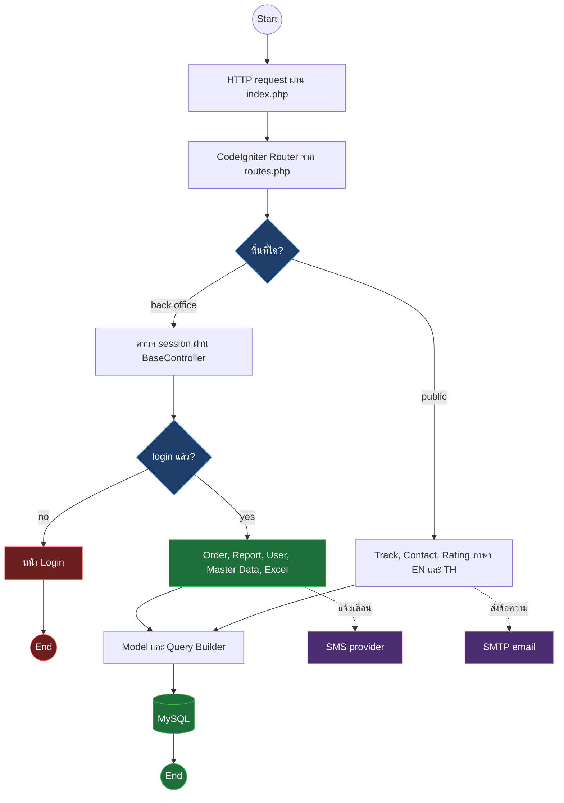
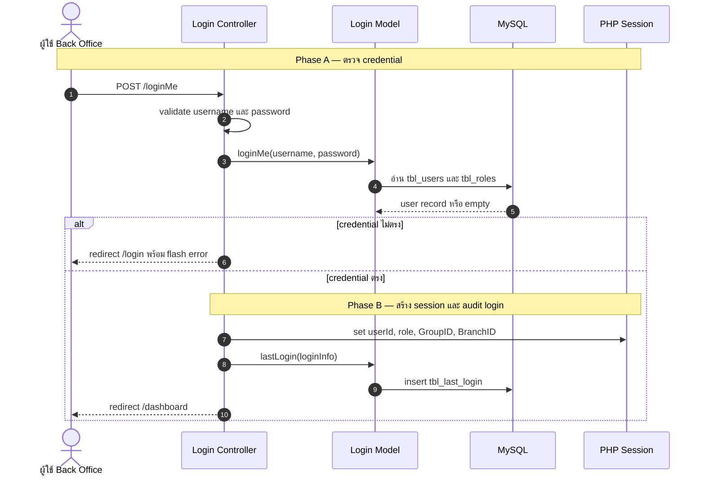
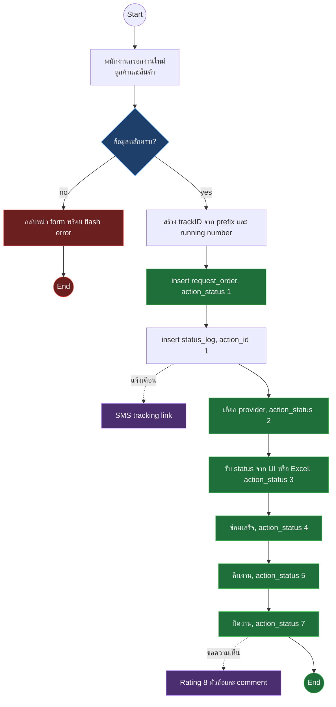
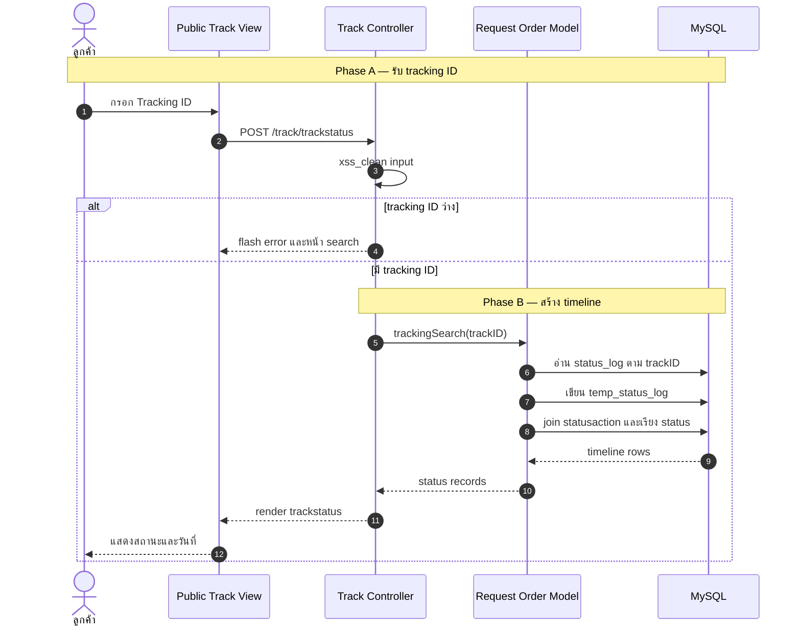
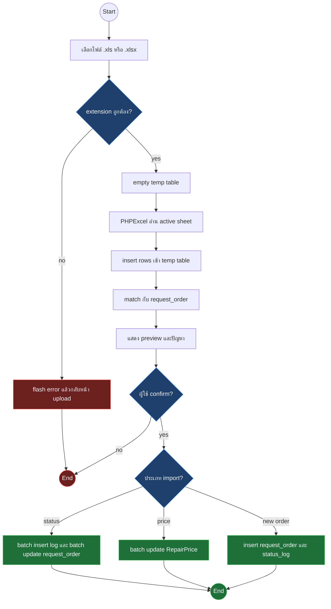
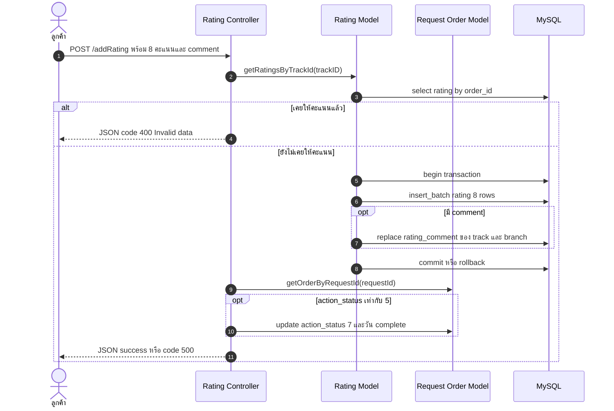
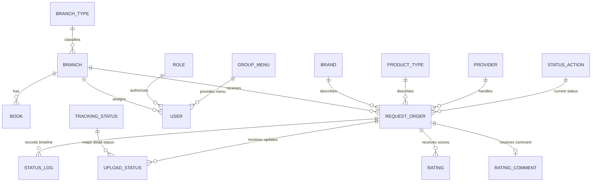

# Samsonite Tracking — รายงานการทำงานของระบบเดิม

> Source: source code ใน working tree ปัจจุบัน โดยยึด `application/config/routes.php`, controllers, models, views และ helpers
> Scope: public website, back office, งานซ่อม, tracking, rating, Excel import, report, master data และ integration
> Generated: 2026-08-09
> Updated: 2026-08-11
> Version: v3.1 — เพิ่ม function inventory baseline และ disposition evidence linkage

**หมายเหตุ baseline (2026-08-17)**: เอกสารนี้เขียนจาก working tree ก่อน CI3 pin — source ที่เป็นทางการตอนนี้คือ commit `8dad4e33` ตาม `outputs/reference/2026-08-17_ci3-reference-baseline_v1.md` ซึ่งไม่มีไฟล์ `application/controllers/--User.php`, `application/libraries/Google_oauth.php` และ `application/views/includes/header_report.php` แล้ว (ถูกลบเป็น dead code) จุดที่เอกสารนี้ยังอ้างถึงสามไฟล์นั้นให้ถืออ่านเป็นประวัติ ไม่ใช่ข้อเท็จจริงที่ pin — disposition ของทุกจุดอยู่ `2026-08-17_function-disposition-evidence_v2.md` หัวข้อ Retired points

เอกสารนี้อธิบายสิ่งที่ระบบเดิมทำจาก code จริง พร้อม actor, process contract, business rules, flow, logical data relationship, ข้อจำกัดและจุดควบคุมสำหรับตรวจสอบย้อนหลัง.

## การควบคุมเอกสาร

| หัวข้อ | รายละเอียด |
|---|---|
| วัตถุประสงค์ | เป็น system baseline สำหรับดูแลระบบ, วิเคราะห์ incident และใช้เทียบ behavior ระหว่าง migration |
| กลุ่มผู้อ่าน | Product owner, business owner, developer, QA, security, operations และผู้ตรวจสอบข้อมูล |
| In scope | Public website, back office, repair order, tracking, rating, Excel import, reporting, master data และ integrations |
| Out of scope | Physical schema/FK ที่ไม่มีใน repo, infrastructure จริง, production data, business label ของ status และ external SLA |
| วิธีศึกษา | Static trace จาก route → controller → model/helper/library → view/frontend/integration และ function token inventory โดยไม่คัดลอก secret value |
| ระดับความเชื่อมั่น | ยืนยัน structure และ code path; runtime behavior ต้องยืนยันเพิ่มด้วย database seed, test data และ integration sandbox |
| เวอร์ชันระบบ | CodeIgniter 3.1.6; PHP target ปัจจุบันไม่ได้ระบุจาก deployment artifact |
| วันที่ฐานข้อมูลความรู้ | 2026-08-09 |
| Research method | Static code trace + repository metadata + safe dependency audit; ไม่เปิด session/upload content หรือ secret values |

### สถานะหลักฐาน

| ระดับ | ความหมาย | การใช้ในเอกสาร |
|---|---|---|
| ยืนยันจาก code | มี route/caller/query/view รองรับ | ใช้ระบุ behavior และ source line |
| อนุมานจาก flow | เห็นเลขสถานะหรือ relationship แต่ไม่มี seed/schema | ระบุเป็นข้อสันนิษฐาน ไม่ตั้งชื่อ business แบบเด็ดขาด |
| ต้องยืนยัน runtime | พึ่ง database, external provider, session หรือ concurrency | บันทึกเป็นข้อจำกัดและ acceptance test ที่ต้องเพิ่ม |

## สรุปสำหรับผู้ดูแลระบบ

ระบบเป็น web application สำหรับรับงานซ่อมสินค้า ติดตามสถานะ แจ้งลูกค้า เก็บคะแนนบริการ และออกรายงาน แบ่งเป็น public website กับ back office ที่ใช้ session และเมนูตาม group

| พื้นที่ | ความสามารถหลัก | ผู้ใช้ |
|---|---|---|
| Public website | ค้นหา tracking, ดู timeline, ติดต่อ, ส่ง rating | ลูกค้า |
| Back office | สร้างและแก้ไขงาน, เปลี่ยนสถานะ, พิมพ์ใบงาน | พนักงานและสาขา |
| Batch operation | นำเข้า status, ราคา, งานใหม่จาก Excel | ผู้ปฏิบัติงาน |
| Reporting | รายงานงาน, SLA, rating, pending, summary, Excel export | ผู้บริหารและพนักงาน |
| Administration | ผู้ใช้, สาขา, master data, เมนู, background | ผู้ดูแล |

ระบบใช้ CodeIgniter 3.1.6 แบบ MVC, MySQL ผ่าน CodeIgniter Query Builder, PHP session, PHPMailer, PHPExcel และ helper สำหรับ SMS. หลักฐาน: `system/core/CodeIgniter.php:58`, `application/config/autoload.php:55-67`, `application/controllers/Upload_excel.php:51-66`, `application/controllers/Order.php:732-738`

### Repository และ runtime footprint

| พื้นที่ | ขนาด/จำนวนที่ตรวจพบ | สถานะ | ผลต่อระบบและ migration |
|---|---:|---|---|
| `application/` | 2.3 MB, 226 files | source หลัก | scope functional migration |
| `system/` | 2.2 MB | CI 3.1.6 framework | ห้าม copy เข้า CI4 |
| `lib/` | 24 MB, 1,025 files | bundled legacy libraries | ต้อง caller audit; replace/delete มากกว่า port |
| `assets/` | 25 MB, 1,001 files | Bootstrap/jQuery/DataTables/CKEditor และ UI assets | ทำ frontend dependency inventory/SCA แยก |
| `tools/` | 54 MB, 3,551 files | มี phpMyAdmin 5.2.0 + vendored dependencies | ไม่ควรอยู่ใต้ application web root |
| `uploads/` | ประมาณ 14 GB | image/Excel operational data | แยกจาก source/release และกำหนด retention/access |
| Git tracked uploads | 18,680 files | ถูก version control | เสี่ยง PII/ขนาด repo; pack ประมาณ 12.92 GiB |
| Git tracked session files | 15 paths | runtime session artifacts ถูก version control | ต้อง incident review และ invalidate sessions ที่เกี่ยวข้อง |
| Backup/reject source | อย่างน้อย 17 paths | ชื่อ `BACKUP`, `.rej`, `---`, `old`, `test` | ห้าม port ถ้าไม่มี active caller proof |

ตัวเลขมาจาก `du`, `find`, `git ls-files` และ `git count-objects` โดยไม่เปิดเนื้อหาใน session/upload files.

### External exposure boundary

| Finding | Evidence | Assessment | Required action |
|---|---|---|---|
| Project root ทำหน้าที่ document root | `index.php` และ `.htaccess` อยู่ root | source/runtime directories อยู่ใต้ web tree | CI4 ต้องชี้ document root ไป `public/` เท่านั้น |
| Existing file/directory bypass front controller | `.htaccess:51-53` ใช้ `!-f`/`!-d` | `tools`, `lib`, `uploads` อาจถูกเสิร์ฟตรง หาก web server ไม่มี deny rule อื่น | deny access ทันทีและยืนยันด้วย HTTP tests |
| phpMyAdmin อยู่ใน `tools/pma` | `tools/pma/README:4`, `tools/pma/index.php` | admin tool ปะปนกับ application release | remove จาก deploy artifact หรือแยก protected admin network |
| phpMyAdmin lock มี advisory | `composer audit --locked` วันที่ 2026-08-09 พบ 32 advisories ใน 8 packages | attack surface สูงหาก path เข้าถึงได้ | block/remove ก่อน migration; ไม่แก้ด้วยการซ่อน link |
| `uploads` ไม่มี `.htaccess` เฉพาะพื้นที่ | filesystem inventory | file ถูกเสิร์ฟตาม web server policy | ปิด script execution, validate content และใช้ controlled download เมื่อเป็น PII |
| HTTPS redirect ถูก comment | `.htaccess:7-9` | application ไม่บังคับ HTTPS จาก repo config | บังคับที่ trusted proxy/web server และทดสอบ redirect/header |
| Environment default เป็น development | `index.php:57-70` | หาก `CI_ENV` ไม่ถูกตั้ง อาจแสดง stack/path/error | production ต้อง fail closed และ `display_errors=0` |

---

## สารบัญ diagram

| § | Diagram | Source |
|---|---|---|
| 1 | ภาพรวมระบบ | `routes.php:41-266`, `BaseController.php:109-145` |
| 2 | Login และ authorization | `Login.php:24-104`, `BaseController.php:36-68` |
| 3 | วงจรงานซ่อม | `Order.php:624-930`, `Request_order_model.php:903-1028` |
| 4 | ลูกค้าตรวจสอบ tracking | `Track.php:25-74`, `Request_order_model.php:1420-1484` |
| 5 | Excel import แบบ preview และ confirm | `Upload_excel.php:43-579` |
| 6 | Rating และการปิดงาน | `Rating.php:43-116`, `Rating_model.php:5-61` |
| 7 | Logical data relationship | models ใน `application/models/` |

---

## 1. ภาพรวมระบบ

Request ทุกประเภทเข้า `index.php` แล้ว CodeIgniter route ไปยัง controller. Back office โหลด header, view และ footer ผ่าน `BaseController`; public website มี layout ภาษาอังกฤษและไทยแยกกัน

**Mapping →** default route และ route หลักอยู่ที่ `application/config/routes.php:41-266`; layout loader อยู่ที่ `application/libraries/BaseController.php:109-145`; database และ session ถูก autoload ที่ `application/config/autoload.php:55`.

---

## 2. บทบาทและขอบเขตการเข้าถึง

Back office ใช้ session keys ได้แก่ `userId`, `role`, `GroupID`, `BranchID`, `roleText`, `name`, `lastLogin` และ `isLoggedIn`. Controller ที่สืบทอด `BaseController` เรียก `isLoggedIn()` เพื่อ redirect ผู้ไม่ผ่าน login ไปหน้า login. หลักฐาน: `application/controllers/Login.php:68-96`, `application/libraries/BaseController.php:36-56`

เมนูไม่ hardcode ทั้งหมดใน view แต่ประกอบจาก `group_menu`, `group_type` และ `tbl_menu` ตาม `GroupID`. ผู้ใช้ที่มี `BranchID` ถูกจำกัดข้อมูลหลาย query ให้อยู่ในสาขาตัวเอง. หลักฐาน: `application/views/includes/header.php:189-264`, `application/models/User_model.php:269-316`, `application/models/Request_order_model.php:177-242`

### 2.1 Actor และขอบเขตข้อมูล

| Actor | Authentication | ความสามารถ | ขอบเขตข้อมูล | จุดควบคุมที่พบ |
|---|---|---|---|---|
| ลูกค้า | ไม่ใช้ session | tracking, contact, rating | ระบุตาม tracking ID หรือข้อมูล form | form validation และ lookup ใน controller/model |
| พนักงานสาขา | login session | สร้าง/แก้ order, เปลี่ยน status, พิมพ์, report | จำกัดด้วย `BranchID` ในหลาย query | `BaseController::isLoggedIn()` และ branch filter |
| ผู้ปฏิบัติงานส่วนกลาง | login session | batch update, provider flow, report/export | หลายสาขาตาม group/role | menu group และ controller access |
| ผู้บริหาร | login session | dashboard, SLA, rating, pending, summary | สาขาที่ role/group อนุญาต | filter วันที่/สาขาใน report queries |
| ผู้ดูแลระบบ | login session | user, role/group menu, master data, background | ข้าม module ตาม menu permission | session + menu mapping; ไม่พบ policy object แยก |
| ระบบภายนอก | credential/config เฉพาะ integration | SMTP email และ SMS | payload จาก contact/order/reset flow | helper/library calls; retry/audit ไม่เป็นมาตรฐานเดียวกัน |

ตารางนี้สรุป behavior ที่ code แสดง ไม่รับรองว่า role ทุกชื่อมีอยู่จริงใน production database เพราะ repo ไม่มี role/group seed.

### 2.2 Login sequence

**Mapping →** validation และ session: `application/controllers/Login.php:50-104`; credential query และ password verify: `application/models/Login_model.php:11-35`; login history: `application/models/Login_model.php:114-135`.

### 2.3 ฟังก์ชันบัญชีผู้ใช้

| ฟังก์ชัน | วิธีทำงาน | หลักฐาน |
|---|---|---|
| Login และ logout | ตรวจ password hash, สร้าง session, บันทึก browser/IP/platform, destroy session เมื่อ logout | `Login.php:50-104`, `BaseController.php:93-99` |
| Forgot password | สร้าง activation record, ส่ง reset link ทาง email, ตรวจ token ก่อนตั้ง password ใหม่ | `Login.php:111-287`, `Login_model.php:38-108` |
| User management | list/search/add/edit และ soft delete ด้วย `isDeleted = 1` | `User.php:826-1104`, `User_model.php:10-175` |
| Change password | ตรวจ old password แล้วเขียน hash ใหม่ | `User.php:1109-1155`, `User_model.php:185-217` |
| Login history | list ประวัติ login ราย user พร้อม pagination | `User.php:1172-1196`, `User_model.php:224-253` |
| Menu by group | อ่าน menu group และ type เพื่อ render sidebar ตามสิทธิ์ | `header.php:189-264`, `User_model.php:269-316` |

### 2.4 Authorization behavior ที่ต้องแยกจากเมนู

| Finding | Code behavior | Risk/ข้อสรุป |
|---|---|---|
| Session gate | `isLoggedIn()` ตรวจเพียง `isLoggedIn == TRUE` แล้วโหลด role/group/branch | ยืนยันตัวตน แต่ไม่ใช่ permission check ราย action |
| Controller access | `isAdmin()` คืน deny เฉพาะเมื่อ role ต่ำกว่า 1; controller จำนวนมากใช้ pattern นี้ | role ค่าบวกทุกชนิดอาจเรียก direct route ได้ ต้องยืนยัน policy ด้วย negative tests |
| Menu visibility | header query menu ตาม `GroupID` | การซ่อนเมนูไม่ป้องกัน direct HTTP request |
| Branch restriction | filter กระจายใน model methods | endpoint ที่ลืม filter อาจเกิด IDOR/PII leak ข้ามสาขา |
| `isTicketter()` | ใช้ `role != ADMIN \|\| role != MANAGER` ซึ่งเป็นจริงเสมอสำหรับ role เดียว และไม่พบ caller | dead/incorrect guard; ห้าม port |
| Destructive endpoints | 13 delete routes เรียก controller methods ที่รับ POST | CSRF ปิดและ route ไม่ผูก HTTP verb จึงเป็น high-risk boundary |

หลักฐาน: `application/libraries/BaseController.php:36-79`, `application/config/routes.php:58-254` และการเรียก `isAdmin()` ใน controllers หลัก.

### 2.5 Session และ password-reset contract

| Finding | Evidence | Risk/ข้อเสนอ baseline |
|---|---|---|
| Session files อยู่ใน application tree | `config.php:252-261` และ `application/sess/` | แยกไป runtime storage; ห้าม commit/serve |
| Session artifacts ถูก Git track | `git ls-files application/sess` พบ 15 paths | invalidate active sessions, incident review และ purge ตาม approved history procedure |
| Cookie secure ปิด | `config.php:277` | session อาจถูกส่งผ่าน HTTP หาก infrastructure ไม่บังคับ HTTPS |
| HttpOnly/SameSite ไม่ได้กำหนดใน app config | ไม่พบ config keys | target ต้องกำหนด explicit cookie contract |
| Login ไม่ regenerate ID แบบ explicit | `Login.php:50-96` | target ต้อง regenerate หลัง authentication/privilege change |
| Reset token ไม่มี expiry check | create time ที่ `Login.php:150-151`; lookup ตรวจ email/token ที่ `Login_model.php:90-99` | token เก่ายัง valid จนถูกลบ; เพิ่ม TTL, single-use และ revoke token เก่า |
| Login/reset ไม่มี rate-limit control ที่พบ | controllers/models ไม่มี throttler/attempt ledger | เพิ่ม throttling, generic response และ audit ที่ไม่ log password/token |
| Encryption key hardcode ใน tracked config | `config.php:232` | ถือเป็น exposed secret; rotate และย้าย secret manager/environment |

ห้ามคัดลอก session files, reset tokens หรือ encryption key เข้า test fixture/report.

---

## 3. Inventory ฟังก์ชันระบบ

### 3.1 งานซ่อมและ tracking หลังบ้าน

| ฟังก์ชัน | การทำงาน | หลักฐาน |
|---|---|---|
| รายการรับงานใหม่ | ค้นด้วย tracking/order/customer/SKU/branch/status, กรองวันที่, แบ่งหน้า | `Order.php:30-86`, `Request_order_model.php:28-133` |
| สร้างงาน | validate ลูกค้าและ brand, สร้าง tracking ID, บันทึกสินค้า/เงื่อนไข/รูป, ตั้ง status 1 | `Order.php:624-733` |
| แจ้งรับงาน | เพิ่ม `status_log` action 1 และส่ง SMS พร้อม tracking link | `Order.php:733-738` |
| ส่งงานให้ provider | เลือกหลายงาน, ระบุ provider หรือ logistics อื่น, เปลี่ยน status 2 | `Order.php:747-802` |
| เปลี่ยนสถานะงาน | update หลายงาน, บันทึกวัน, เพิ่ม status log, เลือกส่ง SMS ได้ | `Order.php:805-865` |
| ส่งคืนหรือปิดงาน | บันทึก `date_deliver` หรือ `date_complete`, เพิ่ม status log | `Order.php:867-930` |
| แก้ไขงาน | โหลด master data และ order เดิม, update รายละเอียดและรูป | `Order.php:966-1132`, `Request_order_model.php:964-999` |
| ลบงาน | ไม่ลบ row จริง แต่เปลี่ยน `action_status` เป็น 8 | `Order.php:1134-1147`, `Request_order_model.php:1008-1028` |
| พิมพ์ใบงาน | โหลด order และ master data แล้ว render print-only view | `Order.php:938-963` |
| อัปโหลดรูปหลายไฟล์ | รับไฟล์, เปลี่ยนชื่อ และคืนชื่อไฟล์ให้ form งาน | `Order.php:1150-1170` |

### 3.2 Public website

| ฟังก์ชัน | การทำงาน | หลักฐาน |
|---|---|---|
| Tracking EN | รับ tracking ID ทาง form หรือ URL, query timeline, render English layout | `Track.php:25-74`, `views/en/track.php:1-97` |
| Tracking TH | validate tracking ID จาก form, query timeline, render Thai layout | `Track_th.php:25-60` |
| Timeline | รวม `status_log` กับ `statusaction`, เรียงสถานะ แล้วแสดงวันที่ พ.ศ. | `Request_order_model.php:1420-1484`, `views/en/trackstatus.php:12-68` |
| Contact EN/TH | validate ชื่อ/email/phone/detail, บันทึก `contact`, ส่ง email | `Contact.php:71-282`, `Contact_th.php:71-225`, `Contact_model.php:44-53` |
| Rating | รับคะแนน 8 หัวข้อและ comment, กันส่งซ้ำด้วย track ID, อัปเดตงานบางสถานะ | `Rating.php:43-116`, `Rating_model.php:5-61` |

### 3.3 Excel batch operation

| ฟังก์ชัน | การทำงาน | หลักฐาน |
|---|---|---|
| Import status งานซ่อม | รับ `.xls`/`.xlsx`, อ่านทุก row เข้า temp table, preview, confirm แล้ว batch update order/log/status detail | `Upload_excel.php:43-217` |
| Import ราคาซ่อม | อ่านไฟล์เข้า temp table, preview, confirm แล้ว batch update `RepairPrice` | `Upload_excel.php:224-366` |
| Import งานใหม่ | อ่านไฟล์เข้า temp table, preview, สร้าง tracking ID และ request rows เมื่อ confirm | `Upload_excel.php:368-579` |
| Temp matching | match order display ID และเบอร์ลูกค้ากับ `request_order` ก่อน confirm | `Request_order_model.php:1552-1633` |

### 3.4 รายงานและ export

| รายงาน | ตัวกรองและผลลัพธ์ | หลักฐาน |
|---|---|---|
| Tracking detail | วันที่, สาขา, status หลายค่า, search text | `Order.php:426-511` |
| Tracking summary | วันที่, สาขา, status, brand, product type | `Order.php:1332-1409` |
| Excel tracking | query ชุดใหญ่แล้ว render view สำหรับ export | `Order.php:1172-1244` |
| Excel summary | summary ตาม brand/type/status แล้ว render export view | `Order.php:1248-1317` |
| Rating dashboard | ช่วงวันที่และสาขา, รวมคะแนนตามหัวข้อ | `User.php:71-434`, `Rating_model.php:64-156` |
| Excel rating | รวม rating, comment และ order detail ต่อ tracking ID | `User.php:438-569` |
| Job by day | สรุป brand × product type หลายช่วงอายุงาน | `User.php:572-668`, `Request_order_model.php:1648-1804` |
| Pending jobs | งานค้างและจำนวนตามช่วงวันที่/สาขา | `User.php:669-825`, `Request_order_model.php:1806-1887` |
| In-progress average | totals แยก status 1–5 | `User.php:1260-1337`, `Request_order_model.php:1888-1971` |
| In-progress list | รายการงานไม่เสร็จ กรองวันที่/สาขา/status และ export Excel | `User.php:1340-1525`, `Request_order_model.php:1973-2009` |

### 3.5 Master data และ CMS

ทุก module ใช้รูปแบบ list/search → add form → validate → insert → edit form → update → delete. Route หลักอยู่ที่ `application/config/routes.php:74-216` และ `application/config/routes.php:234-254`.

| Module | Table หลัก | ใช้ในระบบ |
|---|---|---|
| Branch type | `branch_type` | จัดประเภทสาขาและภาพ dashboard |
| Branch | `branch` | ผูกผู้ใช้ งาน รายงาน และ prefix tracking |
| Book | `book` | เลขเล่มหรือเลขอ้างอิงงานตามสาขา |
| Brand | `brand` | ยี่ห้อสินค้าในงานและรายงาน |
| Product type | `type` | ประเภทสินค้าในงานและรายงาน |
| Condition | `condition` | สภาพสินค้าที่รับเข้า |
| Estimate price | `estimateprice` | ตัวเลือกประเมินราคา |
| Fixed | `fixed` | รายการวิธีหรือจุดซ่อม |
| Provider | `provider` | ผู้ขนส่งหรือผู้ให้บริการที่รับงาน |
| Tracking status | `tracking_status` | แปลงข้อความ status จาก Excel เป็นสถานะย่อย |
| Menu | `group_menu`, `group_type`, `tbl_menu` | จัดเมนูตาม group |
| Background web | `tbl_background_web` | จัดการภาพพื้นหลัง public website แยกสาขา |

**Mapping →** CRUD models: `application/models/Branch_model.php:6-222`, `Book_model.php:6-99`, `Brand_model.php:9-105`, `Producttype_model.php:9-105`, `Condition_model.php:9-105`, `Estimateprice_model.php:9-105`, `Fixed_model.php:9-105`, `Provider_model.php:9-97`, `Statustype_model.php:9-98`, `Menu_model.php:6-90`, `Background_web_model.php:7-67`.

### 3.6 Use case catalog

| ID | Use case | Actor | Preconditions | ผลลัพธ์หลัก | Failure/ข้อจำกัด |
|---|---|---|---|---|---|
| UC-01 | Login | ผู้ใช้หลังบ้าน | บัญชี active และ password ตรง | session + login history | credential ผิดกลับ login; ไม่มี centralized rate limit ที่พบ |
| UC-02 | สร้าง repair order | พนักงาน | login, master data พร้อม | order status 1 + status log + SMS | tracking ID อาจชนจาก `select_max + 1` |
| UC-03 | ส่งงานเข้า workflow | พนักงาน | เลือก order status ที่รองรับ | status 2 + provider/logistics data | batch บางส่วนล้มเหลวไม่มี atomic contract ชัด |
| UC-04 | เปลี่ยนสถานะ | พนักงาน | login และมี order | order dates + status log + optional SMS | transition matrix อยู่ใน code/DB กระจายหลายจุด |
| UC-05 | ส่งคืนหรือปิดงาน | พนักงาน | order ผ่านขั้นก่อนหน้า | `date_deliver`/`date_complete` + log | business label ของ status ต้องยืนยันจาก seed |
| UC-06 | Public tracking | ลูกค้า | มี tracking ID | order summary + timeline | global temp table เสี่ยงปนเมื่อ concurrent |
| UC-07 | Contact | ลูกค้า | form ผ่าน validation | contact row + email | SMTP secret hardcode; delivery failure contract ไม่ชัด |
| UC-08 | Rating | ลูกค้า | tracking ID ยังไม่เคยให้คะแนน | 8 scores + comment + possible status update | `Rating::index()` มี redirect ก่อน render |
| UC-09 | Import status/price/order | ผู้ปฏิบัติงาน | login + `.xls`/`.xlsx` | preview แล้ว batch confirm | temp table global เสี่ยง overwrite ข้ามผู้ใช้ |
| UC-10 | Report/export | พนักงาน/ผู้บริหาร | login + filters | HTML summary หรือ Excel output | raw SQL บางส่วนและ memory limit สูง |
| UC-11 | Manage user/menu | ผู้ดูแล | login + menu access | user/session authority metadata | authorization กระจายระหว่าง session, menu และ query |
| UC-12 | Manage master data | ผู้ดูแล | login + module access | lookup data สำหรับ order/report | physical delete อาจกระทบ historical labels |

### 3.7 Process contract และ side effects

| Process | Input | Validation | Database writes | External side effect | Output |
|---|---|---|---|---|---|
| Login | username/password | required + password verify | login history | ไม่มี | authenticated session หรือ error |
| Forgot password | email/token/new password | account + token + form rules | activation/password | SMTP email | reset link หรือ reset result |
| Create order | customer/product/branch/images | required fields + master lookup | request order + status log | SMS | tracking ID และ order view |
| Status update | order IDs/status/date/detail | selection + status-specific fields | order + status log/detail | optional SMS | updated queue/report state |
| Contact | name/email/phone/detail | form validation | contact | SMTP email | success/error page |
| Rating | tracking ID + 8 scores + comment | duplicate check + score fields | rating/comment + possible order update | ไม่มี | acknowledgement |
| Excel preview | spreadsheet rows | extension + row parsing/matching | temp tables | ไม่มี | preview/reject list |
| Excel confirm | previewed batch | match result จาก temp table | batch order/log/detail updates | อาจมี downstream notification | summary/result page |
| Report/export | date/branch/status/search filters | controller-specific validation | ไม่มีตาม intent | file download | HTML/Excel result |

Transaction boundary, idempotency, retry และ partial-failure behavior ยังไม่เป็น contract กลาง. จุดนี้ต้องถูกบันทึกก่อนแก้หรือย้ายระบบ.

### 3.8 Upload และ file lifecycle

| Flow | Validation ปัจจุบัน | Storage behavior | Finding |
|---|---|---|---|
| Order images | allow extension `png/jpg/gif` | ต่อ `$time` กับ client filename ใต้ `uploads/` | ไม่ตรวจ MIME/size/dimensions; filename ไม่สร้างแบบ server-owned |
| Background images | ใช้ extension จาก client filename | เขียนชื่อคงที่ตาม slot ใต้ `uploads/web/` | ไม่พบ server-side allowlist/MIME/size check |
| Excel imports | allow extension `xls/xlsx` | เขียน random name ใต้ `uploads/excel/` | ไม่ตรวจ MIME/ZIP bomb/row limit; cleanup `unlink` ถูก comment |
| Stored operational files | image + Excel อย่างน้อย 18,112 files จาก inventory | อยู่ใต้ project root และ Git track จำนวนมาก | release, backup, privacy และ performance ปะปนกัน |

หลักฐาน: `Order.php:1150-1170`, `Background_web.php:69-163`, `Upload_excel.php:51-75`, `Upload_excel.php:481` และ filesystem inventory. จำนวนไฟล์เป็น count เท่านั้น; ไม่เปิดเนื้อหา.

### 3.9 View coupling และ output safety

| Finding | จำนวน/ตำแหน่ง | ผลต่อ behavior/migration |
|---|---|---|
| Views เรียก session/model ผ่าน CI superobject | 244 hits ใน 70 view files | copy view ตรงไป CI4 ไม่ได้; ต้องส่ง view data/flashdata จาก controller/service |
| Views เรียก model โดยตรง | 46 hits ใน 19 files | เกิด hidden query/N+1 โดยเฉพาะ report/export; ย้าย query ออกจาก presentation |
| HTML escaping helper ใน views | ไม่พบ `html_escape`/`htmlspecialchars` จาก scan | PII/master/contact output จำนวนมาก echo ตรง; ต้อง context-aware escaping |
| Delete AJAX success check ใช้ assignment | `if (data.status = true)` 19 จุด | UI แสดง success แม้ server คืน failure; baseline ต้องยืนยันจาก DB ไม่ใช่ alert |
| Header/layout ซ้ำหลายไฟล์ | `header.php`, `header_order.php`, `header_report.php`, `header_th.php` | menu/permission/UI fix อาจ drift; target ใช้ layout/partial เดียวตามความต่างจริง |

ตัวอย่าง model calls ใน view: `includes/header.php:82-204`, `tracking/report_tracking.php:346-354`, `tracking/reportsummary.php:371-379`. ตัวอย่าง unescaped PII: `tracking/print_order.php:481-499`, `master/contactlist.php:51-55`.

---

## 4. วงจรงานซ่อม

ชื่อ status จริงอ่านจาก table `statusaction`; repo ไม่มี seed/schema จึงยืนยันจาก code ได้เฉพาะหมายเลขและหน้าที่ของ queue แต่ละช่วง

| `action_status` | ความหมายจาก flow ที่สังเกตได้ | หลักฐาน |
|---|---|---|
| 1 | งานใหม่ รอส่งต่อ | `Order.php:726-735`, `Request_order_model.php:28-59` |
| 2 | ส่งเข้า workflow ซ่อม | `Order.php:747-780`, `Request_order_model.php:63-170` |
| 3 | อยู่ระหว่างซ่อม/อัปเดตจาก Excel | `Upload_excel.php:167-192`, `Request_order_model.php:177-242` |
| 4 | งานซ่อมเสร็จ รอขั้นส่งคืน | `Upload_excel.php:184-190`, `Request_order_model.php:392-457` |
| 5 | ขั้นคืนงานหรือรอยืนยันรับ | `Order.php:846-851`, `Request_order_model.php:249-314` |
| 7 | ปิดงานสมบูรณ์ | `Order.php:817-855`, `Request_order_model.php:320-389` |
| 8 | ยกเลิกหรือ soft delete | `Request_order_model.php:1008-1028` |

**Mapping →** create: `application/controllers/Order.php:624-744`; status update: `Order.php:747-930`; model write และ soft delete: `application/models/Request_order_model.php:903-1028`.

---

## 5. ลูกค้าตรวจสอบ tracking

**Mapping →** form: `application/views/en/track.php:1-20`; controller: `application/controllers/Track.php:39-73`; timeline query: `application/models/Request_order_model.php:1420-1484`; rendering: `application/views/en/trackstatus.php:12-68`.

---

## 6. Excel import แบบสองขั้น

ทั้ง 3 import ใช้แนวคิดเดียวกัน: upload และ parse → เก็บ temp → preview/match → confirm → เขียนข้อมูลจริง. จุดนี้ลดการเขียนข้อมูลผิดทันที แต่ temp table เป็น global ไม่ได้แยกตาม user/session

**Mapping →** status import: `application/controllers/Upload_excel.php:43-217`; price import: `Upload_excel.php:224-366`; new-order import: `Upload_excel.php:368-579`; temp queries: `application/models/Request_order_model.php:1552-1633`.

---

## 7. Rating และการปิดงาน

**Mapping →** controller: `application/controllers/Rating.php:43-116`; transaction: `application/models/Rating_model.php:5-44`; duplicate check: `Rating_model.php:46-61`; order transition: `Rating.php:78-93`.

---

## 8. Logical data relationship

Relationship ต่อไปนี้สรุปจาก join, where และ write path ใน models ไม่ใช่ physical schema. ไม่มี migration หรือ SQL dump ให้ยืนยัน FK, cardinality, type, nullability และ index จริง

| Relationship | หลักฐานจาก code |
|---|---|
| Branch → Request order | join `branch.branch_id = order.branchID` ที่ `Request_order_model.php:33-36` |
| Status action → Request order | join `statusaction.status_id = order.action_status` ที่ `Request_order_model.php:34-35` |
| Request order → Status log | insert `order_id = trackID` ที่ `Order.php:733-735` และ query ที่ `Request_order_model.php:1420-1431` |
| Request order → Rating | lookup `rating.order_id = trackID` ที่ `Rating_model.php:46-55` |
| Request order → Rating comment | comment ใช้ `track_id` และ `branch_id` ที่ `Rating_model.php:21-27` |
| User → Branch/Role | login session มาจาก user record ที่ `Login.php:78-86` และ query join role ที่ `Login_model.php:11-18` |
| Branch → Book | query book ด้วย `branch_id` ที่ `Book_model.php:6-35` |

---

## 9. พฤติกรรมที่ต้องรู้ก่อนแก้หรือเชื่อมระบบ

### 9.1 จุดที่ทำงานได้แต่มีข้อจำกัด

| ประเด็น | ผลต่อการทำงาน | หลักฐาน |
|---|---|---|
| Public tracking ใช้ global temp table | request พร้อมกันอาจล้างหรือปน timeline กัน เพราะ `empty_table` ทุกครั้ง | `Request_order_model.php:1463-1484` |
| Running tracking number ใช้ `select_max` แล้วบวกหนึ่ง | concurrent create อาจสร้างเลขซ้ำ หาก DB ไม่มี unique constraint | `Request_order_model.php:1343-1369` |
| Excel temp table เป็น global | user สองคน upload พร้อมกันอาจ overwrite preview ของกัน | `Upload_excel.php:60`, `Upload_excel.php:241`, `Upload_excel.php:399` |
| Status name อยู่ใน DB | source ระบุเลข queue แต่ยืนยันชื่อ business จริงไม่ได้หากไม่มี seed/data | `Request_order_model.php:1128-1133` |
| Report query สร้าง SQL จาก input บางจุด | ต้องตรวจ SQL injection และรูปแบบ filter ก่อนเปิด endpoint เพิ่ม | `Request_order_model.php:462-749` |
| CSRF และ global XSS filter ปิด | trust boundary พึ่ง validation เฉพาะแต่ละ controller และ Query Builder | `application/config/config.php:255`, `application/config/config.php:302` |
| Cookie security ไม่บังคับครบ | deployment ต้องตรวจ HTTPS, secure cookie และ session policy | `application/config/config.php:277-288` |
| Master data ใช้ physical delete หลายจุด | การลบค่าที่ถูก order อ้างอิงอาจทำให้ report หรือ label ขาด | `Branch_model.php:108-112`, `Brand_model.php:94-98`, `Provider_model.php:94-98` |
| ไม่มี automated test ใน repo | flow ในเอกสารยืนยันด้วย static trace ไม่ใช่ runtime acceptance test | ผลจาก file inventory ณ 2026-08-09 |

### 9.2 Route หรือ flow ที่ไม่สมบูรณ์ใน code ปัจจุบัน

| จุด | พฤติกรรมจริง | หลักฐาน |
|---|---|---|
| `rackstatus` และ `rackstatus_th` | route ชี้ method `rackstatus` แต่ controller มี `trackstatus` | `routes.php:218-222`, `Track.php:39`, `Track_th.php:39` |
| Rating page | `Rating::index()` redirect กลับ base URL ก่อน code render rating view | `Rating.php:24-40` |
| Route report บางตัว | placeholder สองตัวส่ง `$1/$1` แทน `$1/$2` | `routes.php:114-116`, `routes.php:256-266` |
| `reportsummaryCount()` | อ้าง `$branch_id` ที่ไม่ได้รับเป็น parameter หรือกำหนด local | `Request_order_model.php:844-879` |
| README | เป็น Bitbucket starter template ไม่อธิบายระบบ | `README.md:1-48` |

### 9.3 Security และข้อมูลอ่อนไหว

พบ SMTP credential ถูก hardcode ใน controller หลายตำแหน่ง. เอกสารนี้ไม่คัดลอกค่า ต้อง rotate/revoke credential เดิมทันที แล้วอ่านค่าจาก environment variable หรือ secret manager. ตำแหน่ง: `application/controllers/Login.php:213-214`, `application/controllers/Login.php:344-345`, `application/controllers/Contact.php:206-208`, `application/controllers/Contact_th.php:177-179`.

ระบบเก็บ PII ได้แก่ชื่อ เบอร์โทร email ที่อยู่และประวัติงานใน `request_order`, `contact`, report และ export. การเพิ่ม API หรือ log ต้องไม่เผยข้อมูลเหล่านี้. หลักฐาน: `application/controllers/Order.php:675-731`, `application/models/Contact_model.php:44-53`, `application/controllers/User.php:552-560`.

| ระดับ | Finding | หลักฐาน | ผลกระทบ | Control ที่ต้องทำ |
|---|---|---|---|---|
| P0 | มี credential และ encryption key อยู่ใน tracked source | SMTP ตามตำแหน่งข้างต้น; `application/config/config.php:232`; DB config ที่ `application/config/database.php:51-62` | secret ที่เคยเผยใน repository ถือว่า compromise แม้ลบภายหลัง | rotate/revoke, ตรวจ history/access log, ย้ายค่าไป secret manager และห้ามบันทึกค่าจริงในรายงาน |
| P0 | Project root มีโอกาสเป็น web root และ existing file/directory bypass front controller | `.htaccess:51-53`; มี `tools/pma`, `lib`, `uploads` ใต้ root | source, tool และ upload อาจถูกเรียกตรง หาก web-server ไม่มี deny rule นอก repo | ชี้ document root ไป public directory, deny direct access และทดสอบจากภายนอก |
| P0 | Bundled phpMyAdmin 5.2.0 อยู่ใน application tree | `tools/pma/README:4`, `tools/pma/libraries/classes/Version.php:17`; local `composer audit --locked` พบ 32 advisories กระทบ 8 packages | เพิ่ม privileged attack surface และ dependency ที่ไม่ใช่ส่วนของ application | นำออกจาก release artifact; หากยังจำเป็นให้แยก management plane, จำกัด network/SSO และอัปเดตต่างหาก |
| P0 | Runtime/session/upload data ถูก track ใน Git | 18,680 tracked paths ใต้ `uploads`; 15 tracked session paths; Git pack ประมาณ 12.92 GiB | session material, PII/file content และ repository history กระจายเกินจำเป็น | invalidate sessions, หยุด track runtime data, กำหนด retention และย้าย storage ออกจาก source tree |
| P1 | CSRF ปิดและ mutation routes ไม่ผูก HTTP verb ชัด | `application/config/config.php:302`; พบ delete route declarations 13 จุด | request ข้าม site หรือ wrong-method อาจเปลี่ยนข้อมูล | เปิด session-based CSRF, explicit verb routes และ negative tests |
| P1 | Session cookie/rotation ไม่ harden ครบ | `application/config/config.php:252-288`; login `application/controllers/Login.php:50-96` | session fixation/hijacking risk สูงขึ้น | strict mode, Secure, HttpOnly, SameSite, regenerate หลัง login/privilege change และ server-side invalidation |
| P1 | Authorization กระจายและเมนูถูกใช้เสมือน control | `BaseController.php:36-86`; `application/views/includes/header.php:189-264` | ซ่อนเมนูไม่ป้องกัน direct route access; branch/role policy drift | สร้าง route-policy matrix และ server-side deny-by-default filter |
| P1 | Upload ตรวจ extension/client filename เป็นหลัก | `Order.php:1150-1170`, `Background_web.php:69-163`, `Upload_excel.php:51-75` | MIME spoof, unsafe filename, resource exhaustion และ content ที่ไม่ตั้งใจ | validate upload status, MIME/content/extension/size/dimensions; random server filename; private non-executable storage |
| P1 | View echo PII และไม่พบ output-escaping helper จาก static scan | ตัวอย่าง `tracking/print_order.php:481-499`, `master/contactlist.php:51-55` | stored/reflected XSS และข้อมูลรั่ว | escape ตาม output context; allowlist rich HTML; เพิ่ม XSS regression tests |
| P1 | Google OAuth helper ปิด TLS peer verification และ log response | `application/libraries/Google_oauth.php:164-176` | MITM และ token/PII leakage ใน log หาก path ยัง active | พิสูจน์ caller; ถ้าไม่ใช้ให้ไม่ port, ถ้าใช้ให้เปิด certificate validation และ redact log |
| P1 | Production safety ไม่ใช่ default | `index.php:57-70`; `application/config/database.php:67-75`; HTTPS redirect ถูก comment ที่ `.htaccess:7-10` | error detail/SQL information อาจเปิดเผย และ transport/cookie policy พึ่ง deployment ภายนอก | production environment ต้อง fail closed, `DBDebug=false`, HTTPS/HSTS ที่ edge และ config test |

`composer audit` เป็น snapshot วันที่ 2026-08-09 ไม่ใช่การรับรองว่าพบครบ. จำนวน advisory เปลี่ยนได้เมื่อฐานข้อมูลช่องโหว่อัปเดต.

### 9.4 Business rules ที่อนุมานจาก code

| Rule ID | กฎ | Enforcement ปัจจุบัน | หลักฐาน/หมายเหตุ |
|---|---|---|---|
| BR-01 | Back office ต้องมี authenticated session | `BaseController::isLoggedIn()` | `BaseController.php:36-56` |
| BR-02 | เมนูแสดงตาม `GroupID` | query group/menu แล้ว render sidebar | `header.php:189-264`, `User_model.php:269-316` |
| BR-03 | ผู้ใช้สาขาเห็นข้อมูลตาม `BranchID` ในหลาย report/queue | filter ใน model queries | ต้องทดสอบทุก endpoint เพราะไม่ได้บังคับจาก policy กลาง |
| BR-04 | งานใหม่เริ่มที่ `action_status = 1` | controller insert | `Order.php:726-735` |
| BR-05 | ทุก status transition สำคัญควรมี `status_log` | controller/model insert | บาง batch flow มี detail tables เพิ่ม |
| BR-06 | การลบ order คือเปลี่ยน status 8 | soft-delete behavior เฉพาะ order | `Request_order_model.php:1008-1028` |
| BR-07 | User delete ใช้ `isDeleted = 1` | soft delete | `User_model.php:10-175` |
| BR-08 | Rating หนึ่ง tracking ID ส่งได้ครั้งเดียว | lookup ก่อน insert | `Rating_model.php:46-55` |
| BR-09 | Excel import ต้อง preview ก่อน confirm | temp table + confirm endpoint | ไม่มี batch owner key ที่พบ |
| BR-10 | Tracking ID ประกอบจาก running value | `select_max` แล้วบวกหนึ่ง | atomicity/unique constraint ต้องตรวจใน schema จริง |
| BR-11 | Master data ใช้ร่วมกับ order/report | joins และ select options | physical delete เสี่ยงทำ historical label หาย |
| BR-12 | Public รองรับภาษา EN/TH ด้วย controller/view แยก | route + duplicated layout | behavior สองภาษาอาจ drift เมื่อแก้เพียงฝั่งเดียว |

### 9.5 Data classification และ lifecycle

| Data class | ตัวอย่าง | แหล่งเก็บ/การใช้ | Control ที่ต้องยืนยัน |
|---|---|---|---|
| PII | ชื่อ, phone, email, address | order, contact, reports, exports | access scope, masking, retention, deletion request |
| Authentication | password hash, reset token, session keys | user/activation/session | hash algorithm, token TTL, cookie security, brute-force protection |
| Operational | tracking ID, status, dates, provider, repair price | request order, status logs, reports | integrity, unique constraint, audit retention |
| Customer feedback | rating scores และ comment | rating tables, dashboard/export | consent, retention และ branch visibility |
| File content | product photos และ Excel uploads | public/server paths และ temp processing | MIME/size validation, malware scan, path isolation, retention |
| Configuration secret | SMTP/SMS credentials | controller/helper/config เดิม | rotate/revoke, secret manager, log redaction |

### 9.6 Operational model

| เหตุการณ์ | Detection ปัจจุบัน | ผลกระทบ | Runbook ขั้นต่ำที่ต้องมี |
|---|---|---|---|
| SMTP/SMS ล้มเหลว | return/error handling เฉพาะจุด | ลูกค้าไม่ได้รับข้อความ แต่ DB อาจเขียนแล้ว | ตรวจ provider response, retry แบบจำกัด, correlation ID และ manual resend |
| Excel row ผิด | preview/reject matching | batch บางรายการไม่ถูก update | เก็บ reject reason, batch ID, source filename hash และ operator |
| Duplicate tracking ID | ไม่พบ explicit handling | สร้าง order ผิดหรือ insert fail | unique constraint, retry และ alert |
| Concurrent public tracking | ไม่พบ isolation ของ temp table | timeline ปน/หาย | เลิก global temp table; query timeline ตรง |
| Report ใช้ memory สูง | เพิ่ม `memory_limit` ถึง `8048M` | worker crash หรือ resource exhaustion | pagination/streaming, query plan, export size limit |
| Unauthorized branch access | filter กระจายใน queries | เปิดเผย PII ข้ามสาขา | endpoint authorization tests และ deny-by-default policy |
| Database outage | framework error path | ทุก transaction/search หยุด | health check, alert, recovery target และ read-only communication plan |

### 9.7 Repository, storage และ deployment contract

| Contract | สภาพปัจจุบัน | Baseline ที่ต้องตัดสิน |
|---|---|---|
| Source artifact | repository มี application, framework, vendor-like libraries, phpMyAdmin และ runtime files รวมกัน | release artifact ต้องมีเฉพาะ code/assets ที่จำเป็น; dependency สร้างจาก lock file |
| Upload storage | `uploads/` ประมาณ 14 GiB; พบไฟล์ Excel 6,301 และ image 11,811 จาก filename inventory | ระบุ owner, retention, backup, checksum และ access path; ห้าม copy ทั้งก้อนไป CI4 โดยไม่มี reconciliation |
| Session storage | save path อยู่ใต้ `application/sess`; มี tracked session paths | session เป็น ephemeral secret; เก็บนอก source, จำกัด permission และ invalidate ตอน cutover |
| Ignore policy | `.gitignore` ปัจจุบันเป็น boilerplate; ไม่ครอบคลุม `.env`, runtime session และ uploads | เพิ่ม `.env`, `.env.*`, session/runtime paths และ upload policy; commit ได้เฉพาะ example ที่ไม่มี secret |
| Web boundary | directory ที่มี source/tool/upload อยู่ใต้ root เดียวกับ front controller | web server expose เฉพาะ public assets/front controller; uploads private หรือเสิร์ฟผ่าน controlled handler |
| Backup/reject files | พบ source backup/reject naming อย่างน้อย 17 paths | ลบจาก target หลัง caller proof; ห้าม deploy backup source ที่อาจเปิดทาง bypass review |

ตัวเลขไฟล์และขนาดเป็น point-in-time filesystem/Git inventory. ไม่ได้อ่าน file content และไม่ยืนยันว่าไฟล์ทั้งหมดเป็นข้อมูล production.

---

## 10. Source map

| Layer | Source หลัก | หน้าที่ |
|---|---|---|
| Routing | `application/config/routes.php` | public URL → controller/method |
| Shared controller | `application/libraries/BaseController.php` | session gate, layout, pagination |
| Authentication | `Login.php`, `Login_model.php` | login, reset password, login audit |
| Core domain | `Order.php`, `Request_order_model.php` | งานซ่อม, status, reports, tracking |
| Public tracking | `Track.php`, `Track_th.php` | search และ timeline EN/TH |
| Rating | `Rating.php`, `Rating_model.php` | คะแนน, comment, final transition |
| Batch import | `Upload_excel.php` | status, price และ new order imports |
| Back-office reports | `User.php` | rating, pending, SLA, Excel export |
| Master data | controllers/models ราย master | CRUD ค่าที่ order และ report อ้างอิง |
| Views | `application/views/` | HTML, forms, print และ export output |
| Integrations | `cias_helper.php`, PHPMailer, PHPExcel | SMS, email และ spreadsheet parsing |

## 11. Traceability Matrix

| Capability | Route/entry | Controller | Model/helper | View/output | Test baseline ที่ต้องสร้าง |
|---|---|---|---|---|---|
| Login | login routes | `Login.php` | `Login_model.php` | login/dashboard redirect | valid/invalid/disabled user, logout, timeout |
| Create order | order add routes | `Order.php` | `Request_order_model.php`, SMS helper | form/result/print | required fields, ID uniqueness, log, SMS failure |
| Status lifecycle | order queue routes | `Order.php` | `Request_order_model.php` | queue/report | allowed transition, dates, log, branch scope |
| Public tracking | track routes EN/TH | `Track.php`, `Track_th.php` | `Request_order_model.php` | tracking/timeline | found/not found, language parity, concurrency |
| Contact | contact routes EN/TH | `Contact.php`, `Contact_th.php` | `Contact_model.php`, email | success/error page | validation, DB write, SMTP failure, duplicate submit |
| Rating | rating routes | `Rating.php` | `Rating_model.php` | rating/result | first/duplicate rating, invalid score, status side effect |
| Excel import | upload routes | `Upload_excel.php` | DB + PHPExcel | preview/confirm/reject | malformed file, partial rows, concurrent batches, replay |
| Reports | order/user report routes | `Order.php`, `User.php` | request/rating models | HTML/Excel | filter matrix, totals parity, authorization, large dataset |
| Master data | module routes | per-module controllers | per-module models | CRUD views | referential use, delete behavior, duplicate values |

## 12. Baseline Acceptance Checklist

| Area | Acceptance evidence |
|---|---|
| Functional | Expected input/output สำหรับ UC-01 ถึง UC-12 พร้อม test data ที่ไม่ใช่ production PII |
| Data | DDL, indexes, constraints, triggers, seed ของ status/role/menu และ row-count baseline |
| Security | session/cookie policy, branch authorization, CSRF, upload validation และ secret scan |
| Integration | SMTP/SMS sandbox result, timeout, retry, error mapping และ audit identifier |
| Performance | response/export time และ memory จาก dataset ที่แทน production volume |
| Operations | backup/restore, error alert, log retention, failed batch recovery และ manual resend |
| Ownership | business owner ยืนยัน status labels, report totals และ destructive master-data behavior |

เอกสารระบบเดิมถือว่า baseline สมบูรณ์เมื่อ checklist มีหลักฐานจริง ไม่ใช่เพียง code trace.

## 13. Glossary

| คำ | ความหมายในระบบนี้ |
|---|---|
| Repair order | รายการรับซ่อมหลักใน `request_order` |
| Tracking ID | รหัสอ้างอิงที่ลูกค้าใช้ค้นหาและเชื่อม status/rating |
| Action status | สถานะหลักของ order จาก `statusaction` |
| Status log | ประวัติการเปลี่ยนสถานะของ tracking ID |
| Status detail | สถานะย่อยหรือข้อความที่มาจาก import/mapping |
| Branch scope | ขอบเขตข้อมูลที่จำกัดตาม `BranchID` ของผู้ใช้ |
| Preview/confirm | flow import สองขั้น: อ่านเข้า temp แล้วผู้ใช้ยืนยันก่อนเขียนจริง |
| Master data | ข้อมูลอ้างอิง เช่น branch, brand, type, condition, provider และ status mapping |
| Public flow | endpoint ที่ลูกค้าใช้โดยไม่มี back-office session |
| Back office | endpoint สำหรับพนักงานที่พึ่ง session และ group menu |

## 14. ข้อเสนอปรับปรุงระบบเดิมก่อนเริ่ม migration

| ลำดับ | งาน | เหตุผล | หลักฐานปิดงาน |
|---:|---|---|---|
| 1 | Rotate/revoke credential และ key ที่เคยอยู่ใน source; invalidate tracked sessions | ลด incident exposure ปัจจุบัน ไม่ต้องรอ CI4 | provider/key rotation record + session invalidation + secret scan |
| 2 | ปิด direct web access ถึง `tools`, `lib`, config, session และ uploads; นำ phpMyAdmin ออกจาก release | ลด remote attack surface ที่ร้ายแรงสุด | external HTTP deny tests + deployment manifest |
| 3 | Freeze behavior baseline ของ login, order, status, tracking, rating, import และ report | ป้องกันย้าย bug/behavior โดยไม่รู้ตัว | approved characterization tests และ sanitized fixtures |
| 4 | สร้าง authorization matrix ระดับ route × method × role × branch | เมนูไม่ใช่ authorization | negative access tests รวม direct URL/IDOR |
| 5 | แยก upload/session/runtime data ออกจาก Git และ source tree | ลด PII/secret leakage และ repository 12.92 GiB | storage manifest, reconciliation, backup/restore rehearsal |
| 6 | เปิด production-safe config, HTTPS, secure session และ CSRF หลัง compatibility test | ลด error disclosure, session และ request forgery risk | staging security test + rollback config |
| 7 | แก้ UI success-condition assignment 19 จุดและสร้าง DB assertion | `if (data.status = true)` ทำให้ UI รายงานสำเร็จได้แม้ backend ล้ม | regression tests ตรวจ response และ DB side effect |
| 8 | กำหนด retention ของ Excel, image, contact, report และ audit log | ปริมาณข้อมูลจริงใหญ่และมี PII | approved retention schedule + purge/archive rehearsal |

ลำดับ 1–2 เป็น incident containment ไม่ใช่งาน modernization. ต้องทำก่อนเปิด migration environment ให้บุคคลเพิ่ม.

## 15. Function Inventory Baseline

รายงานเดิมอธิบาย behavior ระดับ capability/use case. หลักฐานใหม่เพิ่ม leaf inventory ระดับ source function เพื่อป้องกัน private/model/helper/library/frontend function ตกจากแผนย้าย.

รายละเอียดต่อ function: [2026-08-11_function-disposition-evidence_v1.md](2026-08-11_function-disposition-evidence_v1.md). กติกา acceptance, target mapping และ retirement อยู่ในแผนอัปเกรด §21.

### Initial static denominator

| Layer | Candidate count | Evidence method | Limitation |
|---|---:|---|---|
| Controllers | 223 named PHP functions | PHP tokenizer บน 25 files | runtime/default-route caller ยังต้อง reconcile |
| Models | 228 named PHP functions | PHP tokenizer บน 19 files | dynamic/model callers และ DB contract ยังต้อง trace |
| Helpers | 28 named PHP functions | PHP tokenizer บน 2 files | global calls อาจเป็น dynamic |
| Application libraries | 97 named PHP functions | PHP tokenizer บน 8 files | active/third-party-like component status ยังไม่อนุมัติ |
| Executable config source | 4 named PHP functions | PHP tokenizer | code อยู่ผิด layer; ห้าม exclude จน no-caller proof |
| Top-level local/adapted utilities | 51 named PHP functions | PHP tokenizer บน 5 files ที่ไม่พบ vendor attribution | caller/component disposition ยังไม่อนุมัติ |
| PHP functions in views | 0 | PHP tokenizer | views มี JavaScript handlers แทน |
| Inline JavaScript in views | 690 function + 11 arrow tokens | regex discovery บน tracked + untracked working-tree views | ต้อง parser/dedup/source-owner review |
| Referenced custom JavaScript candidates | 79 function tokens | regex discovery บน custom-file set | ต้องแยก vendor/plugin และ anonymous handler identity |
| Initial total | 1,411 | PHP 631 + JavaScript 780 | provisional; ไม่ใช่ Gate 1 frozen denominator |

คำว่า function ใน denominator ครอบ named PHP function/method และ application-owned frontend handler. CI3 framework internals, minified vendor และ plugin internals ไม่ enumerate ราย function; ใช้ package/component manifest, caller proof, license/SCA และ Replace/Retire decision แทน.

### Current disposition truth

| Claim | สถานะที่หลักฐานรองรับ |
|---|---|
| Source function exists | ยืนยันได้จาก exact source path:line/token inventory |
| Function is active | ยืนยันได้เฉพาะเมื่อมี route/static/runtime caller evidence; ที่เหลือเป็น Unknown |
| Planned CI4 destination | ระบุได้เป็น `PLANNED_NOT_IMPLEMENTED` ตาม source responsibility และ official CI4 mapping |
| Function migrated correctly | ยังยืนยันไม่ได้; ไม่มี CI4 target source/after test |
| Function can be cancelled | ใช้ได้เฉพาะ `RETIRE_PROPOSED`; static no-reference ไม่พอ |
| Function retired successfully | ยังไม่มี `RETIRE_VERIFIED`; ต้อง runtime no-caller, impact, removal regression และ owner sign-off |

จุดเสี่ยงสูงที่รวมใน denominator แม้ชื่อ/path ดูเหมือนไม่ใช้: `application/controllers/--User.php`, `application/config/Contact.php`, backup/test views และ legacy libraries. การ exclude ตามชื่อไฟล์อย่างเดียวอาจทำให้ route, operator flow หรือ side effect หาย.

### Evidence required before final mapping

1. Reconcile explicit routes, CI3 default routing, static/dynamic calls, form/AJAX, menu/database strings, cron/CLI/hook และ provider callbacks.
2. Capture per-function before contract: input, output/error, business/security rule และ data/session/file/integration side effects.
3. Pin exact CI4 target symbol/component หรือ retirement path; map one-to-many/many-to-one ทุก branch.
4. Run same-comparator CI3/CI4 differential tests และ independent review.
5. Retire เฉพาะหลัง static/runtime no-caller window, impact approval, archive/restore, removal regression และ production observation.

จนกว่าหลักฐานนี้ครบ รายงาน function เป็น planning evidence ไม่ใช่คำยืนยันว่า migration หรือ cancellation สำเร็จ.

## Notes

- รายงานอิง working tree ปัจจุบัน ซึ่งมี uncommitted changes ณ วันที่สร้าง
- ไม่อ่านหรือคัดลอก database credential และ secret value
- ไม่พบ migration, schema dump, seed, OpenAPI spec หรือ automated test สำหรับยืนยัน runtime behavior
- CodeIgniter migration ถูกปิด และไม่พบ application migration files: `application/config/migration.php:11-37`
- Logical ERD แสดง relationship ที่ code ใช้ ไม่รับรอง physical FK หรือ constraint
- Diagram ใช้ชื่อ business ภาษาไทยและคง identifier ใน code เป็นภาษาอังกฤษ
- Process contract และ business rules เป็น baseline ที่อนุมานจาก code; business owner ต้องรับรองก่อนใช้เป็น policy ทางการ
- รายงาน v3.1 ไม่แก้ source code, schema, route หรือ credential

**Render**: GitHub / Obsidian / VS Code Mermaid
