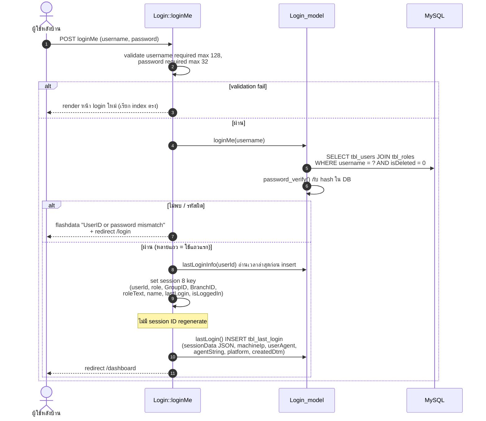
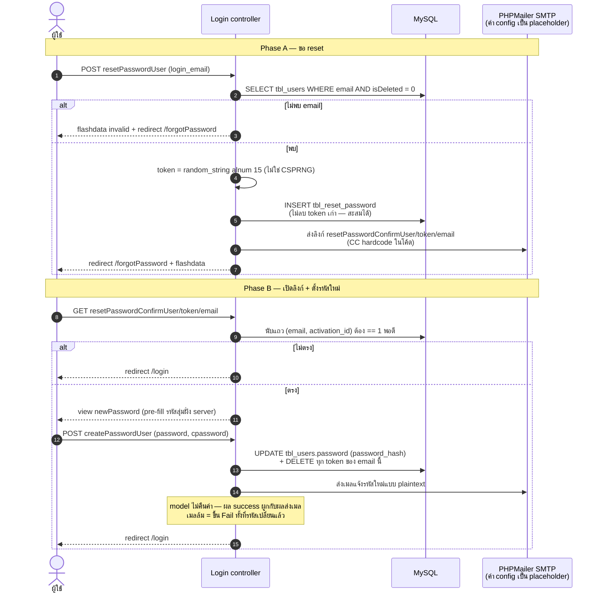
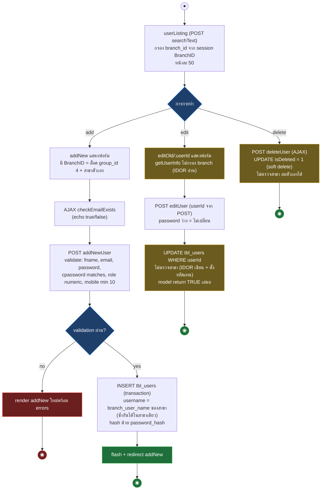

# Samsonite Tracking — Workflow Design: Auth + User

> Source: `samsoniteci3/application/controllers/Login.php`, `User.php`, `models/Login_model.php`, `User_model.php`, `libraries/BaseController.php` (อ่านจาก working tree 2026-08-16)
> Scope: login (UC-01), session/authorization contract, password reset, user CRUD (UC-11 ฝั่ง user) พร้อม mapping ไป CI4
> Generated: 2026-08-17

หัวใจของไฟล์นี้คือ authorization model จริงของระบบ ซึ่งต่างจากที่โค้ดแสร้งเป็น: gate ที่ทำงานจริงมีแค่ isLoggedIn ส่วน role check เป็น dead gate ทั้งระบบ — CI4 ต้องออกแบบ filter จากข้อเท็จจริงนี้ ไม่ใช่จากชื่อ method

| § | Diagram | Source UC |
|---|---|---|
| 1.1 | Login — sequence | UC-01 |
| 1.3 | Password reset — sequence | UC-01 |
| 1.4 | User CRUD — activity | UC-11 |

---

## 1.1 Login — sequence

Login ใช้คอลัมน์ `username` (ไม่ใช่ email) และ username มาจาก `branch_user_name` ของสาขา — ผู้ใช้สาขาเดียวกัน username ซ้ำกันได้ ระบบใช้แถวแรกที่เจอ

## 1.2 Session contract และ authorization model

Session key ที่ set ตอน login (ต้องคงครบตอน parity — view และ model อ่านตรง ๆ หลายจุด)

| key | มาจาก | บทบาทจริง |
|---|---|---|
| `isLoggedIn` | literal TRUE | gate เดียวที่ทำงานจริง (`BaseController::isLoggedIn`) |
| `userId` | `tbl_users.userId` | เป็น `vendorId` — เป้าหมาย changePassword, audit field |
| `role` | `tbl_users.roleId` | ใช้โดย `isAdmin()`/`isTicketter()` ซึ่งเป็น dead gate ทั้งคู่ |
| `GroupID` | `tbl_users.group_id` | คุมการมองเห็นเมนู sidebar (UI เท่านั้น) |
| `BranchID` | `tbl_users.branch_id` | ขอบเขตข้อมูลจริง — model กรองเองต่อ query |
| `roleText`, `name`, `lastLogin` | join/lookup | แสดงผลอย่างเดียว |

ชั้นการเช็คสิทธิ์จริง 3 ชั้น (สำคัญมากตอนออกแบบ CI4 filter)

- **ชั้น 1 ทำงานจริง**: `isLoggedIn()` ใน constructor ของ controller ที่สืบทอด `BaseController` (20 ตัว) — `Login`, `Error`, `welcome` ไม่มี guard
- **ชั้น 2 dead gate**: `isAdmin()` คืน true เมื่อ `role < 1` แต่ role จริงคือ 1/2/3 — pattern `if(isAdmin()) loadThis()` ไม่เคยบล็อกใคร; `isTicketter()` จริงเสมอและไม่มี caller — **role 1/2/3 มีสิทธิ์เท่ากันทุก endpoint**
- **ชั้น 3 data scope**: `BranchID` ใน session — model เติม `where branch_id` เองเป็นราย query ไม่มีชั้นกลาง จุดที่ลืมกรองจึงรั่ว (ดู IDOR ใน §1.3) ส่วนเมนู `GroupID` ซ่อนแค่ UI — เข้า URL ตรงได้เสมอ

## 1.3 Password reset — sequence

Token ไม่มีวันหมดอายุ (`createdDtm` ถูกเขียนแต่ไม่เคยอ่านเทียบ) และ identity คนละคอลัมน์กับ login: reset ใช้ `email`, login ใช้ `username`

## 1.4 User CRUD — activity

pattern ของ `userListing / addNew / addNewUser / editOld / editUser / deleteUser` — จุดต้องรู้: การกรอง BranchID มีเฉพาะ listing ส่วน edit/delete รับ `userId` จาก POST โดยไม่ตรวจสาขา (IDOR ข้ามสาขา รวมถึงตั้งรหัสผ่านแทนได้)

Flow ประกอบที่ไม่ต้องมี diagram แยก

| Flow | พฤติกรรม CI3 |
|---|---|
| changePassword | เป้าหมายคือ userId ของตัวเองจาก session เสมอ (จุดเดียวที่ปลอดภัยจาก IDOR) — ตรวจรหัสเก่าด้วย `password_verify` แล้ว UPDATE; ตั้งรหัสเดิมซ้ำ = `affected_rows` 0 = แจ้ง fail ทั้งที่ไม่ผิด; ไม่ invalidate session |
| logout | `sess_destroy()` + redirect login — เป็น GET ไม่มี token |
| loginHistoy | ดูประวัติ login ของ userId ใดก็ได้ (uri segment) หน้าละ 5 — เก็บ sessionData JSON, IP, userAgent, platform; `searchText` รับมาแต่ไม่ใช้ |
| contactListing | หน้าอ่านข้อความติดต่อจากลูกค้า (ฝั่งรับเข้าคือ `Contact`/`Contact_th` ดู `04-public-site.md`) — หน้าละ 50, LIKE ต่อสตริงดิบ, **ไม่กรอง branch** ทุกคนที่ล็อกอินเห็นทั้งหมด, อ่านอย่างเดียวไม่มี edit/delete |
| get_list_branch / get_list_book / get_list_branchshort / get_list_bookshort | AJAX cascade dropdown — echo HTML `<select>`/`<input>` ดิบไม่ escape ใช้ในฟอร์ม order/user |
| Menu::changePassword + loadChangePass + deleteUser | สำเนาหลงมาจาก User controller — ไม่มี route ชี้แต่เรียกตรงได้ (`menu/<method>`) ดู `05-master-data.md` |

### Mapping → CI4

| CI3 element | CI4 target | หมายเหตุ |
|---|---|---|
| `BaseController::isLoggedIn` + constructor guard | CI4 auth Filter ผูกกับ route group หลังบ้านทั้งหมด | plan v3 non-goal: ไม่สร้าง authentication product ใหม่ — คง session contract เดิม (key ครบ 8 ตัว) |
| `isAdmin()` / `isTicketter()` (dead gate) | ไม่ port — บันทึกเป็น RETIRE พร้อมหลักฐาน dead gate | ตรง legacy report §2.4; ถ้า business ต้องการ role แยกจริงเป็น scope ใหม่หลัง parity |
| BranchID scoping กระจายราย query | รวมเป็น scope ใน Model ชั้นเดียว (เช่น method ที่บังคับ branch filter) | จุดที่ CI3 ลืมกรอง (IDOR) ต้องมี decision: คง behavior หรือปิด — ปิด = เปลี่ยน behavior ต้องมี decision record |
| `Login::loginMe` | `App\Controllers\Login` + Validation + session service | เพิ่ม session regenerate ได้ (G-04) — ต้อง regression ว่า flow เดิมไม่พัง |
| Password reset (token ไม่หมดอายุ, `random_string`) | โครงเดิม + token TTL + CSPRNG ตาม G-04 | การเพิ่ม expiry เปลี่ยน behavior — plan v3 ระบุ reset token ไม่มี expiry เป็น risk ที่ต้องปิด ยืนยันแล้วใน §3.7 |
| PHPMailer + SMTP placeholder + CC hardcode | Email service + config `.env` | เหมือน Contact (`04-public-site.md`) — ต้อง verify ว่า production จริงส่งเมลได้หรือไม่ก่อนตรึง parity |
| `checkEmailExists` (echo text) | endpoint JSON + เอกสาร contract ที่ JS ฝั่งหน้าใช้ | user-enumeration สำหรับคนล็อกอิน — พฤติกรรมเดิม คงไว้ช่วง parity |
| user CRUD | `App\Controllers\Users` + `UserModel` (soft delete `isDeleted` เดิม) | validation rules ย้ายเป๊ะรวม quirk (mobile min 10, password max 20) |

## Notes

- `tbl_users.username` มาจาก `branch_user_name` — identity model นี้เป็น business rule ห้ามแก้เงียบ ๆ ตอน migrate
- โค้ดล็อกอินอาศัยลำดับประเมิน array (`getBrowserAgent()` โหลด `user_agent` library ก่อน `agent_string()` ใช้) — CI4 เขียนใหม่ต้องโหลด library ชัดเจน
- `lastLogin` ที่แสดงคือเวลา login ครั้งก่อนหน้า (อ่านก่อน insert) — เป็น contract ที่ผู้ใช้เห็น คงเดิม
- หน้า login/forgotPassword/newPassword ไม่ผ่าน header/footer ของ admin — layout แยกใน CI4 เช่นกัน

**Render**: GitHub / Obsidian / VS Code Mermaid
