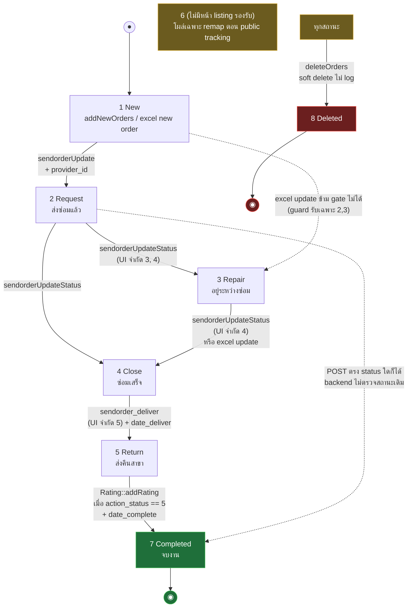
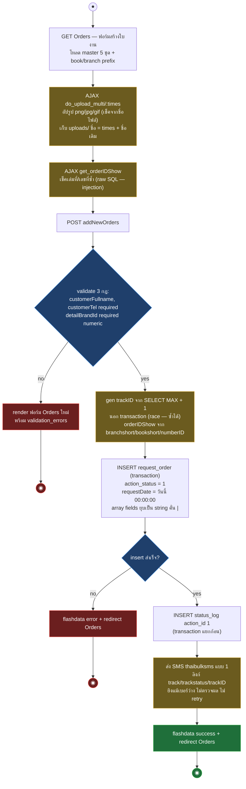
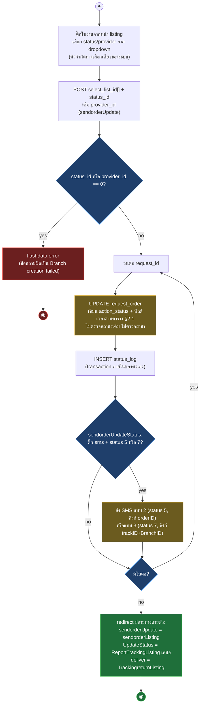

# Samsonite Tracking — Workflow Design: Order + Tracking

> Source: `samsoniteci3/application/controllers/Order.php` (1420 บรรทัด), `models/Request_order_model.php` (2010 บรรทัด), views `tracking/*` (อ่านจาก working tree 2026-08-16)
> Scope: วงจรงานซ่อม (UC-02..UC-05) — สร้าง order, ส่งเข้า workflow, เปลี่ยนสถานะ, ส่งคืน/ปิดงาน, ลบ พร้อม mapping ไป CI4 (รายงานแยกอยู่ `06-reports.md`)
> Generated: 2026-08-17

ข้อเท็จจริงหลักที่คุมการออกแบบ CI4: **transition guard ทั้งหมดอยู่ที่ dropdown ใน view ไม่ใช่ backend** — endpoint รับ `status_id` อะไรก็ได้ และไม่มี method ไหนตรวจสถานะปัจจุบันก่อนเขียนทับ

| § | Diagram | Source UC |
|---|---|---|
| 2.1 | Status lifecycle — flowchart | UC-02..UC-05 |
| 2.2 | สร้าง order — activity | UC-02 |
| 2.3 | Bulk status transition — activity | UC-03, UC-04, UC-05 |

---

## 2.1 Status lifecycle — flowchart

สถานะอยู่ที่ `request_order.action_status` master ในตาราง `statusaction` (ชื่อสถานะอยู่ใน DB ไม่ hardcode) — เส้นทึบคือ transition ที่ UI พาไป เส้นประคือทางที่เข้าถึงได้จริงเพราะ backend ไม่ตรวจ

ตาราง transition ที่เกิดจริงในโค้ด (เขียนฟิลด์เวลาต่างกัน — ต้องตรึงเป๊ะตอน parity)

| ตัวเปลี่ยน | จาก (ตาม UI) | เป็น | ฟิลด์เวลา | log `status_log` |
|---|---|---|---|---|
| `addNewOrders` | — | 1 | `requestDate` = วันนี้ 00:00:00 (hardcode) | action_id 1 |
| `sendorderUpdate` | 1 | 2 | `date_create` (ถูกใช้เป็นวันส่งซ่อม), `date_update_status` | action_id 2 |
| `sendorderUpdateStatus` | 2, 3 | ค่าที่ POST (UI จำกัด 3/4) | 7 → `date_complete`; อื่น → `date_update_status` | action_id = ใหม่ |
| `sendorder_deliver` | 4 | ค่าที่ POST (UI จำกัด 5) | 7 → `date_complete`+`date_update_status`; อื่น → `date_update_status`+`date_deliver` | action_id = ใหม่ |
| `Rating::addRating` | 5 | 7 | `date_complete`, `date_update_status` | ไม่ log |
| Excel ชุด 1 | 2, 3 (guard ฝั่ง server จุดเดียวของระบบ) | 3 หรือ 4 | ดู `03-excel-import.md` | update_id |
| Excel ชุด 2 | — (สร้างใหม่) | 2 หรือ 4 | ดู `03-excel-import.md` | action_id |
| `deleteOrders` | ใดก็ได้ | 8 | — | ไม่ log |
| `editOrders` | ไม่เปลี่ยน (`action_status` จาก POST เป็น dead variable) | — | — | ไม่ log (ถูก comment) |

Listing แต่ละหน้ากรองสถานะเดียว (URL contract ต้องคงใน CI4)

| Route | filter | view | ฟอร์มใน view ส่งไป |
|---|---|---|---|
| `ordersListing` | `action_status = 1` | `tracking/order` | — (edit/delete/print) |
| `sendorderListing` | `= 1` (query เดียวกับบน) | `tracking/send_order` | `sendorderUpdate` |
| `TrackingListing` | `= 2` | `tracking/tracking` | `sendorderUpdateStatus` (เลือก 3/4) |
| `TrackingcloseListing` | `= 3` | `tracking/trackingrepair` | `sendorderUpdateStatus` (เลือก 4) |
| `TrackingreturnListing` | `= 4` | `tracking/trackingreturn` | `sendorder_deliver` (เลือก 5) |
| `TrackingcompleteListing` | `= 5` | `tracking/trackingclose` | modal rating → `rating/addRating` |
| `TrackingCompletedListing` | `= 7` | `tracking/tracking_completed` | — (+คะแนน rating ต่อใบ) |

- สถานะ 6 ไม่มีหน้า listing — ใบงานที่ค่าหลุดไป 6 หายจากทุกหน้างาน เห็นเฉพาะรายงาน
- ชื่อ method กับ view สลับกัน (`TrackingcloseListing` → view repair, `TrackingcompleteListing` → view close) — CI4 ตั้งชื่อใหม่ให้ตรงได้ แต่ URL เดิมต้องคง
- `TrackingreturnListing` pagination base link ผิด (`Trackingreturn/`) — กดหน้า 2 ได้ 404 บน CI3 (บันทึกเป็น broken behavior ไม่ต้อง replicate — decision record)

## 2.2 สร้าง order — activity

หน้า `Orders` (ฟอร์ม) มี guard เต็ม แต่ `addNewOrders` (ตัวรับ POST) มีแค่ isLoggedIn — และ running number ไม่มี lock

## 2.3 Bulk status transition — activity

สาม endpoint (`sendorderUpdate`, `sendorderUpdateStatus`, `sendorder_deliver`) โครงเดียวกัน: รับ `select_list_id[]` แล้ววนเขียนทีละใบ ไม่มี transaction ครอบ batch ไม่ตรวจสถานะเดิม ไม่ตรวจ ownership สาขา

ความต่างสามตัว: `sendorderUpdate` เซ็ต provider (`9999` = อื่น ๆ → เก็บ 0 + `logistics_etc_detail`) และ SMS ถูก comment; `sendorder_deliver` ไม่เช็ค `empty(select_list_id)` ก่อน foreach — ไม่ติ๊กแถวใดเลย PHP 8 ขึ้น warning (`foreach() argument must be of type array|object, null given`) แล้ว loop ไม่รัน redirect ตามปกติ ต้องเก็บ behavior นี้เข้า test ตอนขึ้น PHP 8.5; `sendorderUpdateStatus` เหมือนกันตรงจุดนี้

## 2.4 Edit / Print / Delete

| Flow | พฤติกรรม CI3 | จุดเสี่ยงที่บันทึกไว้ |
|---|---|---|
| `editOrdersOld/:id` + `editOrders` | ฟอร์มแก้ + UPDATE ทุก field ยกเว้นสถานะ (`action_status` จาก POST ไม่ถูกใช้) ไม่ log | IDOR อ่าน/เขียนข้ามสาขา; model return TRUE เสมอ; validation fail redirect ไป route `orderListing` ที่ไม่มีจริง = 404 |
| `OrderPrint/:id` | ใบงานสำหรับพิมพ์ view เดี่ยวไม่มี header/footer | IDOR อ่านข้ามสาขา |
| `deleteOrders` (AJAX) | soft delete → `action_status = 8` ไม่ log | ไม่ validate, ownership ไม่ตรวจ, ตอบ true เสมอแม้ id ไม่มีจริง |
| `do_upload_multi/:times` | อัปรูปเข้า `uploads/` ตรง ๆ | ชื่อไฟล์จากผู้ใช้ประกอบ path (traversal/overwrite), เช็คนามสกุลจากชื่อ |
| `get_orderIDShow` | AJAX เช็คซ้ำ echo 1/0 | raw SQL ทั้งสอง param |

### Mapping → CI4

| CI3 element | CI4 target | หมายเหตุ |
|---|---|---|
| Listing 7 หน้า + query ราย status | `App\Controllers\Tracking` + `RequestOrderModel` แยก method ต่อ status filter, Pager ของ CI4 | URL เดิมทั้งหมดเป็น explicit route; per-page 50 คงเดิม |
| Status transition 3 endpoint | service เดียว `OrderStatusService` รับ (ids, toStatus, ...) | โครงรวมได้เพราะ logic ซ้ำ แต่ contract ต่อ endpoint (ฟิลด์เวลา, redirect, SMS) ต้องคงตามตาราง §2.1 เป๊ะ |
| Transition guard อยู่ที่ view | ช่วง parity: คง behavior (backend รับทุกค่า) + test ตรึง; หลัง parity: state machine ฝั่ง server เป็น decision แยก | ตรง §3.7 legacy report (status matrix กระจาย) — ห้ามแก้เงียบ |
| trackID/orderID running จาก SELECT MAX | คง format เดิม + กัน race (unique index + retry หรือ SELECT FOR UPDATE) | format `GyyMM____` เป็น contract ที่ SMS/ลูกค้าเห็น ห้ามเปลี่ยน; unique index เป็น release ฝั่ง DB |
| SMS `cias_helper::sms` (curl thaibulksms, credential ใน helper) | service แยก + config `.env` + log ผลส่ง | ข้อความ SMS 3 แบบเป็น business contract คงคำต่อคำ |
| `do_upload_multi` | CI4 UploadedFile + random name + เก็บนอก public/ | 4.7.4 fix path traversal ตรง risk นี้ (G-04) |
| ทุก raw SQL ใน `Request_order_model` (~30 method) | Query Builder + binding ทั้งหมด | result contract ต่อ method ตรึงด้วย test ก่อนแปลง — พื้นที่ regression ใหญ่สุดของระบบ (1,089 hits) |
| `editOrders` ไม่ log / `deleteOrders` ไม่ log | คง behavior ช่วง parity | อยากให้ log = scope ใหม่ |
| join `branch_type.branch_type_id = branch.branch_id` ในรายงาน (คอลัมน์คนละมิติ) | ตรวจกับข้อมูลจริงตอน baseline ก่อนตัดสิน | ถ้าข้อมูลจริงทำให้ join นี้ "ถูกโดยบังเอิญ" ต้อง replicate; ดู `06-reports.md` |
| dead code: `excel_report_sum`, `pageNotFound`, `ReportTrackingListingTest`, model `reporttrackingListing*` ชุดเก่า | ไม่ port — RETIRE พร้อมหลักฐาน caller = 0 | ยืนยัน Function ID กับ disposition doc |

## Notes

- ปุ่ม/หน้าที่พาไป transition มี guard `isAdmin` (inert) แต่ endpoint จริง (`addNewOrders`, `sendorderUpdate`, `sendorderUpdateStatus`, `sendorder_deliver`, `do_upload_multi`, `get_orderIDShow`) มีแค่ isLoggedIn — CI4 ใส่ filter ระดับ route group เดียวกันทั้งชุดได้โดยไม่เปลี่ยน exposure จริง
- `date_create` ถูก reuse เป็นวันส่งซ่อม (ไม่ใช่วันสร้าง) — ห้าม rename คอลัมน์ช่วง parity แค่ document ไว้
- `ordersListing` bug ช่วงวันที่ (`$EXX` ใช้ปีของ sdate) — replicate หรือแก้ = decision record
- transition 5 → 7 อยู่ใน `Rating::addRating` (ดู `04-public-site.md` §4.4) และ Excel เขียนสถานะได้อีกทาง (ดู `03-excel-import.md`) — state machine รวมของระบบต้องมองสามไฟล์นี้พร้อมกัน

**Render**: GitHub / Obsidian / VS Code Mermaid
