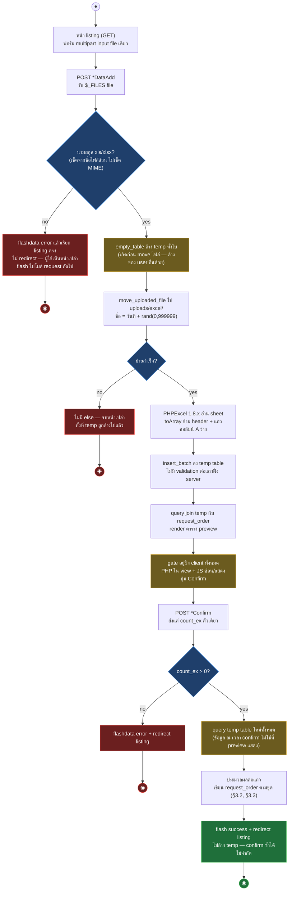
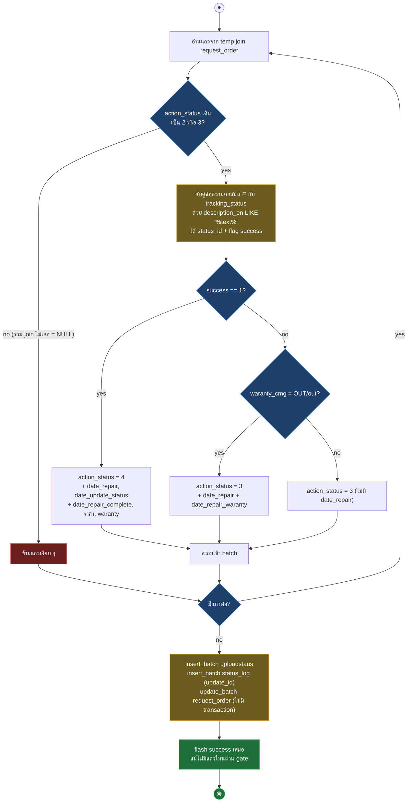
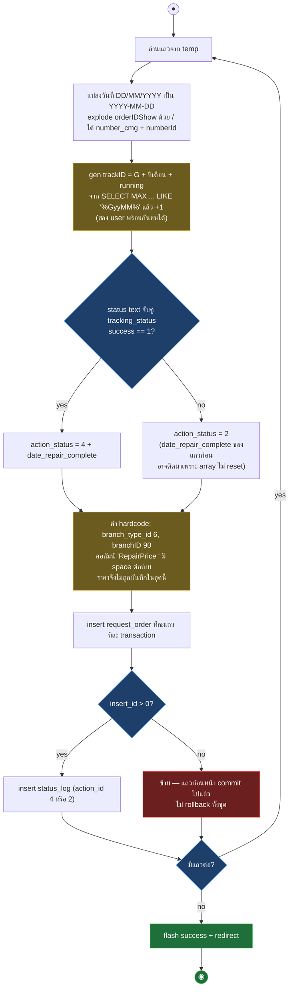

# Samsonite Tracking — Workflow Design: Excel Import

> Source: `samsoniteci3/application/controllers/Upload_excel.php` (806 บรรทัด) + `Request_order_model.php` + views `tracking/show_*` (อ่านจาก working tree 2026-08-16)
> Scope: Excel import 3 ชุดแบบสองขั้น preview/confirm (UC-09) พร้อม mapping ไป CI4
> Generated: 2026-08-17

ระบบมี import 3 ชุด ใช้กลไกสองขั้นเหมือนกันทั้งหมด: ขั้น preview เทลงตาราง temp ระดับ global แล้วขั้น confirm อ่าน temp กลับมาเขียนจริง เอกสารนี้บันทึกพฤติกรรมจริงรวม bug เพื่อเป็น baseline — จุดที่ต้องมี decision ก่อน implement CI4 รวมไว้ท้ายไฟล์

| § | Diagram | Source UC |
|---|---|---|
| 3.1 | กลไกสองขั้นร่วม 3 ชุด — activity | UC-09 |
| 3.2 | Confirm ชุด update status — activity | UC-09 |
| 3.3 | Confirm ชุด new order — activity | UC-09 |

---

## 3.1 กลไกสองขั้นร่วม 3 ชุด — activity

ทั้ง 3 ชุดก็อปโค้ดชุดเดียวกัน ต่างแค่ temp table, column mapping และสิ่งที่ confirm เขียน — ขั้น preview/confirm ส่งต่อกันผ่าน **temp table ใน DB ไม่ใช่ session** จึงแชร์ข้ามผู้ใช้ทั้งระบบ

เทียบ 3 ชุด

| หัวข้อ | ชุด 1 update status | ชุด 2 new order | ชุด 3 price |
|---|---|---|---|
| Routes | `UploadexcelListing`, `ExcelDataAdd`, `ExcelConfirm` | `UploadneworderexcelListing`, `ExcelNewOrderDataAdd`, `ExcelNewOrderConfirm` | `UploadexcelpriceListing`, `ExcelPriceDataAdd`, `ExcelPriceConfirm` |
| Temp table | `temp_updatestatus_order` | `temp_updatestatus_neworder` | `temp_updatestatus_price_order` |
| Join key กับ `request_order` | `orderIDShow` + `customerTel` | `orderIDShow` + tel (เจอ = ซ้ำ = ผิด) | `number_cmg` |
| Column map | A-I (G ราคาเมื่อ >0, H waranty, I number_cmg) | A-H (ไม่มี I) | A-G + I (ข้าม H) |
| ผลต่อ `request_order` | `update_batch` สถานะเป็น 3 หรือ 4 + วันที่ + ราคา + waranty | `insert` ทีละแถว order ใหม่ status 2 หรือ 4 | `update_batch` เฉพาะ `RepairPrice` ไม่แตะสถานะ |
| Log | `status_log` (`update_id`) + `uploadstaus` | `status_log` (`action_id`) | ไม่มี |
| Guard ฝั่ง server ตอน confirm | `action_status` เดิมต้องเป็น 2 หรือ 3 | ไม่มี (dup check อยู่ client และ JS เทียบผิดจนปุ่มโชว์เสมอ) | ไม่มี (บล็อก guard ถูก comment) |
| Transaction | ก้อน insert log แยกกัน, `update_batch` ไม่มี transaction, ไม่มีครอบทั้งชุด | ทีละแถว ทีละ transaction — ล้มกลาง loop แถวก่อนหน้า commit ไปแล้ว | ไม่มี |

## 3.2 Confirm ชุด update status — activity

การตัดสินสถานะต่อแถว: จับคู่ข้อความสถานะจากคอลัมน์ E กับตาราง `tracking_status` ด้วย `description_en LIKE` (ต่อสตริงดิบ — injection ผ่านเนื้อไฟล์ excel ได้)

## 3.3 Confirm ชุด new order — activity

ชุดเดียวที่สร้าง order ใหม่ — จุดเปราะสุดของไฟล์: gen trackID แบบ MAX+1 (race ได้), array ไม่ reset ต่อแถว, ชื่อคอลัมน์ราคามี space ต่อท้าย

ชุด 3 (price) ไม่มี diagram แยก: confirm อ่าน temp แล้ว `update_batch` คอลัมน์ `RepairPrice` อย่างเดียว — guard ทั้งหมดถูก comment ทิ้ง แถวที่ join ไม่เจอ (`request_id` NULL) ก็เข้า batch, `temp_pic <= 0` เขียนค่าว่างทับราคาเดิมได้

### Mapping → CI4

| CI3 element | CI4 target | หมายเหตุ |
|---|---|---|
| PHPExcel 1.8.x (2015, EOL, vendored ใน `lib/`) | PhpSpreadsheet ผ่าน Composer | plan v3 ระบุ PhpSpreadsheet ใน research แล้ว — column mapping ต้องเทียบเซลล์ต่อเซลล์ตอน parity test |
| `$_FILES` + `move_uploaded_file` + เช็คนามสกุลจากชื่อไฟล์ | CI4 `UploadedFile` + validation `ext_in` + `is_image`/MIME ตามชนิด | CI4 ≥ 4.7.4 มี fix filename/path traversal + content-extension validation ที่ plan บังคับ (G-04) |
| temp table แชร์ 3 ใบ (`empty_table` ทั้งใบ) | เพิ่ม batch identifier ต่อการ upload (คอลัมน์ batch_id หรือ per-request storage) | การแก้อนุมัติแล้ว (plan v3 §1 shared temp-table 136 จุด + non-goal "แยกข้อมูลตาม request/import batch") — result contract ของ preview ต้องเท่าเดิม |
| confirm อ่าน temp กลับ + `count_ex` จาก client | confirm ผูก batch_id + server นับแถวจริง | ปิดช่อง confirm ข้าม batch ของคนอื่น |
| confirm ซ้ำได้ไม่จำกัด | ล้าง batch หลัง commit หรือ token กันซ้ำ | ต้องมี decision record — พฤติกรรมเดิมสร้าง `status_log`/`uploadstaus` ซ้ำ |
| `description_en LIKE '%text%'` ต่อสตริงดิบ | Query Builder bind | ผล match ต้องเท่าเดิม (รวม partial match) |
| ไม่มี transaction ครอบ confirm | transaction ครอบต่อ batch | ตรง G-03 (ไม่ทำข้อมูลเสีย); ชุด 2 ต้องเลิก commit ทีละแถว |
| ไฟล์ค้าง `uploads/excel/` ใต้ web root ไม่ลบ | เก็บนอก public/ + ลบหลังอ่าน (หรือ retention ตามที่ business กำหนด) | CI4 โครง `public/` แยก web root อยู่แล้ว |

## Notes — จุดที่ต้องมี decision ก่อน implement

พฤติกรรมเหล่านี้เป็น bug ที่ทำงานอยู่จริงบน production — parity 100% ตามตัวอักษรจะ replicate bug ทั้งหมด ต้องให้ business/engineering ตัดสินและบันทึกเป็น decision record (ตาม change control ของ plan v3) ก่อนเขียน spec รายชุด:

- ชุด 2: คอลัมน์ `'RepairPrice '` (space ต่อท้าย) ทำให้ราคาไม่ถูกบันทึก — แก้ = พฤติกรรมเปลี่ยน (ราคาจะเริ่มถูกบันทึก)
- ชุด 2: `$OrderInfo` ไม่ reset ต่อแถว — `date_repair_complete` รั่วจากแถว success ไปแถวถัดไป
- ชุด 2: ปุ่ม Confirm แสดงเสมอแม้ทุกแถวซ้ำ (JS เทียบ `data_class_error == 1` กับ string ว่าง) และ server ไม่เช็คซ้ำ — เสี่ยง order ซ้ำ
- ชุด 3: guard ถูก comment — เขียนราคาว่างทับของเดิมได้
- ชุด 1: confirm ที่ไม่มีแถวผ่าน gate ยังขึ้น success
- วันที่ไม่ลบ 543 (เวอร์ชัน comment เคยลบ) — ต้อง confirm ว่าไฟล์ excel ที่ใช้จริงปัจจุบันเป็น ค.ศ.
- `status_log` ถูกเขียนคนละคอลัมน์ (`update_id` ชุด 1 / `action_id` ชุด 2) — ตรวจ schema จริงตอน DB baseline (repo ไม่มีไฟล์ `.sql`)

**Render**: GitHub / Obsidian / VS Code Mermaid
