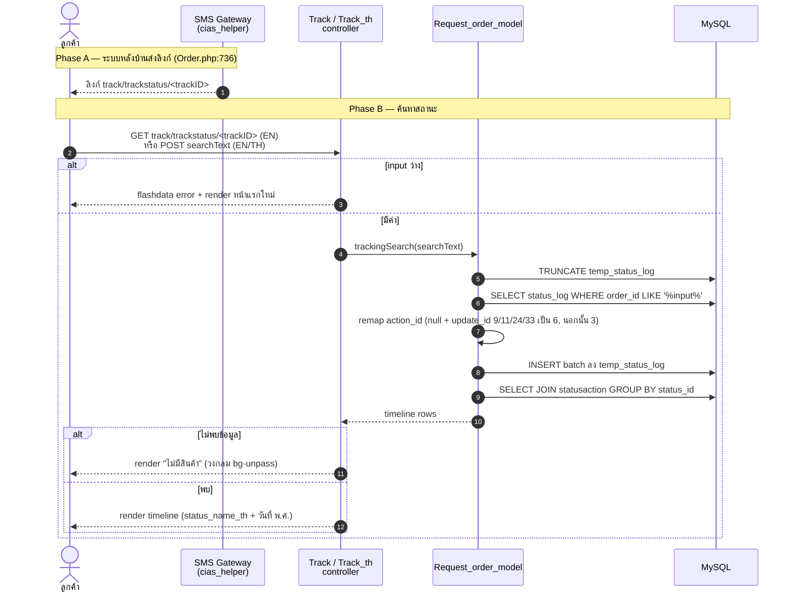
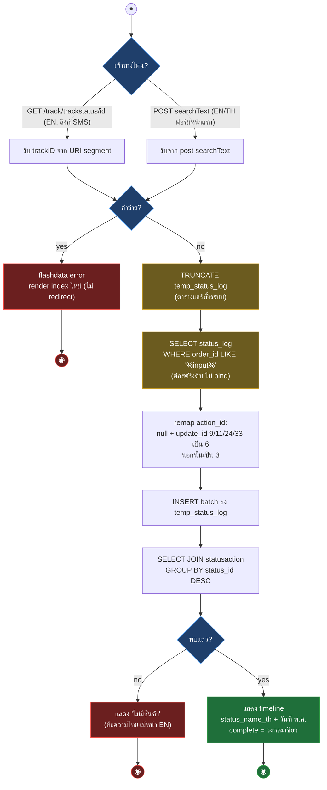
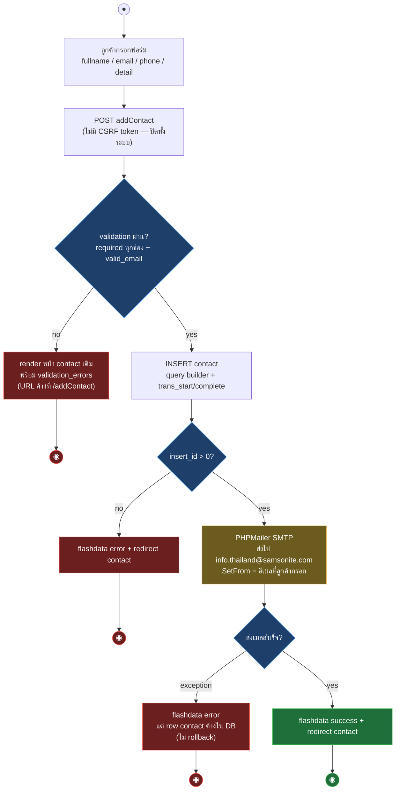
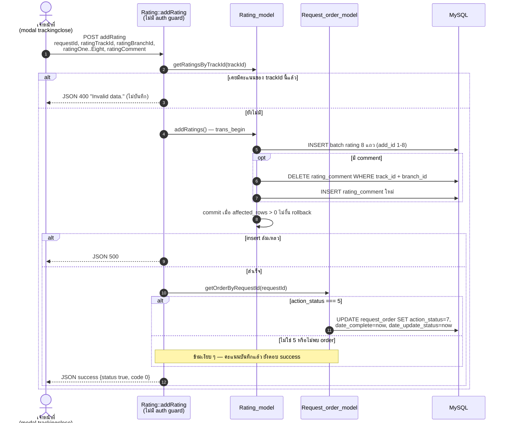

# Samsonite Tracking — Workflow Design: Public Website

> Source: `samsoniteci3/application/controllers/Track.php`, `Track_th.php`, `Contact.php`, `Contact_th.php`, `Rating.php`, `Error.php`, `welcome.php` + models ที่เกี่ยว (อ่านจาก working tree 2026-08-16)
> Scope: workflow ฝั่งเว็บสาธารณะ (UC-06 tracking, UC-07 contact, UC-08 rating) + error/welcome พร้อม mapping ไป CI4
> Generated: 2026-08-17

workflow ทุกตัวในไฟล์นี้บันทึกพฤติกรรมจริงของ CI3 รวม quirk เพื่อใช้เป็น design baseline ตอน implement CI4 — จุดที่ CI4 ต้องเปลี่ยนโครง (ไม่ใช่เปลี่ยน behavior) ระบุในตาราง mapping ท้ายแต่ละ section

| § | Diagram | Source UC |
|---|---|---|
| 4.1 | Public tracking — sequence | UC-06 |
| 4.2 | Public tracking — activity | UC-06 |
| 4.3 | Contact form — activity | UC-07 |
| 4.4 | Rating — sequence | UC-08 |

---

## 4.1 Public tracking — sequence

ลูกค้าเช็คสถานะงานซ่อมผ่านลิงก์ SMS (EN เท่านั้น) หรือพิมพ์ trackID ในฟอร์มหน้าแรก (`Track::index` เป็น default controller)

## 4.2 Public tracking — activity

จุดสำคัญ: การอ่านทำให้เกิด write — ทุกการค้นหา TRUNCATE ตาราง `temp_status_log` ที่แชร์ทั้งระบบ

ความต่าง EN กับ TH (ต้องคง contract ตอน parity test)

| ประเด็น | Track (EN) | Track_th (TH) |
|---|---|---|
| รับ trackID จาก URI | ได้ (`trackstatus/<id>`) — เส้นทางลิงก์ SMS | ไม่ได้ — POST เท่านั้น |
| form_validation | ไม่มี (เช็คแค่ค่าว่าง) | `trim required` บน `searchText` |
| เช็ค complete จากคอลัมน์ | `status_name` | `status_name_th` (เทียบ literal อังกฤษเดิม) |
| ข้อความ error ตอน validation fail | `trackID failed` | `Book creation failed` (copy ผิดมาจาก Book) |

- **Route ตาย**: `rackstatus`, `rackstatus_th` ใน `routes.php:218-222` ชี้ `track/rackstatus` ซึ่งไม่มี method — ตกไป 404 override เส้นทางจริงคือ default routing `track/trackstatus` (ตรง legacy report §9.2)
- ลูกค้าค้นด้วย tracking no อย่างเดียว (partial match ได้เพราะ LIKE) — เห็นเฉพาะ timeline สถานะ ไม่มีชื่อลูกค้า/สินค้า/ราคา

### Mapping → CI4 (Phase ตาม plan v3 route-level strangler)

| CI3 element | CI4 target | หมายเหตุ |
|---|---|---|
| `Track::index` / `Track_th::index` | `App\Controllers\Track::index` แยก locale ด้วย route param หรือ controller คู่ตามเดิม | parity ก่อน — ห้ามรวม EN/TH จนกว่าจะผ่าน parity |
| `Track::trackstatus` (GET+POST) | `App\Controllers\Track::status($trackId = null)` + explicit routes `GET track/trackstatus/(:segment)`, `POST track/trackstatus` | URL contract ต้องคงเดิม (ลิงก์ SMS เก่ายังใช้ได้) |
| `trackingSearch` + `temp_status_log` | query ต่อ request ใน `StatusLogModel` (คืน result set เดียวกัน) — เลิก TRUNCATE ตารางแชร์ | การแก้นี้อนุมัติแล้วใน plan v3 §1 (shared temp-table 136 จุดต้องแยกตาม request) |
| `LIKE '%input%'` ต่อสตริงดิบ | Query Builder `like()` พร้อม escape | behavior partial match คงเดิม |
| remap `action_id` (9/11/24/33) | คง logic เดิมใน model + unit test ตรึงค่า | business rule ที่อนุมานจาก code — ห้ามเปลี่ยนช่วง parity |
| route ตาย `rackstatus` | ไม่สร้างใน CI4 | disposition: RETIRE (ยืนยันกับ function-disposition doc ก่อนปิด) |

---

## 4.3 Contact form — activity

ฟอร์มติดต่อ EN (`contact/addContact`) และ TH (`contact_th/addContact`) — logic เหมือนกันทั้งคู่ ต่างแค่ view และปลายทาง redirect

Contract ที่ต้องคงตอน parity

| หัวข้อ | ค่าใน CI3 |
|---|---|
| Validation | `fullname` trim required max 128, `email` trim required valid_email max 128, `phone` trim required (ไม่บังคับตัวเลข), `detail` trim required ไม่จำกัดยาว |
| DB | `INSERT contact` ครอบ transaction คืน insert_id |
| Email | PHPMailer โหลดจาก `lib/PHPMailer/` นอก application tree, ค่า SMTP เป็น literal placeholder (`SMTP_HOST` ฯลฯ), from = อีเมลลูกค้า |
| ลำดับ side effect | insert ก่อน แล้วค่อยส่งเมล — เมลพัง row ไม่ถูกลบ |

### Mapping → CI4

| CI3 element | CI4 target | หมายเหตุ |
|---|---|---|
| `Contact::addContact` / `Contact_th::addContact` | `App\Controllers\Contact::create` + explicit POST route ต่อ locale | รวม logic ชั้น service เดียว ได้ต่อเมื่อ output/redirect ต่อ locale คงเดิม |
| PHPMailer + placeholder SMTP | CI4 `Email` service หรือ PHPMailer ผ่าน Composer, config จาก `.env` | secret ห้าม hardcode (plan v3 G-04); ต้องได้ค่า SMTP จริงจาก ops ก่อน cutover — ปัจจุบัน placeholder แปลว่าเมล prod อาจไม่เคยส่งสำเร็จ ต้อง verify พฤติกรรมจริงก่อนตรึง parity |
| CSRF ปิด | เปิด CSRF filter ของ CI4 บนฟอร์มสาธารณะ | plan v3 G-04 อนุมัติ — ต้อง regression ว่าฟอร์มยัง submit ได้ |
| validation rules | ย้าย rules เดิมเป๊ะไป CI4 Validation | รวม quirk `phone` ไม่บังคับตัวเลข |

---

## 4.4 Rating — sequence

หน้า rating ฝั่งลูกค้าถูกปิดแล้ว (`Rating::index` redirect ทันที — dead code) ผู้เรียกจริงคือ modal หลังบ้านหน้า `trackingclose` แต่ endpoint `addRating` ยังเปิดสาธารณะไม่มี guard

- กันโหวตซ้ำชั้นเดียวด้วย SELECT ก่อน INSERT — ไม่มี unique constraint ไม่มี lock ยิงพร้อมกันหลุดได้
- validation ช่วงคะแนน 1-5 อยู่ฝั่ง JS เท่านั้น server cast int อย่างเดียว

### Mapping → CI4

| CI3 element | CI4 target | หมายเหตุ |
|---|---|---|
| `Rating::index` (dead — redirect ทันที) | ไม่สร้าง | disposition: RETIRE (view `en/rating` + JS เก่าเลิกด้วยกัน) |
| `Rating::addRating` | `App\Controllers\Rating::create` (JSON) + auth filter session หลังบ้าน | ผู้เรียกจริงมีแค่ modal หลังบ้าน — ใส่ filter ได้โดยไม่กระทบผู้ใช้จริง แต่ต้อง confirm กับ business ก่อน (เปลี่ยน exposure = ต้องมี decision record ตาม plan v3 change control) |
| กันโหวตซ้ำด้วย SELECT | คง logic + เพิ่ม unique constraint ระดับ DB | ส่วน constraint เป็น release ฝั่ง DB — แยกตาม plan v3 (DB conversion แยกจาก app cutover) |
| อัปเดต `action_status` 5 เป็น 7 | คง logic เดิมใน service + test ตรึง | ผูกกับ status lifecycle ใน `02-order-tracking.md` |

---

## Error / welcome

| Controller::method | พฤติกรรม CI3 | CI4 target |
|---|---|---|
| `Error::index` (404 override) | เรียก `isLoggedIn()` ของตัวเอง — ยังไม่ล็อกอินแสดงฟอร์ม login admin, ล็อกอินแล้ว redirect `pageNotFound`; ตอบ HTTP 200 เสมอ | หน้า 404 จริง (HTTP 404) ธีมเว็บสาธารณะ — เลิกโชว์ฟอร์ม login (เปลี่ยนที่ต้องบันทึก decision เพราะแตะ behavior) |
| `Welcome::index` | หน้า welcome ตั้งต้น CI ไม่ถูกลิงก์จากที่ไหน | ไม่สร้าง — disposition: RETIRE |
| `pageNotFound` (ซ้ำในทุก controller) | view `404` wrapper admin | รวมเหลือจุดเดียวใน CI4 (custom 404 handler) |

## Notes

- ทุก endpoint สาธารณะไม่มี CSRF (`csrf_protection = FALSE` ทั้งระบบ) และ `global_xss_filtering = FALSE` — CI4 เปิด CSRF ตาม G-04 แล้วต้อง regression ฟอร์มสาธารณะทุกตัว
- `temp_status_log` เป็น global mutable state ระหว่าง request ลูกค้าทุกคน — จุดแก้ที่อนุมัติแล้ว (plan v3 §1)
- background CMS: view สาธารณะ hardcode `uploads/web/trackstatus_laptop.png` — ตาราง `background` ที่ admin เขียนไม่เคยถูกอ่านฝั่ง public (ดู `05-master-data.md` ส่วน Background_web)
- SMS ลิงก์ EN เท่านั้น — TH ไม่มีเส้นทางรับ trackID จาก URL; ถ้า business ต้องการลิงก์ TH เป็น scope ใหม่ ไม่อยู่ใน parity

**Render**: GitHub / Obsidian / VS Code Mermaid
