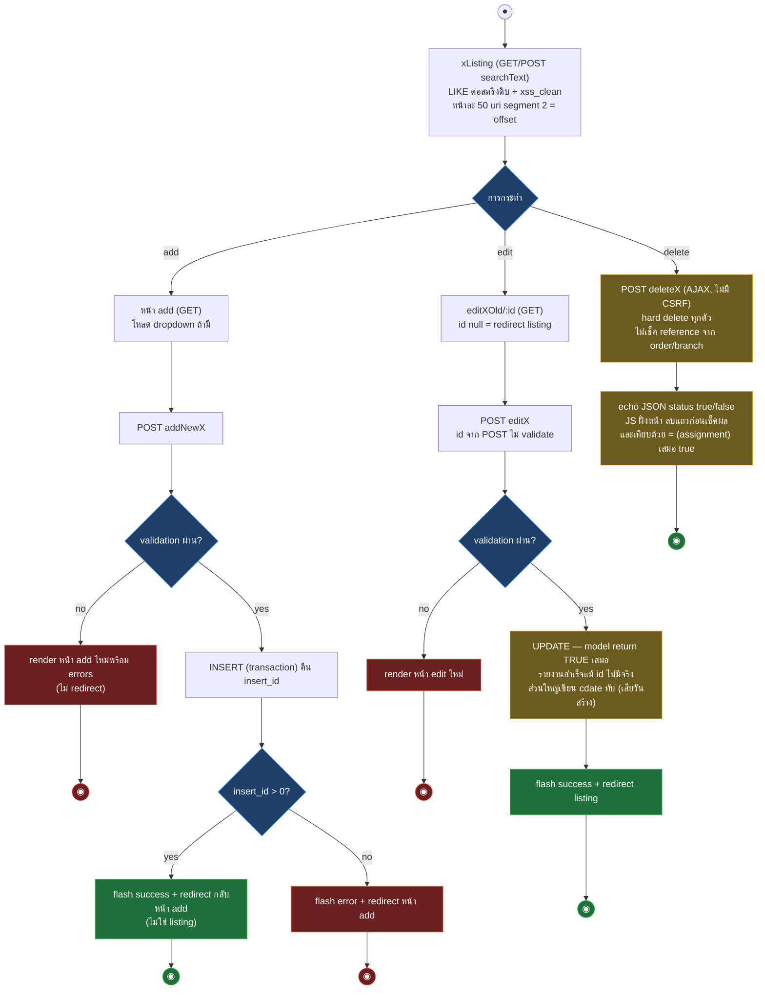

# Samsonite Tracking — Workflow Design: Master Data + CMS

> Source: `samsoniteci3/application/controllers/` — Branch, Branchtype, Brand, Condition, Producttype, Provider, Statustype, Estimateprice, Fixed, Book, Menu, Background_web + models คู่กัน (อ่านจาก working tree 2026-08-16)
> Scope: master data CRUD (UC-12), menu/group authority (UC-11 ฝั่ง menu), CMS background พร้อม mapping ไป CI4
> Generated: 2026-08-17

กลุ่มนี้เป็น CRUD pattern ก็อปซ้ำ 10 controller + 2 ตัวที่แหกโครง (Menu, Background_web) — CI4 ควร implement pattern กลางครั้งเดียวแล้ว configure ต่อ entity แต่ contract ต่อหน้า (route, POST key, redirect target) ต้องคงตามตารางความต่างด้านล่าง

| § | Diagram | Source UC |
|---|---|---|
| 5.1 | CRUD pattern กลาง — activity | UC-12 |

---

## 5.1 CRUD pattern กลาง — activity

ใช้ Branch เป็นตัวแทน — ทุก controller ในกลุ่มใช้โครงนี้ ต่างเฉพาะจุดที่ระบุใน §5.2

Guard ร่วมทุกตัว: `isLoggedIn` (constructor) + `isAdmin` (dead gate — role 1/2/3 ผ่านหมด ดู `01-auth-user.md` §1.2) — Branch เป็นตัวเดียวที่ scope ตาม `BranchID` และซ่อนปุ่ม Add/Delete เมื่อผูกสาขา (ระดับ view เท่านั้น ยิง POST ตรงยังลบได้)

## 5.2 ความต่างต่อ controller

| Controller | ตาราง (PK) | จุดต่างจาก pattern / quirk |
|---|---|---|
| Branch | `branch` (`branch_id`) | ตัวเดียวมี `udate`; scope BranchID; join `branch_type`; field ส่วนใหญ่เข้า DB ดิบ |
| Branchtype | `branch_type` (`branch_type_id`) | upload รูป `uploads/cms/type_<md5(time)>.<ext>` ไม่ validate อะไรเลย ไฟล์เก่าไม่ลบ; รูปใช้เป็น background ของ dashboard/report; pagination base link ผิด (`branchListing/`) |
| Brand | `brand` (`brand_id`) | ตรง pattern สุด |
| Condition | `condition` (`condition_id`) | ชื่อตารางเป็น reserved word หลาย engine; route `add_new_condition` ชี้ method `add_new_Condition` (รอด case-insensitive ของ PHP — CI4 ต้องตั้ง route ตรงตัว); label error เขียนว่า brand |
| Producttype | **`type`** (`type_id`) | ชื่อตารางไม่ตรง controller; pagination base link ผิด; ข้อความ success เป็นของ branch type |
| Provider | `provider` (`provider_id`) | column สะกดผิดจริงใน schema: `provider_datail`; ไม่ถูกใช้เป็น dropdown ที่อื่น (order ใช้ `request_order_model->getProvider()`) |
| Statustype | **`tracking_status`** (`status_id`) | สองภาษา + flag `success` (ไม่ validate) — ตารางนี้คือ master ที่ Excel import ใช้ map สถานะ; **fatal bug**: validation fail ของ `addNewStatustype` เรียก method ที่ไม่มี (`add_new_branchtype`); hard delete ทั้งที่ order อ้าง `status_id` |
| Estimateprice | `estimateprice` (`estimateprice_id`) | `getEstimateprice()` ใน model ตัวเองเป็น dead code — ที่ order ใช้จริงคือชุดใน `request_order_model` (master 5 ตัว type/brand/condition/estimateprice/fixed โหลดพร้อมกันเสมอในฟอร์ม order) |
| Fixed | `fixed` (`fixed_id`) | model ตั้งชื่อตัวแปรเป็น condition ทั้งไฟล์ (ก็อปมา) แต่ชี้ตารางถูก |
| Book | `book` (`book_id`) | ผูก `branch_id`, `book_detail` max 3 ตัวอักษร, status Publishing/Unpublish; `bookListing` ถอด guard ชั้นใน; pagination base link เป็น `userListing/`; route หน้า 2 ชี้ `order/bookListing` ที่ไม่มีจริง = 404 |

## 5.3 Menu — group authority

Menu ไม่ใช่ master data ธรรมดา: กำหนดว่า `GroupID` ไหนเห็นเมนู sidebar อะไร — `group_menu.group_type` เก็บเป็น CSV string (`"1,3,5"`) แล้ว header ของทุกหน้า explode ไป query `tbl_menu`/`group_type` ต่อ id

- **นับผิดตาราง**: `menuListing` ใช้ `user_model->userListingCount()` (นับ user) แต่ดึง record จาก `group_menu` — จำนวนหน้า pagination เพี้ยน; per-page 15 (กลุ่มอื่น 50)
- ไม่มี delete menu — `Menu::deleteUser` เป็นสำเนาหลงจาก User (soft delete `tbl_users`!) ไม่มี route แต่เรียกตรงได้
- add/edit: validate แค่ `name`; checkbox ไม่ติ๊กเลย = กลุ่มไม่เห็นเมนูใดเลย; edit เขียน `cdate` ทับ
- ไม่มีหน้าจอจัดการ `group_type` และ `tbl_menu` — แก้ทาง DB เท่านั้น (operational contract ต้องบันทึกใน runbook)
- ปลายทาง: `header.php` render sidebar ผ่าน `getMenoGroup/getMeno/getMenoGroupType(Icon)` — สองตัวหลังเป็น raw SQL injection ที่ถูกเรียกทุก page load
- method หลงไม่มี route อีก 6 ตัว (`index`, `loadChangePass`, `changePassword`, `loginHistoy`, `get_list_branch`, `get_list_book`) — ซ้ำกับของ User controller

## 5.4 Background_web — CMS ที่ขาดตอน

ตาราง `tbl_background_web` (รูป 3 หน้า × 2 ขนาดจอ + status) — **ไม่มีที่ไหนอ่านตารางนี้นอกจาก controller ตัวเอง** หน้าเว็บสาธารณะ hardcode `uploads/web/trackstatus_laptop.png`

- อัปโหลดเขียนทับชื่อไฟล์คงที่ (`track_laptop.<ext>` ฯลฯ) — record ใน DB กับ `status` Publishing/Unpublish ไม่มีผลต่อการแสดงจริง
- อัปเป็น `.jpg` ได้ไฟล์ `trackstatus_laptop.jpg` แต่หน้าเว็บชี้ `.png` — รูปไม่เปลี่ยนทั้งที่ระบบแจ้งสำเร็จ
- ไม่มี validation เลย (ไม่โหลด form_validation), ไม่มีปุ่ม Add New/Delete ใน UI (เข้า URL ตรงได้), ลบ record ไฟล์ยังอยู่
- รูปชุด `track_*`/`contact_*` อัปได้แต่ไม่มี view ไหนแสดง

### Mapping → CI4

| CI3 element | CI4 target | หมายเหตุ |
|---|---|---|
| CRUD 10 controller | controller ต่อ entity บน base CRUD เดียว (`App\Controllers\Master\*`) + Model จริงต่อตาราง | route/POST key/redirect ต่อหน้า คงตามตาราง §5.2; per-page 50 (Menu 15) คงเดิม |
| LIKE ต่อสตริงดิบทุก model | Query Builder `like()` | พื้นที่แก้แบบ mechanical — result contract เท่าเดิม |
| hard delete ไม่เช็ค reference | ช่วง parity: คง hard delete + test ตรึง; FK/soft delete เป็น release ฝั่ง DB แยก | ลบ `tracking_status` ที่ order อ้าง = orphan ที่ระบบเดิมยอม — ต้องมี decision ก่อนใส่ constraint (BLK ฝั่ง DB conversion) |
| upload รูป (Branchtype, Background_web) | UploadedFile + validate + random name + เก็บนอก public/ | Background_web ต้องคง contract "ทับชื่อไฟล์คงที่" หรือแก้ให้ DB-driven — เป็น decision: ระบบเดิม DB ไม่ถูกอ่านเลย ทางที่ parity แท้คือคงพฤติกรรมไฟล์คงที่ไว้ก่อน |
| Statustype fatal bug (validation fail) | ไม่ replicate fatal — เขียน error path ปกติ | บันทึก decision record (พฤติกรรมเดิมคือ crash — ไม่มี user-visible contract ให้รักษา) |
| Menu นับผิดตาราง / CSV group_type | ช่วง parity: คง CSV + นับให้ถูก (นับผิดเป็น bug แสดงผล ไม่ใช่ contract) | normalize เป็นตารางเชื่อมเป็น scope หลัง parity (plan v3 non-goal: ไม่ redesign schema ช่วงนี้) |
| dead methods (pageNotFound ทุกตัว, Menu 7 ตัว, `getX()` dead ใน model 5 ตัว) | ไม่ port — RETIRE | ยืนยัน Function ID กับ disposition doc ก่อนปิด |

## Notes

- ทุก delete เป็น AJAX POST ที่ไม่มี CSRF — เปิด CSRF filter ใน CI4 แล้วต้องแก้ JS ฝั่งหน้าให้ส่ง token (แตะ 13 endpoint delete — legacy report §2.4 นับไว้)
- JS delete bug (ลบแถวก่อนเช็คผล + `=` แทน `==`) ก็อปอยู่ทุกหน้า — port view ต้องตัดสินใจครั้งเดียวใช้ทุกหน้า
- ชื่อสะกดผิดที่เป็น contract จริง: column `provider_datail`, view file `ecit_menus.php`, method `loginHistoy` (อยู่ใน URL `login-history` แล้ว ไม่กระทบ), `$data['SatusInfo']` — column/URL ห้ามแก้ช่วง parity, ชื่อไฟล์ view ภายในแก้ได้
- master 5 ตัวมี model ซ้ำสองชุด (ของตัวเอง + `request_order_model`) — CI4 เหลือชุดเดียวต่อตาราง แล้วให้ order เรียกชุดเดียวกัน

**Render**: GitHub / Obsidian / VS Code Mermaid
