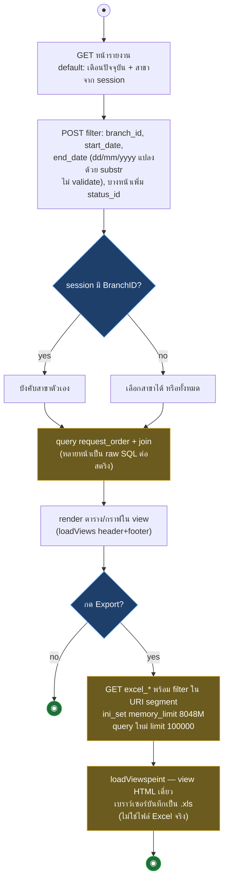

# Samsonite Tracking — Workflow Design: Reports + Export

> Source: `samsoniteci3/application/controllers/User.php` (report methods), `Order.php` (ReportTrackingListing, reportsummary, excel_report), `models/Request_order_model.php`, `Rating_model.php` (อ่านจาก working tree 2026-08-16)
> Scope: รายงานหลังบ้านและ export (UC-10) + dashboard พร้อม mapping ไป CI4
> Generated: 2026-08-17

รายงานทั้งหมดเป็น read-only ใช้ filter pattern เดียวกัน (branch + ช่วงวันที่) — ความเสี่ยงหลักคือ raw SQL, การดึงทั้งตารางเข้า memory (`ini_set 8048M`) และ export ที่เป็น HTML table ให้เบราว์เซอร์ตีความเป็น Excel

| § | Diagram | Source UC |
|---|---|---|
| 6.1 | Report filter + export — activity | UC-10 |

---

## 6.1 Report filter + export — activity

pattern ร่วมของทุกรายงาน: GET ครั้งแรกใช้ค่า default แล้ว POST ฟอร์ม filter กลับ URL เดิม — export เป็นลิงก์ GET ที่ยัด filter ลง URI segment ไปอีก method

## 6.2 รายการรายงานทั้งหมด

ฝั่ง `User.php`

| Method | Route | ข้อมูล | จุดที่ต้องรู้ |
|---|---|---|---|
| `index` (dashboard) | `dashboard` | งานใหม่ค้าง (`get_job_newover`), ข้อมูลสาขา, รูป background จาก `branch_type` | ไม่มี BranchID = ใช้รูป default |
| `report` | `user/report` | คะแนน rating 8 หมวด × 5 ระดับ + comment | นับด้วย switch ซ้อน 8×5; "average" จริง ๆ เป็นเปอร์เซ็นต์ |
| `excel_ratings` | `user/excel_ratings/:b/:s/:e` | export rating | memory 8048M; วันที่รูปแบบ dd-mm-yyyy ใน URI |
| `report_job_byday` | `user/report_job_byday` | งานต่อวัน แยก brand × producttype | ยิง query N×M×5 (5 query ต่อคู่ brand/type) |
| `report_job_pending` | `user/report_job_pending` | งานค้างต่อวัน | |
| `report_total_job_pending` | `user/report_total_job_pending` | ยอดค้างรวม 3 มุม | |
| `report_in_progress_average` | `user/report_in_progress_average` | เวลาเฉลี่ยต่อสถานะ (5 query totals) | |
| `report_in_progress_job` | `user/report_in_progress_job` | งานคงค้างตามสถานะ 1-5 | `status_id` comma-separated |
| `excel_in_progress_job` | `user/excel_in_progress_job?branchId=..` | export งานคงค้าง | method เดียวที่ใช้ query string; memory 8048M |

ฝั่ง `Order.php`

| Method | Route | ข้อมูล | จุดที่ต้องรู้ |
|---|---|---|---|
| `ReportTrackingListing` | `ReportTrackingListing(/:num/:num)` | ใบงานทุกสถานะ + `DATEDIFF` TotalDay/CMGTotalDay | **ไม่ paginate จริง** (limit ถูก comment) ดึงทั้งตาราง + memory 8048M; `status_id` ต่อเข้า SQL ตรง (injection); route `$1/$1` bug |
| `reportsummary` | `reportsummary(/:num/:num)` | สรุปใบงาน + brand/type | INNER JOIN `brand`,`type` — ใบงานที่ brand/type ไม่ตรง master หายเงียบ; limit 100/หน้า; route `$1/$1` bug |
| `excel_report` | `order/excel_report/:c/:s/:e/:st/:q` | export report tracking | `$companny_id` ถูกล้างเป็น "" ทันที (dead filter — ได้ทุกสาขาเสมอสำหรับผู้ใช้ส่วนกลาง); `xss_clean` ผลถูกทิ้ง |
| `excel_report_sum` | ไม่มี route ไม่มี caller | dead code | RETIRE |
| `ReportTrackingListingTest` | `ReportTrackingListingTest(...)` | สำเนา ReportTrackingListing | ไม่มี UI ชี้; ไม่เลือก status = SQL `in ()` syntax error; view อ้างตัวแปรที่ไม่ได้ set — RETIRE |

### Mapping → CI4

| CI3 element | CI4 target | หมายเหตุ |
|---|---|---|
| Report methods ใน `User.php` | แยกเป็น `App\Controllers\Reports` | CI3 ปนอยู่ใน User เพราะประวัติศาสตร์ — URL เดิม (`user/report...`) ต้องคงเป็น explicit route ชี้ controller ใหม่ |
| raw SQL totals/byday ทั้งชุด (~15 method) | Query Builder + binding, result ตรึงด้วย test ต่อรายงาน | plan v3 §1: raw-SQL selects 49 จุดต้อง regression ราย report |
| `ini_set('memory_limit','8048M')` + ดึงทั้งตาราง | streaming/chunk query + pagination จริง | การใส่ pagination คืนให้ `ReportTrackingListing` เปลี่ยนสิ่งที่ผู้ใช้เห็น (จากทั้งหมดเป็นทีละหน้า) — decision record; ทางเลือก parity คือคงดึงทั้งหมดแต่ chunk ภายใน |
| export HTML-as-Excel (`loadViewspeint`) | ช่วง parity: คง HTML table + header เดิมให้ Excel เปิดได้เหมือนเดิม; PhpSpreadsheet จริงเป็น scope หลัง parity | ไฟล์ที่ผู้ใช้ได้ต้องเปิดแล้วหน้าตาเดิม |
| `excel_report` dead branch filter | replicate พฤติกรรมจริง (ทุกสาขา) — ไม่ "แก้ให้ถูก" เงียบ ๆ | ถ้า business บอกว่านี่คือ data leak ให้เปิด decision record |
| N×M×5 query (`report_job_byday`) | รวมเป็น aggregate query | ผลตัวเลขต้องเท่าเดิมทุกช่อง — mutation test เทียบผลก่อน/หลัง |
| INNER JOIN ที่ทำให้แถวหาย + join `branch_type_id = branch_id` | ตรวจกับข้อมูลจริงตอน baseline — ถ้าผลเดิม "ถูกโดยบังเอิญ" ต้อง replicate join เดิม | ห้ามแก้ join โดยไม่มีหลักฐานเทียบผลรายงานจริง |
| dead: `excel_report_sum`, `ReportTrackingListingTest` | ไม่ port — RETIRE | ยืนยัน Function ID กับ disposition doc |

## Notes

- ทุกรายงาน guard ด้วย `isAdmin` (inert) — สิทธิ์จริงคือแค่ล็อกอิน + BranchID scope; CI4 คง exposure เดิมช่วง parity
- การแปลงวันที่ dd/mm/yyyy ด้วย substr ไม่มี validation — input ผิดรูปแบบได้ query เพี้ยนเงียบ ๆ พฤติกรรมนี้เป็น baseline (test fixture ต้องรวม case วันที่ผิดรูป)
- ตัวเลขใน `report` ที่ชื่อ average แต่เป็นเปอร์เซ็นต์ — คงสูตรเดิม document ไว้ ห้ามแก้สูตรตอน migrate

**Render**: GitHub / Obsidian / VS Code Mermaid
